# Chapter 3. Using programmable I/O (PIO)

## 3.1. What is Programmable I/O (PIO)?

Programmable I/O (PIO) is a new piece of hardware developed for RP-series microcontrollers. It allows you to create new types of (or additional) hardware interfaces on your RP-series microcontroller based device. If you’ve looked at fixed peripherals on a microcontroller, and thought "I want to add 4 more UARTs", or "I’d like to output DPI video", or even "I need to communicate with this cursed serial device I found on AliExpress, but no machine has hardware support", then you will have fun with this chapter.

PIO hardware is described extensively in chapter 11 of the RP2350 Datasheet. This is a companion to that text, focussing on how, when and why to use PIO in your software. To start, we’re going to spend a while discussing why I/O is hard, what the current options are, and what PIO does differently, before diving into some software tutorials. We will also try to illuminate some of the more important parts of the hardware along the way, but will defer to the datasheet for full explanations.

プログラマブルI/O(PIO)は、RPシリーズマイクロコントローラ用に開発された新しいハードウェアです。これにより、RPシリーズ・マイコン・ベースのデバイス上に新しいタイプの(または追加の)ハードウェア・インターフェースを作成することができます。マイコン上の固定ペリフェラルを見て、「UARTを4つ追加したい」、「DPIビデオを出力したい」、あるいは「AliExpressで見つけた呪われたシリアルデバイスと通信する必要があるが、どのマシンもハードウェアをサポートしていない」と思ったことがあるのであれば、この章はきっと楽しいでしょう。

PIOハードウェアについては、RP2350データシートの第11章に詳しく説明されています。この章では、PIO をソフトウェアで使用する方法、タイミング、理由に焦点を当てます。はじめに、ソフトウェア・チュートリアルに入る前に、なぜI/Oが難しいのか、現在のオプションは何か、PIOは何が違うのかについて説明します。また、ハードウェアの重要な部分についても説明しますが、完全な説明はデータシートに譲ります。

>  TIP
> You can skip to the first software tutorial if you’d prefer to dive straight in.

### 3.1.1. Background

Interfacing with other digital hardware components is hard. It often happens at very high frequencies (due to amounts of data that need to be transferred), and has very exact timing requirements.

他のデジタル・ハードウェア・コンポーネントとのインターフェイスは難しい。(転送するデータ量が多いため)非常に高い周波数で行われることが多く、非常に正確なタイミングが要求される。

### 3.1.2. I/O Using dedicated hardware on your PC

Traditionally, on your desktop or laptop computer, you have one option for hardware interfacing. Your computer has high speed USB ports, HDMI outputs, PCIe slots, SATA drive controllers etc. to take care of the tricky and time sensitive business of sending and receiving ones and zeros, and responding with minimal latency or interruption to the graphics card, hard drive etc. on the other end of the hardware interface.

The custom hardware components take care of specific tasks that the more general multi-tasking CPU is not designed for. The operating system drivers perform higher level management of what the hardware components do, and coordinate data transfers via DMA to/from memory from the controller and receive IRQs when high level tasks need attention. These interfaces are purpose-built, and if you have them, you should use them.

従来、デスクトップやラップトップコンピュータでは、ハードウェアインターフェースの選択肢は1つでした。お使いのコンピュータには、高速USBポート、HDMI出力、PCIeスロット、SATAドライブコントローラなどがあり、ハードウェアインターフェイスのもう一方の端にあるグラフィックカードやハードドライブなどに対して、1と0を送受信し、最小限のレイテンシや中断で応答するという、トリッキーで時間に敏感な処理を行います。

カスタムハードウェアコンポーネントは、より一般的なマルチタスクCPUが設計されていない特定のタスクを引き受けます。オペレーティングシステムドライバは、ハードウェアコンポーネントが何を行うかについてより高度な管理を行い、コントローラからメモリへのDMAによるデータ転送を調整し、高レベルのタスクが注意を必要とするときにIRQを受け取ります。これらのインターフェースは専用に作られており、もしあれば使うべきです。

### 3.1.3. I/O Using dedicated hardware on your Raspberry Pi or microcontroller

Not so common on PCs: your Raspberry Pi or microcontroller is likely to have dedicated hardware on chip for managing UART, I2C, SPI, PWM, I2S, CAN bus and more over general purpose I/O pins (GPIOs). Like USB controllers (also found on some microcontrollers, including the RP-series microcontroller on Pico-series), I2C and SPI are general purpose buses which connect to a wide variety of external hardware, using the same piece of on-chip hardware. This includes sensors, external flash, EEPROM and SRAM memories, GPIO expanders, and more, all of them widely and cheaply available. Even HDMI uses I2C to communicate video timings between Source and Sink, and there is probably a microcontroller embedded in your TV to handle this.

These protocols are simpler to integrate into very low-cost devices (i.e. not the host), due to their relative simplicity and modest speed. This is important for chips with mostly analogue or high-power circuitry: the silicon fabrication techniques used for these chips do not lend themselves to high speed or gate count, so if your switchmode power supply controller has some serial configuration interface, it is likely to be something like I2C. The number of traces routed on the circuit board, the number of pins required on the device package, and the PCB technology required to maintain signal integrity are also factors in the choice of these protocols. A microcontroller needs to communicate with these devices to be part of a larger embedded system.

This is all very well, but the area taken up by these individual serial peripherals, and the associated cost, often leaves you with a limited menu. You may end up paying for a bunch of stuff you don’t need, and find yourself without enough of what you really want. Of course you are out of luck if your microcontroller does not have dedicated hardware for the type of hardware device you want to attach (although in some cases you may be able to bridge over USB, I2C or SPI at the cost of buying external hardware).

PCではそれほど一般的ではありません。Raspberry Piやマイクロコントローラーには、UART、I2C、SPI、PWM、I2S、CANバスなどを汎用I/Oピン(GPIO)で管理する専用のハードウェアがチップ上に搭載されている可能性があります。USBコントローラ(PicoシリーズのRPシリーズ・マイクロコントローラなど、一部のマイクロコントローラにも搭載)と同様、I2CとSPIは、同じオンチップ・ハードウェアを使用して、さまざまな外部ハードウェアに接続する汎用バスです。これにはセンサー、外部フラッシュ、EEPROM、SRAMメモリー、GPIOエクスパンダーなどが含まれ、これらはすべて広く安価に入手できます。HDMIでさえ、ソースとシンク間のビデオ・タイミングを通信するためにI2Cを使用しており、これを処理するためのマイクロコントローラがテレビに内蔵されているでしょう。

これらのプロトコルは、比較的シンプルで速度もそこそこあるため、非常に低コストのデバイス(つまりホストではない)に統合する方が簡単です。このことは、主にアナログ回路やハイパワー回路を持つチップにとって重要です。これらのチップに使用されるシリコン製造技術は、高速化やゲートカウントに適していないため、スイッチモード電源コントローラが何らかのシリアル設定インターフェースを持つ場合、それはI2Cのようなものである可能性が高いです。回路基板上に配線されるトレースの数、デバイス・パッケージに必要なピンの数、シグナル・インテグリティを維持するために必要なPCB技術も、これらのプロトコルを選択する要因です。マイクロコントローラは、より大きな組み込みシステムの一部となるために、これらのデバイスと通信する必要があります。

しかし、これらのシリアル周辺機器が占める面積とそれに伴うコストから、メニューが限られてしまうことが多い。結局、必要のないものをたくさん買うことになり、本当に欲しいものが十分にないことに気づくかもしれない。もちろん、マイコンに、取り付けたいタイプのハードウェア・デバイス専用のハードウェアがない場合は、運が悪かったと言えます(外部ハードウェアを購入するコストで、USB、I2C、SPI経由でブリッジできる場合もありますが)。

### 3.1.4. GPIOのソフトウェア制御("ビットバンギング")を使うI/O

The third option on your Raspberry Pi or microcontroller — any system with GPIOs which the processor(s) can access easily — is to use the CPU to wiggle (and listen to) the GPIOs at dizzyingly high speeds, and hope to do so with sufficiently correct timing that the external hardware still understands the signals.

As a bit of background it is worth thinking about types of hardware that you might want to interface, and the approximate signalling speeds involved:

Raspberry Piやマイクロコントローラ、つまりプロセッサが簡単にアクセスできるGPIOを持つシス テムの3つ目の選択肢は、CPUを使って目もくらむような高速でGPIOをくねらせ(聞き)、外部ハード ウェアがまだ信号を理解できる十分正しいタイミングでそれを行うことです。

背景として、インターフェイスしたいハードウェアの種類と、それに関係するおおよその信号速度を考えておくとよいでしょう:

Table 3. Types of hardware

|Interface Speed|Interface
|---|---|
1-10Hz|Push buttons, indicator LEDs
300Hz|HDMI CEC
10-100kHz|Temperature sensors (DHT11), one-wire serial
&lt;100kHz|I2C Standard mode
22-100+kHz|PCM audio
300+kHz|PWM audio
400-1200kHz|WS2812 LED string
10-3000kHz|UART serial
12MHz|USB Full Speed
1-100MHz|SPI
20-300MHz|DPI/VGA video
480MHz|USB High Speed
10-4000MHz|Ethernet LAN
12-4000MHz|SD card
250-20000MHz|HDMI/DVI video


"Bit-Banging" (i.e. using the processor to hammer out the protocol via the GPIOs) is very hard. The processor isn’t really designed for this. It has other work to do… for slower protocols you might be able to use an IRQ to wake up the processor from what it was doing fast enough (though latency here is a concern) to send the next bit(s). Indeed back in the early days of PC sound it was not uncommon to set a hardware timer interrupt at 11kHz and write out one 8-bit PCM sample every interrupt for some rather primitive sounding audio! Doing that on a PC nowadays is laughed at, even though they are many order of magnitudes faster than they were back then. As processors have become faster in terms of overwhelming number-crunching brute force, the layers of software and hardware between the processor and the outside world have also grown in number and size. In response to the growing distance between processors and memory, PC-class processors keep many hundreds of instructions in-flight on a single core at once, which has drawbacks when trying to switch rapidly between hard real time tasks. However, IRQ-based bitbanging can be an effective strategy on simpler embedded systems.

Above certain speeds — say a factor of 1000 below the processor clock speed — IRQs become impractical, in part due to the timing uncertainty of actually entering an interrupt handler. The alternative when "bit-banging" is to sit the processor in a carefully timed loop, often painstakingly written in assembly, trying to make sure the GPIO reading and writing happens on the exact cycle required. This is really really hard work if indeed possible at all. Many heroic hours and likely thousands of GitHub repositories are dedicated to the task of doing such things (a large proportion of them for LED strings).

Additionally of course, your processor is now busy doing the "bit-banging", and cannot be used for other tasks. If your processor is interrupted even for a few microseconds to attend to one of the hard peripherals it is also responsible for, this can be fatal to the timing of any bit-banged protocol. The greater the ratio between protocol speed and processor speed, the more cycles your processor will spend uselessly idling in between GPIO accesses. Whilst it is eminently possible to drive a 115200 baud UART output using only software, this has a cost of >10,000 cycles per byte if the processor is running at 133MHz, which may be poor investment of those cycles.

Whilst dealing with something like an LED string is possible using "bit-banging", once your hardware protocol gets faster to the point that it is of similar order of magnitude to your system clock speed, there is really not much you can hope to do. The main case where software GPIO access is the best choice is LEDs and push buttons.

Therefore you’re back to custom hardware for the protocols you know up front you are going to want (or more accurately, the chip designer thinks you might need).

「ビットバンギング」(プロセッサを使ってGPIO経由でプロトコルを打ち出すこと)は非常に難しい。プロセッサはこのために設計されているわけではない。もっと遅いプロトコルの場合、IRQを使えば、次のビットを送信するのに十分な速さで(レイテンシが気になりますが)プロセッサを起動させることができるかもしれません。実際、PCサウンドの黎明期には、11kHzでハードウェアタイマー割り込みを設定し、割り込みごとに8ビットのPCMサンプルを1つずつ書き出すことで、かなり原始的なサウンドを実現することも珍しくありませんでした！当時より何桁も速くなったとはいえ、今のPCでそんなことをするのは笑われます。プロセッサーが圧倒的な数処理能力で速くなるにつれて、プロセッサーと外界の間にあるソフトウェアとハードウェアのレイヤーもまた、その数と規模を拡大してきた。プロセッサとメモリ間の距離の拡大に対応するため、PCクラスのプロセッサは、1つのコアで何百もの命令を同時に実行し続けるが、これはハードなリアルタイム・タスクを高速に切り替えようとする場合には欠点となる。しかし、IRQベースのビットバンギングは、より単純な組み込みシステムでは効果的な戦略です。

ある速度を超えると(例えばプロセッサのクロック速度の1000分の1以下)、実際に割り込みハンドラに入るタイミングが不確実なこともあり、IRQは実用的ではなくなります。ビットバンギング」する場合の代替手段は、プロセッサを注意深くタイミングを合わせたループに座らせ、しばしばアセンブリで丹念に書き、GPIOの読み書きが必要なサイクルで正確に行われるようにすることです。これは、もし本当に可能であれば、本当に大変な作業だ。何千ものGitHubリポジトリが、このようなことを行うタスク(その大部分はLEDストリング用)に捧げられている。

さらにもちろん、プロセッサは「ビットバング」の処理で忙しくなり、他のタスクに使用できなくなります。もし、プロセッサがハードペリフェラルの1つでも担当するために数マイクロ秒でも中断されると、ビットバングされたプロトコルのタイミングに致命的な影響を与えます。プロトコルの速度とプロセッサの速度の比が大きければ大きいほど、プロセッサはGPIOアクセスの間に無駄なアイドリング時間を費やすことになります。115200ボーのUART出力をソフトウェアだけで駆動することは十分に可能ですが、プロセッサが133MHzで動作している場合、1バイトあたり10,000サイクル以上のコストがかかります。

LEDストリングのようなものは 「bit-banging 」を使えば可能ですが、ハードウェア・プロトコルがシステム・クロック・スピードと同程度まで高速化すると、できることは限られてきます。ソフトウェアGPIOアクセスが最良の選択である主なケースは、LEDと押しボタンです。

そのため、前もって必要だとわかっている(正確には、チップ設計者が必要かもしれないと考えている)プロトコルについては、カスタム・ハードウェアに戻ることになります。

### 3.1.5. Programmable I/O Hardware using FPGAs and CPLDs

A field-programmable gate array (FPGA), or its smaller cousin, the complex programmable logic device (CPLD), is in many ways the perfect solution for tailor-made I/O requirements, whether that entails an unusual type or unusual mixture of interfaces. FPGAs are chips with a configurable logic fabric — effectively a sea of gates and flipflops, some other special digital function blocks, and a routing fabric to connect them — which offer the same level of design flexibility available to chip designers. This brings with it all the advantages of dedicated I/O hardware:

* Absolute precision of protocol timing (within limitations of your clock source)
* Capable of very high I/O throughput
* Offload simple, repetitive calculations that are part of the I/O standard (checksums)
* Present a simpler interface to host software; abstract away details of the protocol,  and handle these details internally.

The main drawback of FPGAs in embedded systems is their cost. They also present a very unfamiliar programming model to those well-versed in embedded software: you are not programming at all, but rather designing digital hardware. One you have your FPGA you will still need some other processing element in your system to run control software, unless you are using an FPGA expensive enough to either fit a soft CPU core, or contain a hardened CPU core alongside the FPGA fabric.

eFPGAs (embedded FPGAs) are available in some microcontrollers: a slice of FPGA logic fabric integrated into a more conventional microcontroller, usually with access to some GPIOs, and accessible over the system bus. These are attractive from a system integration point of view, but have a significant area overhead compared with the usual serial peripherals found on a microcontroller, so either increase the cost and power dissipation, or are very limited in size. The issue of programming complexity still remains in eFPGA-equipped systems.

フィールド・プログラマブル・ゲート・アレイ(FPGA)、またはその小型版であるコンプレックス・プログラマブル・ロジック・デバイス(CPLD)は、さまざまな点でオーダーメイドのI/O要件に最適なソリューションである。FPGAは、コンフィギュラブル・ロジック・ファブリック(事実上、ゲートとフリップフロップの海、その他の特殊なデジタル機能ブロック、およびそれらを接続する配線ファブリック)を備えたチップであり、チップ設計者が利用できるのと同じレベルの設計柔軟性を提供する。これは、専用I/Oハードウェアのすべての利点をもたらします:

* プロトコル・タイミングの絶対精度(クロック・ソースの制限内)
* 非常に高いI/Oスループットが可能
* I/O標準の一部である単純な繰り返し計算(チェックサム)をオフロード
* ホスト・ソフトウェアによりシンプルなインターフェイスを提供；プロトコルの詳細を抽象化し、これらの詳細を内部で処理。

組み込みシステムにおけるFPGAの主な欠点は、そのコストである。FPGAはまた、組み込みソフトウェアに精通した人々には非常に馴染みのないプログラミング・モデルを提示します。プログラミングをするのではなく、デジタル・ハードウェアを設計するのです。ソフトCPUコアを搭載できるほど高価なFPGAを使用するか、FPGAファブリックと一緒にハードCPUコアを搭載しない限り、FPGAを使用した後も、制御ソフトウェアを実行するためにシステム内の他の処理要素が必要になります。

eFPGA(組み込みFPGA)は、一部のマイクロコントローラーで利用できる。FPGAロジック・ファブリックのスライスを従来のマイクロコントローラーに統合したもので、通常はいくつかのGPIOにアクセスでき、システム・バス経由でアクセスできる。これらはシステム・インテグレーションの観点からは魅力的だが、マイクロコントローラに見られる通常のシリアル・ペリフェラルに比べて面積のオーバーヘッドが大きいため、コストと消費電力が増加するか、サイズが非常に限定される。eFPGA を搭載したシステムには、プログラミングの複雑さという問題が残っています。

### 3.1.6. PIO を使用したプログラマブル I/O ハードウェア

The PIO subsystem on RP-series microcontrollers allows you to write small, simple programs for what are called PIO state machines, of which RP2040 has eight split across two PIO instances, and RP2350 has twelve split across three PIO instances. A state machine is responsible for setting and reading one or more GPIOs, buffering data to or from the processor (or the RP-series microcontrollers' ultra-fast DMA subsystem), and notifying the processor, via IRQ or polling, when data or attention is needed.

These programs operate with cycle accuracy at up to system clock speed (or the program clocks can be divided down to run at slower speeds for less frisky protocols).

PIO state machines are much more compact than the general-purpose processors on RP2040 and RP2350. In fact, they are similar in size (and therefore cost) to a standard SPI peripheral, such as the PL022 SPI also found on RP-series microcontrollers, because much of their area is spent on components which are common to all serial peripherals, like FIFOs, shift registers and clock dividers. The instruction set is small and regular, so not much silicon is spent on decoding the instructions. There is no need to feel guilty about dedicating a state machine solely to a single I/O task, since you have several! In spite of this, a PIO state machine gets a lot more done in one cycle than a Cortex-M0+ when it comes to I/O: for example, sampling a GPIO value, toggling a clock signal and pushing to a FIFO all in one cycle, every cycle. The trade-off is that a PIO state machine is not remotely capable of running general purpose software. As we shall see though, programming a PIO state machine is quite familiar for anyone who has written assembly code before, and the small instruction set should be fairly quick to pick up for those who haven’t.

For simple hardware protocols - such as PWM or duplex SPI - a single PIO state machine can handle the task of implementing the hardware interface all on its own. For more involved protocols such as SDIO or DPI video you may end up using two or three.

>  TIP
> If you are ever tempted to "bit-bang" a protocol on a RP-series microcontroller, don’t! Use the PIO instead. Frankly this is true for anything that repeatedly reads or writes from GPIOs, but certainly anything which aims to transfer data.

RP シリーズ・マイコンの PIO サブシステムでは、PIO ステートマシンと呼ばれる小規模でシンプルなプログラムを書くことができます。ステートマシンは、1つまたは複数のGPIOの設定と読み出し、プロセッサ(またはRPシリーズ・マイコンの超高速DMAサブシステム)とのデータのバッファリング、データや注意が必要な場合のIRQまたはポーリングによるプロセッサへの通知を担当します。

これらのプログラムは、システム・クロック・スピードまでサイクル精度で動作します(または、あまり気まぐれでないプロトコルのために、プログラム・クロックを分割して低速で動作させることもできます)。

PIO ステートマシンは、RP2040 および RP2350 の汎用プロセッサよりもはるかにコンパクトです。実際、RPシリーズのマイクロコントローラにも搭載されているPL022 SPIのような標準的なSPIペリフェラルと同程度のサイズ(したがってコスト)です。これは、FIFO、シフトレジスタ、クロック分周器など、すべてのシリアルペリフェラルに共通するコンポーネントに面積の多くが費やされているためです。命令セットは小さく規則的であるため、命令のデコードに費やすシリコンはそれほど多くない。複数のI/Oタスクがあるため、1つのI/Oタスクだけにステートマシンを割り当てることに罪悪感を感じる必要はない！にもかかわらず、PIOステートマシンは、I/Oに関してはCortex-M0+よりも多くのことを1サイクルで実行します。たとえば、GPIO値のサンプリング、クロック信号のトグル、FIFOへのプッシュのすべてを、毎サイクル1サイクルで実行します。トレードオフは、PIOステートマシンが汎用ソフトウェアを実行する能力を持ち合わせていないことだ。しかし、これから説明するように、PIOステートマシンのプログラミングは、アセンブリコードを書いたことのある人であれば誰でも簡単にできます。

PWMや双方向SPIなどの単純なハードウェア・プロトコルの場合、1つのPIOステートマシンでハードウェア・インターフェースの実装を処理できます。SDIOやDPIビデオなど、より複雑なプロトコルの場合は、2つか3つを使用することになるでしょう。

> TIP RPシリーズのマイコンでプロトコルを「ビットバング」したくなったとしても、それはやめましょう！代わりにPIOを使ってください。率直に言って、これはGPIOから繰り返し読み書きするものすべてに当てはまります。

## 3.2. Getting started with PIO

It is possible to write PIO programs both within the C++ SDK and directly from MicroPython.

Additionally the future intent is to add APIs to trivially have new UARTs, PWM channels etc created for you, using a menu of pre-written PIO programs, but for now you’ll have to follow along with example code and do that yourself.

C++ SDK内でもMicroPythonから直接でもPIOプログラムを書くことができます。

さらに、将来的には、あらかじめ書かれた PIO プログラムのメニューを使って、新しい UART や PWM チャンネルなどを簡単に作成できる API を追加する予定ですが、今のところは、サンプル・コードに従って自分で行う必要があります。

### 3.2.1. 最初のPIOアプリケーション

Before getting into all of the fine details of the PIO assembly language, we should take the time to look at a small but complete application which:

1. Loads a program into a PIO’s instruction memory 
2. Sets up a PIO state machine to run the program 
3. Interacts with the state machine once it is running.

The main ingredients in this recipe are:

* A PIO program
* Some software, written in C, to run the whole show
* A CMake file describing how these two are combined into a program image to load onto a RP-series microcontroller based development board

>  TIP
> The code listings in this section are all part of a complete application on GitHub, which you can build and run. Just click the link above each listing to go to the source. In this section we are looking at the `pio/hello_pio` example in `pico-examples`. You might choose to build this application and run it, to see what it does, before reading through this section.

>  NOTE
> The focus here is on the main moving parts required to use a PIO program, not so much on the PIO program itself.

This is a lot to take in, so we will stay high-level in this example, and dig in deeper on the next one.

PIOアセンブリ言語の細部に入る前に、小さいけれども完全なアプリケーションを見てみましょう:

1. プログラムをPIOの命令メモリにロードする 
2. プログラムを実行するためにPIOステートマシンをセットアップする 
3. ステートマシンが実行されると、そのステートマシンと対話する。

このレシピの主な材料は以下の通りである:

* PIOプログラム
* 番組全体を実行するためのCで書かれたソフトウェア
* RPシリーズ・マイクロコントローラー・ベースの開発ボードにロードするプログラム・イメージに、これら2つをどのように組み合わせるかを記述したCMakeファイル

>  TIP
> このセクションのコード一覧はすべて、GitHubにある完全なアプリケーションの一部であり、ビルドして実行することができます。各リストの上にあるリンクをクリックすると、ソースにジャンプします。このセクションでは `pico-examples` の `pio/hello_pio` の例を見ています。このセクションを読む前に、このアプリケーションをビルドして実行し、その動作を確認することもできます。

>  NOTE
> ここでの焦点は、PIOプログラムを使うために必要な主な可動部分であり、 PIOプログラムそのものにはそれほど重点を置いていません。

この例を理解するのは大変なので、今回はハイレベルにとどめ、次の例でより深く掘り下げることにしよう。

#### 3.2.1.1. PIO Program

This is our first PIO program listing. It’s written in PIO assembly language.

これが最初のPIOプログラム・リストだ。PIOアセンブリ言語で書かれている。

Pico Examples: https://github.com/raspberrypi/pico-examples/blob/master/pio/hello_pio/hello.pio Lines 8 - 16

```
  8 .program hello
  9
 10 ; Repeatedly get one word of data from the TX FIFO, stalling when the FIFO is
 11 ; empty. Write the least significant bit to the OUT pin group.
 12
 13 loop:
 14     pull
 15     out pins, 1
 16     jmp loop
```

The pull instruction takes one data item from the transmit FIFO buffer, and places it in the output shift register (OSR).  Data moves from the FIFO to the OSR one word (32 bits) at a time. The OSR is able to shift this data out, one or more bits at a time, to further destinations, using an out instruction.

> FIFOs?
> FIFOs are data queues, implemented in hardware. Each state machine has two FIFOs, between the state machine and the system bus, for data travelling out of (TX) and into (RX) the chip. Their name (first in, first out) comes from the fact that data appears at the FIFO’s output in the same order as it was presented to the FIFO’s input.

The `out` instruction here takes one bit from the data we just pull-ed from the FIFO, and writes that data to some pins. We will see later how to decide which pins these are.

The jmp instruction jumps back to the loop: label, so that the program repeats indefinitely. So, to sum up the function of this program: repeatedly take one data item from a FIFO, take one bit from this data item, and write it to a pin.

Our .pio file also contains a helper function to set up a PIO state machine for correct execution of this program:

`pull` 命令は、送信FIFOバッファから1つのデータを取り出し、それを出力シフト・レジスタ(OSR)に配置します。データはFIFOから一度に1ワード(32ビット)ずつOSRに移動します。OSRは、 `out` 命令を使用して、このデータを一度に1ビットまたは複数ビットずつ、さらなる宛先にシフトアウトすることができます。

> FIFOとは？
> FIFOはハードウェアで実装されたデータ・キューである。各ステート・マシンは、ステート・マシンとシステム・バスの間に、チップの外(TX)と内(RX)にデータを転送するための2つのFIFOを持っている。この2つのFIFOの名前(first in, first out)は、データがFIFOの入力と同じ順序でFIFOの出力に現れることに由来する。

ここでの `out` 命令は、先ほどFIFOから取り出したデータから1ビットを `pull` し、そのデータをいくつかのピンに書き込みます。どのピンに書き込むかは後で説明します。

`jmp` 命令は `loop:` ラベルにジャンプして戻るので、プログラムは無限に繰り返される。つまり、このプログラムの機能を要約すると、FIFOから1つのデータを取り出し、そのデータから1ビットを取り出し、ピンに書き込む、ということを繰り返す、ということです。

`.pio` ファイルには、このプログラムを正しく実行するためのPIOステートマシンをセットアップするヘルパー関数も含まれています:

Pico Examples: https://github.com/raspberrypi/pico-examples/blob/master/pio/hello_pio/hello.pio Lines 19 - 34

```
 19 static inline void hello_program_init(PIO pio, uint sm, uint offset, uint pin) {
 20     pio_sm_config c = hello_program_get_default_config(offset);
 21
 22     // Map the state machine's OUT pin group to one pin, namely the `pin`
 23     // parameter to this function.
 24     sm_config_set_out_pins(&c, pin, 1);
 25     // Set this pin's GPIO function (connect PIO to the pad)
 26     pio_gpio_init(pio, pin);
 27     // Set the pin direction to output at the PIO
 28     pio_sm_set_consecutive_pindirs(pio, sm, pin, 1, true);
 29
 30     // Load our configuration, and jump to the start of the program
 31     pio_sm_init(pio, sm, offset, &c);
 32     // Set the state machine running
 33     pio_sm_set_enabled(pio, sm, true);
 34 }
```

Here the main thing to set up is the GPIO we intend to output our data to. There are three things to consider here:

1. The state machine needs to be told which GPIO or GPIOs to output to. There are four different pin groups which are used by different instructions in different situations; here we are using the out pin group, because we are just using an out instruction.

2. The GPIO also needs to be told that PIO is in control of it (GPIO function select)

3. If we are using the pin for output only, we need to make sure that PIO is driving the output enable line high. PIO can drive this line up and down programmatically using e.g. an out pindirs instruction, but here we are setting it up before starting the program.

ここで主に設定するのは、データを出力するGPIOである。ここで考慮すべきことは3つある:

1. ステートマシンに、どのGPIOに出力するかを指示する必要がある。4つの異なるピン・グループがあり、状況に応じて異なる命令で使用されます。ここでは、`out` 命令を使用しているため、 `out` ピン・グループを使用します。

2. また、GPIOはPIOが制御していることを伝える必要があります(GPIOファンクション・セレクト)

3. ピンを出力のみに使用する場合、PIOが出力イネーブル・ラインをHighにドライブしていることを確認する必要があります。PIO は、例えば `out pindirs` 命令を使用することで、プログラムによってこのラインを上下に駆動することができますが、ここではプログラムを開始する前にこの設定を行います。

#### 3.2.1.2. Cプログラム

PIO won’t do anything until it’s been configured properly, so we need some software to do that. The PIO file we just looked at — hello.pio — is converted automatically (we will see later how) into a header containing our assembled PIO program binary, any helper functions we included in the file, and some useful information about the program. We include this as hello.pio.h.

PIOは適切に設定されないと何もしないので、そのためのソフトウェアが必要である。先ほど見たPIOファイル `hello.pio` は自動的に変換され(どのように変換されるかは後述)、組み立てたPIOプログラムのバイナリ、ファイルに含めたヘルパー関数、プログラムに関する便利な情報を含むヘッダーになります。これを `hello.pio.h` としてインクルードします。

Pico Examples: https://github.com/raspberrypi/pico-examples/blob/master/pio/hello_pio/hello.c

```
 1 /**
 2 * Copyright (c) 2020 Raspberry Pi (Trading) Ltd.
 3 *
 4 * SPDX-License-Identifier: BSD-3-Clause
 5 */
 6
 7 #include <stdio.h>
 8
 9 #include "pico/stdlib.h"
10 #include "hardware/pio.h"
11 // Our assembled program:
12 #include "hello.pio.h"
13
14 // This example uses the default led pin
15 // You can change this by defining HELLO_PIO_LED_PIN to use a different gpio
16 #if !defined HELLO_PIO_LED_PIN && defined PICO_DEFAULT_LED_PIN
17 #define HELLO_PIO_LED_PIN PICO_DEFAULT_LED_PIN
18 #endif
19
20 // Check the pin is compatible with the platform
21 #if HELLO_PIO_LED_PIN >= NUM_BANK0_GPIOS
22 #error Attempting to use a pin>=32 on a platform that does not support it
23 #endif
24
25 int main() {
26 #ifndef HELLO_PIO_LED_PIN
27 #warning pio/hello_pio example requires a board with a regular LED
28 #else
29      PIO pio;
30      uint sm;
31      uint offset;
32
33      setup_default_uart();
34
35      // This will find a free pio and state machine for our program and load it for us
36      // We use pio_claim_free_sm_and_add_program_for_gpio_range so we can address gpios >= 32 if needed and supported by the hardware
37      bool success = pio_claim_free_sm_and_add_program_for_gpio_range(&hello_program, &pio, &sm, &offset, HELLO_PIO_LED_PIN, 1, true);
38      hard_assert(success);
39
40      // Configure it to run our program, and start it, using the
41      // helper function we included in our .pio file.
42      printf("Using gpio %d\n", HELLO_PIO_LED_PIN);
43      hello_program_init(pio, sm, offset, HELLO_PIO_LED_PIN);
44
45      // The state machine is now running. Any value we push to its TX FIFO will
46      // appear on the LED pin.
47      // press a key to exit
48      while (getchar_timeout_us(0) == PICO_ERROR_TIMEOUT) {
49          // Blink
50          pio_sm_put_blocking(pio, sm, 1);
51          sleep_ms(500);
52          // Blonk
53          pio_sm_put_blocking(pio, sm, 0);
54          sleep_ms(500);
55      }
56
57      // This will free resources and unload our program
58      pio_remove_program_and_unclaim_sm(&hello_program, pio, sm, offset);
59 #endif
60 }
```

You might recall that RP2040 has two PIO blocks, each of them with four state machines (the RP2350 has three PIO blocks each with four state machines). Each PIO block has a 32-slot instruction memory which is visible to the four state machines in the block. We need to load our program into this instruction memory before any of our state machines can run the program. The function `pio_add_program()` finds free space for our program in a given PIO’s instruction memory, and loads it.

> 32 Instructions?
> 
> This may not sound like a lot, but the PIO instruction set can be very dense once you fully explore its features. A perfectly serviceable UART transmit program can be implemented in four instructions, as shown in the `pio/uart_tx` example in `pico-examples`. There are also a couple of ways for a state machine to execute instructions from other sources — like directly from the FIFOs — which you can read all about in the RP2350 Datasheet.

Once the program is loaded, we find a free state machine and tell it to run our program. There is nothing stopping us from ordering multiple state machines to run the same program. Likewise, we could instruct each state machine to run a different program, provided they all fit into the instruction memory at once.

We’re configuring this state machine to output its data to the LED on your Pico-series device. If you have already built and run the program, you probably noticed this already!

At this point, the state machine is running autonomously. The state machine will immediately stall, because it is waiting for data in the TX FIFO, and we haven’t provided any. The processor can push data directly into the state machine’s TX FIFO using the `pio_sm_put_blocking()` function. (`_blocking` because this function stalls the processor when the TX FIFO is full.) Writing a 1 will turn the LED on, and writing a 0 will turn the LED off.

RP2040には2つのPIOブロックがあり、それぞれに4つのステートマシンがあることを思い出してほしい(RP2350には3つのPIOブロックがあり、それぞれに4つのステートマシンがある)。各PIOブロックには32スロットの命令メモリがあり、ブロック内の4つのステートマシンから見えるようになっている。ステートマシンがプログラムを実行する前に、この命令メモリにプログラムをロードする必要があります。`pio_add_program()` 関数は、指定されたPIOの命令メモリにプログラムをロードするための空き領域を見つけ、ロードします。

> 32命令？
>
> これはあまり多くないように聞こえるかもしれませんが、PIOの命令セットは、その機能を十分に探求すると、非常に密になります。`pico-examples` の `pio/uart_tx` の例にあるように、完全に実用的なUART送信プログラムは4命令で実装できます。また、ステートマシンが他のソースから命令を実行する方法もいくつかあります(FIFOから直接実行する方法など)。

プログラムがロードされたら、空いているステートマシンを見つけ、プログラムを実行するように指示する。複数のステート・マシンに同じプログラムを実行させることを妨げるものは何もない。同様に、各ステート・マシンに異なるプログラムを実行するよう指示することも可能で、その場合、すべてのプログラムが一度に命令メモリに収まる必要がある。

このステートマシンのデータをPicoシリーズデバイスのLEDに出力するように設定します。すでにプログラムをビルドして実行したことがある方は、このことにお気づきでしょう！

この時点で、ステートマシンは自律的に動作しています。ステートマシンはTX FIFOのデータを待っているため、すぐにストールします。プロセッサは、`pio_sm_put_blocking()` 関数を使用して、ステートマシンのTX FIFOに直接データをプッシュすることができます。(この関数は、TX FIFOが一杯になるとプロセッサをストールさせるので、名前に `_blocking` が付いています)。1を書き込むとLEDが点灯し、0を書き込むと消灯する。

#### 3.2.1.3. CMake File

We have two lovely text files sat on our computer, with names ending with .pio and .c, but they aren’t doing us much good there. A CMake file describes how these are built into a binary suitable for loading onto your Pico-series device or other RP-series microcontroller based board.

`.pio` と `.c` で終わる2つの素敵なテキストファイルがコンピュータ上にありますが、これらはあまり役に立ちません。CMakeファイルには、これらをPicoシリーズデバイスや他のRPシリーズマイクロコントローラベースのボードにロードするのに適したバイナリにビルドする方法が記述されています。

Pico Examples: https://github.com/raspberrypi/pico-examples/blob/master/pio/hello_pio/CMakeLists.txt

```
 1 add_executable(hello_pio)
 2
 3 pico_generate_pio_header(hello_pio ${CMAKE_CURRENT_LIST_DIR}/hello.pio)
 4
 5 target_sources(hello_pio PRIVATE hello.c)
 6
 7 target_link_libraries(hello_pio PRIVATE
 8          pico_stdlib
 9          hardware_pio
10          )
11
12 # Pass cmake -DHELLO_PIO_LED_PIN=x, where x is the pin you want to use
13 if(HELLO_PIO_LED_PIN)
14          target_compile_definitions(hello_pio PRIVATE
15                  HELLO_PIO_LED_PIN=${HELLO_PIO_LED_PIN}
16          )
17 endif()
18
19 pico_add_extra_outputs(hello_pio)
20
21 # add url via pico_set_program_url
22 example_auto_set_url(hello_pio)
```

* `add_executable()`: Declare that we are building a program called `hello_pio`
* `pico_generate_pio_header()`: Declare that we have a PIO program, hello.pio, which we want to be built into a C header for use with our program
* `target_sources()`: List the source code files for our hello_pio program. In this case, just one C file.

* `target_link_libraries()`: Make sure that our program is built with the PIO hardware API, so we can call functions like `pio_add_program()` in our C file.

* `pico_add_extra_outputs()`: By default we just get an .elf file as the build output of our app. Here we declare we also want extra build formats, like a `.uf2` file which can be dragged and dropped directly onto a Pico-series device attached over USB.

Assuming you already have pico-examples and the SDK installed on your machine, you can run

* `add_executable()`: `hello_pio` というプログラムをビルドすることを宣言する 
* `pico_generate_pio_header()`: PIOプログラム `hello.pio` があることを宣言する。Cヘッダーにビルドして、このプログラムで使えるようにする。
* `target_sources()`: `hello_pio` プログラムのソースコード・ファイルをリストする。この場合、Cファイルは1つだけである。

* `target_link_libraries()`: プログラムがPIOハードウェアAPIとともにビルドされていることを確認し、Cファイルで `pio_add_program()` のような関数を呼び出せるようにする。

* `pico_add_extra_outputs()`: デフォルトでは、アプリのビルド出力として `.elf` ファイルを取得するだけです。ここでは、USBで接続したPicoシリーズデバイスに直接ドラッグ＆ドロップできる `.uf2` ファイルのような、追加のビルドフォーマットが欲しいことを宣言します。

あなたのマシンに`pico-examples`とSDKがすでにインストールされていると仮定して、ビルドするために、以下を実行できます。

```
$ mkdir build
$ cd build
$ cmake ..
$ make hello_pio
```

To build this program.

### 3.2.2. A Real Example: WS2812 LEDs

The WS2812 LED (sometimes sold as NeoPixel) is an addressable RGB LED. In other words, it’s an LED where the red, green and blue components of the light can be individually controlled, and it can be connected in such a way that many WS2812 LEDs can be controlled individually, with only a single control input. Each LED has a pair of power supply terminals, a serial data input, and a serial data output.

When serial data is presented at the LED’s input, it takes the first three bytes for itself (red, green, blue) and the remainder is passed along to its serial data output. Often these LEDs are connected in a single long chain, each LED connected to a common power supply, and each LED’s data output connected through to the next LED’s input. A long burst of serial data to the first in the chain (the one with its data input unconnected) will deposit three bytes of RGB data in each LED, so their colour and brightness can be individually programmed.

Figure 3. WS2812 line format. Wide positive pulse for 1, narrow positive pulse for 0, very long negative pulse for latch enable

WS2812 LED(NeoPixelとして販売されることもある)は、アドレス指定可能なRGB LEDである。つまり、光の赤、緑、青の成分を個別に制御できるLEDで、1つの制御入力だけで、多数のWS2812 LEDを個別に制御できるように接続できる。各LEDには、一対の電源端子、シリアル・データ入力、シリアル・データ出力があります。

シリアル・データがLEDの入力に提示されると、LEDは最初の3バイト(赤、緑、青)を受け取り、残りはシリアル・データ出力に渡されます。多くの場合、これらのLEDは1つの長いチェーンで接続され、各LEDは共通の電源に接続され、各LEDのデータ出力は次のLEDの入力に接続される。チェーンの最初のもの(データ入力が接続されていないもの)にシリアル・データを長いバースト・バーストで送ると、各LEDに3バイトのRGBデータが入るので、色と明るさを個別にプログラムできる。

図3. WS2812のライン・フォーマット。1は広い正パルス、0は狭い正パルス、ラッチイネーブルは非常に長い負パルス


Unfortunately the LEDs receive and retransmit serial data in quite an unusual format. Each bit is transferred as a positive pulse, and the width of the pulse determines whether it is a `1` or a `0` bit. There is a family of WS2812-like LEDs available, which often have slightly different timings, and demand precision. It is possible to bit-bang this protocol, or to write canned bit patterns into some generic serial peripheral like SPI or I2S to get firmer guarantees on the timing, but there is still some software complexity and cost associated with generating the bit patterns.

Ideally we would like to have all of our CPU cycles available to generate colour patterns to put on the lights, or to handle any other responsibilities the processor may have in the embedded system the LEDs are connected to.

>  TIP
> Once more, this section is going to discuss a real, complete program, that you can build and run on your Pico-series device. Follow the links above the program listings if you’d prefer to build the program yourself and run it, before going through it in detail. This section explores the `pio/ws2812` example in `pico-examples`.

残念なことに、LEDはかなり変わったフォーマットでシリアル・データを受信し、再送信する。各ビットは正のパルスとして転送され、パルスの幅によってビット`1`かビット`0`かが決まる。WS2812のようなLEDのファミリーが利用可能で、それらはしばしば微妙に異なるタイミングを持ち、精度が要求される。このプロトコルをビットバンギングしたり、SPIやI2Sのような一般的なシリアル・ペリフェラルに定型のビットパターンを書き込んで、タイミングをより確実に保証することは可能ですが、ビットパターンを生成するためのソフトウェアの複雑さとコストがまだ残っています。

理想的には、すべてのCPUサイクルを、点灯させるためのカラーパターンの生成や、LEDが接続されている組み込みシステムでプロセッサが持つ可能性のあるその他の責務の処理に利用できるようにしたいものです。

>  TIP
> もう一度言いますが、このセクションではPicoシリーズのデバイス上で実行可能な、実際の完全なプログラムについて説明します。自分でプログラムをビルドして実行したい場合は、プログラムのリストの上にあるリンクをたどってください。このセクションでは、`pico-examples` の `pio/ws2812` の例について説明します。

#### 3.2.2.1. PIO Program

Pico Examples: https://github.com/raspberrypi/pico-examples/blob/master/pio/ws2812/ws2812.pio Lines 8 - 31

```
 8 .program ws2812
 9 .side_set 1
10
11 ; The following constants are selected for broad compatibility with WS2812,
12 ; WS2812B, and SK6812 LEDs. Other constants may support higher bandwidths for
13 ; specific LEDs, such as (7,10,8) for WS2812B LEDs.
14
15 .define public T1 3
16 .define public T2 3
17 .define public T3 4
18
19 .lang_opt python sideset_init = pico.PIO.OUT_HIGH
20 .lang_opt python out_init = pico.PIO.OUT_HIGH
21 .lang_opt python out_shiftdir = 1
22
23 .wrap_target
24 bitloop:
25 out x, 1 side 0 [T3 - 1] ; Side-set still takes place when instruction stalls
26 jmp !x do_zero side 1 [T1 - 1] ; Branch on the bit we shifted out. Positive pulse
27 do_one:
28 jmp bitloop side 1 [T2 - 1] ; Continue driving high, for a long pulse
29 do_zero:
30 nop side 0 [T2 - 1] ; Or drive low, for a short pulse
31 .wrap
```

The previous example was a bit of a whistle-stop tour of the anatomy of a PIO-based application. This time we will dissect the code line-by-line. The first line tells the assembler that we are defining a program named ws2812:

前回の例では、PIOベースのアプリケーションの構造を少しばかり紹介した。今回はコードを一行ずつ分解してみよう。最初の行は、ws2812というプログラムを定義していることをアセンブラに伝えている:

```
.program ws2812
```

We can have multiple programs in one `.pio` file (and you will see this if you click the GitHub link above the main program listing), and each of these will have its own `.program` directive with a different name. The assembler will go through each program in turn, and all the assembled programs will appear in the output file.

Each PIO instruction is 16 bits in size. Generally, 5 of those bits in each instruction are used for the “delay” which is usually 0 to 31 cycles (after the instruction completes and before moving to the next instruction). If you have read the PIO chapter of the RP2350 Datasheet, you may have already know that these 5 bits can be used for a different purpose:

1つの`.pio`ファイルには複数のプログラムを入れることができ(メイン・プログラムのリストの上にあるGitHubのリンクをクリックすると、これが表示される)、それぞれ異なる名前の`.program`ディレクティブを持つことになる。アセンブラは各プログラムを順番に実行し、アセンブルされたすべてのプログラムが出力ファイルに表示されます。

各PIO命令のサイズは16ビットである。一般に、各命令のうち5ビットが「遅延」に使用され、通常は0～31サイクル(命令が完了した後、次の命令に移る前)である。RP2350データシートのPIOの章を読んだことがある人は、これらの5ビットが別の目的に使用できることをすでに知っているかもしれない:

```
.side_set 1
```

This directive `.side_set 1` says we’re stealing one of those delay bits to use for "side-set". The state machine will use this bit to drive the values of some pins, once per instruction, in addition to what the instructions are themselves doing. This is very useful for high frequency use cases (e.g. pixel clocks for DPI panels), but also for shrinking program size, to fit into the shared instruction memory.

Note that stealing one bit has left our delay range from 0-15 (4 bits), but that is quite natural because you rarely want to mix side-set with lower frequency stuff. Because we didn’t say `.side_set 1 opt`, which would mean the side-set is optional (at the cost of another bit to say whether the instruction does a side-set), we have to specify a side-set value for every instruction in the program. This is the `side N` you will see on each instruction in the listing.

この `.side_set 1` 指令は、「サイドセット」に使用する遅延ビットの1つを盗むことを意味しています。ステートマシンはこのビットを使って、命令自体が行っていることに加えて、命令ごとに1回、いくつかのピンの値を駆動します。これは、高周波数で使用する場合(DPIパネルのピクセルクロックなど)に非常に便利ですが、プログラムサイズを縮小して共有命令メモリに収めることもできます。

しかし、サイドセットを低周波のものと混在させることはほとんどないので、これはごく自然なことです。`.side_set 1 opt`としなかったのは、サイドセットがオプションであることを意味します(その命令がサイドセットを行うかどうかを示す別のビットが必要です)。これは、リスト内の各命令に表示される `side N` です。

```
.define public T1 2
.define public T2 5
.define public T3 3
```

`.define` lets you declare constants. The `public` keyword means that the assembler will also write out the value of the define in the output file for use by other software: in the context of the SDK, this is a `#define`. We are going to use `T1`, `T2` and `T3` in calculating the delay cycles on each instruction.

`.define` では定数を宣言できます。`public` キーワードは、アセンブラが define の値を出力ファイルに書き出し、他のソフトウェアでも使用できるようにすることを意味します。SDKのコンテキストでは、これは `#define` です。各命令の遅延サイクルを計算する際に、`T1`、`T2`、`T3` を使用します。

```
.lang_opt python
```

This is used to specify some PIO hardware defaults as used by the MicroPython PIO library. We don’t need to worry about them in the context of SDK applications.

これは、MicroPython PIO ライブラリによって使用されるいくつかの PIO ハードウェアデフォルトを指定するために使用されます。SDKアプリケーションのコンテキストでは気にする必要はありません。

```
.wrap_target
```

We’ll ignore this for now, and come back to it later, when we meet its friend .wrap.

今は無視することにして、後日、その友人である `.wrap` に会うときにまた話そう。

```
bitloop:
```

This is a label. A label tells the assembler that this point in your code is interesting to you, and you want to refer to it later by name. Labels are mainly used with `jmp` instructions.

これはラベルである。ラベルはアセンブラに、コード中のこのポイントがあなたにとって興味深いものであり、後でその名前を参照したいことを伝えます。ラベルは主に `jmp` 命令で使われます。

```
  out x, 1 side 0 [T3 - 1] ; Side-set still takes place when instruction stalls
```

Finally we reach a line with a PIO instruction. There is a lot to see here.

* This is an `out` instruction. `out` takes some bits from the *output shift register* (OSR), and writes them somewhere else. In this case, the OSR will contain pixel data destined for our LEDs.

* `[T3 - 1]` is the number of delay cycles (T3 minus 1). `T3` is a constant we defined earlier.

* `x` (one of two scratch registers; the other imaginatively called `y`) is the destination of the write data. State machines use their scratch registers to hold and compare temporary data.

* side 0: Drive low (0) the pin configured for side-set.

* Everything after the ; character is a comment. Comments are ignored by the assembler: they are just notes for humans to read.

> Output Shift Register
> 
> The OSR is a staging area for data entering the state machine through the TX FIFO. Data is pulled from the TX FIFO into the OSR one 32-bit chunk at a time. When an `out` instruction is executed, the OSR can break this data into smaller pieces by shifting to the left or right, and sending the bits that drop off the end to one of a handful of different destinations, such as the pins.
> 
> The amount of data to be shifted is encoded by the `out` instruction, and the direction of the shift (left or right) is configured ahead of time. For full details and diagrams, see the RP2350 Datasheet.

So, the state machine will do the following operations when it executes this instruction:

1. Set 0 on the side-set pin (this happens even if the instruction stalls because no data is available in the OSR) 

2. Shift one bit out of the OSR into the x register. The value of the x register will be either 0 or 1.

3. Wait `T3 - 1` cycles after the instruction (i.e. the whole thing takes `T3` cycles since the instruction itself took a cycle).  Note that when we say cycle, we mean state machine execution cycles: a state machine can be made to execute at a slower rate than the system clock, by configuring its clock divider.

Let’s look at the next instruction in the program.

最後にPIO命令のある行にたどり着く。ここには見るべきものがたくさんある。

* `out`は*出力シフトレジスタ*(OSR)からビットを取り出し、別の場所に書き込む。この場合、OSRにはLED用のピクセル・データが格納されます。

* `[T3 - 1]` は遅延サイクル数(T3から1を引いた値)です。`T3` は先ほど定義した定数です。

* `x` (2つのスクラッチ・レジスタのうちの1つ。もう一つは `y` である) はデータを書き込む際のディスティネーションである。ステートマシンは、スクラッチ・レジスタを使って一時的なデータを保持し、比較する。

* `side 0`:サイドセット用に設定されたピンをロー(`0`)にドライブする。

* 文字 `;` 以降はすべて*コメント*である。アセンブラはコメントを無視する。コメントは人間が読むための注意書きにすぎない。

> 出力シフト・レジスタ
>
> OSRは、TX FIFOを通してステートマシンに入るデータのステージング・エリアである。データはTX FIFOから一度に32ビットずつOSRに取り込まれます。 `out` 命令が実行されると、OSRはこのデータを左または右に*シフトする*ことで、より小さな断片に分割し、端から落ちたビットをピンなどのいくつかの異なる宛先のいずれかに送信することができます。
>
> シフトされるデータ量は `out` 命令によってエンコードされ、シフトの方向(左または右)は前もって設定される。詳細と図表については、RP2350 データシートを参照してください。

つまり、ステートマシンはこの命令を実行すると、以下の処理を行うことになる:

1. サイドセット・ピンに0をセットする(これは、OSRにデータがないため命令がストールしても起こる)

2. OSRからxレジスタに1ビットシフトする。xレジスタの値は0または1になる。

3. 命令の後、`T3 - 1` サイクル待つ(つまり、命令自体が1サイクルかかるので、全体で `T3` サイクルかかる)。*クロック分周器(clock divider)*を設定することにより、ステートマシンをシステムクロックより遅い速度で実行させることができる。

プログラムの次の命令を見てみよう。

```
  jmp !x do_zero side 1 [T1 - 1] ; Branch on the bit we shifted out. Positive pulse
```

1. `side 1` on the side-set pin (this is the leading edge of our pulse) 

2. If x == 0 then go to the instruction labelled do_zero, otherwise continue on sequentially to the next instruction 

3. We delay T1 - 1 after the instruction (whether the branch is taken or not)

Let’s look at what our output pin has done so far in the program.

Figure 4. The state machine drives the line low for time T1 as it shifts out one data bit from the OSR, and then high for time T2 whilst branching on the value of the bit.

(和約)

1. サイドセットピンの `side 1`(これはパルスのリーディングエッジです)

2. `x == 0` なら `do_zero` と書かれた命令に進み、そうでなければ次の命令に順次進みます

3. 分岐が行われたかどうかにかかわらず)命令の後に `T1 - 1` を遅延させる

出力ピンがプログラムの中でこれまでに何を行ってきたかを見てみましょう。

図4. ステートマシンは、OSRからデータビットを1つシフトアウトさせるため、時間T1の間このピンをLowにし、ビットの値で分岐する間、時間T2の間Highにします。

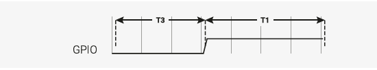

The pin has been low for time T3, and high for time T1. If the x register is 1 (remember this contains our 1 bit of pixel data) then we will fall through to the instruction labelled `do_one`:

ピンは時間T3でローになり、時間T1でハイになります。もしxレジスタが1であれば(このレジスタには1ビットのピクセル・データが格納されていることを思い出してください)、`do_one` 命令へフォールスルーします:

```
do_one:
  	jmp bitloop side 1 [T2 - 1] ; Continue driving high, for a long pulse
```

On this side of the branch we do the following:

1. `side 1` on the side-set pin (continue the pulse) 

2. `jmp` unconditionally back to `bitloop` (the label we defined earlier, at the top of the program); the state machine is done with this data bit, and will get another from its OSR 

3. Delay for `T2 - 1` cycles after the instruction

The waveform at our output pin now looks like this:

Figure 5. On a one data bit, the line is driven low for time T3, high for time T1, then high for an additional time T2

This accounts for the case where we shifted a 1 data bit into the x register. For a 0 bit, we will have jumped over the last instruction we looked at, to the instruction labelled do_zero:

この分岐の側では、次のようにする:

1. サイドセットピンの `side 1`(パルスを続ける)

2. 無条件に `bitloop`(プログラムの先頭で先に定義したラベル)に `jmp` で戻る。ステートマシンはこのデータビットで終了し、OSRから別のビットを取得する

3. 命令の後、`T2 - 1` サイクル遅延する

出力ピンの波形は次のようになります:

図5. 1データ・ビットの場合、ラインは時間T3の間Lowに、時間T1の間Highに、さらに時間T2の間Highに駆動される


これはデータ・ビット `1` を x レジスタにシフトした場合を考慮したものである。ビット `0` の場合は、最後に見た `do_zero` というラベルが付いた命令を飛び越えたことになる:

```
do_zero:
  	nop side 0 [T2 - 1] ; Or drive low, for a short pulse
```

1. `side 0` on the side-set pin (the trailing edge of our pulse)

2. `nop` means no operation. We don’t have anything else we particularly want to do, so waste a cycle

3. The instruction takes T2 cycles in total

For the `x == 0` case, we get this on our output pin:

Figure 6. On a zero data bit, the line is driven low for time T3, high for time T1, then low again for time T1 The final line of our program is this:

1. サイドセットピンのサイド0(パルスの後縁)

2. nopは何もしないことを意味する。他に特にやりたいことがないので、1サイクルを無駄にする

3. この命令は合計でT2サイクルかかる

x==0の場合、出力ピンにはこのように出力される:

図6. データ・ビットがゼロの場合、このラインは時間T3だけLowになり、時間T1だけHighになり、時間T1だけ再びLowになる:

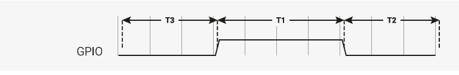

```
.wrap
```

This matches with the `.wrap_target` directive at the top of the program. Wrapping is a hardware feature of the state machine which behaves like a wormhole: you go in through the `.wrap` statement and appear at the `.wrap_target` zero cycles later, unless the `.wrap` is preceded immediately by a `jmp` whose condition is true. This is important for getting precise timing with programs that must run quickly, and often also saves you a slot in the instruction memory.

>  TIP
> Often an explicit .wrap_target/.wrap pair is not necessary, because the default configuration produced by pioasm has an implicit wrap from the end of the program back to the beginning, if you didn’t specify one.

> NOPs
> 
> NOP, or no operation, means precisely that: do nothing! You may notice there is no `nop` instruction defined in the instruction set reference: `nop` is really a synonym for `mov y, y` in PIO assembly.
> 
> Why did we insert a nop in this example when we could have jmp-ed? Good question! It’s a dramatic device we contrived so we could discuss nop and .wrap. Writing documentation is hard. In general, though, nop is useful when you need to perform a side-set and have nothing else to do, or you need a very slightly longer delay than is available on a single instruction.

It is hopefully becoming clear why our timings T1, T2, T3 are numbered this way, because what the LED string sees really is one of these two cases:

Figure 7. The line is initially low in the idle (latch) state, and the LED is waiting for the first rising edge. It sees our pulse timings in the order T1-T2-T3, until the very last T3, where it sees a much longer negative period once the state machine runs out of data.

これは、プログラムの先頭にある `.wrap_target` ディレクティブと対応する。ラップは、ステートマシンのハードウェア機能であり、ワームホールのように動作する。 `.wrap` 文を通して中に入ると、 `.wrap` の直前に条件が真である `jmp` がない限り、0サイクル後に `.wrap_target` に現れる。これは、素早く実行しなければならないプログラムで正確なタイミングを得るために重要であり、多くの場合、命令メモリのスロットを節約することもできる。

>  TIP
> 多くの場合、明示的な`.wrap_target`/`.wrap`のペアは必要ありません。なぜなら、`pioasm` が生成するデフォルトのコンフィギュレーションでは、指定しなかった場合、プログラムの終わりから最初に戻る暗黙的なラップがあるからです。

> NOPs
>
> NOP(操作なし)とは、まさに「何もしない」という意味です！命令セット・リファレンスに `nop` 命令が定義されていないことにお気づきでしょうか。 `nop` は、PIOアセンブリの `mov y, y` の同義語です。
>
> この例では `jmp` することができたのに、なぜ `nop` を挿入したのでしょうか？いい質問だ！これは、 `nop` と `.wrap` について議論するために仕組んだ演出なのです。ドキュメントを書くのは難しい。しかし、一般的には、 `nop` はサイドセットを実行する必要があり、他にすることがない場合や、1つの命令で利用できるよりも非常に長い遅延が必要な場合に便利です。

なぜT1、T2、T3のタイミングにこのような番号を振っているのか、LEDストリングが見ているのはこの2つのケースのどちらかだからだ:

図7: ラインはアイドル(ラッチ)状態で最初はローであり、LEDは最初の立ち上がりエッジを待っている。T1-T2-T3の順でパルスのタイミングを見ますが、最後のT3では、ステートマシンがデータを使い果たした後、より長い負の期間を見ます。

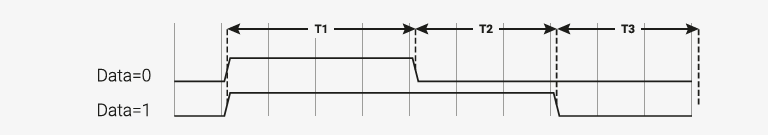

This should look familiar if you refer back to Figure 3.

After thoroughly dissecting our program, and hopefully being satisfied that it will repeatedly send one well-formed data bit to a string of WS2812 LEDs, we’re left with a question: where is the data coming from? This is more thoroughly explained in the RP2350 Datasheet, but the data that we are shifting out from the OSR came from the state machine’s TX FIFO. The TX FIFO is a data buffer between the state machine and the rest of RP-series microcontroller, filled either via direct poking from the CPU, or by the system DMA, which is much faster.

The out instruction shifts data out from the OSR, and zeroes are shifted in from the other end to fill the vacuum.  Because the OSR is 32 bits wide, you will start getting zeroes once you have shifted out a total of 32 bits. There is a pull instruction which explicitly takes data from the TX FIFO and put it in the OSR (stalling the state machine if the FIFO is empty).

However, in the majority of cases it is simpler to configure autopull, a mode where the state machine automatically refills the OSR from the TX FIFO (an automatic `pull`) when a configured number of bits have been shifted out. Autopull happens in the background, in parallel with whatever else the state machine may be up to (in other words it has a cost of zero cycles). We’ll see how this is configured in the next section.

これは、図3を参照すれば見覚えがあるはずだ。

プログラムを徹底的に分解し、WS2812 LED のストリングに 1 つの整ったデータ・ビットを繰り返し送信することに満足したところで、「データはどこから来ているのか」という疑問が残る。これは RP2350 のデータシートに詳しく説明されているが、OSR からシフトアウトされるデータは、ステートマシンの TX FIFO から送られる。TX FIFOは、ステートマシンとRPシリーズ・マイコンの残りの部分との間のデータ・バッファで、CPUから直接つつくか、システムDMAによって満たされます。

`out` 命令によってOSRからデータがシフトアウトされ、もう一方の端からゼロがシフトインされて空白を埋める。 OSRの幅は32ビットなので、合計32ビットをシフト・アウトすると、ゼロが入るようになります。明示的にTX FIFOからデータを取り出してOSRに入れる(FIFOが空の場合、ステートマシンをストールさせる) `pull` 命令があります。

このモードでは、設定されたビット数がシフト・アウトされると、ステート・マシンが自動的にTX FIFOからOSRを補充します(自動 `pull`)。オートプルはバックグラウンドで、ステートマシンが行っている他の作業と並行して行われる(言い換えれば、コストはゼロサイクル)。これがどのように設定されるかは、次のセクションで説明する。

#### 3.2.2.2. State Machine Configuration

When we run `pioasm` on the `.pio` file we have been looking at, and ask it to spit out SDK code (which is the default), it will create some static variables describing the program, and a method ws2812_default_program_config which configures a PIO state machine based on user parameters, and the directives in the actual PIO program (namely the `.side_set` and `.wrap` in this case).

Of course how you configure the PIO SM when using the program is very much related to the program you have written.

Rather than try to store a data representation off all that information, and parse it at runtime, for the use cases where you’d like to encapsulate setup or other API functions with your PIO program, you can embed code within the .pio file.

これまで見てきた `.pio` ファイルで `pioasm` を実行し、SDKコードを吐き出すように指示すると(これがデフォルト)、プログラムを記述するいくつかの静的変数と、ユーザパラメータと実際のPIOプログラムのディレクティブ(この場合は `.side_set` と `.wrap`)に基づいてPIOステートマシンを設定するメソッド `ws2812_default_program_config` が作成される。

もちろん、プログラム使用時にPIO SM(State Machine) をどのように設定するかは、あなたが書いたプログラムに大きく関係しています。

PIOプログラムでセットアップやその他のAPI関数をカプセル化したい場合、これらの情報をすべてデータとして保存し、実行時に解析するのではなく、`.pio` ファイル内にコードを埋め込むことができます。

Pico Examples: https://github.com/raspberrypi/pico-examples/blob/master/pio/ws2812/ws2812.pio Lines 36 - 52

```
36 static inline void ws2812_program_init(PIO pio, uint sm, uint offset, uint pin, float freq, bool rgbw) {
37
38    pio_gpio_init(pio, pin);
39    pio_sm_set_consecutive_pindirs(pio, sm, pin, 1, true);
40
41    pio_sm_config c = ws2812_program_get_default_config(offset);
42    sm_config_set_sideset_pins(&c, pin);
43    sm_config_set_out_shift(&c, false, true, rgbw ? 32 : 24);
44    sm_config_set_fifo_join(&c, PIO_FIFO_JOIN_TX);
45
46    int cycles_per_bit = ws2812_T1 + ws2812_T2 + ws2812_T3;
47    float div = clock_get_hz(clk_sys) / (freq * cycles_per_bit);
48    sm_config_set_clkdiv(&c, div);
49
50    pio_sm_init(pio, sm, offset, &c);
51    pio_sm_set_enabled(pio, sm, true);
52 }
```

In this case we are passing through code for the SDK, as requested by this line you will see if you click the link on the above listing to see the context:

この場合、上のリストのリンクをクリックしてコンテキストを見るとわかるように、この行で要求されたSDK用のコードを渡している:

```
% c-sdk {
```

We have here a function `ws2812_program_init` which is provided to help the user to instantiate an instance of the LED driver program, based on a handful of parameters:

`ws2812_program_init` 関数は、ユーザがいくつかのパラメータに基づいてLEDドライバー・プログラムのインスタンスを生成するのを助けるために用意されている:

<desc>

||pio|| Which of the PIO instances we are dealing with
||sm|| Which state machine on that PIO we want to configure to run the WS2812 program
||offset|| Where the PIO program was loaded in PIO’s 5-bit program address space
||pin|| which GPIO pin our WS2812 LED chain is connected to
||freq|| The frequency (or rather baud rate) we want to output data at.
||rgbw|| True if we are using 4-colour LEDs (red, green, blue, white) rather than the usual 3.
||pio|| どのPIOインスタンスを扱っているか
||sm|| WS2812プログラムを実行するために設定したいPIO上のステートマシン
||offset|| PIOの5ビットプログラムアドレス空間でPIOプログラムがロードされた場所
||pin|| WS2812 LEDチェーンがどのGPIOピンに接続されているか
||freq|| データを出力したい周波数(というかボーレート)。
||rgbw|| 4色LED(赤、緑、青、白)を使う場合は真。
</desc>

Such that:

* `pio_gpio_init(pio, pin);` Configure a GPIO for use by PIO. (Set the GPIO function select.)

* `pio_sm_set_consecutive_pindirs(pio, sm, pin, 1, true);` Sets the PIO pin direction of 1 pin starting at pin number `pin` to out

* `pio_sm_config c = ws2812_program_default_config(offset);` Get the default configuration using the generated function for this program (this includes things like the `.wrap` and .`side_set` configurations from the program). We’ll modify this configuration before loading it into the state machine.

* `sm_config_set_sideset_pins(&c, pin);` Sets the side-set to write to pins starting at pin `pin` (we say starting at because if you had .side_set 3, then it would be outputting values on numbers `pin`, `pin+1`, `pin+2`)

* `sm_config_set_out_shift(&c, false, true, rgbw ? 32 : 24);` False for shift_to_right (i.e. we want to shift out MSB first). True for autopull. 32 or 24 for the number of bits for the autopull threshold, i.e. the point at which the state machine triggers a refill of the OSR, depending on whether the LEDs are RGB or RGBW.

* `int cycles_per_bit = ws2812_T1 + ws2812_T2 + ws2812_T3;` This is the total number of execution cycles to output a single bit. Here we see the benefit of .define public; we can use the T1 - T3 values in our code.

* `float div = clock_get_hz(clk_sys) / (freq * cycles_per_bit);` `sm_config_clkdiv(&c, div);` Slow the state machine’s execution down, based on the system clock speed and the number of execution cycles required per WS2812 data bit, so that we achieve the correct bit rate.

* `pio_sm_init(pio, sm, offset, &c);` Load our configuration into the state machine, and go to the start address (offset)

* `pio_sm_set_enabled(pio, sm, true);` And make it go now!

At this point the program will be stuck on the first `out` waiting for data. This is because we have autopull enabled, the OSR is initially empty, and there is no data to be pulled. The state machine refuses to continue until the first piece of data arrives in the FIFO.

As an aside, this last point sheds some light on the slightly cryptic comment at the start of the PIO program:

ここで、それぞれは以下を示す。

* `pio_gpio_init(pio, pin);` PIOが使用するGPIOを設定する。(GPIOのファンクション・セレクトを設定する。)

* `pio_sm_set_consecutive_pindirs(pio, sm, pin, 1, true);` ピン番号 `pin` から始まる1ピンのPIOピンの方向をoutに設定する

* `pio_sm_config c = ws2812_program_default_config(offset);` このプログラム用に生成された関数を使用してデフォルト・コンフィギュレーションを取得する(これには、プログラムからの `.wrap` や `.side_set` コンフィギュレーションなどが含まれる)。ステートマシンにロードする前に、このコンフィギュレーションを修正する。

* `sm_config_set_sideset_pins(&c, pin);` ピン `pin` から始まるピンに書き込むサイドセットを設定する(ここから始まるというのは、`.side_set 3` を設定した場合、番号 `pin`, `pin+1`, `pin+2` に値を出力することになるから)

* `sm_config_set_out_shift(&c, false, true, rgbw ? 32 : 24);` shift_to_right(つまり、MSBを最初にシフトアウトしたい)場合はfalse。オートプルの場合はtrue。オートプル閾値のビット数は32または24(LEDがRGBかRGBWかによって、ステートマシンがOSRの再充填をトリガーするポイント)。

* `int cycles_per_bit = ws2812_T1 + ws2812_T2 + ws2812_T3;` これは、1ビットを出力するための総実行サイクル数です。ここで、`.define public` の利点がわかる。T1からT3の値をコードで使うことができる。

* `float div = clock_get_hz(clk_sys) / (freq * cycles_per_bit);` `sm_config_clkdiv(&amp;c, div);` システム・クロック速度と WS2812 データビットあたりに必要な実行サイクル数に基づいて、正しいビットレートを達成するように、ステートマシンの実行をスローダウンする。

* `pio_sm_init(pio, sm, offset, &c);` コンフィギュレーションをステートマシンにロードし、開始アドレス(`offset`)に進む。

* `pio_sm_set_enabled(pio, sm, true);` そして実行させます！

この時点で、プログラムはデータ待ちの最初の `out` でスタックします。これは、オートプルを有効にしているためで、OSRは最初は空であり、プルされるデータはない。ステートマシンは、最初のデータがFIFOに到着するまで処理を続行しない。

余談だが、この最後のポイントは、PIOプログラム冒頭の少し不可解なコメントに光を当てている:

```
  out x, 1 side 0 [T3 - 1] ; Side-set still takes place when instruction stalls
```

This comment is giving us an important piece of context. We stall on this instruction initially, before the first data is added, and also every time we finish sending the last piece of data at the end of a long serial burst. When a state machine stalls, it does not continue to the next instruction, rather it will reattempt the current instruction on the next divided clock cycle. However, side-set still takes place. This works in our favour here, because we consequently always return the line to the idle (low) state when we stall.

このコメントは重要な文脈を与えてくれている。この命令でストールするのは、最初のデータが追加される前と、長いシリアル・バーストの最後に最後のデータを送信し終えるときである。ステートマシンがストールすると、次の命令には進まず、次の分割クロックサイクルで現在の命令を再試行する。しかし、サイドセットは依然として行われる。これは、ストールしたときに常にアイドル(Low)状態にラインを戻すので、ここでは有利に働きます。

#### 3.2.2.3. Cプログラム

The companion to the `.pio` file we’ve looked at is a `.c` file which drives some interesting colour patterns out onto a string of LEDs. We’ll just look at the parts that are directly relevant to PIO.


これまで見てきた `.pio` ファイルの仲間は、LEDのストリングにいくつかの興味深いカラー・パターンを表示する `.c` ファイルです。ここでは、PIOに直接関係する部分だけを見ていきます。

Pico Examples: https://github.com/raspberrypi/pico-examples/blob/master/pio/ws2812/ws2812.c Lines 43 - 45

```
43 static inline void put_pixel(PIO pio, uint sm, uint32_t pixel_grb) {
44    pio_sm_put_blocking(pio, sm, pixel_grb << 8u);
45 }
```

Pico Examples: https://github.com/raspberrypi/pico-examples/blob/master/pio/ws2812/ws2812.c Lines 47 - 52

```
47 static inline uint32_t urgb_u32(uint8_t r, uint8_t g, uint8_t b) {
48      return
49              ((uint32_t) (r) << 8) |
50              ((uint32_t) (g) << 16) |
51              (uint32_t) (b);
52 }
```

Here we are writing 32-bit values into the FIFO, one at a time, directly from the CPU. `pio_sm_put_blocking` is a helper method that waits until there is room in the FIFO before pushing your data.

You’ll notice the << 8 in put_pixel(): remember we are shifting out starting with the MSB, so we want the 24-bit colour values at the top. This works fine for WGBR too, just that the W is always 0.

This program has a handful of colour patterns, which call our put_pixel helper above to output a sequence of pixel values:

ここで 32ビットの値を、一度に1個ずつ CPUから FIFO に書き込んでいます。`pio_sm_put_blocking` は、データをプッシュする前にFIFOに空きができるまで待機するヘルパー・メソッドです。

`put_pixel()` の `<< 8` にお気づきでしょう: MSBからシフトアウトしていることを思い出してください。これはWGBRでも問題なく動作するが、Wは常に0である。

このプログラムにはいくつかのカラーパターンがあり、上記の `put_pixel` ヘルパーを呼び出して一連のピクセル値を出力します:

Pico Examples: https://github.com/raspberrypi/pico-examples/blob/master/pio/ws2812/ws2812.c Lines 76 - 81

```
76 void pattern_random(PIO pio, uint sm, uint len, uint t) {
77    if (t % 8)
78        return;
79    for (uint i = 0; i < len; ++i)
80        put_pixel(pio, sm, rand());
81 }
```

The main function loads the program onto a PIO, configures a state machine for 800 kbaud WS2812 transmission, and then starts cycling through the colour patterns randomly.

メイン関数は、プログラムをPIOにロードし、800kbaud WS2812伝送用のステートマシンを設定し、カラーパターンをランダムに循環させ始める。

Pico Examples: https://github.com/raspberrypi/pico-examples/blob/master/pio/ws2812/ws2812.c Lines 110 - 143

```
110 int main() {
111     //set_sys_clock_48();
112     stdio_init_all();
113     printf("WS2812 Smoke Test, using pin %d\n", WS2812_PIN);
114
115     // todo get free sm
116     PIO pio;
117     uint sm;
118     uint offset;
119
120     // This will find a free pio and state machine for our program and load it for us
121     // We use pio_claim_free_sm_and_add_program_for_gpio_range (for_gpio_range variant)
122     // so we will get a PIO instance suitable for addressing gpios >= 32 if needed and
  supported by the hardware
123     bool success = pio_claim_free_sm_and_add_program_for_gpio_range(&ws2812_program, 
                    &pio, &sm, &offset, WS2812_PIN, 1, true);
124     hard_assert(success);
125
126     ws2812_program_init(pio, sm, offset, WS2812_PIN, 800000, IS_RGBW);
127
128     int t = 0;
129     while (1) {
130         int pat = rand() % count_of(pattern_table);
131         int dir = (rand() >> 30) & 1 ? 1 : -1;
132         puts(pattern_table[pat].name);
133         puts(dir == 1 ? "(forward)" : "(backward)");
134         for (int i = 0; i < 1000; ++i) {
135             pattern_table[pat].pat(pio, sm, NUM_PIXELS, t);
136             sleep_ms(10);
137             t += dir;
138         }
139     }
140
141     // This will free resources and unload our program
142     pio_remove_program_and_unclaim_sm(&ws2812_program, pio, sm, offset);
143 }
```

### 3.2.3. PIO and DMA (A Logic Analyser)

So far we have looked at writing data to PIO directly from the processor. This often leads to the processor spinning its wheels waiting for room in a FIFO to make a data transfer, which is not a good investment of its time. It also limits the total data throughput you can achieve.

RP-series microcontrollers are equipped with a powerful direct memory access unit (DMA), which can transfer data for you in the background. Suitably programmed, the DMA can make quite long sequences of transfers without supervision.

Up to one word per system clock can be transferred to or from a PIO state machine, which is, to be quite technically precise, more bandwidth than you can shake a stick at. The bandwidth is shared across all state machines, but you can use the full amount on one state machine.

Let’s take a look at the `logic_analyser` example, which uses PIO to sample some of the RP-series microcontroller’s own pins, and capture a logic trace of what is going on there, at full system speed.

これまで、プロセッサから直接PIOにデータを書き込むことについて見てきた。これはしばしば、プロセッサがデータ転送を行うためにFIFOの空きを待って空回りすることにつながる。また、達成できるデータ・スループットも制限されます。

RPシリーズ・マイコンには、強力なダイレクト・メモリ・アクセス・ユニット(DMA)が搭載されており、バックグラウンドでデータ転送を行うことができます。適切にプログラムされたDMAは、監視なしで非常に長い転送シーケンスを実行できます。

システムクロックあたり最大1ワードをPIOステートマシンに転送することができる。帯域幅はすべてのステートマシンで共有されますが、1つのステートマシンで全量を使用できます。

`logic_analyser` の例を見てみましょう。この例では、PIOを使用してRPシリーズ・マイクロコントローラ自身のピンの一部をサンプリングし、そこで何が起こっているのかのロジック・トレースを、フル・システム速度でキャプチャします。

Pico Examples: https://github.com/raspberrypi/pico-examples/blob/master/pio/logic_analyser/logic_analyser.c Lines 40 - 63

```
40 void logic_analyser_init(PIO pio, uint sm, uint pin_base, uint pin_count, float div) {
41      // Load a program to capture n pins. This is just a single `in pins, n`
42      // instruction with a wrap.
43      uint16_t capture_prog_instr = pio_encode_in(pio_pins, pin_count);
44      struct pio_program capture_prog = {
45          .instructions = &capture_prog_instr,
46          .length = 1,
47          .origin = -1
48      };
49      uint offset = pio_add_program(pio, &capture_prog);
50
51      // Configure state machine to loop over this `in` instruction forever,
52      // with autopush enabled.
53      pio_sm_config c = pio_get_default_sm_config();
54      sm_config_set_in_pins(&c, pin_base);
55      sm_config_set_wrap(&c, offset, offset);
56      sm_config_set_clkdiv(&c, div);
57      // Note that we may push at a < 32 bit threshold if pin_count does not
58      // divide 32. We are using shift-to-right, so the sample data ends up
59      // left-justified in the FIFO in this case, with some zeroes at the LSBs.
60      sm_config_set_in_shift(&c, true, true, bits_packed_per_word(pin_count));
61      sm_config_set_fifo_join(&c, PIO_FIFO_JOIN_RX);
62      pio_sm_init(pio, sm, offset, &c);
63 }
```

Our program consists only of a single `in pins`, `<pin_count>` instruction, with program wrapping and autopull enabled.  Because the amount of data to be shifted is only known at runtime, and because the program is so short, we are generating the program dynamically here (using the pio_encode_ functions) instead of pushing it through pioasm. The program is wrapped in a data structure stating how big the program is, and where it must be loaded — in this case origin = -1 meaning "don’t care".

> Input Shift Register
> 
> The *input shift register* (ISR) is the mirror image of the OSR. Generally data flows through a state machine in one of two directions: System → TX FIFO → OSR → Pins, or Pins → ISR → RX FIFO → System. An `in` instruction shifts data into the ISR.
> 
> If you don’t need the ISR’s shifting ability — for example, if your program is output-only — you can use the ISR as a third scratch register. It’s 32 bits in size, the same as X, Y and the OSR. The full details are in the RP2350 Datasheet.

We load the program into the chosen PIO, and then configure the input pin mapping on the chosen state machine so that its `in pins` instruction will see the pins we care about. For an `in` instruction we only need to worry about configuring the base pin, i.e. the pin which is the least significant bit of the `in` instruction’s sample. The number of pins to be sampled is determined by the bit count parameter of the `in pins` instruction — it will sample *n* pins starting at the base we specified, and shift them into the ISR.

> Pin Groups (Mapping)
> 
> We mentioned earlier that there are four pin groups to configure, to connect a state machine’s internal data buses to the GPIOs it manipulates. A state machine accesses all pins within a group at once, and pin groups can overlap. So far we have seen the out, side-set and in pin groups. The fourth is set.
> 
> The out group is the pins affected by shifting out data from the OSR, using `out pins` or `out pindirs`, up to 32 bits at a time. The set group is used with `set pins` and `set pindirs` instructions, up to 5 bits at a time, with data that is encoded directly in the instruction. It’s useful for toggling control signals. The side-set group is similar to the set group, but runs simultaneously with another instruction. Note: `mov pin` uses the in or out group, depending on direction.

Configuring the clock divider optionally slows down the state machine’s execution: a clock divisor of n means 1 instruction will be executed per n system clock cycles. The default system clock frequency for SDK is 125MHz.

`sm_config_set_in_shift` sets the shift direction to rightward, enables autopush, and sets the autopush threshold to 32.  The state machine keeps an eye on the total amount of data shifted into the ISR, and on the `in` which reaches or breaches a total shift count of 32 (or whatever number you have configured), the ISR contents, along with the new data from the `in.` goes straight to the RX FIFO. The ISR is cleared to zero in the same operation.

`sm_config_set_fifo_join` is used to manipulate the FIFOs so that the DMA can get more throughput. If we want to sample every pin on every clock cycle, that’s a lot of bandwidth! We’ve finished describing how the state machine should be configured, so we use `pio_sm_init` to load the configuration into the state machine, and get the state machine into a clean initial state.

> FIFO Joining
> 
> Each state machine is equipped with a FIFO going in each direction: the TX FIFO buffers data on its way out of the system, and the RX FIFO does the same for data coming in. Each FIFO has four data slots, each holding 32 bits of data. Generally you want FIFOs to be as deep as possible, so there is more slack time between the timing-critical operation of a peripheral, and data transfers from system agents which may be quite busy or have high access latency. However this comes with significant hardware cost.
> 
> If you are only using one of the two FIFOs — TX or RX — a state machine can pool its resources to provide a single FIFO with double the depth. The RP2350 Datasheet goes into much more detail, including how this mechanism actually works under the hood.

Our state machine is ready to sample some pins. Let’s take a look at how we hook up the DMA to our state machine, and tell the state machine to start sampling once it sees some trigger condition.

私たちのプログラムは、プログラム・ラッピングとオートプルを有効にした、1つの `in pins`、`<pin_count>` 命令のみで構成されています。 シフトされるデータ量は実行時にしかわからないし、プログラムも短いので、ここでは `pioasm` 通してプログラムをプッシュするのではなく、(`pio_encode_` 関数を使用して)動的にプログラムを生成している。プログラムはデータ構造でラップされ、そのデータ構造にはプログラムのサイズとロードされる場所(この場合、`origin = -1` は "don't care" を意味する)が記述されている。

> 入力シフト・レジスタ
>
> *入力シフト・レジスタ*(ISR)はOSRの鏡像である。一般的に、データはステートマシンを2つの方向のいずれかで流れる: システム → TX FIFO → OSR → ピン、またはピン → ISR → RX FIFO → システムです。 `in` 命令はデータを ISR にシフトします。
>
> ISRのシフト機能を必要としない場合、例えばプログラムが出力のみの場合、ISRを第3のスクラッチ・レジスタとして使用することができます。サイズは32ビットで、X、Y、OSRと同じです。詳細はRP2350データシートに記載されています。

選択したPIOにプログラムをロードし、選択したステートマシンの入力ピン・マッピングを設定し、 `in pins` 命令で気になるピンを確認できるようにします。 `in` 命令では、ベース・ピン、つまり `in` 命令のサンプルの最下位ビットとなるピンの設定だけを気にすればよい。サンプリングするピンの数は、`in pins` 命令のビットカウントパラメータで決定します。 指定したベースからはじまる *n* ピンをサンプリングし、ISR にシフトして入れ込む。

> Pin Groups (Mapping)
>
> ステートマシンの内部データバスを操作するGPIOに接続するために、設定すべき4つのピングループがあることを前述しました。ステートマシンはグループ内のすべてのピンに一度にアクセスし、ピングループは重複することがあります。これまで、out、side-set、inのピングループを見てきた。4つ目はセットである。
>
> アウト・グループは、`out pins` または `out pindirs` を使ってOSRからデータをシフト・アウトすることによって影響を受けるピンで、一度に最大32ビットまで使用できる。 setグループは `set pins` 命令や `set pindirs` 命令で使用され、一度に最大5ビットまで、命令で直接エンコードされたデータで使用されます。これは制御信号をトグルするのに便利です。side-setグループはsetグループに似ていますが、別の命令と同時に実行されます。注: `mov pin` は、方向によってinまたはoutグループを使用します。

クロック分周器を設定すると、オプションでステートマシンの実行速度が遅くなる:クロック分周器をnに設定すると、nシステム・クロック・サイクルあたり1命令が実行されることになる。SDKのデフォルトのシステムクロック周波数は125MHzである。

`sm_config_set_in_shift` シフト方向を右方向に設定し、オートプッシュを有効にし、オートプッシュしきい値を32に設定する。ステートマシンはISRにシフトされたデータの総量を監視し、シフト総カウントが32(または設定された任意の数)に達するか突破した `in` で、ISRの内容は `in` からの新しいデータと共にRX FIFOに直接送られる。同じオペレーションで、ISR はゼロクリアされる。

`sm_config_set_fifo_join` は、DMA がより多くのスループットを得られるように FIFO を操作するために使用される。毎クロック・サイクルですべてのピンをサンプリングしようとすると、それはかなりの帯域幅になります！ステートマシンがどのように設定されるべきかを説明し終わったので、 `pio_sm_init` を使用してステートマシンにコンフィギュレーションをロードし、ステートマシンをクリーンな初期状態にします。

> FIFO Joining
>
> 各ステートマシンには、各方向に向かうFIFOが装備されている。TX FIFOはシステムから出るデータをバッファリングし、RX FIFOは入ってくるデータに対して同じことを行う。各FIFOには4つのデータ・スロットがあり、それぞれ32ビットのデータを保持する。ペリフェラルのタイミングが重要な動作と、非常にビジーであったりアクセスレイテンシが高かったりするシステムエージェントからのデータ転送の間に、より多くのスラックタイムがあるように、一般的にFIFOはできるだけ深くしたいものです。しかし、これには大きなハードウェアコストがかかります。
>
> TXまたはRXの2つのFIFOのうち1つだけを使用する場合、ステートマシンはそのリソースをプールして、2倍の深さの1つのFIFOを提供することができます。RP2350のデータシートでは、このメカニズムが実際にどのように動作するのかを含め、より詳細に説明しています。

ステートマシンは、いくつかのピンをサンプリングする準備ができています。DMAをステートマシンに接続し、トリガ条件を見つけたらサンプリングを開始するようにステートマシンに指示する方法を見てみましょう。

Pico Examples: https://github.com/raspberrypi/pico-examples/blob/master/pio/logic_analyser/logic_analyser.c Lines 65 - 87

```
65 void logic_analyser_arm(PIO pio, uint sm, uint dma_chan, uint32_t 
            *capture_buf, size_t capture_size_words,
66          uint trigger_pin, bool trigger_level) {
67      pio_sm_set_enabled(pio, sm, false);
68      // Need to clear _input shift counter_, as well as FIFO, because there may be
69      // partial ISR contents left over from a previous run. sm_restart does this.
70      pio_sm_clear_fifos(pio, sm);
71      pio_sm_restart(pio, sm);
72
73      dma_channel_config c = dma_channel_get_default_config(dma_chan);
74      channel_config_set_read_increment(&c, false);
75      channel_config_set_write_increment(&c, true);
76      channel_config_set_dreq(&c, pio_get_dreq(pio, sm, false));
77
78      dma_channel_configure(dma_chan, &c,
79              capture_buf,        // Destination pointer
80              &pio->rxf[sm],      // Source pointer
81              capture_size_words, // Number of transfers
82              true                // Start immediately
83      );
84
85      pio_sm_exec(pio, sm, pio_encode_wait_gpio(trigger_level, trigger_pin));
86      pio_sm_set_enabled(pio, sm, true);
87 }
```

We want the DMA to read from the RX FIFO on our PIO state machine, so every DMA read is from the same address.

The write address, on the other hand, should increment after every DMA transfer so that the DMA gradually fills up our capture buffer as data comes in. We need to specify a data request signal (DREQ) so that the DMA transfers data at the proper rate.

> Data request signals
> 
> The DMA can transfer data incredibly fast, and almost invariably this will be much faster than your PIO program actually needs. The DMA paces itself based on a data request handshake with the state machine, so there’s no worry about it overflowing or underflowing a FIFO, as long as you have selected the correct DREQ signal. The state machine coordinates with the DMA to tell it when it has room available in its TX FIFO, or data available in its RX FIFO.

We need to provide the DMA channel with an initial read address, an initial write address, and the total number of reads/writes to be performed (not the total number of bytes). We start the DMA channel immediately — from this point on, the DMA is poised, waiting for the state machine to produce data. As soon as data appears in the RX FIFO, the DMA will pounce and whisk the data away to our capture buffer in system memory.

As things stand right now, the state machine will immediately go into a 1-cycle loop of `in` instructions once enabled.  Since the system memory available for capture is quite limited, it would be better for the state machine to wait for some trigger before it starts sampling. Specifically, we are using a `wait pin` instruction to stall the state machine until a certain pin goes high or low, and again we are using one of the `pio_encode_` functions to encode this instruction on-the-fly.

`pio_sm_exec` tells the state machine to immediately execute some instruction you give it. This instruction never gets written to the instruction memory, and if the instruction stalls (as it will in this case — a `wait` instruction’s job is to stall) then the state machine will latch the instruction until it completes. With the state machine stalled on the `wait` instruction, we can enable it without being immediately flooded by data.

At this point everything is armed and waiting for the trigger signal from the chosen GPIO. This will lead to the following sequence of events:

1. The `wait` instruction will clear

2. On the very next cycle, state machine will start to execute `in` instructions from the program memory

3. As soon as data appears in the RX FIFO, the DMA will start to transfer it.

4. Once the requested amount of data has been transferred by the DMA, it’ll automatically stop

> State Machine EXEC Functionality
> 
> So far our state machines have executed instructions from the instruction memory, but there are other options. One is the `SMx_INSTR` register (used by `pio_sm_exec()`): the state machine will immediately execute whatever you write here, momentarily interrupting the current program it’s running if necessary. This is useful for poking around inside the state machine from the system side, for initial setup.
> 
> The other two options, which use the same underlying hardware, are `out exec` (shift out an instruction from the data being streamed through the OSR, and execute it) and `mov exec` (execute an instruction stashed in e.g. a scratch register). Besides making people’s eyes bulge, these are really useful if you want the state machine to perform some data-defined operation at a certain point in an output stream.

The example code provides this cute function for displaying the captured logic trace as ASCII art in a terminal:

(和約)

DMAはPIOステートマシンのRX FIFOから読み込みたいので、すべてのDMA読み込みは同じアドレスからとなる。

一方、書き込みアドレスは、DMA転送のたびにインクリメントして、データが入ってくるたびにDMAがキャプチャ・バッファを徐々に埋めていくようにします。DMAが適切なレートでデータを転送できるように、データ要求信号(DREQ)を指定する必要がある。

> データ要求信号
>
> DMAは信じられないほど高速にデータを転送することができ、ほとんどの場合、これはPIOプログラムが実際に必要とする速度よりもはるかに速くなります。DMAは、ステートマシンとのデータ要求ハンドシェイクに基づいてペース配分するので、正しいDREQ信号を選択している限り、FIFOがオーバーフローしたりアンダーフローしたりする心配はない。ステートマシンはDMAと協調して、TX FIFOに空きがあるとき、またはRX FIFOにデータがあるとき、それをDMAに伝えます。

DMAチャネルに、初期読み取りアドレス、初期書き込みアドレス、および実行される読み取り/書き込みの合計数(合計バイト数ではない)を提供する必要があります。この時点からDMAは待機し、ステートマシンがデータを生成するのを待っている。データがRX FIFOに現れるとすぐに、DMAは飛びかかり、システム・メモリ内のキャプチャ・バッファにデータを運びます。

現状では、ステートマシンはイネーブルになるとすぐに `in` 命令の1サイクルループに入る。キャプチャに使用できるシステム・メモリはかなり限られているため、ステート・マシンがサンプリングを開始する前に何らかのトリガーを待つ方が良いだろう。具体的には、あるピンがHighまたはLowになるまでステートマシンをストールさせるために `wait pin` 命令を使用します。また、この命令をオンザフライでエンコードするために `pio_encode_` 関数の1つを使用します。

`pio_sm_exec` は、ステートマシンに与えた命令を即座に実行するように指示します。この命令が命令メモリに書き込まれることはなく、命令がストールした場合(この場合、 `wait` 命令の仕事はストールすることです)、ステートマシンは命令が完了するまでその命令をラッチします。ステートマシンが `wait` 命令でストールしているため、すぐにデータが殺到することなく、 `wait` 命令を有効にすることができる。

この時点で、すべてが待機状態となり、選択されたGPIOからのトリガ信号を待っている。これにより、以下の一連のイベントが発生する:

1. `wait` 命令がクリアされる。

2. 次のサイクルで、ステートマシンがプログラム・メモリからの `in` 命令の実行を開始する。

3. データがRX FIFOに現れるとすぐに、DMAはそのデータの転送を開始する。

4. 要求された量のデータがDMAによって転送されると、DMAは自動的に停止する

> State Machine EXEC Functionality
>
> ここまでのステートマシンは命令メモリから命令を実行してきたが、他にも選択肢がある。その1つが `SMx_INSTR` レジスタ(`pio_sm_exec()`で使用)です。ステートマシンはここに書き込んだものを即座に実行し、必要であれば実行中のプログラムを一瞬中断します。これは、システム側からステートマシンの内部を覗いたり、初期設定を行ったりするのに便利です。
>
> 他の2つのオプションは、同じ下回りハードウェアを使用するもので、`out exec`(OSRを通してストリームされているデータから命令をシフトアウトして実行する)と `mov exec`(例えばスクラッチ・レジスタに格納された命令を実行する)です。これらは、人々の目を丸くするだけでなく、出力ストリームのある時点で、ステートマシンに何らかのデータ定義の操作を実行させたい場合に本当に便利です。

サンプルコードは、キャプチャしたロジックトレースをASCIIアートとしてターミナルに表示するための、このかわいい機能を提供します:

Pico Examples: https://github.com/raspberrypi/pico-examples/blob/master/pio/logic_analyser/logic_analyser.c Lines 89 - 108

```
 89 void print_capture_buf(const uint32_t *buf, uint pin_base, uint pin_count,  
                            uint32_t n_samples) {
 90     // Display the capture buffer in text form, like this:
 91     // 00: __--__--__--__--__--__--
 92     // 01: ____----____----____----
 93     printf("Capture:\n");
 94     // Each FIFO record may be only partially filled with bits, depending on
 95     // whether pin_count is a factor of 32.
 96     uint record_size_bits = bits_packed_per_word(pin_count);
 97     for (uint pin = 0; pin < pin_count; ++pin) {
 98         printf("%02d: ", pin + pin_base);
 99         for (uint32_t sample = 0; sample < n_samples; ++sample) {
100             uint bit_index = pin + sample * pin_count;
101             uint word_index = bit_index / record_size_bits;
102             // Data is left-justified in each FIFO entry, hence the (32 - record_size_bits) offset
103             uint word_mask = 1u << (bit_index % record_size_bits + 32 - record_size_bits);
104             printf(buf[word_index] & word_mask ? "-" : "_");
105         }
106         printf("\n");
107     }
108 }
```

We have everything we need now for a RP-series microcontroller to capture a logic trace of its own pins, whilst running some other program. Here we’re setting up a PWM slice to output at around 15MHz on two GPIOs, and attaching our brand spanking new logic analyser to those same two GPIOs.

これで、RPシリーズ・マイクロコントローラーが他のプログラムを実行しながら、それ自身のピンのロジック・トレースをキャプチャするために必要なものがすべて揃いました。ここでは、2つのGPIOに約15MHzで出力するPWMスライスを設定し、真新しいロジックアナライザーを同じ2つのGPIOに接続しています。

Pico Examples: https://github.com/raspberrypi/pico-examples/blob/master/pio/logic_analyser/logic_analyser.c Lines 110 - 159

```
110 int main() {
111     stdio_init_all();
112     printf("PIO logic analyser example\n");
113
114     // We're going to capture into a u32 buffer, for best DMA efficiency. Need
115     // to be careful of rounding in case the number of pins being sampled
116     // isn't a power of 2.
117     uint total_sample_bits = CAPTURE_N_SAMPLES * CAPTURE_PIN_COUNT;
118     total_sample_bits += bits_packed_per_word(CAPTURE_PIN_COUNT) - 1;
119     uint buf_size_words = total_sample_bits / bits_packed_per_word(CAPTURE_PIN_COUNT);
120     uint32_t *capture_buf = malloc(buf_size_words * sizeof(uint32_t));
121     hard_assert(capture_buf);
122
123     // Grant high bus priority to the DMA, so it can shove the processors out
124     // of the way. This should only be needed if you are pushing things up to
125     // >16bits/clk here, i.e. if you need to saturate the bus completely.
126     bus_ctrl_hw->priority = BUSCTRL_BUS_PRIORITY_DMA_W_BITS |
  BUSCTRL_BUS_PRIORITY_DMA_R_BITS;
127
128     PIO pio = pio0;
129     uint sm = 0;
130     uint dma_chan = 0;
131
132     logic_analyser_init(pio, sm, CAPTURE_PIN_BASE, CAPTURE_PIN_COUNT, 1.f);
133
134     printf("Arming trigger\n");
135     logic_analyser_arm(pio, sm, dma_chan, capture_buf, buf_size_words, CAPTURE_PIN_BASE, true);
136
137     printf("Starting PWM example\n");
138     // PWM example: -----------------------------------------------------------
139     gpio_set_function(CAPTURE_PIN_BASE, GPIO_FUNC_PWM);
140     gpio_set_function(CAPTURE_PIN_BASE + 1, GPIO_FUNC_PWM);
141     // Topmost value of 3: count from 0 to 3 and then wrap, so period is 4 cycles
142     pwm_hw->slice[0].top = 3;
143     // Divide frequency by two to slow things down a little
144     pwm_hw->slice[0].div = 4 << PWM_CH0_DIV_INT_LSB;
145     // Set channel A to be high for 1 cycle each period (duty cycle 1/4) and
146     // channel B for 3 cycles (duty cycle 3/4)
147     pwm_hw->slice[0].cc =
148             (1 << PWM_CH0_CC_A_LSB) |
149             (3 << PWM_CH0_CC_B_LSB);
150     // Enable this PWM slice
151     pwm_hw->slice[0].csr = PWM_CH0_CSR_EN_BITS;
152     // ------------------------------------------------------------------------
153
154     // The logic analyser should have started capturing as soon as it saw the
155     // first transition. Wait until the last sample comes in from the DMA.
156     dma_channel_wait_for_finish_blocking(dma_chan);
157
158     print_capture_buf(capture_buf, CAPTURE_PIN_BASE, CAPTURE_PIN_COUNT, CAPTURE_N_SAMPLES);
159 }
```

The output of the program looks like this:

```
Starting PWM example
Capture:
16: ----____________----____________----____________----____________----_______
17: ------------____------------____------------____------------____-----------
```

### 3.2.4. Further examples

Hopefully what you have seen so far has given some idea of how PIO applications can be built with the SDK. The RP2350 Datasheet contains *many* more documented examples, which highlight particular hardware features of PIO, or show how particular hardware interfaces can be implemented.

You can also browse the `pio/` directory in the Pico Examples repository.

ここまでの説明で、SDK を使って PIO アプリケーションを構築する方法について、ある程度ご理解いただけたと思います。RP2350 Datasheetには、PIOの特定のハードウェア機能を強調したり、特定のハードウェア・インタフェースをどのように実装できるかを示す、より多くの文書化された例が含まれています。

また、Pico Examples リポジトリの `pio/` ディレクトリを参照することもできます。

## 3.3. PIOアセンブラPIOASMを使う

Up until now, we have glossed over the details of how the assembly program in our `.pio` file is translated into a binary program, ready to be loaded into our PIO state machine. Programs that handle this task — translating assembly code into binary — are generally referred to as assemblers, and PIO is no exception in this regard. The SDK includes an assembler for PIO, called `pioasm`. The SDK handles the details of building this tool for you behind the scenes, and then using it to build your PIO programs, for you to `#include` from your C or C++ program. `pioasm` can also be used directly, and has a few features not used by the C++ SDK, such as generating programs suitable for use with the MicroPython PIO library.

これまで、`.pio` ファイルのアセンブリプログラムがどのようにバイナリプログラムに変換され、PIOステートマシンにロードできるようになるかについて、詳細を説明してきませんでした。アセンブリ・コードをバイナリに変換するというこの作業を行うプログラムは一般にアセンブラと呼ばれ、この点ではPIOも例外ではありません。SDKには、`pioasm` と呼ばれるPIO用のアセンブラが含まれています。 `pioasm` は直接使用することも可能で、MicroPython PIOライブラリで使用するのに適したプログラムを生成するなど、C++ SDKでは使用されない機能をいくつか持っています。

If you have built the `pico-examples` repository at any point, you will likely already have a `pioasm` binary in your build directory, located under `build/tools/pioasm/pioasm`, which was bootstrapped for you before building any applications that depend on it. If we want a standalone copy of `pioasm`, perhaps just to explore the available command-line options, we can obtain it as follows (assuming the SDK is extracted at `$PICO_SDK_PATH`):

`pioasm`に依存するアプリケーションをビルドする前に、`build/tools/pioasm/pioasm`の下にある`pioasm`バイナリをビルドディレクトリにビルドしているはずです。`pioasm`のスタンドアロンコピーが欲しい場合、おそらく利用可能なコマンドラインオプションを調べるために、次のようにして入手できます(SDKが`$PICO_SDK_PATH`に展開されていると仮定します):

```
$ mkdir pioasm_build
$ cd pioasm_build
$ cmake $PICO_SDK_PATH/tools/pioasm
$ make
```

And then invoke as:

```
$ ./pioasm
```

### 3.3.1. Usage

A description of the command line arguments can be obtained by running:

コマンドライン引数の説明は、実行することで得られる:

```
$ pioasm -?
```

giving:

```
usage: pioasm <options> <input> (<output>)

Assemble file of PIO program(s) for use in applications.

<input>             the input filename
<output>            the output filename (or filename prefix if the output
                        format produces multiple outputs).
                    if not specified, a single output will be written to stdout
options:
-o <output_format>  select output_format (default 'c-sdk'); available options are:
                    c-sdk
                        C header suitable for use with the Raspberry Pi Pico SDK
                    python
                        Python file suitable for use with MicroPython
                    hex
                        Raw hex output (only valid for single program inputs)
-v <version>        specify the default PIO version (0 or 1)
-p <output_param>   add a parameter to be passed to the outputter
-?, --help          print this help and exit
```

>  NOTE
> Within the SDK you do not need to invoke pioasm directly, as the `CMake` function `pico_generate_pio_header(TARGET PIO_FILE)` takes care of invoking pioasm and adding the generated header to the include path of the target TARGET for you.

>  NOTE
> なぜなら、`CMake` 関数の `pico_generate_pio_header(TARGET PIO_FILE)` が pioasm を起動し、生成されたヘッダーをターゲットTARGETのインクルード・パスに追加してくれるからです。

### 3.3.2. Directives

The following directives control the assembly of PIO programs:

以下のディレクティブは、PIOプログラムのアセンブリを制御する:

Table 4. alphabetical
list of pioasm directives

<directive>

||.define ( PUBLIC ) <symbol> <value>||Define an integer symbol named <symbol> with the value <value> (see Section 3.3.3). If this .define appears before the first program in the input file, then this define is global to all programs, otherwise it is local to the program in which it occurs. If PUBLIC is specified the symbol will be emitted into the assembled output for use by user code. For the SDK this takes the form of:

`#define <program_name>_<symbol>` value for program symbols or `#define <symbol> value` for global symbols

<symbol> という名前の整数シンボルを値<value> で定義する(セクション 3.3.3 参照)。この.defineが入力ファイルの最初のプログラムの前に現れる場合、このdefineは全てのプログラムに対してグローバルであり、そうでない場合、このdefineが現れるプログラムに対してローカルである。PUBLICが指定された場合、シンボルはユーザコードで使用するためにアセンブルされた出力に出力されます。SDKの場合、これは次のような形になります:

プログラムシンボルでは `#define <program_name>_<symbol>` の値、グローバルシンボルでは `#define <symbol> value`
||.clock_div <divider>||If this directive is present, <divider> is the state machine clock divider for the program. Note, that divider is a floating point value, but may not currently use arithmetic expressions or defined values. This directive affects the default state machine configuration for a program. This directive is only valid within a program before the first instruction

このディレクティブが存在する場合、`<divider>`はプログラムのステートマシンクロックディバイダです。dividerは浮動小数点値ですが、算術式や定義された値を使用することはできません。このディレクティブは、プログラムのデフォルトのステートマシン設定に影響します。この指令はプログラム内で最初の命令より前にある場合のみ有効です。
||.fifo <fifo_config>||If this directive is present, it is used to specify the FIFO configuration for the program. It affects the default state machine configuration for a program, but also restricts what instructions may be used (for example PUSH makes no sense if there is no IN FIFO configrued).

The following values are supported:

`txrx`: 4 FIFO entries for each of TX and RX; this is the default. 

`tx` - All 8 FIFO entries for TX.

`rx` - All 8 FIFO entries for RX.

`txput` - 4 FIFO entries for TX, and 4 FIFO entries for `mov rxfifo[index], isr` aka put. This value is not supported on PIO version 0.

`txget` - 4 FIFO entries for TX, and 4 FIFO entries for `mov osr, rxfifo[index]` aka get. This value is not supported on PIO version 0.

`putget` - 4 FIFO entries for `mov rxfifo[index], isr` aka put, and 4 FIFO entries for `mov osr, rxfifo[index]` aka get. This value is not supported on PIO version 0.

This directive is only valid within a program before the first instruction

このディレクティブがある場合、プログラムの FIFO 設定を指定するために使用されます。このディレクティブは、プログラムのデフォルトのステートマシン構成に影響するだけでなく、使用できる命令も制限します(例えば、IN FIFOが構成されていない場合、PUSHは意味を持ちません)。

以下の値がサポートされている:

`txrx`: 4 FIFO entries for each of TX and RX; this is the default.

`rx` - RXの8つのFIFOエントリすべて。

`tx` - All 8 FIFO entries for TX.

`rx` - All 8 FIFO entries for RX.

`txput` - TXの4つのFIFOエントリ、および `mov rxfifo[index]、isr` (別名 *put*)の4つのFIFOエントリ。

`txget` - TX用の4つのFIFOエントリと、`mov osr, rxfifo[index]` 用の4つのFIFOエントリ。

`putget` - `mov rxfifo[index],isr` (別名`put`)用の4つのFIFOエントリと、`mov osr, rxfifo[index]`(別名`get`)用の4つのFIFOエントリ。この値はPIOバージョン0ではサポートされていません。

この指令は、最初の命令の前のプログラム内でのみ有効です。
||.mov_status rxfifo < <n><br>.mov_status txfifo < <n><br>.mov_status irq <(next|prev)> set <n>||This directive configures the source for the `mov , STATUS`.  One of the three syntaxes can be used to set the status based on the RXFIFO level being below a value N, the TXFIFO level being below a value N, or an IRQ flag N being set on this PIO instance (or the next higer numbered, or lowered numbered PIO instance if `next` or `prev` or specified). Note, that the IRQ option requires PIO version 1.

This directive affects the default state machine configuration for a program.

This directive is only valid within a program before the first instruction

このディレクティブは、 `mov , STATUS` のソースをを設定します。RXFIFOレベルが値N以下であること、TXFIFOレベルが値N以下であること、またはIRQフラグNがこのPIOインスタンス(nextまたはprevが指定されている場合は、次の上位番号または下位番号のPIOインスタンス)で設定されていることに基づいてステータスを設定するには、3つの構文のいずれかを使用できます。IRQオプションはPIOバージョン1を必要とすることに注意。

このディレクティブは、プログラムのデフォルトのステートマシン構成に影響します。このディレクティブは、プログラム内で最初の命令の前にのみ有効である
||.in <count> (left|right) (auto) (<threshold>)||If this directive is present, *<count>* indicates the number of IN bits to be used.  'left' or 'right' if specified, control the ISR shift direction; 'auto', if present, enables "auto-push"; *<threshold>*, if present, specifies the "auto-push" threshold. This directive affects the default state machine configuration for a program. This directive is only valid within a program before the first instruction 

When assembling for PIO version 0, count must be 32.

このディレクティブが存在する場合、`<count>` は使用するINビットの数を示す。 『`left`』または『`right`』が指定された場合、ISRのシフト方向を制御する。『`auto`』が指定された場合、「自動プッシュ」を有効にする。`<threshold>` が指定された場合、「自動プッシュ」のしきい値を指定する。このディレクティブは、プログラムのデフォルトのステートマシン構成に影響する。このディレクティブは、プログラム内で最初の命令の前にのみ有効である。 

PIOバージョン0用にアセンブルする場合、count は 32 でなければならない。
||.program <name>||Start a new program with the name *<name>*. Note that that name is used in code so should be alphanumeric/underscore not starting with a digit. The program lasts until another .program directive or the end of the source file. PIO instructions are only allowed within a program

新しいプログラムを *<name>* という名前で開始する。この名前はコードの中で使われるので、数字で始まらない英数字/アンダースコアでなければならないことに注意してください。このプログラムは、別の *.program* 命令かソース・ファイルの終わりまで続きます。PIO命令はプログラムの中でしか許可されません。
||.origin <offset>||Optional directive to specify the PIO instruction memory offset at which the program *must* load. Most commonly this is used for programs that must load at offset 0, because they use data based JMPs with the (absolute) jmp target being stored in only a few bits. This directive is invalid outside a program

プログラムがロードしなければならないPIO命令のメモリオフセットを指定するオプションの命令です。最も一般的には、オフセット 0 でロードしなければならないプログラムに使用されます。これは、データ・ベースの JMP を使用し、(絶対) JMP ターゲットがわずか数ビットに格納されているためです。このディレクティブはプログラムの外では無効である。
||.out <count> (left|right) (auto)<br>(<threshold>)|| If this directive is present, <count> indicates the number of OUT bits to be used. 'left' or 'right' if specified control the OSR shift direction; 'auto', if present, enables "auto-pull"; <threshold>, if present, specifies the "auto-pull" threshold.  This directive affects the default state machine configuration for a program.  This directive is only valid within a program before the first instruction

このディレクティブがある場合、`<count>` は使用するOUTビットの数を示す。『left』または『right』が指定された場合、OSRシフト方向を制御する。『auto』が指定された場合、 'auto-pull' を有効にする。`<threshold>` が指定された場合、 'auto-pull' のしきい値を指定する。 この指令は、プログラムのデフォルトのステートマシン構成に影響する。 

||.pio_version <version>||This directive sets the target PIO hardware version. The version for RP2350 is 1 or RP2350, and is also the default version number. For backwards compatibility with RP2040, 0 or RP2040 may be used.

If this directive appears before the first program in the input file, then this define is the default for all programs, otherwise it specifies the version for the program in which it occurs. If specified for a program, it must occur before the first instruction.

このディレクティブは、ターゲットPIOハードウェアのバージョンを設定します。RP2350 のバージョンは `1` または `RP2350` で、デフォルトのバージョン番号でもあります。 RP2040 との後方互換性のために、 `0` または `RP2040` を使用することができます。

このディレクティブが入力ファイルの最初のプログラムの前にある場合、この定義はすべてのプログラムのデフォルトとなる。プログラムに指定する場合は、最初の命令の前になければならない。
||.set <count>||If this directive is present, <count> indicates the number of SET bits to be used. This directive affects the default state machine configuration for a program. This directive is only valid within a program before the first instruction

この指令がある場合、<count> 、使用するSETビットの数を示す。この指令はプログラムのデフォルトのステートマシン構成に影響する。この指令は、最初の命令の前のプログラム内でのみ有効である
||.side_set <count> (opt) (pindirs)||If this directive is present, <count> indicates the number of side-set bits to be used. Additionally opt may be specified to indicate that a `side <value>` is optional for instructions (note this requires stealing an extra bit — in addition to the <count> bits — from those available for the instruction delay). Finally, pindirs may be specified to indicate that the side set values should be applied to the PINDIRs and not the PINs. This directive is only valid within a program before the first instruction

この指令が存在する場合、 *<count>* は使用されるサイドセットビットの数を示す。さらに *opt* は、命令に対して `side <value>` がオプションであることを示すために指定されるかもしれません(これは、命令遅延のために利用可能なものから *<count>* ビットに加えて、余分なビットを盗む必要があることに注意してください)。最後に、PINではなくPINDIRにサイドセット値を適用することを示すために、 *pindirs* を指定することができる。この指令は、最初の命令の前に置かれた場合のみ有効である。
||.wrap_target||Place prior to an instruction, this directive specifies the instruction where execution continues due to program wrapping. This directive is invalid outside of a program, may only be used once within a program, and if not specified defaults to the start of the program

命令の前に置かれ、プログラムの折り返しによって実行が継続される命令を指定する。このディレクティブは、プログラム外では無効で、プログラム内で一度だけ使用することができ、指定されなければ、プログラムの開始がデフォルトになります。
||.wrap||Placed after an instruction, this directive specifies the instruction after which, in normal control flow (i.e. `jmp` with false condition, or no `jmp`), the program wraps (to .wrap_target instruction). This directive is invalid outside of a program, may only be used once within a program, and if not specified defaults to after the last program instruction.

命令の後に置かれ、このディレクティブは、通常の制御フロー(すなわち、偽の条件での `jmp`、または `jmp` なし)で、プログラムがラップする(`.wrap_target` 命令へ)命令の後の命令を指定します。このディレクティブは、プログラム外では無効であり、プログラム内で一度だけ使用することができ、指定されなければ、最後のプログラム命令の後がデフォルトとなる。
||.lang_opt <lang> <name> <option>||Specifies an option for the program related to a particular language generator.  (See Section 3.3.10). This directive is invalid outside of a program

特定の言語ジェネレータに関連するプログラムのオプションを指定する。 (セクション3.3.10参照)。このディレクティブはプログラムの外では無効である。
||.word <value>||Stores a raw 16-bit value as an instruction in the program. This directive is invalid outside of a program.

プログラム中の命令として生の16ビット値を格納する。この指令はプログラム外では無効である。
</directive>

### 3.3.3. Values

The following types of values can be used to define integer numbers or branch targets

整数値や分岐先を定義するために、以下のタイプの値を使用することができる。

Table 5. Values in
pioasm, i.e. &lt;value>

|||
|---|---|
|integer|An integer value e.g. 3 or -7
|hex|A hexadecimal value e.g. 0xf
|binary|A binary value e.g. 0b1001
|symbol|A value defined by a .define (see pioasm_define)
|<label>|The instruction offset of the label within the program. This makes most sense when used with a JMP instruction (see Section 3.4.4)
|( <expression> )|An expression to be evaluated; see expressions. Note that the parentheses are necessary.

### 3.3.4. Expressions

Expressions may be freely used within pioasm values.

pioasmの値の中では、式を自由に使うことができる。

Table 6. Expressions
in pioasm i.e. &lt;expression>

|||
|---|---|
|&lt;expression> + &lt;expression>|The sum of two expressions
|&lt;expression> - &lt;expression>|The difference of two expressions
|&lt;expression> * &lt;expression>|The multiplication of two expressions
|&lt;expression> / &lt;expression>|The integer division of two expressions
|- &lt;expression>|The negation of another expression
|&lt;expression> &lt;&lt; &lt;expression>|One expression shifted left by another expression
|&lt;expression> >> &lt;expression>|One expression shifted right by another expression
|:: &lt;expression>|The bit reverse of another expression
|&lt;value>|Any value (see Section 3.3.3)

### 3.3.5. Comments

Line comments are supported with `//` or `;` 

C-style block comments are supported via `/*` and `.`

行コメントは `//` または `;` が使用できます。 

C スタイルのブロックコメントは `/*` と `*/` でサポートされる。

### 3.3.6. Labels

Labels are of the form:

`<symbol>:`

or

`PUBLIC <symbol>:`

at the start of a line.

>  TIP
> A label is really just an automatic .define with a value set to the current program instruction offset. A PUBLIC label is exposed to the user code in the same way as a PUBLIC .define.

>  TIP
> ラベルは実際には、現在のプログラム命令オフセットに値が設定された自動 `.define` にすぎません。 *PUBLIC* ラベルは *PUBLIC* `.define` と同じようにユーザコードに公開されます。

### 3.3.7. Instructions

All pioasm instructions follow a common pattern:

pioasm の指示はすべて共通のパターンに従っている:

```
<instruction> (side <side_set_value>) ([<delay_value>])
```

where:

<directive>

||<instruction>||Is an assembly instruction detailed in the following sections. (See Section 3.4) 

以下のセクションで詳述されるアセンブリ命令である。(セクション3.4参照) 
||<side_set_value>||Is a value (see Section 3.3.3) to apply to the side_set pins at the start of the instruction. Note that the rules for a side-set value via `side <side_set_value>` are dependent on the .`side_set` (see `pioasm_side_set`) directive for the program. If no `.side_set` is specified then the `side <side_set_value>` is invalid, if an optional number of sideset pins is specified then `side <side_set_value>` may be present, and if a non-optional number of sideset pins is specified, then `side <side_set_value>` is required. The *<side_set_value>* must fit within the number of side-set bits specified in the `.side_set` directive.

命令の開始時にside_setピンに適用する値(セクション3.3.3参照)です。`side <side_set_value>` を介したサイドセット値のルールは、プログラムの `.side_set` (`pioasm_side_set` 参照) 命令に依存することに注意してください。`.side_set` が指定されていない場合、`side <side_set_value>` は不当です。オプションのサイドセット・ピン数が指定されている場合、`side <side_set_value>` が存在してもかまいません。オプションでないサイドセット・ピン数が指定されている場合、`side <side_set_value>` は必須となります。 *<side_set_value>* は、`.side_set` 指令中で指定されたサイドセットビット数に収まらなければならない。
||<delay_value>||Specifies the number of cycles to delay after the instruction completes. The delay_value is specified as a value (see Section 3.3.3), and in general is between 0 and 31 inclusive (a 5-bit value), however the number of bits is reduced when sideset is enabled via the `.side_set` (see `pioasm_side_set`) directive. If the *<delay_value>* is not present, then the instruction has no delay

命令が完了した後に遅延させるサイクル数を指定する。delay_value は値として指定され(セクション3.3.3参照)、一般的には0から31の間(5ビット値)ですが、`.side_set`(`pioasm_side_set` 参照)指令によってサイドセットが有効になっている場合は、ビット数が減少します。 *<delay_value>* が存在しない場合、その命令は遅延を持たない。
</directive>

>  NOTE
> pioasm instruction names, keywords and directives are case insensitive; lower case is used in the Assembly Syntax sections below as this is the style used in the SDK.

>  NOTE
> pioasm の命令名、キーワード、ディレクティブは大文字と小文字が区別されません。 *Assembly Syntax* セクションでは小文字を使います。

>  NOTE
> Commas appear in some Assembly Syntax sections below, but are entirely optional, e.g. `out pins, 3` may be written `out pins 3`, and `jmp x-- label` may be written as `jmp x--, label.` The Assembly Syntax sections below uses the first style in each case as this is the style used in the SDK.

>  NOTE
> コンマは *Assembly Syntax* セクションで表れていますが、コンマは完全にオプションです。例えば、`out pins, 3` は `out pins 3` と書くことができ、 `jmp x-- label` は `jmp x--, label` と書くことができます。　 SDKで用いているスタイルなので、以下の *Assembly Syntax* セクションでは最初のスタイルを使用します。

### 3.3.8. 擬似命令

Currently pioasm provides one pseudoinstruction, as a convenience:

<desc>

||nop||Assembles to mov y, y. "No operation", has no particular side effect, but a useful vehicle for a side-set operation or an extra delay.

`mov y, y` にアセンブルされます。"No operation" は特に副作用はありませんが、サイドセット操作や追加のディレイには便利です。
</desc>

現在 pioasm は、便宜上 1 つの擬似命令を提供しています:

### 3.3.9. Output pass through

Text in the PIO file may be passed, unmodified, to the output based on the language generator being used.

For example the following (comment and function) would be included in the generated header when the default c-sdk language generator is used.

PIOファイル内のテキストは、使用されている言語ジェネレーターに基づいて、変更されずに出力に渡されることがある。

たとえば、デフォルトのc-sdk言語ジェネレーターが使用されている場合、生成されるヘッダーには次のようなテキスト(コメントと関数)が含まれる。

```
% c-sdk {

// an inline function (since this is going in a header file)
static inline int some_c_code() {
    return 0;
}
%}
```

The general format is

通常の書式は、

```
% target {
pass through contents
%}
```

with `target`s being recognized by a particular language generator (see Section 3.3.10; note that `target` is usually the language generator name e.g. c-sdk, but could potentially be some_language.some_group if the language generator supports different classes of pass through with different output locations.

This facility allows you to encapsulate both the PIO program and the associated setup required in the same source file.

See Section 3.3.10 for a more complete example.

ここで、`target` は特定の言語ジェネレーターを表します(see Section 3.3.10。 `target` は通常は言語ジェネレータ名 (例: `c-sdk`)ですが、その言語ジェネレーターが異なる出力場所を持つ異なるクラスのパススルーに対応している場合は、 `some_language.some_group` になる可能性もあります。

この機能を使用すると、PIOプログラムと関連するセットアップの両方を同じソースファイルにカプセル化することができます。

より完全な例については、セクション3.3.10を参照してください。

### 3.3.10. 言語ジェネレータ

The following example shows a multi program source file (with multiple programs) which we will use to highlight c-sdk and python output features

以下の例は、c-sdk と python の出力機能を強調するために使用するマルチ・プログラム・ ソース・ファイル(複数のプログラムを含む)を示しています。

Pico Examples: https://github.com/raspberrypi/pico-examples/blob/master/pio/ws2812/ws2812.pio

```
 1 ;
 2 ; Copyright (c) 2020 Raspberry Pi (Trading) Ltd.
 3 ;
 4 ; SPDX-License-Identifier: BSD-3-Clause
 5 ;
 6 .pio_version 0 // only requires PIO version 0
 7
 8 .program ws2812
 9 .side_set 1
10
11 ; The following constants are selected for broad compatibility with WS2812,
12 ; WS2812B, and SK6812 LEDs. Other constants may support higher bandwidths for
13 ; specific LEDs, such as (7,10,8) for WS2812B LEDs.
14
15 .define public T1 3
16 .define public T2 3
17 .define public T3 4
18
19 .lang_opt python sideset_init = pico.PIO.OUT_HIGH
20 .lang_opt python out_init = pico.PIO.OUT_HIGH
21 .lang_opt python out_shiftdir = 1
22
23 .wrap_target
24 bitloop:
25      out x, 1        side 0 [T3 - 1] ; Side-set still takes place when instruction stalls
26      jmp !x do_zero  side 1 [T1 - 1] ; Branch on the bit we shifted out. Positive pulse
27 do_one:
28      jmp bitloop     side 1 [T2 - 1] ; Continue driving high, for a long pulse
29 do_zero:
30      nop             side 0 [T2 - 1] ; Or drive low, for a short pulse
31 .wrap
32
33 % c-sdk {
34 #include "hardware/clocks.h"
35
36 static inline void ws2812_program_init(PIO pio, uint sm, uint offset, uint pin, 
                    float freq, bool rgbw) {
37
38      pio_gpio_init(pio, pin);
39      pio_sm_set_consecutive_pindirs(pio, sm, pin, 1, true);
40
41      pio_sm_config c = ws2812_program_get_default_config(offset);
42      sm_config_set_sideset_pins(&c, pin);
43      sm_config_set_out_shift(&c, false, true, rgbw ? 32 : 24);
44      sm_config_set_fifo_join(&c, PIO_FIFO_JOIN_TX);
45
46      int cycles_per_bit = ws2812_T1 + ws2812_T2 + ws2812_T3;
47      float div = clock_get_hz(clk_sys) / (freq * cycles_per_bit);
48      sm_config_set_clkdiv(&c, div);
49
50      pio_sm_init(pio, sm, offset, &c);
51      pio_sm_set_enabled(pio, sm, true);
52 }
53 %}
54
55 .program ws2812_parallel
56
57 .define public T1 3
58 .define public T2 3
59 .define public T3 4
60
61 .wrap_target
62      out x, 32
63      mov pins, !null [T1-1]
64      mov pins, x     [T2-1]
65      mov pins, null  [T3-2]
66 .wrap
67
68 % c-sdk {
69 #include "hardware/clocks.h"
70
71 static inline void ws2812_parallel_program_init(PIO pio, uint sm, uint offset, 
                uint pin_base, uint pin_count, float freq) {
72      for(uint i=pin_base; i<pin_base+pin_count; i++) {
73          pio_gpio_init(pio, i);
74      }
75      pio_sm_set_consecutive_pindirs(pio, sm, pin_base, pin_count, true);
76
77      pio_sm_config c = ws2812_parallel_program_get_default_config(offset);
78      sm_config_set_out_shift(&c, true, true, 32);
79      sm_config_set_out_pins(&c, pin_base, pin_count);
80      sm_config_set_fifo_join(&c, PIO_FIFO_JOIN_TX);
81
82      int cycles_per_bit = ws2812_parallel_T1 + ws2812_parallel_T2 + ws2812_parallel_T3;
83      float div = clock_get_hz(clk_sys) / (freq * cycles_per_bit);
84      sm_config_set_clkdiv(&c, div);
85
86      pio_sm_init(pio, sm, offset, &c);
87      pio_sm_set_enabled(pio, sm, true);
88 }
89 %}
```

#### 3.3.10.1. c-sdk

The c-sdk language generator produces a single header file with all the programs in the PIO source file:

The pass through sections (`% c-sdk {`) are embedded in the output, and the `PUBLIC` defines are available via `#define`.

>  TIP
> `pioasm` creates a function for each program (e.g. `ws2812_program_get_default_config()`) returning a `pio_sm_config` based on the `.side_set`, `.wrap` and `.wrap_target` settings of the program, which you can then use as a basis for configuration the PIO state machine.

c-sdk言語ジェネレーターは、PIOソースファイル内のすべてのプログラムを含む単一のヘッダーファイルを生成します:

パス・スルー・セクション(`% c-sdk {`)は出力に埋め込まれ、 `PUBLIC` 定義は `#define` を通じて利用可能です。

>  TIP
> `pioasm` は、プログラムの `.side_set`、`.wrap`、`.wrap_target` 設定に基づいて `pio_sm_config` を返す各プログラム用の関数(例えば `ws2812_program_get_default_config()`)を作成します。

Pico Examples: https://github.com/raspberrypi/pico-examples/blob/master/pio/ws2812/generated/ws2812.pio.h

```
  1 // -------------------------------------------------- //
  2 // This file is autogenerated by pioasm; do not edit! //
  3 // -------------------------------------------------- //
  4
  5 #pragma once
  6
  7 #if !PICO_NO_HARDWARE
  8 #include "hardware/pio.h"
  9 #endif
 10
 11 // ------ //
 12 // ws2812 //
 13 // ------ //
 14
 15 #define ws2812_wrap_target 0
 16 #define ws2812_wrap 3
 17 #define ws2812_pio_version 0
 18
 19 #define ws2812_T1 3
 20 #define ws2812_T2 3
 21 #define ws2812_T3 4
 22
 23 static const uint16_t ws2812_program_instructions[] = {
 24             // .wrap_target
 25     0x6321, // 0: out x, 1 side 0 [3]
 26     0x1223, // 1: jmp !x, 3 side 1 [2]
 27     0x1200, // 2: jmp 0 side 1 [2]
 28     0xa242, // 3: nop side 0 [2]
 29             // .wrap
 30 };
 31
 32 #if !PICO_NO_HARDWARE
 33 static const struct pio_program ws2812_program = {
 34     .instructions = ws2812_program_instructions,
 35     .length = 4,
 36     .origin = -1,
 37     .pio_version = ws2812_pio_version,
 38 #if PICO_PIO_VERSION > 0
 39     .used_gpio_ranges = 0x0
 40 #endif
 41 };
 42
 43 static inline pio_sm_config ws2812_program_get_default_config(uint offset) {
 44     pio_sm_config c = pio_get_default_sm_config();
 45     sm_config_set_wrap(&c, offset + ws2812_wrap_target, offset + ws2812_wrap);
 46     sm_config_set_sideset(&c, 1, false, false);
 47     return c;
 48 }
 49
 50 #include "hardware/clocks.h"
 51 static inline void ws2812_program_init(PIO pio, uint sm, uint offset, uint pin, 
                    float freq, bool rgbw) {
 52     pio_gpio_init(pio, pin);
 53     pio_sm_set_consecutive_pindirs(pio, sm, pin, 1, true);
 54     pio_sm_config c = ws2812_program_get_default_config(offset);
 55     sm_config_set_sideset_pins(&c, pin);
 56     sm_config_set_out_shift(&c, false, true, rgbw ? 32 : 24);
 57     sm_config_set_fifo_join(&c, PIO_FIFO_JOIN_TX);
 58     int cycles_per_bit = ws2812_T1 + ws2812_T2 + ws2812_T3;
 59     float div = clock_get_hz(clk_sys) / (freq * cycles_per_bit);
 60     sm_config_set_clkdiv(&c, div);
 61     pio_sm_init(pio, sm, offset, &c);
 62     pio_sm_set_enabled(pio, sm, true);
 63 }
 64
 65 #endif
 66
 67 // --------------- //
 68 // ws2812_parallel //
 69 // --------------- //
 70
 71 #define ws2812_parallel_wrap_target 0
 72 #define ws2812_parallel_wrap 3
 73 #define ws2812_parallel_pio_version 0
 74
 75 #define ws2812_parallel_T1 3
 76 #define ws2812_parallel_T2 3
 77 #define ws2812_parallel_T3 4
 78
 79 static const uint16_t ws2812_parallel_program_instructions[] = {
 80             // .wrap_target
 81     0x6020, // 0: out x, 32
 82     0xa20b, // 1: mov pins, ~null [2]
 83     0xa201, // 2: mov pins, x [2]
 84     0xa203, // 3: mov pins, null [2]
 85             //    .wrap
 86 };
 87
 88 #if !PICO_NO_HARDWARE
 89 static const struct pio_program ws2812_parallel_program = {
 90     .instructions = ws2812_parallel_program_instructions,
 91     .length = 4,
 92     .origin = -1,
 93     .pio_version = ws2812_parallel_pio_version,
 94 #if PICO_PIO_VERSION > 0
 95     .used_gpio_ranges = 0x0
 96 #endif
 97 };
 98
 99 static inline pio_sm_config ws2812_parallel_program_get_default_config(uint offset) {
100     pio_sm_config c = pio_get_default_sm_config();
101     sm_config_set_wrap(&c, offset + ws2812_parallel_wrap_target, offset + 
                ws2812_parallel_wrap);
102     return c;
103 }
104
105 #include "hardware/clocks.h"
106 static inline void ws2812_parallel_program_init(PIO pio, uint sm, uint offset, 
                            uint pin_base, uint pin_count, float freq) {
107     for(uint i=pin_base; i<pin_base+pin_count; i++) {
108         pio_gpio_init(pio, i);
109     }
110     pio_sm_set_consecutive_pindirs(pio, sm, pin_base, pin_count, true);
111     pio_sm_config c = ws2812_parallel_program_get_default_config(offset);
112     sm_config_set_out_shift(&c, true, true, 32);
113     sm_config_set_out_pins(&c, pin_base, pin_count);
114     sm_config_set_fifo_join(&c, PIO_FIFO_JOIN_TX);
115     int cycles_per_bit = ws2812_parallel_T1 + ws2812_parallel_T2 + ws2812_parallel_T3;
116     float div = clock_get_hz(clk_sys) / (freq * cycles_per_bit);
117     sm_config_set_clkdiv(&c, div);
118     pio_sm_init(pio, sm, offset, &c);
119     pio_sm_set_enabled(pio, sm, true);
120 }
121
122 #endif
```

#### 3.3.10.2. python

The python language generator produces a single python file with all the programs in the PIO source file:

The pass through sections (% python {) would be embedded in the output, and the PUBLIC defines are available as python variables.

Also note the use of ``.lang_opt python` to pass initializers for the `@pico.asm_pio` decorator

>  TIP
> The python language output is provided as a utility. MicroPython supports programming with the PIO natively, so you may only want to use pioasm when sharing PIO code between the SDK and MicroPython. No effort is currently made to preserve label names, symbols or comments, as it is assumed you are either using the PIO file as a source or python; not both. The python language output can of course be used to bootstrap your MicroPython PIO development based on an existing PIO file.

python言語ジェネレータは、PIOソースファイルのすべてのプログラムを含む単一のpythonファイルを生成します:

パススルーセクション(`% python {`)は出力に埋め込まれ、 `PUBLIC` 定義は python 変数として利用可能です。

また、 `@pico.asm_pio` デコレータのイニシャライザを渡すために `.lang_opt python` を使用していることに注意してください。

>  TIP
> python 言語出力はユーティリティとして提供されます。 MicroPython はネイティブに PIO でのプログラミングをサポートしているので、SDK と MicroPython の間で PIO コードを共有するときだけ pioasm を使いたいかもしれません。PIOファイルをソースとして使うか、 python を使うかのどちらかを想定しているため、ラベル名、シンボル、コメントを保持する努力は今のところしていません。 python 言語出力はもちろん、既存のPIOファイルに基づいてMicroPython PIO開発をブートストラップするために使用できます。

Pico Examples: https://github.com/raspberrypi/pico-examples/blob/master/pio/ws2812/generated/ws2812.py

```
 1 # -------------------------------------------------- #
 2 # This file is autogenerated by pioasm; do not edit! #
 3 # -------------------------------------------------- #
 4
 5 import rp2
 6 from machine import Pin
 7 # ------ #
 8 # ws2812 #
 9 # ------ #
10
11 ws2812_T1 = 3
12 ws2812_T2 = 3
13 ws2812_T3 = 4
14
15 @rp2.asm_pio(sideset_init=pico.PIO.OUT_HIGH, out_init=pico.PIO.OUT_HIGH, out_shiftdir=1)
16 def ws2812():
17      wrap_target()
18      label("0")
19      out(x, 1)               .side(0) [3] # 0
20      jmp(not_x, "3")         .side(1) [2] # 1
21      jmp("0")                .side(1) [2] # 2
22      label("3")
23      nop()               .side(0) [2] # 3
24      wrap()
25
26
27
28 # --------------- #
29 # ws2812_parallel #
30 # --------------- #
31
32 ws2812_parallel_T1 = 3
33 ws2812_parallel_T2 = 3
34 ws2812_parallel_T3 = 4
35
36 @rp2.asm_pio()
37 def ws2812_parallel():
38      wrap_target()
39      out(x, 32) # 0
40      mov(pins, invert(null))     [2] # 1
41      mov(pins, x)                [2] # 2
42      mov(pins, null)             [2] # 3
43      wrap()
```

#### 3.3.10.3. hex

The hex generator only supports a single input program, as it just dumps the raw instructions (one per line) as a 4- character hexadecimal number.

Given:

16進数ジェネレーターは、生の命令(1行に1つ)を4文字の16進数としてダンプするだけなので、1つの入力プログラムしかサポートしない。

与えられた

Pico Examples: https://github.com/raspberrypi/pico-examples/blob/master/pio/squarewave/squarewave.pio

```
 1 ;
 2 ; Copyright (c) 2020 Raspberry Pi (Trading) Ltd.
 3 ;
 4 ; SPDX-License-Identifier: BSD-3-Clause
 5 ;
 6 .pio_version 0 // only requires PIO version 0
 7
 8 .program squarewave
 9      set pindirs, 1 ; Set pin to output
10 again:
11      set pins, 1 [1]     ; Drive pin high and then delay for one cycle
12      set pins, 0         ; Drive pin low
13      jmp again           ; Set PC to label `again`
```

The hex output produces:

Pico Examples: https://github.com/raspberrypi/pico-examples/blob/master/pio/squarewave/generated/squarewave.hex

```
1 e081
2 e101
3 e000
4 0001
```

## 3.4. PIO Instruction Set Reference

>  NOTE
> This section refers in places to concepts and pieces of hardware discussed in the RP2350 Datasheet. You are encouraged to read the PIO chapter of the datasheet to get the full context for what these instructions do.

The following sections document instruction behaviour on both PIO version 0 (RP2040) and PIO version 1 (RP2350).  When no version restrictions are mentioned, this means the behaviour applies to both versions. PIO version 1 is strictly additive over version 0, so some features may be indicated as version-1-only, but none are version-0-only.

For documentation specific to a particular PIO version, see the device datasheet for a device equipped with that version.

>  注意
> このセクションは、RP2350 データシートで説明されている概念やハードウェアに言及しています。データシートの PIO の章を読んで、これらの命令で何ができるかを理解することを推奨します。

以下のセクションでは、PIO バージョン 0(RP2040)と PIO バージョン 1(RP2350)の両方における命令の動作について説明します。バージョンの制限がない場合は、両方のバージョンに適用されます。PIO version 1はversion 0に対して厳密には追加物であるため、version-1専用と記載されているものがあっても、version-0専用と記載されているものはありません。

特定のPIOバージョンに特化した文書については、そのバージョンを搭載したデバイスのデータシートを参照してください。

### 3.4.1. エンコーディング(バージョン0、RP2040)

PIO instructions are 16 bits long, and have the following encoding:

PIO命令は16ビット長で、以下のエンコーディングを持ちます:

Table 7. PIO instruction encoding

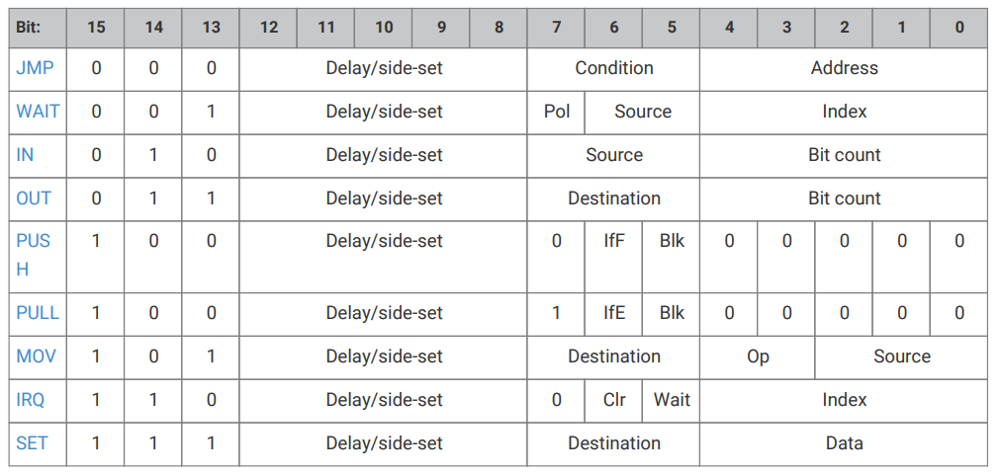

### 3.4.2. Encoding (version 1, RP2350)

PIO instructions are 16 bits long, and have the following encoding:

Table 8. PIO instruction encoding

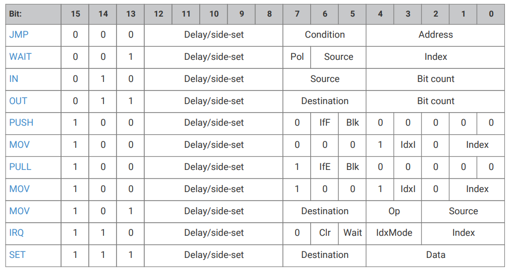


### 3.4.3. Summary

All PIO instructions execute in one clock cycle.

The `Delay/side-set` field is present in all instructions. Its exact use is configured for each state machine by `PINCTRL_SIDESET_COUNT`:

* Up to 5 MSBs encode a side-set operation, which optionally asserts a constant value onto some GPIOs, concurrently with main instruction execution logic

* Remaining LSBs (up to 5) encode the number of idle cycles inserted between this instruction and the next

すべてのPIO命令は1クロックサイクルで実行される。

`Delay/side-set` フィールドは全ての命令に存在する。その正確な使用方法は、 `PINCTRL_SIDESET_COUNT` によって各ステートマシンに設定されます:

* Up to 5 MSBs encode a side-set operation, which optionally asserts a constant value onto some GPIOs, concurrently with main instruction execution logic

* 上位 5 MSB がサイドセット操作をエンコードし、メイン命令実行ロジックと同時に、オプションでいくつかのGPIOに定数値をアサートする。

* 残りのLSB(最大5)は、この命令と次の命令の間に挿入されるアイドル・サイクル数をエンコードします。

### 3.4.4. JMP

#### 3.4.4.1. Encoding

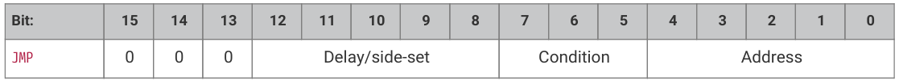


#### 3.4.4.2. Operation

Set program counter to `Address` if `Condition` is true, otherwise no operation.

Delay cycles on a `JMP` always take effect, whether `Condition` is true or false, and they take place after `Condition` is evaluated and the program counter is updated.

* Condition:

    + 000: (no condition): Always
    + 001: `!X`: scratch X zero   
    + 010: `X--`: scratch X non-zero, prior to decrement   
    + 011: `!Y`: scratch Y zero   
    + 100: `Y--`: scratch Y non-zero, prior to decrement   
    + 101: `X!=Y`: scratch X not equal scratch Y   
    + 110: `PIN`: branch on input pin   
    + 111: `!OSRE`: output shift register not empty

* Address: Instruction address to jump to. In the instruction encoding this is an absolute address within the PIO instruction memory.

`JMP PIN` branches on the GPIO selected by `EXECCTRL_JMP_PIN`, a configuration field which selects one out of the maximum of 32 GPIO inputs visible to a state machine, independently of the state machine’s other input mapping. The branch is taken if the GPIO is high.

`!OSRE` compares the bits shifted out since the last `PULL` with the shift count threshold configured by `SHIFTCTRL_PULL_THRESH`.  This is the same threshold used by autopull.

`JMP X--` and `JMP Y--` always decrement scratch register X or Y, respectively. The decrement is not conditional on the current value of the scratch register. The branch is conditioned on the initial value of the register, i.e. before the decrement took place: if the register is initially nonzero, the branch is taken.

`Condition` が真の場合、プログラム・カウンタを `Address` に設定する。

`JMP` の遅延サイクルは、 `Condition` が true であろうと false であろうと常に有効であり、 `Condition` が評価され、プログラム・カウンタが更新された後に実行される。

* `Condition`:

    + 000: (条件なし): 常に
    + 001: `!X`: スクラッチ X ゼロ
    + 010: `X--`: デクリメント前のスクラッチXがゼロでない
    + 011: `!Y`: デクリメント前のスクラッチYがゼロ
    + 100: `Y--`: デクリメント前のスクラッチYがゼロでない
    + 101: `X!=Y`: スクラッチXがスクラッチYと等しくない
    + 110: `PIN`: 入力ピンでの分岐
    + 111: `!OSRE`: 出力シフトレジスタが空でない

* `Address`: アドレス:ジャンプ先の命令アドレス。命令エンコーディングでは、これは PIO 命令メモリ内の絶対アドレスです。

`JMP PIN` は、 `EXECCTRL_JMP_PIN` によって選択されたGPIOで分岐します。このフィールドは、ステートマシンの他の入力マッピングとは別に、ステートマシンに見える最大32個のGPIO入力のうち1つを選択するコンフィギュレーション・フィールドです。GPIOがHighの場合に分岐が行われる。

`!OSRE` は、 `SHIFTCTRL_PULL_THRESH` で設定されたシフトカウントしきい値と、最後の `PULL` からシフトアウトされたビットを比較します。これは、 自動PULLで使用されるしきい値と同じです。

`JMP X--` と `JMP Y--` は、それぞれ常にスクラッチ・レジスタXまたはYをデクリメントする。このデクリメントには、スクラッチ・レジスタの現在値に対する条件はありません。分岐は、レジスタの初期値、つまりデクリメントが行われる前の値に対して条件付けされます。レジスタの初期値が0でなければ、分岐が行われます。

#### 3.4.4.3. Assembler Syntax

```
jmp ( <cond> ) <target>
```

where:

<desc>

||<cond>||Is an optional condition listed above (e.g. `!x` for scratch X zero). If a condition code is not specified, the branch is always taken

上記のオプションの条件です(例えば、スクラッチ X ゼロの場合は `!x`)。条件コードが指定されない場合、分岐は常に行われます。
||<target>||Is a program label or value (see Section 3.3.3) representing instruction offset within the program (the first instruction being offset 0). Note that because the PIO JMP instruction uses absolute addresses in the PIO instruction memory, JMPs need to be adjusted based on the program load offset at runtime. This is handled for you when loading a program with the SDK, but care should be taken when encoding JMP instructions for use by `OUT EXEC`

プログラム内の命令オフセット(最初の命令はオフセット0)を表すプログラムラベルまたは値(セクション3.3.3参照)です。PIO JMP 命令は PIO 命令メモリ内の絶対アドレスを使用するため、JMP は実行時のプログラム・ロード・オフセットに基づいて調整する必要があることに注意してください。これはSDKでプログラムをロードする際に処理されますが、 `OUT EXEC` で使用するJMP命令をエンコードする際には注意が必要です。
</desc>

### 3.4.5. WAIT

#### 3.4.5.1. Encoding

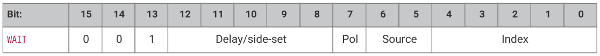

#### 3.4.5.2. Operation

Stall until some condition is met.

Like all stalling instructions, delay cycles begin after the instruction completes. That is, if any delay cycles are present, they do not begin counting until after the wait condition is met.

* Polarity:

  + 1: wait for a 1.
  + 0: wait for a 0.

* Source: what to wait on. Values are:

    + 00: `GPIO`: System GPIO input selected by `Index`. This is an absolute GPIO index, and is not affected by the state machine’s input IO mapping.
    + 01: `PIN`: Input pin selected by `Index`. This state machine’s input IO mapping is applied first, and then `Index` selects which of the mapped bits to wait on. In other words, the pin is selected by adding `Index` to the `PINCTRL_IN_BASE` configuration, modulo 32.
    + 10: `IRQ`: PIO IRQ flag selected by `Index`   
    + 11: (version 1 and above) `JMPPIN`: wait on the pin indexed by the `PINCTRL_JMP_PIN` configuration, plus an Index in the range 0-3, all modulo 32. Other values of Index are reserved.

* Index: which pin or bit to check.

`WAIT x IRQ` behaves slightly differently from other `WAIT` sources:

* If Polarity is 1, the selected IRQ flag is cleared by the state machine upon the wait condition being met.

* The flag index is decoded in the same way as the IRQ index field, decoding down from the two MSBs (aligning with the IRQ instruction IdxMode field):

  + `00`: the three LSBs are used directly to index the IRQ flags in this PIO block.
  + `01` (version 1 and above) (`PREV`), the instruction references an IRQ from the next-lower-numbered PIO in the system, wrapping to the highest-numbered PIO if this is PIO0.
  + `10` (`REL`), the state machine ID (0…3) is added to the IRQ index, by way of modulo-4 addition on the two LSBs.  For example, state machine 2 with a flag value of '0x11' will wait on flag 3, and a flag value of '0x13' will wait on flag 1. This allows multiple state machines running the same program to synchronise with each other.
  + `11` (version 1 and above) (`NEXT`), the instruction references an IRQ from the next-higher-numbered PIO in the system, wrapping to PIO0 if this is the highest-numbered PIO.

>  CAUTION
> `WAIT 1 IRQ x` should not be used with IRQ flags presented to the interrupt controller, to avoid a race condition with a system interrupt handler

(和訳)

何らかの条件が満たされるまでストールする。

すべてのストール命令と同様に、遅延サイクルは命令が完了した後に開始する。つまり、遅延サイクルが存在する場合は、待機条件が満たされるまでカウントは開始されません。

* Polarity:
  + 1: 1 を待つ。
  + 0: 0 を待つ。

* Source: 何を待つのかを指定する。値は次のとおり:
    + 00: `GPIO`: システムGPIO入力を`Index`で選択。これは絶対的なGPIOインデックスであり、ステート・マシンの入力IOマッピングの影響を受けない。
    + 01: `PIN`: インデックスで選択された入力ピン。このステート・マシンの入力IOマッピングが最初に適用され、次に`Index`がマッピングされたビットのどれで待機するかを選択する。言い換えると、ピンは、 `PINCTRL_IN_BASE` 構成に `Index` を32モジュロ加算することで選択される。
    + 10: `IRQ`: PIO IRQフラグが `Index` によって選択される
    + 11: (バージョン1以上) `JMPPIN`: `PINCTRL_JMP_PIN` コンフィギュレーションによってインデックス付けされたピンに、0～3の範囲のIndexを全てモジュロ32で加算した値で待機する。Indexの他の値は予約されています。

* Index: どのピンまたはビットをチェックするか。

`WAIT x IRQ` は他の `WAIT` ソースと若干異なる動作をします:

* `Polarity` が1の場合、待機条件が満たされると、選択されたIRQフラグはステート・マシンによってクリアされる。

* フラグ・インデックスは `IRQ` インデックス・フィールドと同じように、2 つの MSB からデコードされる(`IRQ` 命令 IdxMode フィールドと整列する):

    + `00`: 3つのLSBは、このPIOブロックのIRQフラグのインデックスに直接使用される。
    + `01` (バージョン1以上) (`PREV`), 命令はシステム内の次の下位番号のPIOからIRQを参照し、これがPIO0の場合は最上位番号のPIOに折り返す。
    + `10`(`REL`) では、ステートマシンID (0...3)が、2つのLSBのモジュロ4加算によってIRQインデックスに加算される。例えば、フラグ値『0x11』のステート・マシン2はフラグ3で待機し、フラグ値『0x13』はフラグ1で待機する。これにより、同じプログラムを実行している複数のステートマシンが互いに同期することができる。
    + `11`(バージョン1以上)(`NEXT`)命令は、システム内で次に高い番号のPIOからIRQを参照し、これが最も高い番号のPIOであればPIO0に折り返す。

>  注意
> `WAIT 1 IRQ x` は、システム割り込みハンドラとの競合状態を避けるため、割り込みコントローラに提示されるIRQフラグと一緒に使用しないでください。

#### 3.4.5.3. Assembler Syntax

```
wait <polarity> gpio <gpio_num>
wait <polarity> pin <pin_num>
wait <polarity> irq <irq_num> ( rel )
```

where:

<directive>

||<polarity>||Is a value (see Section 3.3.3) specifying the polarity (either 0 or 1) 

極性(0または1)を指定する値
||<pin_num>||Is a value (see Section 3.3.3) specifying the input pin number (as mapped by the SM input pin mapping) 

入力ピン番号(SM入力ピンマッピングによってマッピングされたもの)を指定する値 
||<gpio_num>||Is a value (see Section 3.3.3) specifying the actual GPIO pin number 

実際のGPIOピン番号を指定する値(セクション3.3.3参照) 
||<irq_num> ( rel )||Is a value (see Section 3.3.3) specifying The irq number to wait on (0-7). If rel is present, then the actual irq number used is calculating by replacing the low two bits of the irq number (irq_num10) with the low two bits of the sum (irq_num10 + sm_num10) where sm_num10 is the state machine number

待機するirq番号(0-7)を指定する値(セクション3.3.3を参照)。relが存在する場合、実際に使用されるirq番号は、irq番号($$irq\_num_{10}$$)の下位2ビットを和($$irq\_num_{10} + sm\_num_{10}$$)の下位2ビット($$sm\_num_{10}$$ はステートマシン番号)に置き換えて計算される。
</directive>

### 3.4.6. IN

#### 3.4.6.1. Encoding

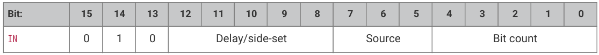

#### 3.4.6.2. Operation

Shift Bit count bits from Source into the Input Shift Register (ISR). Shift direction is configured for each state machine by SHIFTCTRL_IN_SHIFTDIR. Additionally, increase the input shift count by Bit count, saturating at 32.

* Source:

    + 000: `PINS`   
    + 001: `X` (scratch register X)   
    + 010: `Y` (scratch register Y)   
    + 011: `NULL` (all zeroes)   
    + 100: Reserved   
    + 101: Reserved   
    + 110: `ISR`   
    + 111: `OSR`

* Bit count: How many bits to shift into the ISR. 1…32 bits, 32 is encoded as `00000`.

If automatic push is enabled, `IN` will also push the ISR contents to the RX FIFO if the push threshold is reached (`SHIFTCTRL_PUSH_THRESH`). `IN` still executes in one cycle, whether an automatic push takes place or not. The state machine will stall if the RX FIFO is full when an automatic push occurs. An automatic push clears the ISR contents to all-zeroes, and clears the input shift count.

`IN` always uses the least significant `Bit count` bits of the source data. For example, if `PINCTRL_IN_BASE` is set to 5, the instruction `IN PINS,`3` will take the values of pins 5, 6 and 7, and shift these into the ISR. First the ISR is shifted to the left or right to make room for the new input data, then the input data is copied into the gap this leaves. The bit order of the input data is not dependent on the shift direction.

`NULL` can be used for shifting the ISR’s contents. For example, UARTs receive the LSB first, so must shift to the right.  After 8 `IN PINS, 1` instructions, the input serial data will occupy bits 31…24 of the ISR. An `IN NULL, 24` instruction will shift in 24 zero bits, aligning the input data at ISR bits 7…0. Alternatively, the processor or DMA could perform a byte read from FIFO address + 3, which would take bits 31…24 of the FIFO contents.

(和訳)

ソースから入力シフトレジスタ(ISR) にビットカウントビットをシフトします。シフト方向は、SHIFTCTRL_IN_SHIFTDIR で各ステートマシンに対して設定されます。さらに、入力シフトカウントをBitカウント分増やし、32 で飽和させます。

* ソース:
    + 000: PINS
    + 001: X(スクラッチレジスタX)
    + 010: Y(スクラッチレジスタY)
    + 011: NULL(全てゼロ)
    + 100: 予約
    + 101: Reserved
    + 110: ISR
    + 111: OSR

* ビット数: ISRに何ビットシフトするか。1...32ビット、32は00000としてエンコードされる。

自動プッシュが有効な場合、プッシュしきい値(`SHIFTCTRL_PUSH_THRESH`)に達すると、 `IN` はISRの内容もRX FIFOにプッシュする。自動プッシュの有無に関わらず、 `IN` は1サイクルで実行される。自動プッシュが発生したときにRX FIFOが満杯であれば、ステートマシンはストールする。自動プッシュ は ISR の内容をクリアしてすべて0 にし、入力シフトカウントをクリアします。

`IN` は常にソースデータの最下位ビットカウントを使用する。例えば、 `PINCTRL_IN_BASE` が 5 に設定されている場合、命令 `IN PINS, 3` はピン 5、6、7 の値を取り、これらを ISR にシフトします。最初にISRが左または右にシフトされ、新しい入力データのためのスペースが作られ、次に入力データがこの残されたギャップにコピーされる。入力データのビット順序はシフト方向に依存しない。

`NULL` は、ISR の内容のシフトに使用できます。例えば、UART は LSB を最初に受信するため、右にシフトする必要があります。 `IN PINS, 1` 命令を 8 回実行した後、入力シリアル・データは ISR のビット 31 ～ 24 を占めます。`IN NULL, 24` 命令では、24個のゼロビットがシフトされ、入力データはISRのビット7...0に整列される。別の方法として、プロセッサまたはDMAは、FIFOアドレス+3からバイト読み出しを実行することができ、これはFIFO内容のビット31～24を使用する。

#### 3.4.6.3. Assembler Syntax

```
in <source>, <bit_count>
```

where:

<desc>

||<source>||Is one of the sources specified above.

上記で指定したソースの1つ。
||<bit_count>||Is a value (see Section 3.3.3) specifying the number of bits to shift (valid range 1-32)

シフトするビット数を指定する値(セクション3.3.3を参照)です(有効範囲は1〜32)。
</desc>

### 3.4.7. OUT

#### 3.4.7.1. Encoding


#### 3.4.7.2. Operation

Shift Bit count bits out of the Output Shift Register (OSR), and write those bits to Destination. Additionally, increase the output shift count by Bit count, saturating at 32.

* Destination:

    + 000: PINS   
    + 001: X (scratch register X)   
    + 010: Y (scratch register Y)   
    + 011: NULL (discard data)   
    + 100: PINDIRS   
    + 101: PC   
    + 110: ISR (also sets ISR shift counter to Bit count)   
    + 111: EXEC (Execute OSR shift data as instruction)

* Bit count: how many bits to shift out of the OSR. 1…32 bits, 32 is encoded as 00000.

A 32-bit value is written to Destination: the lower Bit count bits come from the OSR, and the remainder are zeroes. This value is the least significant Bit count bits of the OSR if SHIFTCTRL_OUT_SHIFTDIR is to the right, otherwise it is the most significant bits.

PINS and PINDIRS use the OUT pin mapping.

If automatic pull is enabled, the OSR is automatically refilled from the TX FIFO if the pull threshold, SHIFTCTRL_PULL_THRESH, is reached. The output shift count is simultaneously cleared to 0. In this case, the OUT will stall if the TX FIFO is empty, but otherwise still executes in one cycle.

`OUT EXEC` allows instructions to be included inline in the FIFO datastream. The OUT itself executes on one cycle, and the instruction from the OSR is executed on the next cycle. There are no restrictions on the types of instructions which can be executed by this mechanism. Delay cycles on the initial OUT are ignored, but the executee may insert delay cycles as normal.

`OUT PC` behaves as an unconditional jump to an address shifted out from the OSR.

出力シフト・レジスタ(OSR)からビット・カウント・ビットをシフ トし、それらのビットをデスティネーションに書き込む。さらに、出力シフト・カウントをビット・カウントずつ増やし、32で飽和させる。

* Destination:

    + 000: `PINS`
    + 001: `X` (スクラッチ・レジスタX)
    + 010: `Y` (スクラッチレジスタY)
    + 011: `NULL` (データ破棄)
    + 100: ``PINDIRS``
    + 101: `PC`
    + 110: `ISR` (ISRシフトカウンタも`Bit count`に設定)
    + 111: `EXEC` (OSRシフトデータを命令として実行)

* Bit count: OSRから何ビットシフトアウトさせるか。1...32ビット、32は `00000` とエンコードされる。

32ビットの値が `Destination` に書き込まれます。`Bit count` の下位ビットがOSRから出力され、残りは0です。この値は、 `SHIFTCTRL_OUT_SHIFTDIR` が右の場合はOSRの最下位ビット、それ以外の場合は最上位ビットになります。

`PINS` と `PINDIRS` は OUT ピン・マッピングを使用します。

自動プルが有効な場合、 プルのしきい値(`SHIFTCTRL_PULL_THRESH`) に達すると 、 TX FIFO から自動的に OSR が補充されます。この場合、TX FIFO が空であれば `OUT` はストールするが、そうでなければ1サイクルで実行される。

`OUT EXEC` では、FIFOデータストリームにインラインで命令を含めることができる。 `OUT` 自体は1サイクルで実行され、OSRからの命令は次のサイクルで実行される。このメカニズムで実行できる命令の種類に制限はない。最初の `OUT` の遅延サイクルは無視されるが、実行者は通常通り遅延サイクルを挿入することができる。

`OUT PC` はOSRからシフトアウトされたアドレスへの無条件ジャンプとして動作する。

#### 3.4.7.3. Assembler Syntax

```
out <destination>, <bit_count>
```

where:

<desc>

||<destination>||Is one of the destinations specified above.
||<bit_count>||Is a value (see Section 3.3.3) specifying the number of bits to shift (valid range 1-32)
</desc>

### 3.4.8. PUSH

#### 3.4.8.1. Encoding

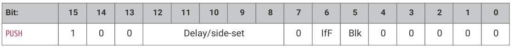

#### 3.4.8.2. Operation

Push the contents of the ISR into the RX FIFO, as a single 32-bit word. Clear ISR to all-zeroes.

* `IfFull`: If 1, do nothing unless the total input shift count has reached its threshold, `SHIFTCTRL_PUSH_THRESH` (the same as for autopush).

* `Block`: If 1, stall execution if RX FIFO is full.

`PUSH IFFULL` helps to make programs more compact, like autopush. It is useful in cases where the `IN` would stall at an inappropriate time if autopush were enabled, e.g. if the state machine is asserting some external control signal at this point.

The PIO assembler sets the `Block` bit by default. If the `Block` bit is not set, the `PUSH` does not stall on a full RX FIFO, instead continuing immediately to the next instruction. The FIFO state and contents are unchanged when this happens. The ISR is still cleared to all-zeroes, and the `FDEBUG_RXSTALL` flag is set (the same as a blocking `PUSH` or autopush to a full RX FIFO) to indicate data was lost.

(和訳)

ISRの内容を1つの32ビット・ワードとしてRX FIFOにプッシュする。ISRをゼロクリアする。

* IfFull: 1の場合、総入力シフト数がしきい値SHIFTCTRL_PUSH_THRESHに達しない限り何もしない(自動プッシュの場合と同じ)。

* Block: 1 の場合、RX FIFO が満杯になると実行を停止する。

`PUSH IFFULL` は、オートプッシュのようにプログラムをよりコンパクトにするのに役立つ。オートプッシュを有効にすると、 `IN` が不適切なタイミングでストールしてしまうような場合、例えば、ステートマシンがこの時点で何らかの外部制御信号をアサートしているような場合に有用である。

PIO アセンブラはデフォルトで `Block` ビットを設定する。 `Block` ビットが設定されていない場合、 `PUSH` は RX FIFO が満杯でもストールせず、すぐに次の命令に進みます。この場合、FIFO の状態と内容は変更されない。ISR はゼロクリアされ、データが失われたことを示す `FDEBUG_RXSTALL` フラグがセットされる(満杯の RX FIFO に対するブロッキング `PUSH` または自動プッシュと同じ)。

#### 3.4.8.3. Assembler Syntax

```
push ( iffull )
push ( iffull ) block
push ( iffull ) noblock
```

where:

<desc>

||iffull||Is equivalent to `IfFull == 1` above. i.e. the default if this is not specified is `IfFull == 0`.

上記の `IfFull == 1` と等価です。つまり、これが指定されない場合のデフォルトは `IfFull==0`
||block||Is equivalent to `Block == 1` above. This is the default if neither block nor noblock are specified.

上記の `Block == 1` と等価です。これは、 *block* も *noblock* も指定されていない場合のデフォルトである
||noblock||Is equivalent to `Block == 0` above.

上記の `Block == 0` と等価である。
</desc>

### 3.4.9. PULL

#### 3.4.9.1. Encoding

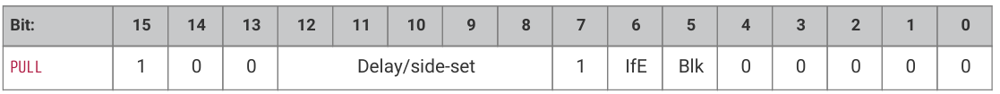

#### 3.4.9.2. Operation

Load a 32-bit word from the TX FIFO into the OSR.

* `IfEmpty`: If 1, do nothing unless the total output shift count has reached its threshold, `SHIFTCTRL_PULL_THRESH` (the same as for autopull).

* `Block`: If 1, stall if TX FIFO is empty. If 0, pulling from an empty FIFO copies scratch X to OSR.

Some peripherals (UART, SPI…) should halt when no data is available, and pick it up as it comes in; others (I2S) should clock continuously, and it is better to output placeholder or repeated data than to stop clocking. This can be achieved with the `Block` parameter.

A nonblocking `PULL` on an empty FIFO has the same effect as `MOV OSR, X`. The program can either preload scratch register X with a suitable default, or execute a `MOV X, OSR` after each `PULL NOBLOCK`, so that the last valid FIFO word will be recycled until new data is available.

`PULL IFEMPTY` is useful if an `OUT` with autopull would stall in an inappropriate location when the TX FIFO is empty. For example, a UART transmitter should not stall immediately after asserting the start bit. `IfEmpty` permits some of the same program simplifications as autopull, but the stall occurs at a controlled point in the program.

>  NOTE
> When autopull is enabled, any `PULL` instruction is a no-op when the OSR is full, so that the `PULL` instruction behaves as a barrier. `OUT NULL, 32` can be used to explicitly discard the OSR contents. See the RP2350 Datasheet for more detail on autopull.

(和訳)

TX FIFOからOSRに32ビット・ワードをロードする。

* `IfEmpty`: 1 の場合、 出力シフトカウントの合計がしきい値 (SHIFTCTRL_PULL_THRESH)(オートプルの場合と同じ)に達しない限り、何もしません。

* `Block`: 1 の場合、TX FIFOが空の場合にストールする。0 の場合、空の FIFO からプルするとスクラッチ X が OSR にコピーされる。

いくつかのペリフェラル(UART、SPI...)は、データが利用可能でないときに停止し、データが入ってきたときにそれを拾うべきである。これは `Block` パラメータで実現できる 。

FIFO が空のときの非ブロッキング `PULL` は、`MOV OSR, X` と同じ効果を持つ。プログラムは、スクラッチレジスタ X を適切なデフォルトでプリロードするか、または `PULL NOBLOCK` のたびに `MOV X, OSR` を実行することで、 最後の有効な FIFO ワードが、新しいデータが利用可能になるまでリサイクルされます。

`PULL IFEMPTY` は、TX FIFO が空になったときに、オートプル付きの OUT が不適切な位置でストールする場合に便利です。たとえば、UART トランスミッタは、スタート・ビットをアサートした直後にストールしてはならない。 `IfEmpty` を使用すると、オートプルと同じようにプログラムを簡略化できますが、ストールはプログラム内の制御されたポイントで発生します。

>  注意
> オートプルが有効な場合、OSRが一杯になると `PULL` 命令は no-op となり、 `PULL` 命令はバリアとして動作する。 `OUT NULL, 32` を使用すると、OSR の内容を明示的に破棄できる。オートプルの詳細については、RP2350 データシートを参照してください。

#### 3.4.9.3. Assembler Syntax

```
pull ( ifempty )
pull ( ifempty ) block
pull ( ifempty ) noblock
```

where:

<desc>

||ifempty||Is equivalent to `IfEmpty == 1` above. i.e. the default if this is not specified is `IfEmpty == 0`.

上記の `IfEmpty == 1` と等価です。つまり、これが指定されない場合のデフォルトは`IfEmpty == 0`
||block||Is equivalent to `Block == 1` above. This is the default if neither block nor noblock are specified

上記の `Block == 1` と等価です。これは、
||noblock||Is equivalent to `Block == 0` above.

上記の `Block == 0` と同じです。
</desc>

### 3.4.10. MOV (to RX)

#### 3.4.10.1. Encoding


(version 1 and above)

#### 3.4.10.2. Operation

Write the ISR to a selected RX FIFO entry. The state machine can write the RX FIFO entries in any order, indexed either by the Y register, or an immediate Index in the instruction. Requires the `SHIFTCTRL_FJOIN_RX_PUT` configuration field to be set, otherwise its operation is undefined. The FIFO configuration can be specified for the program via the `.fifo` directive (see `pioasm_fifo`).

If IdxI (index by immediate) is set, the RX FIFO’s registers are indexed by the two least-significant bits of the Index operand. Otherwise, they are indexed by the two least-significant bits of the Y register. When IdxI is clear, all nonzero values of Index are reserved encodings, and their operation is undefined.

When only `SHIFTCTRL_FJOIN_RX_PUT` is set (in `SM0_SHIFTCTRL` through `SM3_SHIFTCTRL`), the system can also read the RX FIFO registers with random access via `RXF0_PUTGET0` through `RXF0_PUTGET3` (where RXFx indicates which state machine’s FIFO is being accessed). In this state, the FIFO register storage is repurposed as status registers, which the state machine can update at any time and the system can read at any time. For example, a quadrature decoder program could maintain the current step count in a status register at all times, rather than pushing to the RX FIFO and potentially blocking.

When both `SHIFTCTRL_FJOIN_RX_PUT` and `SHIFTCTRL_FJOIN_RX_GET` are set, the system can no longer access the RX FIFO storage registers, but the state machine can now put/get the registers in arbitrary order, allowing them to be used as additional scratch storage.

>  NOTE
> The RX FIFO storage registers have only a single read port and write port, and access through each port is assigned to only one of (system, state machine) at any time.

選択した RX FIFO エントリに ISR を書き込む。ステートマシンは、Y レジスタまたは命令内の即時インデックスによってインデックス付けされたRX FIFO エントリを任意の順序で書き込むことができます。 `SHIFTCTRL_FJOIN_RX_PUT` 設定フィールドが設定されている必要があります。FIFOコンフィギュレーションは、`.fifo` ディレクティブ(`pioasm_fifo` を参照)を介してプログラムに指定することができます。

IdxI(即値によるインデックス)が設定されている場合、RX FIFOのレジスタはIndexオペランドの最下位ビット2つによってインデックス付けされます。そうでない場合は、Yレジスタの最下位ビット2つによってインデックスが付けられます。IdxIがクリアされている場合、Indexの0以外の値は全て予約エンコーディングであり、その動作は未定義である。

`SHIFTCTRL_FJOIN_RX_PUT` のみが設定されている場合(`SM0_SHIFTCTRL` ～ `SM3_SHIFTCTRL` 内)、システムは `RXF0_PUTGET0` ～ `RXF0_PUTGET3`(ここでRXFxはどのステートマシンのFIFOにアクセスしているかを示す)を介してランダムアクセスでRX FIFOレジスタを読み出すこともできる。この状態では、FIFOレジスタ・ストレージはステータス・レジスタとして再利用され、ステート・マシンはいつでも更新でき、システムはいつでも読み出すことができます。例えば、矩形波デコーダ・プログラムでは、RX FIFOにプッシュしてブロックするのではなく、ステータス・レジスタに現在のステップ・カウントを常に保持することができます。

`SHIFTCTRL_FJOIN_RX_PUT` と `SHIFTCTRL_FJOIN_RX_GET` の両方が設定されると、システムは RX FIFO ストレージ・レジスタにアクセスできなくなりますが、ステートマシンはレジスタを任意の順序で PUT/GET できるようになり、追加のスクラッチ・ストレージとして使用できるようになります。

>  注意
> RX FIFOストレージ・レジスタには、1つの読み取りポートと書き込みポートのみがあり、各ポートを介したアクセスは、常に(システム、ステートマシン)のうちの1つのみに割り当てられます。

#### 3.4.10.3. Assembler Syntax

```
mov rxfifo[y], isr
mov rxfifo[<index>], isr
```

where:

<desc>

||y|| Is the literal token "y", indicating the RX FIFO entry is indexed by the Y register

リテラルトークン "y" で、RX FIFOエントリがYレジスタでインデックス付けされていることを示す
||<index>||Is a value (see Section 3.3.3) specifying the RX FIFO entry to write (valid range 0-3)

書き込む RX FIFO エントリを指定する値(セクション3.3.3を参照)(有効範囲は0～3)。
</desc>

### 3.4.11. MOV (from RX)

#### 3.4.11.1. Encoding


(version 1 and above)

#### 3.4.11.2. Operation

Read the selected RX FIFO entry into the OSR. The PIO state machine can read the FIFO entries in any order, indexed either by the Y register, or an immediate Index in the instruction. Requires the `SHIFTCTRL_FJOIN_RX_GET` configuration field to be set, otherwise its operation is undefined.

If IdxI (index by immediate) is set, the RX FIFO’s registers are indexed by the two least-significant bits of the Index operand. Otherwise, they are indexed by the two least-significant bits of the Y register. When IdxI is clear, all nonzero values of Index are reserved encodings, and their operation is undefined.

When only `SHIFTCTRL_FJOIN_RX_GET` is set, the system can also write the RX FIFO registers with random access via `RXF0_PUTGET0` through `RXF0_PUTGET3` (where RXFx indicates which state machine’s FIFO is being accessed). In this state, the RX FIFO register storage is repurposed as additional configuration registers, which the system can update at any time and the state machine can read at any time. For example, a UART TX program might use these registers to configure the number of data bits, or the presence of an additional stop bit.

When both `SHIFTCTRL_FJOIN_RX_PUT` and `SHIFTCTRL_FJOIN_RX_GET` are set, the system can no longer access the RX FIFO storage registers, but the state machine can now put/get the registers in arbitrary order, allowing them to be used as additional scratch storage.

>  NOTE
> The RX FIFO storage registers have only a single read port and write port, and access through each port is assigned to only one of (system, state machine) at any time.

選択された RX FIFO エントリを OSR に読み込む。PIO ステートマシンは、Y レジスタまたは命令内の即時インデックスをインデックスとして、 任意の順序でFIFO エントリを読み出すことができます。`SHIFTCTRL_FJOIN_RX_GET` 設定フィールドが設定されている必要があり、そうでなければ動作は未定義です。

IdxI(即時インデックス)が設定されている場合、RX FIFOのレジスタはIndexオペランドの最下位ビット2つによってインデックス付けされます。そうでない場合は、Yレジスタの最下位ビット2つによってインデックスが付けられます。IdxIがクリアされている場合、Indexの0以外の値は全て予約エンコードであり、その動作は未定義である。

`SHIFTCTRL_FJOIN_RX_GET` のみが設定されている場合、システムは `RXF0_PUTGET0` ～ `RXF0_PUTGET3` (ここでRXFxはどのステートマシンのFIFOにアクセスしているかを示す)を介したランダムアクセスでRX FIFOレジスタを書き込むこともできる。こ の ス テー ト では、RX FIFO レジスタ ストレージは追加のコンフィギュレーションレジスタとして再利用され、システムはこれらをいつでも更新でき、ステートマシンはこれらをいつでも読み出しできます。例えば、UART TX プログラムはこれらのレジスタを使用してデータ・ビット数や追加ストップ・ビットの有無を設定することができます。

`SHIFTCTRL_FJOIN_RX_PUT` と `SHIFTCTRL_FJOIN_RX_GET` の両方が設定されると、システムはRX FIFOストレージ・レジスタにアクセスできなくなります。

> RX FIFOストレージ・レジスタは、単一のリード・ポートとライト・ポートのみを持ち、各ポートからのアクセスは、常に(システム、ステート・マシン)のうちの1つだけに割り当てられる。

#### 3.4.11.3. Assembler Syntax

```
mov osr, rxfifo[y]
mov osr, rxfifo[<index>]
```

where:

<desc>

||y|| Is the literal token "y", indicating the RX FIFO entry is indexed by the Y register

リテラルトークン "y "で、RX FIFOエントリがYレジスタでインデックス付けされていることを示す
||<index>||Is a value (see Section 3.3.3) specifying the RX FIFO entry to read (valid range 0-3)

読み出すRX FIFOエントリを指定する値(セクション3.3.3を参照)(有効範囲は0～3)。
</desc>


### 3.4.12. MOV

#### 3.4.12.1. Encoding

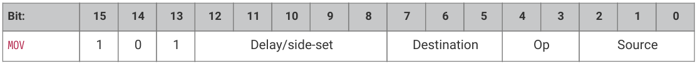

#### 3.4.12.2. Operation

Copy data from `Source` to `Destination`.

* Destination:

    + 000: `PINS` (Uses same pin mapping as `OUT`)   
    + 001: `X` (Scratch register X)   
    + 010: `Y` (Scratch register Y)   
    + 011: (version 1 and above) `PINDIRS` (Uses same pin mapping as `OUT`)   
    + 100: `EXEC` (Execute data as instruction)   
    + 101: `PC`   
    + 110: `ISR` (Input shift counter is reset to 0 by this operation, i.e. empty)   
    + 111: `OSR` (Output shift counter is reset to 0 by this operation, i.e. full)

* Operation:

    + 00: None   
    + 01: Invert (bitwise complement)   
    + 10: Bit-reverse   
    + 11: Reserved

* Source:

    + 000: `PINS` (Uses same pin mapping as `IN`)   
    + 001: `X`   
    + 010: ``Y``   
    + 011: `NULL`   
    + 100: Reserved   
    + 101: `STATUS`   
    + 110: `ISR`   
    + 111: `OSR`

`MOV PC` causes an unconditional jump. `MOV EXEC` has the same behaviour as `OUT EXEC` (Section 3.4.7), and allows register contents to be executed as an instruction. The `MOV` itself executes in 1 cycle, and the instruction in `Source` on the next cycle. Delay cycles on `MOV EXEC` are ignored, but the executee may insert delay cycles as normal.

The `STATUS` source has a value of all-ones or all-zeroes, depending on some state machine status such as FIFO full/empty, configured by `EXECCTRL_STATUS_SEL`.

`MOV dst, PINS` reads pins using the `IN` pin mapping, and writes the full 32-bit value to the destination without masking.  The LSB of the read value is the pin indicated by `PINCTRL_IN_BASE`, and each successive bit comes from a higher-numbered pin, wrapping after 31.

`MOV` can manipulate the transferred data in limited ways, specified by the `Operation` argument. Invert sets each bit in `Destination` to the logical NOT of the corresponding bit in `Source`, i.e. 1 bits become 0 bits, and vice versa. Bit reverse sets each bit n in Destination to bit 31 - n in `Source`, assuming the bits are numbered 0 to 31.

MOV PC は無条件ジャンプを引き起こす。 `MOV EXEC` は `OUT EXEC`(セクション 3.4.7)と同じ動作をし、レジスタの内容を命令として実行することができる。MOV 自体は 1 サイクルで実行され、ソース内の命令は次のサイクルで実行される。`MOV EXEC` の遅延サイクルは無視されるが、実行者は通常通り遅延サイクルを挿入することができる。

`STATUS` ソースは、 `EXECCTRL_STATUS_SEL` で設定された FIFO のフル/エンプティなどのステー ト・マシンの状態に応じて、オール 1 またはオール 0 の値を持つ。

`MOV` は、 `Operation` 引数で指定された限られた方法で転送データを操作することができる。すなわち、1ビットは0ビットになり、逆も同様です。ビット反転は、 `Destination` の各ビット n を `Source` のビット 31-n に設定する。

`MOV dst、PINS` は `IN` ピンマッピングを使用してピンを読み出し、マスキングなしで32ビット値をデスティネーションに書き込みます。読み出し値のLSBは `PINCTRL_IN_BASE` で示されるピンです。そのあとのビットは高位の番号(31 より大きい数はラッピングされます)のピンから来ます。

#### 3.4.12.3. Assembler Syntax

```
mov <destination>, ( op ) <source>
```

where:

<desc>
||<destination>||Is one of the destinations specified above.
||<op>||If present, is:

`!` or `~` for NOT (Note: this is always a bitwise NOT)

`::` for bit reverse

||<source>||Is one of the sources specified above.
</desc>

### 3.4.13. IRQ

#### 3.4.13.1. Encoding

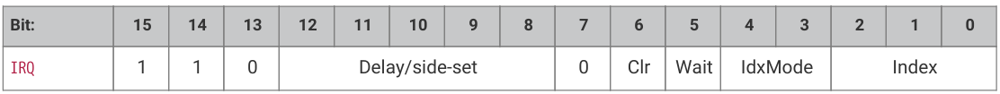

#### 3.4.13.2. Operation

Set or clear the IRQ flag selected by `Index` argument. 

* `Clear`: if 1, clear the flag selected by `Index`, instead of raising it. If `Clear` is set, the `Wait` bit has no effect. 
* `Wait`: if 1, halt until the raised flag is lowered again, e.g. if a system interrupt handler has acknowledged the flag. 
* `Index`: specifies an IRQ index from 0-7. This IRQ flag will be set/cleared depending on the Clear bit. 
* `IdxMode`: modify the behaviour if the Index field, either modifying the index, or indexing IRQ flags from a different PIO block: 

    + `00`: the three LSBs are used directly to index the IRQ flags in this PIO block. 
    + `01` (version 1 and above) (`PREV`): the instruction references an IRQ flag from the next-lower-numbered PIO in the system, wrapping to the highest-numbered PIO if this is PIO0. 
    + `10` (`REL`): the state machine ID (0…3) is added to the IRQ flag index, by way of modulo-4 addition on the two LSBs. For example, state machine 2 with a flag value of '0x11' will wait on flag 3, and a flag value of '0x13' will wait on flag 1. This allows multiple state machines running the same program to synchronise with each other. 
    + `11` (version 1 and above) (`NEXT`): the instruction references an IRQ flag from the next-higher-numbered PIO in the system, wrapping to PIO0 if this is the highest-numbered PIO.

On PIO version 0, IRQ flags 4-7 are visible only to the state machines; IRQ flags 0-3 can be routed out to system level interrupts, on either of the PIO’s two external interrupt request lines, configured by `IRQ0_INTE` and `IRQ1_INTE`. PIO version 1 lifts this limitation and allows all eight flags to assert system interrupts.

The modulo addition mode allows relative addressing of 'IRQ' and 'WAIT' instructions, for synchronising state machines which are running the same program. Bit 2 (the third LSB) is unaffected by this addition.

(和訳)

The modulo addition mode (`REL`) allows relative addressing of 'IRQ' and 'WAIT' instructions, for synchronising state machines which are running the same program. Bit 2 (the third LSB) is unaffected by this addition.

The `NEXT`/`PREV` modes (version 1 and above) can be used to synchronise between state machines in different PIO blocks.

If these state machines' clocks are divided, their clock dividers must be the same, and must have been synchronised by writing `CTRL.NEXTPREV_CLKDIV_RESTART` in addition to the relevant NEXT_PIO_MASK/PREV_PIO_MASK bits. Note that the cross-PIO connection is severed between PIOs with different accessibility to Non-secure code, as per ACCESSCTRL.

If `Wait` is set, `Delay` cycles do not begin until after the wait period elapses.

引数 `Index` で選択されたIRQフラグをセットまたはクリアする。

* `Clear`: 1の場合、Indexで選択されたフラグを立てる代わりにクリアする。 `Clear` が設定されている場合、 `Wait` ビットは何の効果もない。
* `Wait`: 1の場合、システム割り込みハンドラがフラグを確認した場合など、フラグが下がるまで停止する。
* `Index`: 0～7 の IRQ インデックスを指定します。このIRQフラグは `Clear` ビットに依存してセット/クリアされる。
* `IdxMode`:インデックス・フィールドの動作を変更します。インデックスを変更するか、別のPIOブロックからIRQフラグのインデックスを作成します。

    + `00`: 3つのLSBは、このPIOブロックのIRQフラグのインデックスを作成するために直接使用されます。
    + `01` (バージョン1以上) (`PREV`): 命令は、システム内の次の下位番号のPIOからIRQフラグを参照し、これがPIO0の場合は最上位番号のPIOに折り返す。
    + `10` (`REL`): ステートマシンID (0～3)が、2つのLSBのモジュロ4加算によってIRQフラグ・インデックスに追加される。例えば、フラグ値が『0x11』のステート・マシン2はフラグ3で待機し、フラグ値が『0x13』のステート・マシンはフラグ1で待機する。これにより、同じプログラムを実行している複数のステートマシンが互いに同期することができる。
    + `11` (バージョン1以上) (`NEXT`): 命令は、システム内で次に高い番号のPIOからIRQフラグを参照し、これが最も高い番号のPIOであればPIO0に折り返す。

PIOバージョン0では、IRQフラグ4～7はステート・マシンにしか見えません。IRQフラグ0～3は、 `IRQ0_INTE` と `IRQ1_INTE` で設定されたPIOの2つの外部割り込み要求ラインのいずれかで、システム・レベルの割り込みにルーティングできます。PIOバージョン1では、この制限が解除され、8つのフラグすべてがシステム割り込みをアサートできるようになりました。

モジュロ加算モードは、「IRQ」と「WAIT」命令の相対アドレッシングを可能にし、同じプログラムを実行しているステートマシンを同期させます。ビット2(3番目のLSB)はこの加算の影響を受けない。

モジュロ加算モード(`REL`)は、同じプログラムを実行しているステートマシンを同期させるため に、「IRQ」と「WAIT」命令の相対アドレッシングを可能にする。ビット2(3番目のLSB)はこの加算の影響を受けない。

`NEXT`/`PREV` モード(バージョン1以上)は、異なるPIOブロック内のステートマシン間の同期に使用できる。

これらのステートマシンのクロックが分周されている場合、それらのクロック分周器は同じでなければならず、関連する NEXT_PIO_MASK/PREV_PIO_MASK ビットに加えて `CTRL.NEXTPREV_CLKDIV_RESTART` を書き込むことによって同期されなければならない。クロスPIO接続は、 ACCESSCTRL に従って、非セキュアコードへのアクセス性が異なるPIO間で切断されることに注意。

Waitが設定されている場合、Delayサイクルは待機期間が経過するまで開始されない。

#### 3.4.13.3. Assembler Syntax

```
irq <irq_num> ( rel )
irq set <irq_num> ( rel )
irq nowait <irq_num> ( rel )
irq wait <irq_num> ( rel )
irq clear <irq_num> ( rel )
```

where:

<desc>

||<irq_num> ( rel )||Is a value (see Section 3.3.3) specifying The irq number to wait on (0-7). If rel is present, then the actual irq number used is calculating by replacing the low two bits of the irq number (irq_num10) with the low two bits of the sum (irq_num10 + sm_num10) where sm_num10 is the state machine number

待機するirq番号(0-7)を指定する値(セクション3.3.3参照)。relが存在する場合、実際に使用されるirq番号は、irq番号(irq_num10)の下位2ビットを、和(irq_num10 + sm_num10)の下位2ビット(sm_num10はステートマシン番号)に置き換えて計算される。
||irq||Means set the IRQ without waiting

待たずにIRQを設定するという意味
||irq set||Also means set the IRQ without waiting

また、待たずにIRQを設定するという意味
||irq nowait||Again, means set the IRQ without waiting

これまた、 待たずにIRQを設定するという意味
||irq wait||Means set the IRQ and wait for it to be cleared before proceeding

IRQを設定し、IRQがクリアされるのを待って次に進むことを意味する
||irq clear||Means clear the IRQ

IRQをクリアすることを意味する
</desc>

### 3.4.14. SET

#### 3.4.14.1. Encoding

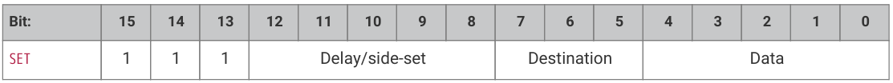

#### 3.4.14.2. Operation

Write immediate value Data to Destination.

* Destination:

    + 000: `PINS`   
    + 001: `X` (scratch register X) 5 LSBs are set to `Data`, all others cleared to 0.
    + 010: Y (scratch register Y) 5 LSBs are set to `Data`, all others cleared to 0.
    + 011: Reserved   
    + 100: `PINDIRS`   
    + 101: Reserved   
    + 110: Reserved   
    + 111: Reserved

* Data: 5-bit immediate value to drive to pins or register.

This can be used to assert control signals such as a clock or chip select, or to initialise loop counters. As `Data` is 5 bits in size, scratch registers can be `SET` to values from 0-31, which is sufficient for a 32-iteration loop.

The mapping of `SET` and `OUT` onto pins is configured independently. They may be mapped to distinct locations, for example if one pin is to be used as a clock signal, and another for data. They may also be overlapping ranges of pins: a UART transmitter might use `SET` to assert start and stop bits, and `OUT` instructions to shift out FIFO data to the same pins.

(和訳)

Destination にイミディエイト値 Data を書き込む。

* Destination:

    + 000: `PINS`   
    + 001: `X` (scratch register X) 5 LSBs are set to `Data`, all others cleared to 0.
    + 010: `Y` (scratch register Y) 5 LSBs are set to `Data`, all others cleared to 0.
    + 011: Reserved   
    + 100: `PINDIRS`   
    + 101: Reserved   
    + 110: Reserved   
    + 111: Reserved

* Data: データ:ピンまたはレジスタにドライブする5ビットの即時値。

クロックやチップ・セレクトなどの制御信号のアサートや、ループ・カウンターの初期化に使用できる。 `Data` は5ビットなので、スクラッチ・レジスタを0～31の値に `SET` することができ、これは32回繰り返しのループには十分です。

`SET` と `OUT` のピンへのマッピングは独立して設定される。例えば、1つのピンをクロック信号として使用し、もう1つのピンをデータ信号として使用する場合、これらのピンを別々の場所にマッピングすることができます。UARTトランスミッタは、 `SET` を使用してスタートビットとストップビットをアサートし、 `OUT` 命令を使用してFIFOデータを同じピンにシフトアウトする。

#### 3.4.14.3. Assembler Syntax

```
set <destination>, <value>
```

where:

<desc>
||<destination>||Is one of the destinations specified above.
||<value>||The value (see Section 3.3.3) to set (valid range 0-31)
</desc>
