# Chapter 11. PIO

## 11.1. Overview

RP2350 contains 3 identical PIO blocks. Each PIO block has dedicated connections to the bus fabric, GPIO and interrupt controller. The diagram for a single PIO block is shown below in Figure 43.

RP2350 には 3 つの同じ PIO ブロックがあります。各 PIO ブロックは、バスファブリック、GPIO、および割り込みコントローラへの専用接続を持っています。単一の PIO ブロックの図を図 43 に示します。

<figure>
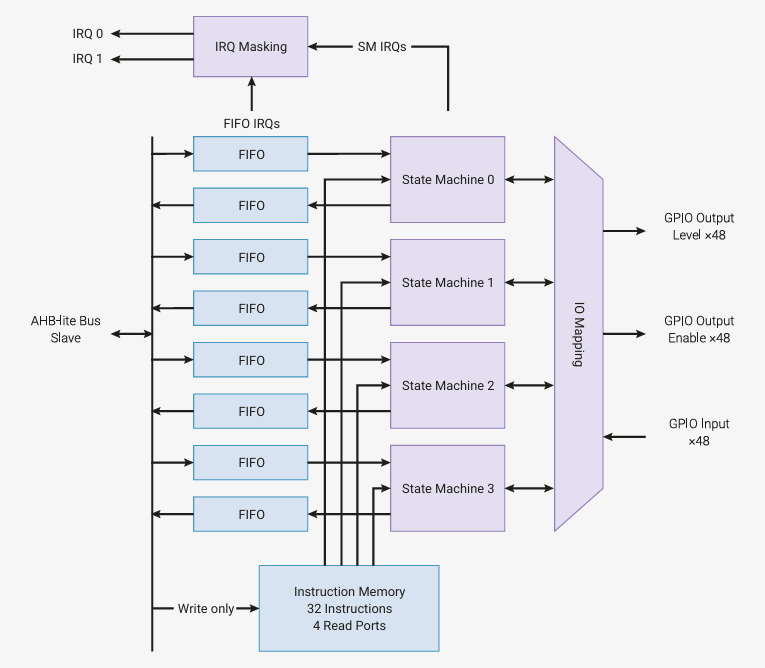
<figcaption>

Figure 43. PIO block-level diagram. There are three PIO blocks, each containing four state machines. The four state machines simultaneously execute programs from shared instruction memory.

FIFO data queues buffer data transferred between PIO and the system. GPIO mapping logic allows each state machine to observe and manipulate up to 32 GPIOs.

図 43. PIO ブロックレベル図。3 つの PIO ブロックがあり、それぞれが 4 つのステートマシンを含む。4 つのステートマシンは、共有命令メモリから同時にプログラムを実行する。

FIFO データキューは、PIO とシステム間で転送されるデータをバッファリングする。GPIO マッピングロジックにより、各ステートマシンは最大 32 個の GPIO を監視および操作できる。
</figcaption>
</figure>

The **programmable input/output block** (PIO) is a versatile hardware interface. It can support a variety of IO standards, including:

* 8080 and 6800 parallel bus
* I2C
* 3-pin I2S
* SDIO
* SPI, DSPI, QSPI
* UART
* DPI or VGA (via resistor DAC)

PIO is programmable in the same sense as a processor. There are three PIO blocks with four state machines. Each can independently execute sequential programs to manipulate GPIOs and transfer data. Unlike a general purpose processor, PIO state machines are specialised for IO, with a focus on determinism, precise timing, and close integration with fixed- function hardware. Each state machine is equipped with:

* Two 32-bit shift registers (either direction, any shift count)
* Two 32-bit scratch registers
* 4 × 32-bit bus FIFO in each direction (TX/RX), reconfigurable as 8 × 32 in a single direction
* Fractional clock divider (16 integer, 8 fractional bits)
* Flexible GPIO mapping
* DMA interface (sustained throughput up to 1 word per clock from system DMA)
* IRQ flag set/clear/status

Each state machine, along with its supporting hardware, occupies approximately the same silicon area as a standard serial  interface  block,  such  as  an  SPI  or  I2C  controller.  However,  PIO  state  machines  can  be  configured  and reconfigured dynamically to implement numerous different interfaces.

Making  state  machines  programmable  in  a  software-like  manner,  rather  than  a  fully  configurable  logic  fabric  like  a complex programmable logic device (CPLD), allows more hardware interfaces to be offered in the same cost and power envelope. This also presents a more familiar programming model, and simpler tool flow, to those who wish to exploit PIO's full flexibility by programming it directly, rather than using a pre-made interface from the PIO library.

PIO  is  performant  as  well  as  flexible,  thanks  to  a  carefully  selected  set  of  fixed-function  hardware  inside  each  state machine.  When  outputting  DPI,  PIO  can  sustain  360  Mb/s  during  the  active  scanline  period  when  running  from  a 48 MHz system clock. In this example, one state machine handles frame/scanline timing and generates the pixel clock.  Another handles the pixel data and unpacks run-length-encoded scanlines.

State machines' inputs and outputs are mapped to up to 32 GPIOs (limited to 30 GPIOs for RP2350). All state machines have independent, simultaneous access to any GPIO. For example, the standard UART code allows TX, RX, CTS and RTS to be any four arbitrary GPIOs, and I2C permits the same for `SDA` and `SCL`. The amount of freedom available depends on how exactly  a  given  PIO  program  chooses  to  use  PIO's  pin  mapping  resources,  but  at  the  minimum,  an  interface  can  be freely shifted up or down by some number of GPIOs.

**プログラマブル入出力ブロック(programmable input/output block)**(PIO)は、汎用性の高いハードウェアインターフェースです。以下のようなさまざまな IO 標準をサポートします: 

* 8080 および 6800 パラレルバス
* I2C
* 3 ピン I2S
* SDIO
* SPI、DSPI、QSPI
* UART
* DPI または VGA(抵抗器 DAC を使うもの)

PIO はプロセッサと同じ意味でプログラマブルである。4 つのステートマシンを持つ 3 つの PIO ブロックがある。それぞれが独立してシーケンシャルプログラムを実行し、GPIO の操作やデータ転送を行うことができます。汎用プロセッサとは異なり、PIO のステートマシンは IO に特化しており、決定性、正確なタイミング、固定機能ハードウェアとの密接な統合に重点を置いています。各ステートマシンは以下を備えている: 

* 2 つの 32 ビットシフトレジスタ(どちらの方向でも、任意のシフトカウント)
* 2 つの 32 ビットスクラッチレジスタ
* 双方向(TX/RX)4×32 ビットバス FIFO(単一方向で 8×32 として再構成可能
* フラクショナルクロック分周器(16 整数、8 フラクショナルビット)
* 柔軟な GPIO マッピング
* DMA インターフェース(システム DMA から 1 クロックあたり最大 1 ワードのスループットを維持)
* IRQ フラグのセット/クリア/ステータス

各ステートマシンは、それをサポートするハードウェアとともに、SPI や I2C コントローラなどの標準的なシリアルインターフェースブロックとほぼ同じシリコン面積を占めます。 しかし、PIO ステートマシンは、多数の異なるインターフェイスを実装するために、動的にコンフィギュレーションおよび再構成することができます。

複合プログラマブルロジックデバイス(CPLD)のような完全にコンフィギュラブルなロジックファブリックではなく、ソフトウェアのような方法でステートマシンをプログラム可能にすることで、同じコストと消費電力でより多くのハードウェアインターフェイスを提供できるようになります。また、PIO ライブラリの既成インタフェースを使用するのではなく、PIO を直接プログラミングして PIO の柔軟性をフルに活用したいと考える人にとっても、より馴染みやすいプログラミングモデルとシンプルなツールフローを提供することができます。

PIO は、各ステートマシン内部の厳選された固定機能ハードウェアセットのおかげで、柔軟性とともに高性能です。 DPI を出力する場合、PIO は 48MHz のシステムクロックで動作させると、アクティブスキャンライン期間中 360Mb/s を維持することができる。この例では、1 つのステートマシンがフレーム/スキャンラインタイミングを処理し、ピクセルクロックを生成する。 もう 1 つのステートマシンはピクセルデータを処理し、ランレングス符号化されたスキャンラインをアンパックする。

ステートマシンの入出力は、最大 32GPIO(RP2350 では 30GPIO に制限)にマッピングされます。すべてのステートマシンは、任意の GPIO に独立して同時にアクセスできます。例えば、標準的な UART コードでは、　`TX`、`RX`、`CTS`、`RTS` を任意の 4 つの GPIO にすることができ、I2C では `SDA` と `SCL` に同じことができます。利用可能な自由度は、PIO プログラムが PIO のピンマッピングリソースをどのように使用するかによって異なりますが、最低限、インターフェイスは GPIO の数だけ自由に上下にシフトすることができます。

### 11.1.1. RP2040 からの変更点

RP2350 adds the following new registers and controls:

* `DBG_CFGINFO`.VERSION indicates the PIO version, to allow PIO feature detection at runtime.
  + This 4-bit field was reserved-0 on RP2040 (indicating version 0), and reads as 1 on RP2350.
* `GPIOBASE` adds support for more than 32 GPIOs per PIO block.
  + Each PIO block is still limited to 32 GPIOs at a time, but `GPIOBASE` selects which 32.
* `CTRL`.NEXT_PIO_MASK and `CTRL`.PREV_PIO_MASK apply some `CTRL` register operations to state machines in neighbouring PIO blocks simultaneously.
  + `CTRL`.NEXTPREV_SM_DISABLE stops PIO state machines in multiple PIO blocks simultaneously.
  + `CTRL`.NEXTPREV_SM_ENABLE starts PIO state machines in multiple PIO blocks simultaneously.
`  + `CTRL`.NEXTPREV_CLKDIV_RESTART synchronises the clock dividers of PIO state machines in multiple PIO blocks
`* `SM0_SHIFTCTRL`.IN_COUNT masks unneeded IN-mapped pins to zero.
  + This is useful for `MOV x, PINS` instructions, which previously always returned a full rotated 32-bit value.
* `IRQ0_INTE` and `IRQ1_INTE` now expose all eight SM IRQ flags to system-level interrupts (not just the lower four).
* Registers starting from `RXF0_PUTGET0` expose each RX FIFO's internal storage registers for random read or write access from the system,
  + The new `FJOIN_RX_PUT` FIFO join mode enables random writes from the state machine, and random reads from the system (for implementing status registers).
  + The new `FJOIN_RX_GET` FIFO join mode enables random reads from the state machine, and random writes from the system (for implementing control registers).
  + Setting both `FJOIN_RX_PUT` and `FJOIN_RX_GET` enables random read and write access from the state machine, but disables system access.

RP2350 adds the following new instruction features:

* Adds `PINCTRL_JMP_PIN` as a source for the `WAIT` instruction, plus an offset in the range 0-3.
  + This gives `WAIT` pin arguments a per-SM mapping that is independent of the IN-mapped pins.
* Adds `PINDIRS` as a destination for `MOV`.
  + This allows changing the direction of all OUT-mapped pins with a single instruction: `MOV PINDIRS, NULL` or `MOV PINDIRS, ~NULL`
* Adds SM IRQ flags as a source for `MOV x, STATUS`
  + This allows branching (as well as blocking) on the assertion of SM IRQ flags.
* Extends `IRQ` instruction encoding to allow state machines to set, clear and observe IRQ flags from different PIO blocks.
  + There is no delay penalty for cross-PIO IRQ flags: an `IRQ` on one state machine is observable to all state machines on the next cycle.
* Adds the `FJOIN_RX_GET` FIFO mode.
  + A new `MOV` encoding reads any of the four RX FIFO storage registers into `OSR`.
  + This instruction permits random reads of the four FIFO entries, indexed either by instruction bits or the `Y` scratch register.
* Adds the `FJOIN_RX_PUT` FIFO mode.
  + A new `MOV` encoding writes the `ISR` into any of the four RX FIFO storage registers.
  + The registers are indexed either by instruction bits or the `Y` scratch register.

RP2350 adds the following security features:

* Limits Non-secure PIOs (set to via ACCESSCTRL) to observation of only Non-secure GPIOs. Attempting to read a Secure GPIO returns a 0.
* Disables cross-PIO functionality (IRQs, CTRL_NEXTPREV operations) between Non-secure PIO blocks (those which permit Non-secure access according to ACCESSCTRL) and Secure-only blocks (those which do not).

RP2350 includes the following general improvements:

* Increased the number of PIO blocks from two to three (8 → 12 state machines).
* Improved GPIO input/output delay and skew.
* Reduced DMA request (DREQ) latency by one cycle vs RP2040.

(和訳)

RP2350 では、以下の新しいレジスタとコントロールが追加されました: 

* `DBG_CFGINFO.VERSION` は PIO のバージョンを示し、実行時に PIO 機能を検出できるようにする。
  + この 4 ビットフィールドは RP2040 では予約 0 (バージョン 0 を示す) であったが、RP2350 では 1 として読み込まれる。
* `GPIOBASE` は PIO ブロックあたり 32以上の GPIO をサポートします。
  + 各 PIO ブロックが使用する GPIO は一度に 32個と制限されますが、`GPIOBASE` は、どの 32GPIO を使うかを選択します。
* `CTRL.NEXT_PIO_MASK` と `CTRL.PREV_PIO_MASK` は、いくつかの `CTRL` レジスタ操作を隣接する PIO ブロックのステートマシンに同時に適用します。
  + `CTRL.NEXTPREV_SM_DISABLE` は、複数の PIO ブロックの PIO ステートマシンを同時に停止する。
  + `CTRL.NEXTPREV_SM_ENABLE` は、複数の PIO ブロック内の PIO ステートマシンを同時に起動する。
  + `CTRL.NEXTPREV_CLKDIV_RESTART` 複数の PIO ブロックの PIO ステートマシンの分周クロックを同期させる。
* `SM0_SHIFTCTRL.IN_COUNT` は、不要な IN マップピンをゼロにマスクします。
  + これは `MOV x, PINS` 命令に便利で、以前は常に 32ビットフルローテーションして返していました。
* `IRQ0_INTE` と `IRQ1_INTE` は、システムレベルの割り込みに対して 8 つの SM IRQ フラグをすべて(下位4 つだけでなく)公開するようになりました。
* `RXF0_PUTGET0` から始まるレジスタは、各 RX FIFO の内部ストレージレジスタをシステムからのランダムリードまたはライトアクセス用に公開する、
  + 新しい `FJOIN_RX_PUT` FIFO 結合モードは、ステートマシンからのランダム書き込みと、システムからのランダム読み出しを可能にします(ステータスレジスタの実装用)。
  + 新しい `FJOIN_RX_GET` FIFO 結合モードは、ステートマシンからのランダム読み出しとシステムからのランダム書き込み(制御レジスタの実装用)を可能にする。
  + `FJOIN_RX_PUT` と `FJOIN_RX_GET` の両方を設定すると、ステートマシンからのランダムリードとライトアクセスが可能になりますが、システムアクセスは無効になります。

RP2350 は以下の新しい命令機能を追加した: 

* `WAIT` 命令のソースとして `PINCTRL_JMP_PIN` を追加し、さらに 0～3 の範囲のオフセットを追加。
  + これにより、 `WAIT` ピンの引数は、IN にマッピングされたピンとは独立した SM ごとのマッピングとなる。
* `MOV` のデスティネーションとして `PINDIRS` を追加。
  + これにより、　`MOV PINDIRS, NULL` または `MOV PINDIRS, ~NULL` の 1 命令ですべての OUT マップされたピンの方向を変更することができます。
* `MOV x, STATUS` のソースとして SM IRQ フラグを追加。
  + これにより、SM IRQ フラグのアサート時に(ブロッキングと同様に)分岐することができる。
* 異なる PIO ブロックからの IRQ フラグをステートマシンが設定、クリア、監視できるように `IRQ` 命令エンコーディングを拡張。
  + クロス PIO IRQ フラグには遅延ペナルティはない。あるステートマシンの IRQ は、次のサイクルですべてのステートマシンが観測可能。
* `FJOIN_RX_GET` FIFO モードを追加。
  + 新しい MOV エンコーディングは、4 つの RX FIFO ストレージレジスタのいずれかを OSR に読み出します。
  + この命令では、命令ビットまたは Y スクラッチレジスタによってインデックス付けされた 4 つの FIFO エントリをランダムに読み出すことができます。
* `FJOIN_RX_PUT` FIFO モードを追加。
  + 新しい MOV エンコーディングは、ISR を 4 つの RX FIFO ストレージレジスタのいずれかに書き込みます。
  + レジスタは命令ビットまたは Y スクラッチレジスタでインデックス付けされる。

RP2350 は以下のセキュリティ機能を追加します: 

* 非セキュア PIO(`ACCESSCTRL` 経由で設定)を非セキュア GPIO のみの観測に制限する。セキュア GPIO を読み出そうとすると、0 を返します。
* 非セキュア PIO ブロック(`ACCESSCTRL` に従って非セキュアアクセスを許可するブロック)とセキュア専用ブロック(許可しないブロック)間のクロス PIO 機能(IRQ や、 `CTRL_NEXTPREV` 操作)を無効にします。

RP2350 には、以下の全般的な改良が含まれています: 

* PIO ブロックの数を 2 つから 3 つに増やした(8 → 12 ステートマシン)。
* GPIO 入出力遅延とスキューの改善。
* DMA 要求(DREQ)のレイテンシを RP2040 と比較して 1 サイクル短縮。

## 11.2. Programmer's Model

The four state machines execute from shared instruction memory. System software loads programs into this memory, configures  the  state  machines  and  IO  mapping,  and  then  sets  the  state  machines  running.  PIO  programs  come  from various  sources:  assembled  directly  by  the  user,  drawn  from  the  PIO  library,  or  generated  programmatically  by  user software.

From this point on, state machines are generally autonomous, and system software interacts through DMA, interrupts and  control  registers,  as  with  other  peripherals  on  RP2350.  For  more  complex  interfaces,  PIO  provides  a  small  but flexible set of primitives which allow system software to be more hands-on with state machine control flow.

Figure 44. State machine overview.  Data flows in and out through a pair of FIFOs. The state machine executes a program which transfers data between these FIFOs, a set of internal registers, and the pins.  The clock divider can reduce the state machine's execution speed by a constant factor.

4 つのステートマシンは、共有命令メモリから実行される。システムソフトウェアがこのメモリにプログラムをロードし、ステートマシンと IO マッピングを設定し、ステートマシンの実行を設定する。 PIO プログラムは、ユーザによって直接アセンブルされたもの、PIO ライブラリから引き出されたもの、ユーザソフトウェアによってプログラム的に生成されたものなど、さまざまなソースから提供される。

この時点から、ステートマシンは一般に自律的であり、システムソフトウェアは RP2350 の他のペリフェラルと同様に、DMA、割り込み、制御レジスタを通して相互作用する。 より複雑なインタフェースのために、PIO は、システムソフトウェアがステートマシンの制御フローをより実践的に使用できるようにする、小さいが柔軟なプリミティブのセットを提供する。

<figure>
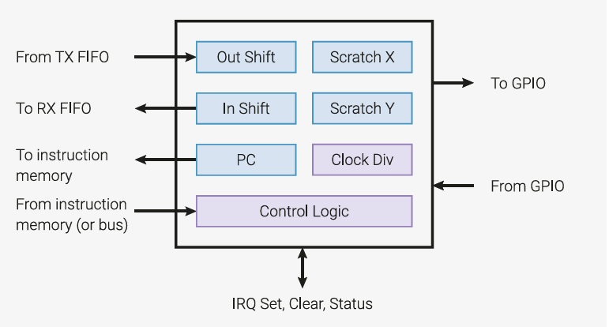
<figcaption>
図 44. ステートマシンの概要。 データは 1 組の FIFO を通して出入りする。ステートマシンは、これらの FIFO、内部レジスタのセット、およびピン間でデータを転送するプログラムを実行する。 クロック分周器によって、ステートマシンの実行速度は一定の倍率で低下する。
</figcaption>
</figure>

### 11.2.1. PIO プログラム

PIO state machines execute short binary programs.

Programs  for  common  interfaces,  such  as  UART,  SPI,  or  I2C,  are  available  in  the  PIO  library.  In  many  cases,  it  is  not necessary to write PIO programs. However, the PIO is much more flexible when programmed directly, supporting a wide variety of interfaces which may not have been foreseen by its designers.

The PIO has a total of nine instructions: `JMP`, `WAIT`, `IN`, `OUT`, `PUSH`, `PULL`, `MOV`, `IRQ`, and `SET`. For more information about these instructions, see Section 11.4.

Though  the  PIO  only  has  a  total  of  nine  instructions,  it  would  be  difficult  to  edit  PIO  program  binaries  by  hand.  PIO assembly  is  a  textual  format,  describing  a  PIO  program,  where  each  command  corresponds  to  one  instruction  in  the output binary. The following code snippet contains an example program written in in PIO assembly:

PIO ステートマシンは短いバイナリプログラムを実行します。

UART、SPI、I2C などの一般的なインターフェース用のプログラムは、PIO ライブラリで利用可能です。 多くの場合、PIO プログラムを書く必要はありません。しかし、PIO は直接プログラムした方がはるかに柔軟で、設計者が予期していなかったような多種多様なインターフェースをサポートします。

PIO には全部で 9 つの命令がある:  `JMP`, `WAIT`, `IN`, `OUT`, `PUSH`, `PULL`, `MOV`, `IRQ`, `SET` である。これらの命令の詳細については、セクション 11.4 を参照してください。

PIO の命令は合計 9 つだけだが、PIO プログラムのバイナリを手作業で編集するのは難しいだろう。 PIO アセンブリは、PIO プログラムを記述するテキスト形式で、各コマンドが出力バイナリの 1 命令に対応する。以下のコードスニペットには、PIO アセンブリで書かれたプログラム例が含まれています: 

Pico Examples: https://github.com/raspberrypi/pico-examples/blob/master/pio/squarewave/squarewave.pio Lines 8 - 13

```
 8 .program squarewave
 9     set pindirs, 1   ; Set pin to output
10 again:
11     set pins, 1 [1]  ; Drive pin high and then delay for one cycle
12     set pins, 0      ; Drive pin low
13     jmp again        ; Set PC to label `again`
```

The PIO assembler is included with the SDK, and is called pioasm. This program processes a PIO assembly input text file, which  may  contain  multiple  programs,  and  writes  out  the  assembled  programs  ready  for  use.  For  the  SDK,  these assembled programs are emitted as C headers, containing constant arrays.

For more information, see Section 11.3.

PIO アセンブラは SDK に含まれており、pioasm と呼ばれる。このプログラムは PIO アセンブラの入力テキストファイル(複数のプログラムを含むことができる)を処理し、使用できるようにアセンブルされたプログラムを書き出す。 SDK では、これらのアセンブルプログラムは定数配列を含む C ヘッダとして出力される。

詳細については、セクション 11.3 を参照してください。

### 11.2.2. 制御フロー

On every system clock cycle, each state machine fetches, decodes and executes one instruction. Each instruction takes precisely one cycle, unless it explicitly stalls (such as the `WAIT` instruction). Instructions may insert a delay of up to 31 cycles before the next instruction execute, to help write cycle-exact programs.

The program counter, or `PC`, points to the location in the instruction memory being executed on this cycle. Generally, `PC` increments by one each cycle, wrapping at the end of the instruction memory. Jump instructions are an exception and explicitly provide the next value that `PC` will take.

Our example assembly program (listed as `.program squarewave` above) shows both of these concepts in practice. It drives a 50/50 duty cycle square wave with a period of four cycles onto a GPIO. Using some other features (e.g. side-set) this can be made as low as two cycles.

>  NOTE Side-set  is  where  a  state  machine  drives  a  small  number  of  GPIOs  in  addition  to  the  main  side  effects  of  the instruction it executes. It's described fully in Section 11.5.1.

The system has write-only access to the instruction memory, which is used to load programs. The clock divider slows the state machine's execution by a constant factor, represented as a 16.8 fixed-point fractional number. In the following example, if a clock division of 2.5 were programmed, the square wave would have a period of  cycles. This is useful for setting a precise baud rate for a serial interface, such as a UART.

システムクロックサイクルごとに、各ステートマシンは 1 つの命令をフェッチ、デコード、 実行します。各命令は、明示的にストールしない限り(`WAIT` 命令など)、正確に 1 サイクルかかります。命令は、次の命令実行までに最大 31 サイクルの遅延を挿入することができ、サイクル精度の高いプログラムを記述するのに役立ちます。

プログラムカウンタ(`PC`)は、このサイクルで実行される命令メモリの場所を指す。通常、PC は各サイクルごとに 1 ずつ増加し、命令メモリの終端で折り返す。ジャンプ命令は例外で、PC が次に取る値を明示的に指定する。

私たちのサンプルアセンブリプログラム(上記の `.program squarewave` としてリストされている)は、これらのコンセプトの両方を実際に示しています。これは、周期 4 サイクルのデューティ 50/50 の矩形波を GPIO にドライブします。他の機能(サイドセットなど)を使用すれば、2 サイクルまで下げることができます。

> 注: サイドセットとは、ステートマシンが実行する命令の主な副作用に加えて、少数の GPIO を駆動することです。これについてはセクション 11.5.1 で詳しく説明します。

システムは、プログラムのロードに使用される命令メモリへの書き込み専用アクセスを持っている。クロック分周器は、"16.8 固定小数点小数" で表される定数倍だけ、ステートマシンの実行を遅くする。以下の例では、クロック分周比 `2.5` をプログラムした場合、矩形波は 4 x 2.5 = 10 周期を持つことになる。これは、UART のようなシリアルインターフェースのボーレートを正確に設定するのに便利です。

Pico Examples: https://github.com/raspberrypi/pico-examples/blob/master/pio/squarewave/squarewave.c Lines 34 - 38

```
34     // Load the assembled program directly into the PIO's instruction memory.
35     // Each PIO instance has a 32-slot instruction memory, which all 4 state
36     // machines can see. The system has write-only access.
37     for (uint i = 0; i < count_of(squarewave_program_instructions); ++i)
38         pio->instr_mem[i] = squarewave_program_instructions[i];
```

The following code fragments are part of a complete code example which drives a 12.5 MHz square wave out of GPIO 0 (or  any  other  pins  we  might  choose  to  map).  We  can  also  use  pins  `WAIT PIN`  instruction  to  stall  a  state  machine's execution  for  some  amount  of  time,  or  a  `JMP PIN`  instruction  to  branch  on  the  state  of  a  pin,  so  control  flow  can  vary based on pin state.

以下のコード断片は、GPIO 0(またはマッピングする他のピン)から 12.5MHz の矩形波を駆動する完全なコード例の一部です。 `WAIT PIN` 命令を使ってステートマシンの実行を一定時間停止させたり、`JMP PIN` 命令を使ってピンの状態で分岐させたりすることもできます。

Pico Examples: https://github.com/raspberrypi/pico-examples/blob/master/pio/squarewave/squarewave.c Lines 42 - 47

```
42     // Configure state machine 0 to run at sysclk/2.5. The state machines can
43     // run as fast as one instruction per clock cycle, but we can scale their
44     // speed down uniformly to meet some precise frequency target, e.g. for a
45     // UART baud rate. This register has 16 integer divisor bits and 8
46     // fractional divisor bits.
47     pio->sm[0].clkdiv = (uint32_t) (2.5f * (1 << 16));
```

Pico Examples: https://github.com/raspberrypi/pico-examples/blob/master/pio/squarewave/squarewave.c Lines 51 - 59

```
51     // There are five pin mapping groups (out, in, set, side-set, jmp pin)
52     // which are used by different instructions or in different circumstances.
53     // Here we're just using SET instructions. Configure state machine 0 SETs
54     // to affect GPIO 0 only; then configure GPIO0 to be controlled by PIO0,
55     // as opposed to e.g. the processors.
56     pio->sm[0].pinctrl =
57             (1 << PIO_SM0_PINCTRL_SET_COUNT_LSB) |
58             (0 << PIO_SM0_PINCTRL_SET_BASE_LSB);
59     gpio_set_function(0, pio_get_funcsel(pio));
```

The system can start and stop each state machine at any time, via the CTRL register. Multiple state machines can be started simultaneously, and the deterministic nature of PIO means they can stay perfectly synchronised.

システムは、CTRL レジスタを介して、いつでも各ステートマシンを起動/停止できる。複数のステートマシンを同時に起動することができ、PIO の決定論的な性質により、完全に同期した状態を保つことができる。

Pico Examples: https://github.com/raspberrypi/pico-examples/blob/master/pio/squarewave/squarewave.c Lines 63 - 67

```
63     // Set the state machine running. The PIO CTRL register is global within a
64     // PIO instance, so you can start/stop multiple state machines
65     // simultaneously. We're using the register's hardware atomic set alias to
66     // make one bit high without doing a read-modify-write on the register.
67     hw_set_bits(&pio->ctrl, 1 << (PIO_CTRL_SM_ENABLE_LSB + 0));
```

Most instructions are executed from instruction memory, but there are other sources which can be freely mixed:

* Instructions written to a special configuration register (`SMx INSTR`) are immediately executed, momentarily interrupting other execution. For example, a `JMP` instruction written to `SMx INSTR` causes the state machine to start executing from a different location.
* Instructions can be executed from a register, using the `MOV EXEC` instruction.
* Instructions can be executed from the output shifter, using the `OUT EXEC` instruction

The last of these is particularly versatile: instructions can be embedded in the stream of data passing through the FIFO.  The I2C example uses this to embed e.g. `STOP` and `RESTART` line conditions alongside normal data. In the case of `MOV` and `OUT EXEC`, the `MOV`/`OUT` itself executes in one cycle, and the executee on the next.

ほとんどの命令は命令メモリから実行されるが、自由に混在できる他のソースもある: 

* 特別なコンフィギュレーションレジスタ(`SMx INSTR`)に書き込まれた命令は即座に実行され、他の実行を一時的に中断します。例えば、`SMx INSTR` に書き込まれた `JMP` 命令により、ステートマシンは別の場所から実行を開始します。
* `MOV EXEC` 命令を使用して、レジスタから命令を実行できます。
* `OUT EXEC` 命令を使用すると、出力シフタから命令を実行できます。

これらのうち、特に汎用性が高いのは、FIFO を通過するデータのストリームに命令を埋め込むことができる点です。 I2C の例では、通常のデータと一緒に STOP や RESTART などのライン条件を埋め込むためにこれを使用しています。 `MOV EXEC` と `OUT EXEC` の場合、 `MOV`/`OUT` 自体は 1 サイクルで実行され、次のサイクルで実行される。

### 11.2.3. Registers

Each  state  machine  possesses  a  small  number  of  internal  registers.  These  hold  input  or  output  data,  and  temporary values such as loop counter variables.

各ステートマシンは、少数の内部レジスタを持つ。 これらは、入力または出力データ、およびループカウンタ変数のような一時的な値を保持する。

#### 11.2.3.1. Output Shift Register (OSR)

<figure>
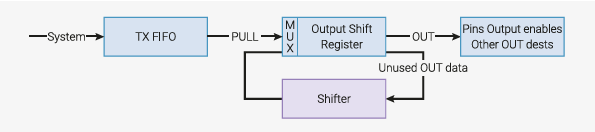
<figcaption>
Figure 45. Output Shift Register (OSR). Data is parcelled out 1…32 bits at a time, and unused data is recycled by a bidirectional shifter.  Once empty, the OSR is reloaded from the TX FIFO.

図 45. 出力シフトレジスタ(OSR)。データは一度に 1～32 ビットずつ分割され、未使用データは双方向シフタによって再利用される。 OSR が空になると、TX FIFO から再ロードされる。
</figcaption>
</figure>

The Output Shift Register (OSR) holds and shifts output data between the TX FIFO and the pins or other destinations, such as the scratch registers.

* `PULL` instructions: remove a 32-bit word from the TX FIFO and place into the OSR.
* `OUT` instructions shift data from the OSR to other destinations, 1…32 bits at a time.
* The OSR fills with zeroes as data is shifted out
* The state machine will automatically refill the OSR from the FIFO on an `OUT` instruction, once some total shift count threshold is reached, if autopull is enabled
* Shift direction can be left/right, configurable by the processor via configuration registers

For example, to stream data through the FIFO and output to the pins at a rate of one byte per two clocks:

出力シフトレジスタ(OSR)は、TX FIFO とピンまたはスクラッチレジスタなどの他の出力先との間で出力データを保持し、シフトします。

* `PULL` 命令: TX FIFO から 32 ビットワードを取り出し、OSR に置きます。
* `OUT` 命令: OSR から 1 度に 1～32 ビットのデータを他のデスティネーションにシフトします。
* データがシフトアウトされると、OSR はゼロで満たされます。
* オートプルが有効な場合、総シフト数がしきい値に達すると、ステートマシンは `OUT` 命令で FIFO から OSR を自動的に補充します。
* シフト方向は、コンフィギュレーションレジスタを介してプロセッサが設定可能な左/右にすることができます。

例えば、2 クロックに 1 バイトの割合でデータを FIFO に流し、ピンに出力する: 

```
1 .program pull_example1
2 loop:
3     out pins, 8
4 public entry_point:
5     pull
6     out pins, 8 [1]
7     out pins, 8 [1]
8     out pins, 8
9     jmp loop
```

### 11.2.4. Autopull

Autopull (see Section 11.5.4) allows the hardware to automatically refill the OSR in the majority of cases, with the state machine stalling if it tries to `OUT` from an empty OSR. This has two benefits:

* No instructions spent on explicitly pulling from FIFO at the right time
* Higher throughput: can output up to 32 bits on every single clock cycle, if the FIFO stays topped up

After configuring autopull, the above program can be simplified to the following, which behaves identically:

オートプル(セクション 11.5.4 参照)により、ほとんどの場合、ハードウェアが自動的に OSR を補充し、空の OSR から `OUT` しようとするとステートマシンがストールする。これには 2 つの利点がある: 

* 適切なタイミングで明示的に FIFO からプルするために費やす命令がない。
* スループットの向上: FIFO が一杯の状態であれば、1 クロックサイクルごとに最大 32 ビットを出力できる。

オートプルを設定した後、上記のプログラムは次のように簡略化でき、動作は同じである: 

```
1 .program pull_example2
2
3 loop:
4     out pins, 8
5 public entry_point:
6     jmp loop
```

Program wrapping (Section 11.5.2) allows further simplification and, if desired, an output of 1 byte every system clock cycle.

プログラムラッピング(セクション 11.5.2)により、さらに簡略化することができ、必要であれば、システムクロックサイクルごとに 1 バイトを出力することができる。

```
1 .program pull_example3
2
3 public entry_point:
4 .wrap_target
5     out pins, 8 [1]
6 .wrap
```

#### 11.2.4.1. Input Shift Register (ISR)

<figure>
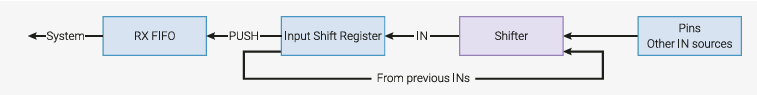
<figcaption>
Figure 46. Input Shift Register (ISR). Data enters 1…32 bits at a time, and current contents is shifted left or right to make room.  Once full, contents is written to the RX FIFO.

図 46. 入力シフトレジスタ(ISR)。データは一度に 1～32 ビットずつ入力され、現在の内容は左または右にシフトしてスペースを作る。 一杯になると、内容は RX FIFO に書き込まれる。
</figcaption>
</figure>

* `IN` instructions shift 1…32 bits at a time into the register.
* `PUSH` instructions write the ISR contents to the RX FIFO.
* The ISR is cleared to all-zeroes when pushed.
* The state machine will automatically push the ISR on an `IN` instruction, once some shift threshold is reached, if autopush is enabled.
* Shift direction is configurable by the processor via configuration registers

Some  peripherals,  like  UARTs,  must  shift  in  from  the  left  to  get  correct  bit  order,  since  the  wire  order  is  LSB-first;  however, the processor may expect the resulting byte to be right-aligned. This is solved by the special `null` input source, which allows the programmer to shift some number of zeroes into the ISR, following the data.

(和訳)

* `IN` 命令は 1～32 ビットを一度にレジスタにシフトする。
* `PUSH` 命令は ISR の内容を RX FIFO に書き込む。
* ISR はプッシュされるとオールゼロにクリアされる。
* オートプッシュが有効な場合、あるシフトしきい値に達すると、ステートマシンは `IN` 命令で自動的に ISR をプッシュします。
* シフト方向は、コンフィギュレーションレジスタを介してプロセッサが設定可能です。

UART のようないくつかの周辺回路は、正しいビット順序を得るために左からシフトする必要があります。これは特別な `null` 入力ソースによって解決され、プログラマはデータに続いて、ある数のゼロを ISR にシフトすることができます。

#### 11.2.4.2. シフトカウンタ

State machines remember how many bits, in total, have been shifted out of the OSR via `OUT` instructions, and into the ISR via `IN` instructions. This information is tracked at all times by a pair of hardware counters: the output shift counter and the input shift counter. Each is capable of holding values from 0 to 32 inclusive. With each shift operation, the relevant counter increments by the shift count, up to the maximum value of 32 (equal to the width of the shift register). The state machine can be configured to perform certain actions when a counter reaches a configurable threshold:

* The OSR can be automatically refilled once some number of bits have been shifted out (see Section 11.5.4).
* The ISR can be automatically emptied once some number of bits have been shifted in (see Section 11.5.4.
* `PUSH` or `PULL` instructions can be conditioned on the input or output shift counter, respectively.

On PIO reset, or the assertion of CTRL_SM_RESTART, the input shift counter is cleared to 0 (nothing yet shifted in), and the output shift counter is initialised to 32 (nothing remaining to be shifted out; fully exhausted). Some other instructions affect the shift counters:

* A successful `PULL` clears the output shift counter to 0
* A successful `PUSH` clears the input shift counter to 0
* `MOV OSR, …` (i.e. any `MOV` instruction that writes OSR) clears the output shift counter to 0
* `MOV ISR, …` (i.e. any `MOV` instruction that writes ISR) clears the input shift counter to 0
* `OUT ISR, count` sets the input shift counter to `count`

(和訳)

ステートマシンは、これまでの累積で何ビットが `OUT` 命令によって OSR からシフトされ、 `IN` 命令によって ISR にシフトされたかを記憶しています。この情報は、出力シフトカウンタと入力シフトカウンタというハードウェアカウンタのペアによって常に追跡される。それぞれ 0 から 32 までの値を保持することができる。各シフト動作に伴い、関連するカウンタは最大値 32 (シフトレジスタの幅に等しい)まで、シフトカウント分ずつインクリメントします。ステートマシンは、カウンタが設定可能な閾値に達したときに特定のアクションを実行するように構成できます: 

* あるビット数がシフトアウトされると、OSR を自動的にリフィルすることができる(セクション 11.5.4 を参照)。
* あるビット数がシフトインされると、自動的に ISR を空にすることができます(セクション 11.5.4 を参照)。
* `PUSH` 命令または `PULL` 命令は、それぞれ入力または出力シフトカウンタを条件とすることができます。

PIO リセットまたは `CTRL_SM_RESTART` のアサート時に、入力シフトカウンタは 0 にクリアされ(まだ何もシフトインされていない)、 出力シフトカウンタは 32 に初期化されます(シフトアウトされる残りがなく、完全に使い切られた)。他のいくつかの命令は、シフトカウンタに影響を与えます: 

* `PULL` が成功すると、出力シフトカウンタは 0 にクリアされます。
* `PUSH` が成功すると、入力シフトカウンタは 0 にクリアされます。
* `MOV OSR, ...`(すなわち、OSR を書き込むすべての MOV 命令)は、出力シフトカウンタを 0 にクリアします。
* `MOV ISR, ...`(すなわち、ISR を書き込むすべての MOV 命令)は、入力シフトカウンタを 0 にクリアします。
* `OUT ISR, count` は入力シフトカウンタを `count` に設定します。

#### 11.2.4.3. スクラッチレジスタ

Each state machine has two 32-bit internal scratch registers, called X and Y.

They are used as:

* Source/destination for `IN`/`OUT`/`SET`/`MOV`
* Source for branch conditions

For example, suppose we wanted to produce a long pulse for "1" data bits, and a short pulse for "0" data bits:

各ステートマシンには、X および Y と呼ばれる 2 つの 32 ビット内部スクラッチレジスタがあります。

これらは以下のように使用されます: 

* `IN`/`OUT`/`SET`/`MOV` のソース/デスティネーション。
* 分岐条件のソース

例えば、 "1" データビットには長いパルスを、 "0" データビットには短いパルスを生成したいとします: 

```
 1 .program ws2812_led
 2
 3 public entry_point:
 4     pull
 5     set x, 23       ; Loop over 24 bits
 6 bitloop:
 7     set pins, 1     ; Drive pin high
 8     out y, 1 [5]    ; Shift 1 bit out, and write it to y
 9     jmp !y skip     ; Skip the extra delay if the bit was 0
10     nop [5]
11 skip:
12     set pins, 0 [5]
13     jmp x-- bitloop ; Jump if x nonzero, and decrement x
14     jmp entry_point
```

Here `X` is used as a loop counter, and `Y` is used as a temporary variable for branching on single bits from the OSR. This program can be used to drive a WS2812 LED interface, although more compact implementations are possible (as few as 3 instructions).

`MOV` allows the use of the scratch registers to save/restore the shift registers if, for example, you would like to repeatedly shift out the same sequence.

>  NOTE A much more compact WS2812 example (4 instructions total) is shown in Section 11.6.2.

ここでは、X をループカウンタとして使用し、Y を OSR からのシングルビットで分岐するための一時変数として使用しています。このプログラムは WS2812 LED インターフェースを駆動するために使用できますが、よりコンパクトな実装も可能です(わずか 3 命令)。

`MOV` は、例えば同じシーケンスを繰り返しシフトアウトしたい場合、シフトレジスタを保存/復元するためにスクラッチレジスタを使用することができます。

> 注: 11.6.2 節に、よりコンパクトな WS2812 の例(合計 4 命令)を示します。

#### 11.2.4.4. FIFOs

Each state machine has a pair of 4-word deep FIFOs, one for data transfer from system to state machine (TX), and the other for state machine to system (RX). The TX FIFO is written to by system bus masters, such as a processor or DMA controller, and the RX FIFO is written to by the state machine. FIFOs decouple the timing of the PIO state machines and the system bus, allowing state machines to go for longer periods without processor intervention.

FIFOs also generate data request (DREQ) signals, which allow a system DMA controller to pace its reads/writes based on the presence of data in an RX FIFO, or space for new data in a TX FIFO. This allows a processor to set up a long transaction, potentially involving many kilobytes of data, which will proceed with no further processor intervention.

Often, a state machine only transfers data in one direction. In this case, the  `SHIFTCTRL_FJOIN` option can merge the two FIFOs into a single 8-entry FIFO that only goes in one direction. This is useful for high-bandwidth interfaces such as DPI.

(和訳)

各ステートマシンには、システムからステートマシンへのデータ転送用(TX)と、ステートマシンからシステムへのデータ転送用(RX)の、深さ 4 ワードの FIFO があります。TX FIFO はプロセッサや DMA コントローラなどのシステムバスマスタによって書き込まれ、RX FIFO はステートマシンによって書き込まれる。FIFO は、PIO ステートマシンとシステムバスのタイミングを切り離し、プロセッサの介入なしにステートマシンを長時間動作させることを可能にする。

FIFO はまた、データ要求(DREQ)信号を生成し、システム DMA コントローラが、RX FIFO 内のデータの有無、または TX FIFO 内の新しいデータのスペースに基づいて、リード/ライトをペース配分することを可能にする。これにより、プロセッサは、何キロバイトものデータを含む可能性のある長いトランザクションをセットアップすることができる。

多くの場合、ステートマシンは一方向にしかデータを転送しない。この場合、 `SHIFTCTRL_FJOIN` オプションは、2 つの FIFO を 1 つの 8 エントリ FIFO に統合し、一方向にのみデータを転送することができる。これは DPI のような高帯域幅インターフェイスに有用である。

### 11.2.5. ストール

State machines may momentarily pause execution for a number of reasons:

* A `WAIT` instruction's condition is not yet met
* A blocking `PULL` when the TX FIFO is empty, or a blocking `PUSH` when the RX FIFO is full
* An `IRQ WAIT` instruction which has set an `IRQ` flag, and is waiting for it to clear
* An `OUT` instruction when autopull is enabled, and OSR has already reached its shift threshold
* An `IN` instruction when autopush is enabled, ISR reaches its shift threshold, and the RX FIFO is full

In this case, the program counter does not advance, and the state machine will continue executing this instruction on the next cycle. If the instruction specifies some number of delay cycles before the next instruction starts, these do not begin until after the stall clears.

>  NOTE Side-set  (Section  11.5.1)  is  not  affected  by  stalls,  and  always  takes  place  on  the  first  cycle  of  the  attached instruction.

ステートマシンは、いくつかの理由で実行を一時停止することがあります: 

* `WAIT` 命令の条件がまだ満たされていない。
* TX FIFO が空のときのブロッキング `PULL`、または RX FIFO が一杯のときのブロッキング `PUSH`
* 事前にセットされた IRQ フラグがクリアされるのを待つ `IRQ WAIT` 命令。
* オートプルが有効で、OSR がすでにシフトしきい値に達している場合の `OUT` 命令。
* オートプッシュが有効で、ISR がシフトしきい値に達し、RX FIFO が満杯のときの `IN` 命令。

この場合、プログラムカウンタは進まず、ステートマシンは次のサイクルでこの命令の実行を継続する。命令が、次の命令を開始するまでの遅延サイクル数を指定している場合、これらの遅延サイクルは、ストールがクリアされるまで開始されません。

> 注: サイドセット(セクション 11.5.1)はストールの影響を受けません。

### 11.2.6. ピンのマッピング

PIO controls the output level and direction of up to 32 GPIOs, and can observe their input levels. On every system clock cycle, each state machine may do none, one, or both of the following:

* Change the level or direction of some GPIOs via an `OUT` or `SET` instruction, or read some GPIOs via an `IN` instruction
* Change the level or direction of some GPIOs via a side-set operation

Each  of  these  operations  uses  one  of  four  contiguous  ranges  of  GPIOs,  with  the  base  and  count  of  each  range configured  via  each  state  machine's  `PINCTRL`  register.  There  is  a  range  for  each  of  `OUT`,  `SET`,  `IN`  and  side-set  operations.  Each range can cover any of the GPIOs accessible to a given PIO block (on RP2350 this is the 30 user GPIOs), and the ranges can overlap.

For each individual GPIO output (level and direction separately), PIO considers all 8 writes that may have occurred on that cycle, and applies the write from the highest-numbered state machine. If the same state machine performs a `SET`/`OUT`  and  a  side-set  on  the  same  GPIO  simultaneously,  the  side-set  is  used.  If  no  state  machine  writes  to  this  GPIO output, its value does not change from the previous cycle.

Generally  each  state  machine's  outputs  are  mapped  to  a  distinct  group  of  GPIOs,  implementing  some  peripheral interface.

PIO は最大 32 個の GPIO の出力レベルと方向を制御し、その入力レベルを観測することができます。システムクロックサイクルごとに、各ステートマシンは以下のいずれか、または両方を実行します: 

* `OUT` 命令または `SET` 命令で一部の GPIO のレベルまたは方向を変更するか、 `IN` 命令で一部の GPIO を読み出します。
* サイドセット操作によっていくつかの GPIO のレベルまたは方向を変更する。

これらの各操作は GPIO の 4 つの連続した範囲の 1 つを使用し、各範囲のベースとカウントは各ステートマシンの `PINCTRL` レジスタで設定します。 `OUT`、`SET`、`IN`、およびサイドセット操作のそれぞれに範囲があります。 各範囲は、指定された PIO ブロック(RP2350 では 30 個のユーザ GPIO)にアクセス可能な GPIO のいずれかをカバーすることができ、範囲は重複することができます。

個々の GPIO 出力(レベルと方向は別々)に対して、PIO はそのサイクルで発生した可能性のある 8 つの書き込みすべてを考慮し、最も番号の高いステートマシンからの書き込みを適用します。同じステートマシンが同じ GPIO に対して `SET`/`OUT` とサイドセットを同時に実行した場合、サイドセットが使用されます。 この GPIO 出力に書き込むステートマシンがない場合、その値は前のサイクルから変化しません。

一般に、各ステートマシンの出力は GPIO の別個のグループにマッピングされ、何らかのペリフェラルインターフェースを実装します。

### 11.2.7. IRQ フラグ

IRQ flags are state bits which can be set or cleared by state machines or the system. There are 8 in total: all 8 are visible to all state machines, and the lower 4 can also be masked into one of PIO's interrupt request lines, via the `IRQ0_INTE` and `IRQ1_INTE` control registers.

They have two main uses:

* Asserting system level interrupts from a state machine program, and optionally waiting for the interrupt to be acknowledged
* Synchronising execution between two state machines

State machines interact with the flags via the `IRQ` and `WAIT` instructions.

IRQ フラグはステートマシンやシステムによってセットまたはクリアされる状態ビットです。全部で 8 つあり、8 つすべてがすべてのステートマシンに表示され、下位 4 つは `IRQ0_INTE` および `IRQ1_INTE` 制御レジスタを経由して PIO の割り込み要求ラインの 1 つにマスクすることもできます。

これらには主に 2 つの用途がある: 

* ステートマシンプログラムからシステムレベルの割り込みをアサートし、オプションで割り込みが確認されるのを待ちます。
* 2 つのステートマシン間の実行の同期

ステートマシンは `IRQ` 命令と `WAIT` 命令を介してフラグと相互作用します。

### 11.2.8. ステートマシン間の相互作用

Instruction  memory  is  implemented  as  a  1-write,  4-read  register  file,  allowing  all  four  state  machines  to  read  an instruction on the same cycle without stalling.

There are three ways to apply the multiple state machines:

* Pointing multiple state machines at the same program
* Pointing multiple state machines at different programs
* Using multiple state machines to run different parts of the same interface, e.g. TX and RX side of a UART, or clock/hsync and pixel data on a DPI display

State machines cannot communicate data, but they can synchronise with one another by using the IRQ flags. There are 8 flags total. Each state machine can set or clear any flag using the IRQ instruction, and can wait for a flag to go high or low using the WAIT IRQ instruction. This allows cycle-accurate synchronisation between state machines.

命令メモリは、1 書き込み 4 読み出しのレジスタファイルとして実装され、4 つのステートマシンがすべて、ストールすることなく同じサイクルで命令を読み出すことができます。

複数のステートマシンを適用するには、3 つの方法がある: 

* 複数のステートマシンを同じプログラムに向ける
* 複数のステートマシンを異なるプログラムに向ける
* 複数のステートマシンを同じインタフェースの異なる部分を実行させる。例えば、UART の TX 側と RX 側、DPI ディスプレイのクロック/Hsync とピクセルデータなどです。

ステートマシンはデータを通信することはできませんが、IRQ フラグを使用することで互いに同期することができます。フラグは全部で 8 つあります。各ステートマシンは、IRQ 命令を使って任意のフラグをセットまたはクリアでき、 `WAIT IRQ` 命令を使ってフラグが High または Low になるのを待つことができます。これにより、ステートマシン間でサイクル精度の高い同期を取ることができる。

## 11.3. PIO アセンブラ (pioasm)

The  PIO  Assembler  parses  a  PIO  source  file  and  outputs  the  assembled  version  ready  for  inclusion  in  an  RP2350 application. This includes C and C++ applications built against the SDK, and Python programs running on the RP2350 MicroPython port.

This section briefly introduces the directives and instructions that can be used in `pioasm` input. For a deeper discussion of how to use `pioasm`, how it is integrated into the SDK build system, extended features such as code pass through, and the various output formats it can produce, see Raspberry Pi Pico-series C/C++ SDK.

PIO アセンブラは、PIO ソースファイルを解析し、RP2350 アプリケーションに組み込めるようにアセンブルしたバージョンを出力します。これには、SDK に対してビルドされた C および C++ アプリケーション、および RP2350 MicroPython ポートで実行される Python プログラムが含まれます。

このセクションでは、 `pioasm` 入力で使用できる指令と命令を簡単に紹介します。 `pioasm` の使用方法、SDK ビルドシステムへの統合方法、コードパススルーなどの拡張機能、および `pioasm` が生成できるさまざまな出力形式については、 "Raspberry Pi Pico-series C/C++ SDK." を参照してください。

### 11.3.1. Directives

The following directives control the assembly of PIO programs:

以下の指令(directives)は、PIO プログラムのアセンブリを制御する: 

<description>

||.define (PUBLIC) <symbol> <value>||Define an integer symbol named `<symbol>` with the value `<value>` (see Section 11.3.2). If this `.define` appears before the first program in the input file, then this define is global to all programs, otherwise it is local to the program in which it occurs. If `PUBLIC` is specified, the symbol will be emitted into the assembled output for use by user code. For the SDK this takes the following forms:

* `#define <program_name> <symbol> value`: for program symbols
* `#define <symbol> value`: for global symbols

`<symbol>` という名前の整数シンボルを `<value>` という値で定義する(セクション 11.3.2 参照)。この `.define` が入力ファイルの最初のプログラムの前にある場合、この `.define` は全てのプログラムに対してグローバルであり、そうでない場合、この `.define` が現れたプログラムに対してローカルである。 `PUBLIC` が指定された場合、シンボルはユーザコードで使用するためにアセンブルされた出力に出力されます。SDK の場合、これは次のような形になります: 

* `#define <program_name> <symbol> value`: プログラムシンボル用
* `#define <symbol> value`: グローバルシンボル用

||.clock_div <divider>||If this directive is present, `<divider>` is the state machine clock divider for the program. Note, that divider is a floating point  value,  but  may  not  currently  use  arithmetic  expressions  or  defined  values.  This  directive  affects  the  default state machine configuration for a program. This directive is only valid within a program before the first instruction.

この指令が存在する場合、 `<divider>` はプログラムのステートマシン・クロック分周比である。 分周比は浮動小数点値であるが、算術式や定義された値を使用する*ことはできない*。 この指令は、プログラムのデフォルトのステートマシン構成に影響を与える。この指令はプログラム内で最初の命令の前にのみ有効である。
||.fifo <fifo_config>||If this directive is present, it is used to specify the FIFO configuration for the program. It affects the default state machine configuration for a program, but also restricts what instructions may be used (for example PUSH makes no sense if there is no IN FIFO configured).

This directive supports the following configuration values:

* `txrx`: 4 FIFO entries for each of TX and RX; this is the default.
* `tx`: All 8 FIFO entries for TX.
* `rx`: All 8 FIFO entries for RX.
* `txput`: 4 FIFO entries for TX, and 4 FIFO entries for `mov rxfifo[index], isr` aka `put`. This value is not supported on PIO version 0.
* `txget`: 4 FIFO entries for TX, and 4 FIFO entries for `mov osr, rxfifo[index]` aka `get`. This value is not supported on PIO version 0.
* `putget`: 4 FIFO entries for `mov rxfifo[index], isr` aka `put`, and 4 FIFO entries for mov `osr, rxfifo[index]` aka `get`.  This value is not supported on PIO version 0.

This directive is only valid within a program before the first instruction.

この命令が存在する場合、プログラムの FIFO 設定を指定するために使用される。これはプログラムのデフォルトのステートマシン構成に影響を与えるだけでなく、使用できる命令も制限します(例えば、IN FIFO が構成されていない場合、PUSH は意味を持ちません)。

この指令は以下の設定値をサポートする: 

* `txrx`:  これはデフォルトである。
* `tx`: TX 用の 8 つの FIFO エントリすべて。
* `rx`:  RX 用の 8 つの FIFO エントリすべて。
* @: TX 用の 4 つの FIFO エントリ、および `mov rxfifo[index], isr` aka `put` 用の 4 つの FIFO エントリ。この値は PIO バージョン 0 ではサポートされない。
* `txget`:  TX 用の 4 つの FIFO エントリと、 `mov osr, rxfifo[index]` 用の 4 つの FIFO エントリ。この値は PIO バージョン 0 ではサポートされない。
* `putget`: `mov rxfifo[index], isr`(別名 `put`)に対して 4 FIFO エントリ、および `mov osr, rxfifo[index]` (別名 `get`)に対して 4 FIFO エントリ。 この値は PIO バージョン 0 ではサポートされていません。

この指令はプログラム内で最初の命令の前にのみ有効である。
||.mov_status rxfifo < <n><br> .mov_status txfifo < <n><br> .mov_status irq <(next|prev)> set <n>|| This directive configures the source for the  `mov  ,  STATUS`. One of the three syntaxes can be used to set the status based on the RXFIFO level being below a value N, the TXFIFO level being below a value N, or an IRQ flag N being set on this PIO instance (or the next higher numbered, or lowered numbered PIO instance if `next` or `prev` or specified).  Note, that the IRQ option requires PIO version 1.

This  directive  affects  the  default  state  machine  configuration  for  a  program.  This  directive  is  only  valid  within  a program before the first instruction.

 この指令は `mov , STATUS` のソースを設定する。RXFIFO レベルが値 N 以下であること、TXFIFO レベルが値 N 以下であること、または IRQ フラグ N がこの PIO インスタンス(`next` または `prev` が指定されている場合は、次に高い番号または低い番号の PIO インスタンス)で設定されていることに基づいてステータスを設定するには、3 つの構文のいずれかを使用できます。 IRQ オプションは PIO バージョン 1 を必要とすることに注意。

この指令は、プログラムのデフォルトのステートマシン設定に影響します。 この指令は最初の命令の前のプログラムでのみ有効である。
||.in <count> (left|right) (auto) (<threshold>)||If this directive is present, `<count>` indicates the number of IN bits to be used. 'left' or 'right' if specified, control the ISR shift direction; 'auto', if present, enables "auto-push"; `<threshold>`, if present, specifies the "auto-push" threshold.  This directive affects the default state machine configuration for a program.

This directive is only valid within a program before the first instruction. When assembling for PIO version 0, `<count>` must be 32.

この指令がある場合、<count>は使用する IN ビットの数を示す。'left'または'right'が指定された場合、ISR のシフト方向を制御する。'auto'が指定された場合、 "auto-push" を有効にする。<threshold>が指定された場合、 "auto-push" のしきい値を指定する。 この指令は、プログラムのデフォルトのステートマシン構成に影響を与える。

この指令は、プログラム内で最初の命令の前にのみ有効である。PIO バージョン 0 用にアセンブルする場合、 `<count>` は 32 でなければならない。
||.program <name>||Start  a  new  program  with  the  name  `<name>`.  Note  that  that  name is  used in  code  so  should  be alphanumeric/underscore not starting with a digit. The program lasts until another `.program` directive or the end of the source file. PIO instructions are only allowed within a program.

名前 `<name>` で新しいプログラムを開始する。 この名前はコードの中で使われるので、数字で始まらない英数字/アンダースコアでなければならないことに注意してください。このプログラムは、別の  `.program` 命令かソースファイルの終わりまで続きます。PIO 命令はプログラム内でのみ許される。
||.origin <offset>||Optional directive to specify the PIO instruction memory offset at which the program must load. Most commonly this is used for programs that must load at offset 0, because they use data based JMPs with the (absolute) jmp target being stored in only a few bits. This directive is invalid outside a program.

プログラムがロードしなければならない PIO 命令メモリのオフセットを指定するためのオプション命令。最も一般的には、オフセット 0 にロードしなければならないプログラムに使用されます。これは、(絶対)jmp ターゲットが数ビットしか格納されていないデータベースの JMP を使用するためです。この命令はプログラム外では無効です。
||.out <count> (left|right) (auto) (<threshold>)||If this directive is present, `<count>` indicates the number of OUT bits to be used. 'left' or 'right' if specified control the OSR  shift  direction;  'auto',  if  present,  enables  "auto-pull";  `<threshold>`,  if  present,  specifies  the  "auto-pull"  threshold.  This  directive  affects  the  default  state  machine  configuration  for  a  program.  This  directive  is  only  valid  within  a program before the first instruction.

この指令がある場合、 `<count>` は使用する OUT ビットの数を示す。'left'または'right'が指定された場合、OSR のシフト方向を制御する。 'auto' が指定された場合、 "auto-pull" を有効にする。 `<threshold>` が指定された場合、 "auto-pull" のしきい値を指定する。 この指令は、プログラムのデフォルトのステートマシン構成に影響する。 この指令は、最初の命令の前のプログラム内でのみ有効である。
||.pio_version <version>||This  directive  sets  the  target  PIO  hardware  version.  The  version  for  RP2350  is  `1`  or  `RP2350`,  and  is  also  the  default version number. For backwards compatibility with RP2040, `0` or `RP2040` may be used.

If  this  directive  appears  before  the  first  program  in  the  input  file,  then  this  define  is  the  default  for  all  programs,

otherwise it specifies the version for the program in which it occurs. If specified for a program, it must occur before the first instruction.

この指令はターゲット PIO ハードウェアのバージョンを設定する。 RP2350 のバージョンは `1` または `RP2350` で、デフォルトのバージョン番号でもあります。RP2040 との後方互換性のために、`0` または `RP2040` を使うことができます。

この指令が入力ファイルの最初のプログラムの前にある場合は、この定義がすべてのプログラムのデフォルトとなる。そうでない場合は、この指令が置かれるプログラムのバージョンを指定する。プログラム中で指定する場合は、最初の命令より前になければならない。
||.set <count>||If  this  directive  is  present,  `<count>`  indicates  the  number  of  SET  bits  to  be  used.  This  directive  affects  the  default state machine configuration for a program. This directive is only valid within a program before the first instruction.

この命令が存在する場合、 `<count>` は使用する SET ビットの数を示す。 この指令はプログラムのデフォルトのステートマシン構成に影響する。この指令は最初の命令の前のプログラムでのみ有効である。
||.side_set <count> (opt) (pindirs)||If this directive is present, `<count>` indicates the number of side-set bits to be used. Additionally, `opt` may be specified to indicate that a `side <value>` is optional for instructions (note this requires stealing an extra bit --- in addition to the `<count>`  bits --- from  those  available  for  the  instruction  delay).  Finally,  `pindirs`  may  be  specified  to  indicate  that  the side  set  values  should  be  applied  to  the  PINDIRs  and  not  the  PINs.  This  directive  is  only  valid  within  a  program before the first instruction.

この指令がある場合、 `<count>` は使用されるサイドセットビットの数を示す。さらに、 `opt` は、 `side <value>` が命令のオプションであることを示すために指定することができる(これは、 `<count>` ビットに加えて---命令遅延のために利用可能なものから --- その分多くのビットを盗む必要があることに注意すること)。 最後に、 `pindirs` を指定して、サイドセット値が PIN ではなく PINDIR に適用することを指示することができる。 この指令は最初の命令の前のプログラム内でのみ有効である。
||.wrap_target||Place  prior  to  an  instruction,  this  directive  specifies  the  instruction  where  execution  continues  due  to  program wrapping.  This  directive  is  invalid  outside  of  a  program,  may  only  be  used  once  within  a  program,  and  if  not specified defaults to the start of the program.

命令の前に置かれ、プログラムの折り返しによって実行が継続される命令を指定します。 この指令はプログラム外では無効であり、プログラム内で一度だけ使用することができます。
||.wrap||Placed after an instruction, this directive specifies the instruction after which, in normal control flow (i.e.  `jmp` with false  condition,  or  no  `jmp`),  the  program  wraps  (to  `.wrap_target`  instruction).  This  directive  is  invalid  outside  of  a program,  may  only  be  used  once  within  a  program,  and  if  not  specified  defaults  to  after  the  last  program instruction.

命令の後に置かれ、通常の制御フロー (すなわち、偽の条件での `jmp`、または `jmp` なし) において、プログラムが巻き戻る (`.wrap_target` 命令へ) 命令を指定します。 この指令は、プログラム外では無効で、プログラム内で一度だけ使用することができ、指定されなければ、最後のプログラム命令の後がデフォルトになります。
||.lang_opt <lang> <name> <option>||Specifies  an  option  for  the  program  related  to  a  particular  language  generator.  (See  Language  Generators  in Raspberry Pi Pico-series C/C++ SDK). This directive is invalid outside of a program.

特定の言語ジェネレータに関連するプログラムのオプションを指定します。 (Raspberry Pi Pico シリーズ C/C++ SDK の言語ジェネレータを参照)。この指令はプログラムの外では無効です。
||.word <value>||Stores a raw 16-bit value as an instruction in the program. This directive is invalid outside of a program.

生の 16 ビット値をプログラム中の命令として格納する。この指令はプログラムの外では無効です。
</description>

### 11.3.2. Values

The following types of values can be used to define integer numbers or branch targets:

Table 977. Values in pioasm, i.e. <value>

 |||
 |---|---|
 |integer|An integer value, e.g. 3 or -7.
 |hex|A hexadecimal value, e.g. 0xf.
 |binary|A binary value, e.g. 0b1001.
 |symbol|A value defined by a .define (see pioasm_define).
 |<label>|The instruction offset of the label within the program. Typically used with a JMP instruction (see Section 11.4.2).
 |(<expression>)|An expression to be evaluated; see expressions. Note that the parentheses are necessary.

### 11.3.3. Expressions

Expressions may be freely used within pioasm values.

Table 978. Expressions in pioasm i.e. <expression>

 |||
 |---|---|
 |<expression> + <expression>|The sum of two expressions
 |<expression> - <expression>|The difference of two expressions
 |<expression> * <expression>|The multiplication of two expressions
 |<expression> / <expression>|The integer division of two expressions
 |- <expression>|The negation of another expression
 |<expression> << <expression>|One expression shifted left by another expression
 |<expression> >> <expression>|One expression shifted right by another expression
 |:: <expression>|The bit reverse of another expression
 |<value>|Any value (see Section 11.3.2)

### 11.3.4. Comments

To create a line comment that ignores all content on a certain line following a certain symbol, use `//` or `;`.

To create a C-style block comment that ignores all content across multiple lines until after a start symbol until an end symbol appears, use `/*` to begin the comment and `*/` to end the comment.

### 11.3.5. Labels

Labels use the following forms at the start of a line:

```
<symbol>:
```

```
PUBLIC <symbol>:
```

>  TIP A label is really just an automatic .define with a value set to the current program instruction offset. A PUBLIC label is exposed to the user code in the same way as a PUBLIC .define.

> ヒント: ラベルは実際には、現在のプログラム命令オフセットに値が設定された自動.define に過ぎません。PUBLIC ラベルは PUBLIC .define と同じようにユーザコードに公開されます。

### 11.3.6. Instructions

All pioasm instructions follow a common pattern:

```
<instruction> (side <side_set_value>) ([<delay_value>])
```

where:

<desc>

||<instruction>||An assembly instruction detailed in the following sections. (see Section 11.4)

以下のセクションで詳述されるアセンブリ命令(セクション 11.4 参照)。
||<side_set_value>||A value (see Section 11.3.2) to apply to the side_set pins at the start of the instruction. Note that the rules for a side-set value via `side <side_set_value>` are dependent on the `.side_set` (see `pioasm_side_set`) directive for the program. If no .`side_set` is specified then the `side <side_set_value>` is invalid, if an optional number of sideset pins is specified then `side <side_set_value>` may be present, and if a non-optional number of sideset pins is specified, then `side <side_set_value>` is required. The <side_set_value> must fit within the number of side-set bits specified in the `.side_set` directive.

命令開始時に side_set ピンに適用する値(セクション 11.3.2 参照)。 `side <side_set_value>` によるサイドセット値の規則は、プログラムの `.side_set` (`pioasm_side_set` 参照) 命令に依存することに注意すること。`.side_set` が指定されていない場合、 `side <side_set_value>` は無効である。オプションのサイドセットピン数が指定されている場合、 `side <side_set_value>` が存在してもよく、オプションでないサイドセットピン数が指定されている場合、 `side <side_set_value>` は必須である。 `<side_set_value>` は、 `.side_set` 指令で指定されたサイドセットビット数に収まらなければならない。
||<delay_value>||Specifies the number of cycles to delay after the instruction completes. The delay_value is specified as a value (see Section 11.3.2), and in general is between 0 and 31 inclusive (a 5-bit value), however the number of bits is reduced when sideset is enabled via the `.side_set` (see `pioasm_side_set`) directive. If the `<delay_value>` is not present, then the instruction has no delay.

命令が完了した後に遅延させるサイクル数を指定する。delay_value は値として指定され(セクション 11.3.2 参照)、通常は 0 から 31 の間(5 ビット値)であるが、`.side_set`(`pioasm_side_set` 参照)指令によってサイドセットが有効になっている場合はビット数が減る。 `<delay_value>` が存在しない場合、その命令は遅延を持たない。
</desc>

>  NOTE pioasm instruction names, keywords and directives are case insensitive; lower case is used in the Assembly Syntax sections below, as this is the style used in the SDK.

>  NOTE Commas appear in some Assembly Syntax sections below, but are entirely optional, e.g. `out pins, 3` may be written `out pins 3`, and  `jmp x-- label` may be written as  `jmp x--, label`. The Assembly Syntax sections below uses the first style in each case as this is the style used in the SDK.

> NOTE pioasm の命令名、キーワード、指令は大文字と小文字を区別しません。以降の *Assembly Syntax* のセクションでは、SDK のスタイルに合わせ、小文字を使用します。

> NOTE 以降の *Assembly Syntax* セクションではコンマを使用していますが、これは完全にオプション扱いです。例えば、`out pins, 3` は `out pins 3`、`jmp x-- label` は `jmp x--, label` と書くことができます。以下のセクションの *Assembly Syntax* の説明では、SDK で使用されている最初のスタイルを使用しています。

### 11.3.7. Pseudoinstructions

pioasm provides aliases for certain instructions, as a convenience:

pioasm は、便宜上、特定の命令のエイリアスを提供している: 

<desc>

||nop||Assembles to mov y, y. No side effect, but a useful vehicle for a side-set operation or an extra delay.

副作用はないが、サイドセット操作や追加ディレイのための便利な手段。
</desc>

## 11.4. Instruction Set

### 11.4.1. Summary

PIO instructions are 16 bits long, and use the following encoding:

PIO 命令は 16 ビット長で、以下のエンコーディングを使用する: 

Table 979. PIO instruction encoding

<figure>
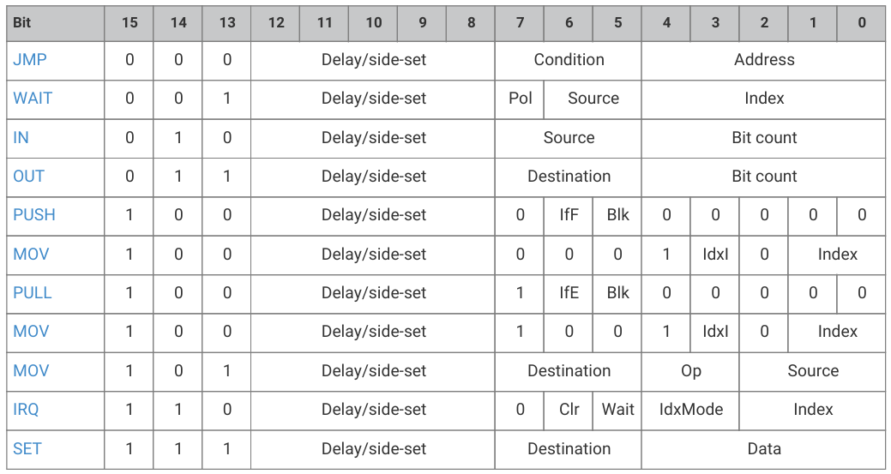
</figure>

All PIO instructions execute in one clock cycle.

The function of the 5-bit Delay/side-set field depends on the state machine's SIDESET_COUNT configuration:

* Up to 5 LSBs (5 minus SIDESET_COUNT) encode a number of idle cycles inserted between this instruction and the next.
* Up to 5 MSBs, set by SIDESET_COUNT, encode a side-set (Section 11.5.1), which can assert a constant onto some GPIOs, concurrently with main instruction execution.

すべての PIO 命令は 1 クロックサイクルで実行される。

5 ビットの Delay/side-set フィールドの機能は、ステートマシンの SIDESET_COUNT コンフィギュレーションに依存する: 

* 最大 5 つの LSB(5 から SIDESET_COUNT を引いた値)は、この命令と次の命令の間に挿入されるアイドルサイクル数をエンコードする。
* SIDESET_COUNT で設定される最大 5 つの MSB は、サイドセット(セクション 11.5.1)をエンコードし、メイン命令実行と同時に、いくつかの GPIO に定数をアサートすることができます。

### 11.4.2. JMP

#### 11.4.2.1. Encoding


#### 11.4.2.2. Operation

Set program counter to Address if Condition is true, otherwise no operation.

Delay  cycles  on  a  JMP  always  take  effect,  whether  Condition  is  true  or  false,  and  they  take  place  after  Condition  is evaluated and the program counter is updated.

* Condition:

  + 000: (no condition): Always
  + 000: (no condition): Always
  + 001: !X: scratch X zero
  + 010: X--: scratch X non-zero, prior to decrement
  + 011: !Y: scratch Y zero
  + 100: Y--: scratch Y non-zero, prior to decrement
  + 101: X!=Y: scratch X not equal scratch Y
  + 110: PIN: branch on input pin
  + 111: !OSRE: output shift register not empty

* Address: Instruction address to jump to. In the instruction encoding this is an absolute address within the PIO instruction memory 

JMP PIN branches on the GPIO selected by EXECCTRL_JMP_PIN, a configuration field which selects one out of the maximum of 32 GPIO inputs visible to a state machine, independently of the state machine's other input mapping. The branch is taken if the GPIO is high.

条件が真の場合、プログラムカウンタをアドレスに設定する。

JMP の遅延サイクルは、Condition が true であろうと false であろうと常に有効であり、Condition が評価され、プログラムカウンタが更新された後に実行される。

* コンディション

  + 000: (条件なし):  常に
  + 000: (条件なし):  常に
  + 001: !X:スクラッチ X ゼロ
  + 010: X--: デクリメント前のスクラッチ X ゼロ以外
  + 011: !Y: Y ゼロをスクラッチする。
  + 100: Y--: デクリメント前のスクラッチ Y が 0 以外の場合
  + 101: X!=Y: スクラッチ X がスクラッチ Y と等しくない。
  + 110: PIN: 入力ピンへの分岐
  + 111: !OSRE: 出力シフトレジスタが空でない。

* アドレス:  ジャンプ先の命令アドレス。命令エンコーディングでは、これは PIO 命令メモリ内の絶対アドレスです。

JMP PIN は、EXECCTRL_JMP_PIN によって選択された GPIO に分岐します。これは、ステートマシンの他の入力マッピングとは無関係に、ステートマシンに見える最大 32 個の GPIO 入力のうち 1 つを選択するコンフィギュレーションフィールドです。GPIO が High の場合、分岐が行われます。

!OSRE compares the bits shifted out since the last PULL with the shift count threshold configured by SHIFTCTRL_PULL_THRESH.  This is the same threshold used by autopull (Section 11.5.4).

JMP  X--  and  JMP  Y--  always  decrement  scratch  register  X  or  Y,  respectively.  The  decrement  is  not  conditional  on  the current  value  of  the  scratch  register.  The  branch  is  conditioned  on  the  initial  value  of  the  register,  i.e.  before  the decrement took place: if the register is initially nonzero, the branch is taken.

OSRE は、最後の PULL からシフトアウトされたビットを、SHIFTCTRL_PULL_THRESH で設定されたシフトカウントしきい値と比較します。 これはオートプル(セクション 11.5.4)で使用される閾値と同じである。

JMP X--と JMP Y--は、それぞれ常にスクラッチレジスタ X または Y をデクリメントする。 このデクリメントには、スクラッチレジスタの現在値に対する条件はない。 分岐は、レジスタの初期値、つまりデクリメントが行われる前の値に条件付けされます。レジスタの初期値が 0 でなければ、分岐が行われます。

#### 11.4.2.3. Assembler Syntax

```
jmp (<cond>) <target>
```

where:

<description>

||<cond>||An optional condition listed above (e.g. !x for scratch X zero). If a condition code is not specified, the branch is always taken.

上記のオプション条件(例: スクラッチ X がゼロの場合は!) 条件コードが指定されない場合は、常に分岐が行われる。
||<target>||A program label or value (see Section 11.3.2) representing instruction offset within the program (the first instruction being offset 0). Because the PIO JMP instruction uses absolute addresses in the PIO instruction memory, JMPs need to be adjusted based on the program load offset at runtime. This is handled for you when loading a program with the SDK, but care should be taken when encoding JMP instructions for use by OUT EXEC.

プログラムラベルまたは値(セクション 11.3.2 を参照) プログラム内の命令オフセットを表す(最初の命令はオフセット 0)。PIO JMP 命令は PIO 命令メモリ内の絶対アドレスを使用するため、JMP は実行時のプログラムロードオフセットに基づいて調整する必要があります。これは SDK でプログラムをロードする際に処理されますが、OUT EXEC で使用する JMP 命令をエンコードする際には注意が必要です。
</description>

### 11.4.3. WAIT

#### 11.4.3.1. Encoding

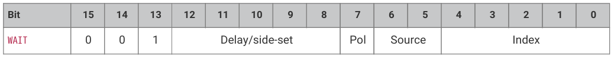

#### 11.4.3.2. Operation

Stall until some condition is met.

Like  all  stalling  instructions  (Section  11.2.5),  delay  cycles  begin  after  the  instruction  completes.  That  is,  if  any  delay cycles are present, they do not begin counting until after the wait condition is met.

* Polarity:
  + 1: wait for a 1.
  + 0: wait for a 0.
* Source: what to wait on. Values are:
  + 00: GPIO: System GPIO input selected by Index. This is an absolute GPIO index, and is not affected by the state machine's input IO mapping.
  + 01: PIN: Input pin selected by Index. This state machine's input IO mapping is applied first, and then Index selects which of the mapped bits to wait on. In other words, the pin is selected by adding Index to the PINCTRL_IN_BASE configuration, modulo 32.
  + 10: IRQ: PIO IRQ flag selected by Index
  + 11: JMPPIN: wait on the pin indexed by the PINCTRL_JMP_PIN configuration, plus an Index in the range 0-3, all modulo 32. Other values of Index are reserved.
* Index: which pin or bit to check.

何らかの条件が満たされるまでストールする。

すべてのストール命令(セクション 11.2.5)と同様に、遅延サイクルは命令が完了した後に開始します。 つまり、遅延サイクルが存在する場合、それらは待機条件が満たされるまでカウントを開始しません。

* 極性: 
  + 1: 1 を待つ。
  + 0: 0 を待つ。
* ソース: 何を待つのか。値は次のとおり: 
  + 00: GPIO: インデックスによって選択されたシステム GPIO 入力。これは絶対的な GPIO インデックスであり、ステートマシンの入力 IO マッピングの影響を受けない。
  + 01: PIN: インデックスで選択された入力ピン。このステートマシンの入力 IO マッピングが最初に適用され、次に Index がマッピングされたビットのどれで待機するかを選択する。言い換えると、ピンは、PINCTRL_IN_BASE 構成に Index を 32 モジュロ加算することで選択される。
  + 10: IRQ: PIO IRQ フラグが Index によって選択される。
  + 11: JMPPIN: PINCTRL_JMP_PIN コンフィギュレーションに 0～3 の範囲の Index を加えた 32 モジュロでインデックスされたピンで待機。Index の他の値は予約されています。
* インデックス: どのピンまたはビットをチェックするか。

WAIT x IRQ behaves slightly differently from other WAIT sources:

* If Polarity is 1, the selected IRQ flag is cleared by the state machine upon the wait condition being met.
* The flag index is decoded in the same way as the IRQ index field, decoding down from the two MSBs (aligning with the IRQ instruction IdxMode field):
  + 00: the three LSBs are used directly to index the IRQ flags in this PIO block.
  + 01 (PREV), the instruction references an IRQ from the next-lower-numbered PIO in the system, wrapping to the highest-numbered PIO if this is PIO0.
  + 10 (REL), the state machine ID (0…3) is added to the IRQ index, by way of modulo-4 addition on the two LSBs.  For example, state machine 2 with a flag value of 0x11 will wait on flag 3, and a flag value of 0x13 will wait on flag 1. This allows multiple state machines running the same program to synchronise with each other.
  + 11 (NEXT), the instruction references an IRQ from the next-higher-numbered PIO in the system, wrapping to PIO0 if this is the highest-numbered PIO.

>  CAUTION WAIT 1 IRQ x should not be used with IRQ flags presented to the interrupt controller, to avoid a race condition with a system interrupt handler

WAIT x IRQ は、他の WAIT ソースとは若干異なる動作をします: 

* 極性が 1 の場合、選択された IRQ フラグは待機条件が満たされるとステートマシンによってクリアされる。
* フラグインデックスは IRQ インデックスフィールドと同じ方法でデコードされ、2 つの MSB(IRQ 命令 IdxMode フィールドと一致)からデコードされます: 
  + 00: 3 つの LSB は、この PIO ブロックの IRQ フラグのインデックスに直接使用される。
  + 01 (PREV)、この命令はシステム内の次の下位番号の PIO から IRQ を参照し、PIO0 の場合は最上位番号の PIO に折り返す。
  + 10 (REL)では、ステートマシン ID (0...3)が、2 つの LSB のモジュロ 4 加算によって IRQ インデックスに加算される。 例えば、フラグ値 0x11 のステートマシン 2 はフラグ 3 で待機し、フラグ値 0x13 はフラグ 1 で待機する。これにより、同じプログラムを実行している複数のステートマシンが互いに同期することができる。
  + 11(NEXT)の命令では、システム内で次に高い番号の PIO から IRQ を参照し、これが最も高い番号の PIO であれば PIO0 に折り返す。

> 注意: WAIT 1 IRQ x は、システム割り込みハンドラとの競合状態を避けるため、割り込みコントローラに提示される IRQ フラグと一緒に使用しないでください。

#### 11.4.3.3. Assembler Syntax

```
wait <polarity> gpio <gpio_num>
wait <polarity> pin <pin_num> 
wait <polarity> irq <irq_num> (rel, next, prev) 
wait <polarity> jmppin (+ <pin_offset>) 
```

where:

<description>

||<polarity>||A value (see Section 11.3.2) specifying the polarity (either 0 or 1).

極性を指定する値(セクション 11.3.2 参照)(0 または 1)。
||<pin_num>||A value (see Section 11.3.2) specifying the input pin number (as mapped by the SM input pin mapping).

SM 入力ピンマッピングによってマッピングされた)入力ピン番号を指定する値(セクション 11.3.2 参照)。
||<gpio_num>||A value (see Section 11.3.2) specifying the actual GPIO pin number.

実際の GPIO ピン番号を指定する値(セクション 11.3.2 を参照)。
||<irq_num> (rel)||A value (see Section 11.3.2) specifying The IRQ number to wait on (0-7). If rel is present, then the actual IRQ number used is calculating by replacing the low two bits of the IRQ number (irq_num10) with the low two bits of the sum (irq_num10 + sm_num10) where sm_num10 is the state machine number.

待機する IRQ 番号(0-7)を指定する値(セクション 11.3.2 参照)。rel が存在する場合、実際に使用される IRQ 番号は、IRQ 番号(irq_num10)の下位2 ビットを和(irq_num10 + sm_num10)の下位2 ビット(sm_num10 はステートマシン番号)に置き換えて計算される。
||<pin_offset>||A value (see Section 11.3.2) added to the jmp_pin to get the actual pin number.

実際のピン番号を得るために jmp_pin に追加される値(セクション 11.3.2 参照)。
</description>

### 11.4.4. IN

#### 11.4.4.1. Encoding

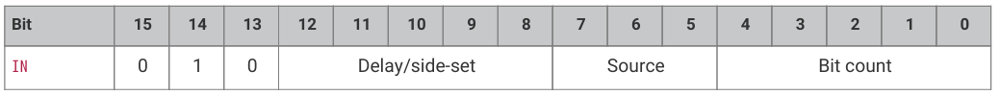

#### 11.4.4.2. Operation

Shift Bit count bits from Source into the Input Shift Register (ISR). Shift direction is configured for each state machine by SHIFTCTRL_IN_SHIFTDIR. Additionally, increase the input shift count by Bit count, saturating at 32.

* Source:
  + 000: PINS
  + 001: X (scratch register X)
  + 010: Y (scratch register Y)
  + 011: NULL (all zeroes)
  + 100: Reserved
  + 101: Reserved
  + 110: ISR
  + 111: OSR
* Bit count: How many bits to shift into the ISR. 1…32 bits, 32 is encoded as 00000

If  automatic  push  is  enabled,  IN  will  also  push  the  ISR  contents  to  the  RX  FIFO  if  the  push  threshold  is  reached (SHIFTCTRL_PUSH_THRESH). IN still executes in one cycle, whether an automatic push takes place or not. The state machine will stall if the RX FIFO is full when an automatic push occurs. An automatic push clears the ISR contents to all-zeroes, and clears the input shift count. See Section 11.5.4.

IN  always  uses  the  least  significant  Bit  count  bits  of  the  source  data.  For  example,  if  PINCTRL_IN_BASE  is  set  to  5,  the instruction IN PINS, 3 will take the values of pins 5, 6 and 7, and shift these into the ISR. First the ISR is shifted to the left or right to make room for the new input data, then the input data is copied into the gap this leaves. The bit order of the input data is not dependent on the shift direction.

NULL  can  be  used  for  shifting  the  ISR's  contents.  For  example,  UARTs  receive  the  LSB  first,  so  must  shift  to  the  right.  After 8 IN PINS, 1 instructions, the input serial data will occupy bits 31…24 of the ISR. An IN NULL, 24 instruction will shift in 24 zero bits, aligning the input data at ISR bits 7…0. Alternatively, the processor or DMA could perform a byte read from FIFO address + 3, which would take bits 31…24 of the FIFO contents.

(和訳)

ソースから入力シフトレジスタ　(ISR) にビットカウントビットをシフトします。シフト方向は、SHIFTCTRL_IN_SHIFTDIR によって各ステートマシンに設定されます。さらに、入力シフトカウントを Bit カウント分増やし、32 で飽和させます。

* ソース: 
  + 000: PINS
  + 001: X (スクラッチレジスタ X)
  + 010: Y(スクラッチレジスタ Y)
  + 011: NULL(すべてゼロ)
  + 100: 予約
  + 101: リザーブ
  + 110: ISR
  + 111: OSR
* ビット数:  ISR に何ビットシフトするか。1...32 ビット、32 は 00000 としてエンコードされる。

自動プッシュが有効な場合、プッシュしきい値(SHIFTCTRL_PUSH_THRESH)に達すると、IN は ISR の内容も RX FIFO にプッシュします。IN は、自動プッシュの有無にかかわらず、1 サイクルで実行されます。自動プッシュが発生したときに RX FIFO が満杯であれば、ステートマシンはストールする。自動プッシュは ISR の内容をすべてゼロにクリアし、入力シフトカウントをクリアする。セクション 11.5.4 を参照。

IN は常にソースデータの最下位ビット数を使用します。 例えば、PINCTRL_IN_BASE が 5 に設定されている場合、IN PINS, 3 命令はピン 5、6、7 の値を取り、これらを ISR にシフトする。最初に ISR が左または右にシフトされ、新しい入力データのためのスペースが作られ、次に入力データがこの残されたギャップにコピーされます。入力データのビット順序はシフト方向に依存しない。

ISR の内容のシフトには NULL を使用できます。 たとえば、 UART は LSB を最初に受信するため、 右へシフトしなければなりません。 8 回の IN PINS, 1 命令の後、入力シリアルデータは ISR のビット 31 ～ 24 を占めます。IN NULL, 24 命令では、24 個のゼロビットがシフトされ、入力データは ISR のビット 7...0 に整列される。別の方法として、プロセッサまたは DMA は、FIFO アドレス+3 からバイト読み出しを実行することができ、これは FIFO 内容のビット 31～24 を使用する。

#### 11.4.4.3. Assembler Syntax

```
in <source>, <bit_count> 
```

where:

<description>
||<source>||One of the sources specified above.

上記のソースのいずれか。
||<bit_count>||A value (see Section 11.3.2) specifying the number of bits to shift (valid range 1-32).

シフトするビット数を指定する値(セクション 11.3.2 参照)(有効範囲1-32)。
</description>

### 11.4.5. OUT

#### 11.4.5.1. Encoding

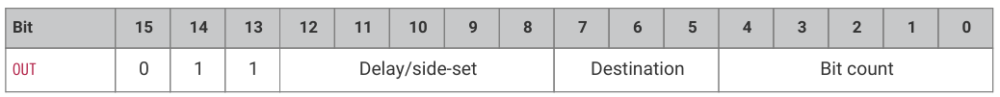

#### 11.4.5.2. Operation

Shift Bit count bits out of the Output Shift Register (OSR), and write those bits to Destination. Additionally, increase the output shift count by Bit count, saturating at 32.

* Destination:
  + 000: PINS
  + 001: X (scratch register X)
  + 010: Y (scratch register Y)
  + 011: NULL (discard data)
  + 100: PINDIRS
  + 101: PC
  + 110: ISR (also sets ISR shift counter to Bit count)
  + 111: EXEC (Execute OSR shift data as instruction)
* Bit count: how many bits to shift out of the OSR. 1…32 bits, 32 is encoded as 00000

A 32-bit value is written to Destination: the lower Bit count bits come from the OSR, and the remainder are zeroes. This value  is  the  least  significant  Bit  count  bits  of  the  OSR  if  SHIFTCTRL_OUT_SHIFTDIR  is  to  the  right,  otherwise  it  is  the  most significant bits.

PINS and PINDIRS use the OUT pin mapping, as described in Section 11.5.6.

If automatic pull is enabled, the OSR is automatically refilled from the TX FIFO if the pull threshold, SHIFTCTRL_PULL_THRESH, is reached. The output shift count is simultaneously cleared to 0. In this case, the OUT will stall if the TX FIFO is empty, but otherwise still executes in one cycle. The specifics are given in Section 11.5.4.

OUT EXEC allows instructions to be included inline in the FIFO datastream. The OUT itself executes on one cycle, and the instruction from the OSR is executed on the next cycle. There are no restrictions on the types of instructions which can be executed by this mechanism. Delay cycles on the initial OUT are ignored, but the executee may insert delay cycles as normal.

OUT PC behaves as an unconditional jump to an address shifted out from the OSR.

(和訳)

出力シフトレジスタ(OSR)からビットカウントビットをシフトし、それらのビットをデスティネーションに書き込む。さらに、出力シフトカウントをビットカウントずつ増やし、32 で飽和させる。

* デスティネーション: 
  + 000: PINS
  + 001: X(スクラッチレジスタ X)
  + 010: 010: Y(スクラッチレジスタ Y)
  + 011: NULL(データ破棄)
  + 100: PINDIRS
  + 101: PC
  + 110: ISR (ISR シフトカウンタもビットカウントにセット)
  + 111: EXEC (OSR シフトデータを命令として実行)
* ビット数: OSR から何ビットシフトするか。1...32 ビット、32 は 00000 としてエンコードされる。

32 ビットの値が Destination に書き込まれます。Bit カウントの下位ビットが OSR から取り出され、残りは 0 です。この値は、SHIFTCTRL_OUT_SHIFTDIR が右の場合は OSR の最下位ビット、それ以外の場合は最上位ビットになります。

PINS と PINDIRS はセクション 11.5.6 で説明される OUT ピンマッピングを使用する。

自動プルがイネーブルの場合、プルスレッショルド(SHIFTCTRL_PULL_THRESH)に達すると、OSR は自動的に TX FIFO から補充されます。この場合、TX FIFO が空であれば OUT はストールするが、そうでなければ 1 サイクルで実行される。詳細はセクション 11.5.4 に記載されている。

OUT EXEC では、FIFO データストリームにインラインで命令を含めることができる。OUT 自体は 1 サイクルで実行され、OSR からの命令は次のサイクルで実行される。このメカニズムで実行できる命令の種類に制限はない。最初の OUT の遅延サイクルは無視されるが、実行者は通常通り遅延サイクルを挿入することができる。

OUT PC は OSR からシフトアウトされたアドレスへの無条件ジャンプとして動作する。

#### 11.4.5.3. Assembler Syntax

```
out <destination>, <bit_count>
```

where:

<description>

||<destination>||One of the destinations specified above.
||<bit_count>||A value (see Section 11.3.2) specifying the number of bits to shift (valid range 1-32).
</description>

### 11.4.6. PUSH

#### 11.4.6.1. Encoding

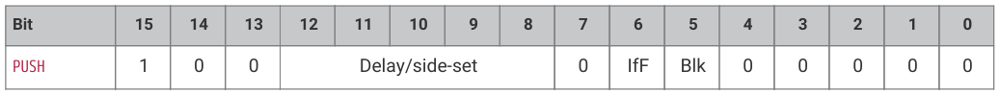

#### 11.4.6.2. Operation

Push the contents of the ISR into the RX FIFO, as a single 32-bit word. Clear ISR to all-zeroes.

* IfFull: If 1, do nothing unless the total input shift count has reached its threshold, SHIFTCTRL_PUSH_THRESH (the same as for autopush; see Section 11.5.4).
* Block: If 1, stall execution if RX FIFO is full.

PUSH  IFFULL helps to make programs more compact, like autopush. It is useful in cases where the  IN would stall at an inappropriate time if autopush were enabled, e.g. if the state machine is asserting some external control signal at this point.

The PIO assembler sets the Block bit by default. If the Block bit is not set, the PUSH does not stall on a full RX FIFO, instead continuing immediately to the next instruction. The FIFO state and contents are unchanged when this happens. The ISR is still cleared to all-zeroes, and the FDEBUG_RXSTALL flag is set (the same as a blocking PUSH or autopush to a full RX FIFO) to indicate data was lost.

>  NOTE The  operation  of  the  PUSH  instruction  is  undefined  when  SM0_SHIFTCTRL.FJOIN_RX_PUT  or  FJOIN_RX_GET  is set --- see Section 11.4.8 and Section 11.4.9 for details of the PUT and GET instruction which can be used in this state.

ISR の内容を 1 つの 32 ビットワードとして RX FIFO にプッシュする。ISR をゼロクリアする。

* IfFull: 1 の場合、総入力シフトカウントがしきい値 SHIFTCTRL_PUSH_THRESH に達しない限り何もしない(自動プッシュの場合と同じ。)
* ブロック:  ブロック: 1 の場合、RX FIFO が満杯になると実行を停止する。

PUSH IFFULL は、autopush のようにプログラムをよりコンパクトにするのに役立つ。オートプッシュを有効にすると、IN が不適切なタイミングでストールしてしまうような場合、例えば、ステートマシンがこの時点で何らかの外部制御信号をアサートしているような場合に有用である。

PIO アセンブラはデフォルトで Block ビットを設定する。Block ビットが設定されていない場合、PUSH は RX FIFO が満杯でもストールせず、すぐに次の命令に進みます。この場合、FIFO の状態と内容は変更されない。ISR はゼロクリアされ、FDEBUG_RXSTALL フラグがセットされ(ブロッキング PUSH または満杯の RX FIFO への自動 PUSH と同じ)、データが失われたことを示します。

> 注: SM0_SHIFTCTRL.FJOIN_RX_PUT または FJOIN_RX_GET が設定されている場合の PUSH 命令の動作は未定義である。


#### 11.4.6.3. Assembler Syntax

```
push (iffull) 
push (iffull) block 
push (iffull) noblock 
```

where:

<description>

||iffull||Equivalent to IfFull == 1 above. i.e. the default if this is not specified is IfFull == 0.

上記の IfFull==1 と同じ。つまり、これが指定されない場合のデフォルトは IfFull==0 である。
||block ||Equivalent to Block == 1 above. This is the default if neither block nor noblock is specified.

上記の Block == 1 と同じ。これは、block も noblock も指定されていない場合のデフォルトである。
||noblock||Equivalent to Block == 0 above.
</description>

### 11.4.7. PULL

#### 11.4.7.1. Encoding

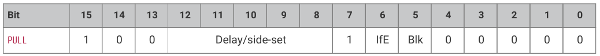

#### 11.4.7.2. Operation

Load a 32-bit word from the TX FIFO into the OSR.

* IfEmpty: If 1, do nothing unless the total output shift count has reached its threshold, SHIFTCTRL_PULL_THRESH (the same as for autopull; see Section 11.5.4).
* Block: If 1, stall if TX FIFO is empty. If 0, pulling from an empty FIFO copies scratch X to OSR.

Some  peripherals  (UART,  SPI,  etc.)  should  halt  when  no  data  is  available,  and  pick  it  up  as  it  comes  in;  others  (I2S) should  clock  continuously,  and  it  is  better  to  output  placeholder  or  repeated  data  than  to  stop  clocking.  This  can  be achieved with the Block parameter.

A  non-blocking  PULL  on  an  empty  FIFO  has  the  same  effect  as  MOV  OSR,  X.  The  program  can  either  preload  scratch register X with a suitable default, or execute a MOV X, OSR after each PULL NOBLOCK, so that the last valid FIFO word will be recycled until new data is available.

PULL IFEMPTY is useful if an OUT with autopull would stall in an inappropriate location when the TX FIFO is empty. IfEmpty permits some of the same program simplifications as autopull: for example, the elimination of an outer loop counter.  However, the stall occurs at a controlled point in the program.

>  NOTE When autopull is enabled, any PULL instruction is a no-op when the OSR is full, so that the PULL instruction behaves as a barrier. OUT NULL, 32 can be used to explicitly discard the OSR contents. See Section 11.5.4.2 for more detail.

(和訳)

TX FIFO から OSR に 32 ビットワードをロードする。

* IfEmpty:  1 の場合、 総出力シフトカウントがしきい値 SHIFTCTRL_PULL_THRESH に達しない限り、何もしません (オートプルの場合と同じ。)
* Block:  1 の場合、TX FIFO が空の場合にストールする。0 の場合、空の FIFO からプルするとスクラッチ X が OSR にコピーされる。

いくつかのペリフェラル(UART、SPI など)は、データが利用できないときに停止し、データが入ってきたときにそれを拾うべきである。 これは Block パラメータで実現できる。

プログラムは、スクラッチレジスタ X を適切なデフォルト値でプリロードするか、 または PULL NOBLOCK のたびに `MOV X, OSR` を実行して、 最後の有効な FIFO ワードを、 新しいデータが利用可能になるまで再利用することができます。

PULL IFEMPTY は、TX FIFO が空のときに、自動プル付きの OUT が不適切な位置でストールする場合に便利です。IfEmpty を使用すると、オートプルと同じようにプログラムを簡略化できます。 ただし、ストールはプログラム内の制御されたポイントで発生する。

> 注: オートプルが有効になっている場合、OSR が一杯になると PULL 命令は no-op となり、PULL 命令はバリアとして動作する。OUT NULL、32 を使用すると、OSR の内容を明示的に破棄できます。詳細はセクション 11.5.4.2 を参照。

#### 11.4.7.3. Assembler Syntax

```
pull (ifempty) 
pull (ifempty) block 
pull (ifempty) noblock
```

where:

<description>

||ifempty||Equivalent to IfEmpty == 1 above. i.e. the default if this is not specified is IfEmpty == 0.

上記の IfEmpty == 1 と同じ。つまり、この指定がない場合のデフォルトは IfEmpty == 0 である。
||block||Equivalent to Block == 1 above. This is the default if neither block nor noblock is specified.

上記の Block == 1 と同じ。これは、block も noblock も指定されていない場合のデフォルトである。
||noblock||Equivalent to Block == 0 above.
</description>

### 11.4.8. MOV (to RX)

#### 11.4.8.1. Encoding

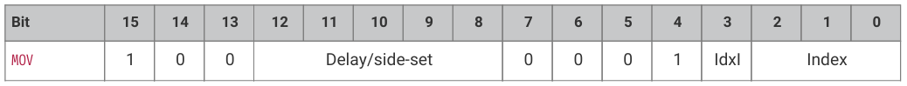

#### 11.4.8.2. Operation

Write the ISR to a selected RX FIFO entry. The state machine can write the RX FIFO entries in any order, indexed either by the Y register, or an immediate Index in the instruction. Requires the SHIFTCTRL_FJOIN_RX_PUT configuration field to be set, otherwise its operation is undefined. The FIFO configuration can be specified for the program via the .fifo directive (see pioasm_fifo).

If  IdxI  (index  by  immediate)  is  set,  the  RX  FIFO's  registers  are  indexed  by  the  two  least-significant  bits  of  the  Index operand. Otherwise, they are indexed by the two least-significant bits of the Y register. When IdxI is clear, all non-zero values of Index are reserved encodings, and their operation is undefined.

When only SHIFTCTRL_FJOIN_RX_PUT is set (in SM0_SHIFTCTRL through SM3_SHIFTCTRL), the system can also read the RX FIFO  registers  with  random  access  via  RXF0_PUTGET0  through  RXF0_PUTGET3  (where  RXFx  indicates  which  state machine's FIFO is being accessed). In this state, the FIFO register storage is repurposed as status registers, which the state machine can update at any time and the system can read at any time. For example, a quadrature decoder program could maintain the current step count in a status register at all times, rather than pushing to the RX FIFO and potentially blocking.

When  both  SHIFTCTRL_FJOIN_RX_PUT  and  SHIFTCTRL_FJOIN_RX_GET  are  set,  the  system  can  no  longer  access  the  RX  FIFO storage registers, but the state machine can now put/get the registers in arbitrary order, allowing them to be used as additional scratch storage.

>  NOTE The RX FIFO storage registers have only a single read port and write port, and access through each port is assigned to only one of (system, state machine) at any time.

選択した RX FIFO エントリに ISR を書き込む。ステートマシンは、Y レジスタまたは命令内の即時インデックスによってインデックス付けされた RX FIFO エントリを任意の順序で書き込むことができます。SHIFTCTRL_FJOIN_RX_PUT 設定フィールドが設定されている必要があります。FIFO コンフィギュレーションは、.fifo 指令(pioasm_fifo を参照)を介してプログラムに指定することができます。

IdxI(即値によるインデックス)が設定されている場合、RX FIFO のレジスタは Index オペランドの最下位ビット 2 つによってインデックス付けされます。そうでない場合は、Y レジスタの最下位ビット 2 つによってインデックスが付けられます。IdxI がクリアされている場合、Index の 0以外の値は全て予約エンコーディングであり、その動作は未定義である。

SHIFTCTRL_FJOIN_RX_PUT のみが設定されている場合(SM0_SHIFTCTRL ～ SM3_SHIFTCTRL 内)、システムは RXF0_PUTGET0 ～ RXF0_PUTGET3(ここで RXFx はどのステートマシンの FIFO にアクセスしているかを示す)を介してランダムアクセスで RX FIFO レジスタを読み出すこともできる。この状態では、FIFO レジスタストレージはステータスレジスタとして再利用され、ステートマシンはいつでも更新でき、システムはいつでも読み出すことができます。例えば、矩形波デコーダプログラムは、RX FIFO にプッシュしてブロッキングさせるのではなく、ステータスレジスタに現在のステップカウントを常に保持することができる。

SHIFTCTRL_FJOIN_RX_PUT と SHIFTCTRL_FJOIN_RX_GET の両方が設定されると、システムは RX FIFO ストレージレジスタにアクセスできなくなりますが、ステートマシンはレジスタを任意の順序で PUT/GET できるようになり、追加のスクラッチストレージとして使用できるようになります。

> 注: RX FIFO ストレージレジスタには、1 つのリードポートとライトポートのみがあり、各ポートからのアクセスは、常に(システム、ステートマシンの)一方にのみ割り当てられます。

#### 11.4.8.3. Assembler Syntax

```
mov rxfifo[y], isr 
mov rxfifo[<index>], isr 
```

where:

<description>
||y||The literal token "y", indicating the RX FIFO entry is indexed by the Y register.

リテラルトークン "y" は、 RX FIFO エントリが Y レジスタによってインデックス付けされていることを示す。
||<index>||A value (see Section 11.3.2) specifying the RX FIFO entry to write (valid range 0-3).

書き込む RX FIFO エントリを指定する値(セクション 11.3.2 参照)(有効範囲 0～3)。
</description>

### 11.4.9. MOV (from RX)

#### 11.4.9.1. Encoding

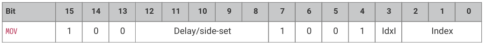

#### 11.4.9.2. Operation

Read the selected RX FIFO entry into the OSR. The PIO state machine can read the FIFO entries in any order, indexed either by the Y register, or an immediate Index in the instruction. Requires the SHIFTCTRL_FJOIN_RX_GET configuration field to be set, otherwise its operation is undefined.

If  IdxI  (index  by  immediate)  is  set,  the  RX  FIFO's  registers  are  indexed  by  the  two  least-significant  bits  of  the  Index operand. Otherwise, they are indexed by the two least-significant bits of the Y register. When IdxI is clear, all non-zero values of Index are reserved encodings, and their operation is undefined.

When  only  SHIFTCTRL_FJOIN_RX_GET  is  set,  the  system  can  also  write  the  RX  FIFO  registers  with  random  access  via RXF0_PUTGET0 through RXF0_PUTGET3 (where RXFx indicates which state machine's FIFO is being accessed). In this state, the RX FIFO register storage is repurposed as additional configuration registers, which the system can update at any time and the state machine can read at any time. For example, a UART TX program might use these registers to configure the number of data bits, or the presence of an additional stop bit.

When  both  SHIFTCTRL_FJOIN_RX_PUT  and  SHIFTCTRL_FJOIN_RX_GET  are  set,  the  system  can  no  longer  access  the  RX  FIFO storage registers, but the state machine can now put/get the registers in arbitrary order, allowing them to be used as additional scratch storage.

>  NOTE The RX FIFO storage registers have only a single read port and write port, and access through each port is assigned to only one of (system, state machine) at any time.

(和訳)

選択された RX FIFO エントリを OSR に読み込む。PIO ステートマシンは、Y レジスタまたは命令内の即時インデックスをインデックスとして、 任意の順序で FIFO エントリを読み出すことができます。設定フィールドが設定されている必要があり、そうでなければ動作は未定義です。

IdxI(即時インデックス)が設定されている場合、RX FIFO のレジスタは Index オペランドの最下位ビット 2 つによってインデックス付けされます。そうでない場合は、Y レジスタの最下位ビット 2 つによってインデックスが付けられます。IdxI がクリアされている場合、Index の 0以外の値は全て予約エンコーディングであり、その動作は未定義である。

SHIFTCTRL_FJOIN_RX_GET のみが設定されている場合、システムは RXF0_PUTGET0～RXF0_PUTGET3(ここで RXFx はどのステートマシンの FIFO にアクセスしているかを示す)を介したランダムアクセスで RX FIFO レジスタを書き込むこともできる。このステートでは、RX FIFO レジスタストレージは追加コンフィギュレーションレジスタとして再利用され、システムはこれらをいつでも更新でき、ステートマシンはこれらをいつでも読み出しできます。例えば、UART TX プログラムはこれらのレジスタを使用してデータビット数や追加ストップビットの有無を設定することができます。

SHIFTCTRL_FJOIN_RX_PUT と SHIFTCTRL_FJOIN_RX_GET の両方が設定されると、システムは RX FIFO ストレージレジスタにアクセスできなくなります。

> 注: RX FIFO ストレージレジスタには 1 つの読み出しポートと書き込みポートのみがあり、各ポートからのアクセスは常に 1 つ(システム、ステートマシン)のみに割り当てられる。

#### 11.4.9.3. Assembler Syntax

```
mov osr, rxfifo[y] 
mov osr, rxfifo[<index>] 
```

where:

<description>
||y||The literal token "y", indicating the RX FIFO entry is indexed by the Y register.

リテラルトークン  "y" は、RX FIFO エントリが Y レジスタによってインデックス付けされていることを示す。
||<index>||A value (see Section 11.3.2) specifying the RX FIFO entry to read (valid range 0-3).

読み出す RX FIFO エントリを指定する値(セクション 11.3.2 を参照)(有効範囲0～3)。
</description>

### 11.4.10. MOV

#### 11.4.10.1. Encoding

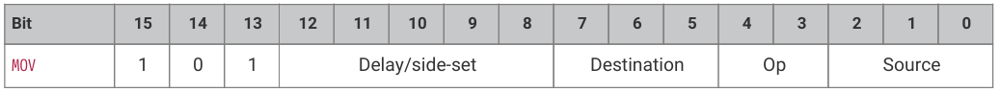

#### 11.4.10.2. Operation

Copy data from Source to Destination.

* Destination:
  + 000: PINS (Uses same pin mapping as OUT)
  + 001: X (Scratch register X)
  + 010: Y (Scratch register Y)
  + 011: PINDIRS (Uses same pin mapping as OUT)
  + 100: EXEC (Execute data as instruction)
  + 101: PC
  + 110: ISR (Input shift counter is reset to 0 by this operation, i.e. empty)
  + 111: OSR (Output shift counter is reset to 0 by this operation, i.e. full)
* Operation:
  + 00: None
  + 01: Invert (bitwise complement)
  + 10: Bit-reverse
  + 11: Reserved
* Source:
  + 000: PINS (Uses same pin mapping as IN)
  + 001: X
  + 010: Y
  + 011: NULL
  + 100: Reserved
  + 101: STATUS
  + 110: ISR
  + 111: OSR

MOV PC causes an unconditional jump. MOV EXEC has the same behaviour as OUT EXEC (Section 11.4.5), and allows register contents  to  be  executed  as  an  instruction.  The  MOV  itself  executes  in  1  cycle,  and  the  instruction  in  Source  on  the  next cycle. Delay cycles on MOV EXEC are ignored, but the executee may insert delay cycles as normal.

The  STATUS  source  has  a  value  of  all-ones  or  all-zeroes,  depending  on  some  state  machine  status  such  as  FIFO full/empty, configured by EXECCTRL_STATUS_SEL.

MOV  can  manipulate  the  transferred  data  in  limited  ways,  specified  by  the  Operation  argument.  Invert  sets  each  bit  in Destination to the logical NOT of the corresponding bit in Source, i.e. 1 bits become 0 bits, and vice versa. Bit reverse sets each bit n in Destination to bit 31 - n in Source, assuming the bits are numbered 0 to 31.

MOV dst, PINS reads pins using the IN pin mapping, masked to the number of bits specified by SHIFTCTRL_IN_COUNT. The LSB of  the  read  value  is  the  pin  indicated  by  PINCTRL_IN_BASE,  and  each  successive  bit  comes  from  a  higher-numbered  pin, wrapping after 31. Result bits greater than the width specified by SHIFTCTRL_IN_COUNT configuration are 0.

MOV PINDIRS, src is not supported on PIO version 0.

(和訳)

ソースからデスティネーションにデータをコピーする。

* デスティネーション: 
  + 000: PINS (OUT と同じピンマッピングを使用)
  + 001: X(スクラッチレジスタ X)
  + 010: 010: Y(スクラッチレジスタ Y)
  + 011: PINDIRS (OUT と同じピンマッピング)
  + 100: EXEC (データを命令として実行)
  + 101: PC
  + 110: ISR(この操作で入力シフトカウンタが 0 にリセットされる。)
  + 111: OSR(この操作で出力シフトカウンタが 0 にリセットされる。)
* 動作
  + 00: なし
  + 01: 反転(ビットごとの補数)
  + 10: ビット反転
  + 11: 予約
* ソース
  + 000: PINS(IN と同じピンマッピングを使用)
  + 001: X
  + 010: Y
  + 011: NULL
  + 100: 予約
  + 101: ステータス
  + 110: ISR
  + 111: OSR

MOV PC は無条件ジャンプを引き起こす。MOV EXEC は OUT EXEC(セクション 11.4.5)と同じ動作をし、レジスタの内容を命令として実行することができる。 MOV 自体は 1 サイクルで実行され、ソース内の命令は次のサイクルで実行される。MOV EXEC の遅延サイクルは無視されるが、実行者は通常通り遅延サイクルを挿入することができる。

STATUS ソースは、EXECCTRL_STATUS_SEL で設定された FIFO のフル/エンプティなどのステートマシンの状態に応じて、オール 1 またはオール 0 の値を持つ。

MOV は、Operation 引数で指定された限られた方法で転送データを操作することができる。 すなわち、1 ビットは 0 ビットになり、逆も同様です。ビット反転は、デスティネーションの各ビット n をソースのビット 31-n に設定する。

MOV dst, PINS は、SHIFTCTRL_IN_COUNT で指定されたビット数にマスクされた IN ピンマッピングを使用してピンを読み出します。読み出される値の LSB は PINCTRL_IN_BASE で示されるピンであり、連続する各ビットは 31 の後にラップして、より高い番号のピンから来ます。SHIFTCTRL_IN_COUNT コンフィギュレーションで指定された幅より大きい結果のビットは 0 になります。

MOV PINDIRS, src は PIO バージョン 0 ではサポートされていません。

#### 11.4.10.3. Assembler Syntax

```
mov <destination>, (op) <source>
```

where:

<description>
||<destination>||One of the destinations specified above.
||op||If present, is:

! or ~ for NOT (Note: this is always a bitwise NOT)

:: for bit reverse
||<source>||One of the sources specified above.
</description>

### 11.4.11. IRQ

#### 11.4.11.1. Encoding

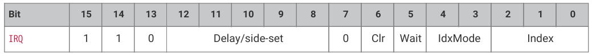

#### 11.4.11.2. Operation

Set or clear the IRQ flag selected by Index argument.

* Clear: if 1, clear the flag selected by Index, instead of raising it. If Clear is set, the Wait bit has no effect.
* Wait: if 1, halt until the raised flag is lowered again, e.g. if a system interrupt handler has acknowledged the flag.
* Index: specifies an IRQ index from 0-7. This IRQ flag will be set/cleared depending on the Clear bit.
* IdxMode: modify the behaviour if the Index field, either modifying the index, or indexing IRQ flags from a different PIO block:
  + 00: the three LSBs are used directly to index the IRQ flags in this PIO block.
  + 01 (PREV): the instruction references an IRQ flag from the next-lower-numbered PIO in the system, wrapping to the highest-numbered PIO if this is PIO0.
  + 10 (REL): the state machine ID (0…3) is added to the IRQ flag index, by way of modulo-4 addition on the two LSBs. For example, state machine 2 with a flag value of '0x11' will wait on flag 3, and a flag value of '0x13' will wait on flag 1. This allows multiple state machines running the same program to synchronise with each other.
  + 11 (NEXT): the instruction references an IRQ flag from the next-higher-numbered PIO in the system, wrapping to PIO0 if this is the highest-numbered PIO.

All IRQ flags 0-7 can be routed out to system level interrupts, on either of the PIO's two external interrupt request lines, configured by IRQ0_INTE and IRQ1_INTE.

The  modulo  addition  mode  (REL)  allows  relative  addressing  of  'IRQ'  and  'WAIT'  instructions,  for  synchronising  state machines which are running the same program. Bit 2 (the third LSB) is unaffected by this addition.

The  NEXT/PREV  modes  can  be  used  to  synchronise  between  state  machines  in  different  PIO  blocks.  If  these  state machines'  clocks  are  divided,  their  clock  dividers  must  be  the  same,  and  must  have  been  synchronised  by  writing CTRL.NEXTPREV_CLKDIV_RESTART  in  addition  to  the  relevant  NEXT_PIO_MASK/PREV_PIO_MASK  bits.  Note  that  the cross-PIO connection is severed between PIOs with different accessibility to Non-secure code, as per ACCESSCTRL.

If Wait is set, Delay cycles do not begin until after the wait period elapses.

(和訳)

引数 Index で選択された IRQ フラグをセットまたはクリアする。

* Clear: 1 の場合、Index で選択されたフラグを立てる代わりにクリアする。Clear が設定されている場合、Wait ビットは何の効果もない。
* Wait: 1 の場合、システム割り込みハンドラがフラグを確認した場合など、フラグが下がるまで停止する。
* Index: 0～7 の IRQ インデックスを指定します。この IRQ フラグは Clear ビットに依存してセット/クリアされる。
* IdxMode: Index フィールドの動作を変更し、インデックスを修正するか、別の PIO ブロックから IRQ フラグのインデックスを作成します: 
  + 00: 3 つの LSB は、この PIO ブロックの IRQ フラグのインデックスに直接使用される。
  + 01(PREV):  命令は、システム内の次の下位番号の PIO から IRQ フラグを参照し、PIO0 の場合は最上位番号の PIO に折り返す。
  + 10(REL): ステートマシン ID(0～3)が、2 つの LSB のモジュロ 4 加算によって IRQ フラグインデックスに加算される。例えば、フラグ値'0x11'のステートマシン 2 はフラグ 3 で待機し、フラグ値'0x13'はフラグ 1 で待機する。これにより、同じプログラムを実行している複数のステートマシンが互いに同期することができる。
  + 11(NEXT): この命令は、システム内で次に高い番号の PIO から IRQ フラグを参照し、これが最も高い番号の PIO であれば PIO0 に折り返す。

すべての IRQ フラグ 0～7 は、IRQ0_INTE と IRQ1_INTE で設定された PIO の 2 つの外部割り込み要求ラインのいずれかで、システムレベルの割り込みにルーティングすることができます。

モジュロ加算モード(REL)は、同じプログラムを実行しているステートマシンを同期させるために、 "IRQ" と "WAIT" 命令の相対アドレッシングを可能にする。ビット 2(3 番目の LSB)はこの加算の影響を受けない。

NEXT/PREV モードは、異なる PIO ブロック内のステートマシン間の同期に使用できる。 これらのステートマシンのクロックが分周されている場合、それらのクロック分周器は同じでなければならず、関連する NEXT_PIO_MASK/PREV_PIO_MASK ビットに加えて CTRL.NEXTPREV_CLKDIV_RESTART を書き込むことによって同期化されていなければならない。 クロス PIO 接続は、ACCESSCTRL に従って、非セキュアコードへのアクセス性が異なる PIO 間で切断されることに注意。

Wait が設定されている場合、Delay サイクルは待機期間が経過するまで開始されない。

#### 11.4.11.3. Assembler Syntax

```
irq <irq_num> (prev, rel, next) 
irq set <irq_num> (prev, rel, next) 
irq nowait <irq_num> (prev, rel, next) 
irq wait <irq_num> (prev, rel, next) 
irq clear <irq_num> (prev, rel, next) 
```

where:

<description>
||<irq_num> (rel)||A value (see Section 11.3.2) specifying The IRQ number to wait on (0-7). If rel is present, then the actual IRQ number used is calculating by replacing the low two bits of the IRQ number (irq_num10) with the low two bits of the sum (irq_num10 + sm_num10) where sm_num10 is the state machine number.

待機する IRQ 番号(0-7)を指定する値(セクション 11.3.2 参照)。rel が存在する場合、実際に使用される IRQ 番号は、IRQ 番号(irq_num10)の下位2 ビットを和(irq_num10 + sm_num10)の下位2 ビット(sm_num10 はステートマシン番号)に置き換えて計算される。
||irq||Set the IRQ without waiting.
||irq set||Set the IRQ without waiting.
||irq nowait||Set the IRQ without waiting.
||irq wait||Set the IRQ and wait for it to be cleared before proceeding.
||irq clear||Clear the IRQ.
</description>

### 11.4.12. SET

#### 11.4.12.1. Encoding


#### 11.4.12.2. Operation

Write immediate value Data to Destination.

* Destination:
  + 000: PINS
  + 001: X (scratch register X) 5 LSBs are set to Data, all others cleared to 0.
  + 010: Y (scratch register Y) 5 LSBs are set to Data, all others cleared to 0.
  + 011: Reserved
  + 100: PINDIRS
  + 101: Reserved
  + 110: Reserved
  + 111: Reserved
* Data: 5-bit immediate value to drive to pins or register.

This can be used to assert control signals such as a clock or chip select, or to initialise loop counters. As Data is 5 bits in size, scratch registers can be SET to values from 0-31, which is sufficient for a 32-iteration loop.

The  mapping  of  SET  and  OUT  onto  pins  is  configured  independently.  They  may  be  mapped  to  distinct  locations,  for example if one pin is to be used as a clock signal, and another for data. They may also be overlapping ranges of pins: a UART transmitter might use SET to assert start and stop bits, and OUT instructions to shift out FIFO data to the same pins.

即値の書き込みデータをデスティネーションへ

* デスティネーション
  + 000: PINS
  + 001: X (スクラッチレジスタ X) 5 LSB が Data にセットされ、その他は 0 にクリアされる。
  + 010: 010: Y(スクラッチレジスタ Y) 5 LSB が Data に設定され、その他は 0 にクリアされる。
  + 011: 予約
  + 100: PINDIRS
  + 101: 予約
  + 110: 予約
  + 111: 予約
* データ: ピンまたはレジスタにドライブする 5 ビットの即時値。

これは、クロックやチップセレクトのような制御信号をアサートしたり、ループカウンタを初期化するために使用できる。Data は 5 ビットなので、スクラッチレジスタを 0～31 の値に SET することができ、これは 32 回繰り返しのループには十分である。

SET と OUT のピンへのマッピングは独立して設定される。 例えば、1 つのピンをクロック信号として使用し、もう 1 つのピンをデータ信号として使用する場合、これらのピンを別々の場所にマッピングすることができます。UART トランスミッタは、SET を使用してスタートビットとストップビットをアサートし、OUT 命令を使用して FIFO データを同じピンにシフトアウトする。

#### 11.4.12.3. Assembler Syntax

```
set <destination>, <value>
```

where:

<description>
||<destination>||Is one of the destinations specified above.

上記で指定された目的地の 1 つ。
||<value>||The value (see Section 11.3.2) to set (valid range 0-31).

設定する値(セクション 11.3.2 参照)(有効範囲 0-31)。
</description>

## 11.5. Functional Details

### 11.5.1. Side-set

Side-set is a feature that allows state machines to change the level or direction of up to 5 pins, concurrently with the main execution of the instruction.

One  example  where  this  is  necessary  is  a  fast  SPI  interface:  here  a  clock  transition  (toggling  1→0  or  0→1)  must  be simultaneous with a data transition, where a new data bit is shifted from the OSR to a GPIO. In this case an OUT with a side-set would achieve both of these at once.

This makes the timing of the interface more precise, reduces the overall program size (as a separate SET instruction is not needed to toggle the clock pin), and also increases the maximum frequency the SPI can run at.

Side-set also makes GPIO mapping much more flexible, as its mapping is independent from SET. The example I2C code allows  SDA  and  SCL  to  be  mapped  to  any  two  arbitrary  pins,  if  clock  stretching  is  disabled.  Normally,  SCL  toggles  to synchronise data transfer, and SDA contains the data bits being shifted out. However, some particular I2C sequences such as Start and Stop line conditions, need a fixed pattern to be driven on SDA as well as SCL. The mapping I2C uses to achieve this is:

* Side-set → SCL
* OUT → SDA
* SET → SDA

This lets the state machine serve the two use cases of data on SDA and clock on SCL, or fixed transitions on both SDA and SCL, while still allowing SDA and SCL to be mapped to any two GPIOs of choice.

The side-set data is encoded in the Delay/side-set field of each instruction. Any instruction can be combined with side- set, including instructions which write to the pins, such as  OUT  PINS or  SET  PINS. Side-set's pin mapping is independent from OUT and SET mappings, though it may overlap. If side-set and an OUT or SET write to the same pin simultaneously, the side-set data is used.

>  NOTE If an instruction stalls, the side-set still takes effect immediately.

サイドセットは、ステートマシンが命令のメイン実行と同時に最大 5 つのピンのレベルまたは方向を変更できる機能である。

この機能が必要な例として、高速 SPI インターフェイスがあります。ここでは、クロック遷移(1→0 または 0→1 のトグル)とデータ遷移(新しいデータビットが OSR から GPIO にシフトされる)を同時に行う必要があります。この場合、サイドセットを持つ OUT は、これらの両方を一度に達成することになります。

これにより、インターフェイスのタイミングがより正確になり、プログラム全体のサイズが小さくなります(クロックピンを切り替えるために別の SET 命令が必要ないため)。

また、サイドセットは SET から独立しているため、GPIO マッピングの柔軟性も向上します。サンプルの I2C コードでは、クロックストレッチを無効にすれば、SDA と SCL を任意の 2 つのピンにマッピングできます。 通常、SCL はデータ転送を同期させるためにトグルし、SDA はシフトアウトされるデータビットを含む。しかし、スタートとストップのような特定の I2C シーケンスでは、SCL だけでなく SDA も固定パターンで駆動する必要があります。I2C がこれを実現するために使用するマッピングは以下の通りである: 

* Side-set → SCL
* OUT → SDA
* SET → SDA

これにより、ステートマシンは SDA 上のデータと SCL 上のクロック、または SDA と SCL の両方での固定遷移という 2 つの使用ケースに対応し、同時に SDA と SCL を任意の 2 つの GPIO にマッピングすることができます。

サイドセットデータは各命令の Delay/side-set フィールドにエンコードされます。OUT PINS や SET PINS のようにピンに書き込む命令を含め、どの命令もサイドセットと組み合わせることができます。side-set のピンマッピングは OUT や SET のマッピングとは独立していますが、重複する場合があります。サイドセットと OUT または SET が同時に同じピンに書き込む場合、サイドセットのデータが使用されます。

> 注: 命令がストールした場合でも、サイドセットは直ちに有効になります。

```
1 .program spi_tx_fast
2 .side_set 1
3
4 loop:
5     out pins, 1  side 0
6     jmp loop     side 1
```

The  spi_tx_fast example shows two benefits of this: data and clock transitions can be more precisely co-aligned, and programs can be made faster overall, with an output of one bit per two system clock cycles in this case. Programs can also be made smaller.

There are four things to configure when using side-set:

* The number of MSBs of the Delay/side-set field to use for side-set rather than delay. This is configured by PINCTRL_SIDESET_COUNT. If this is set to 5, delay cycles are not available. If set to 0, no side-set will take place.
* Whether to use the most significant of these bits as an enable. Side-set takes place on instructions where the enable is high. If there is no enable bit, every instruction on that state machine will perform a side-set, if SIDESET_COUNT is nonzero. This is configured by EXECCTRL_SIDE_EN.
* The GPIO number to map the least-significant side-set bit to. Configured by PINCTRL_SIDESET_BASE.
* Whether side-set writes to GPIO levels or GPIO directions. Configured by EXECCTRL_SIDE_PINDIR

In the above example, we have only one side-set data bit, and every instruction performs a side-set, so no enable bit is required. SIDESET_COUNT would be 1, SIDE_EN would be false. SIDE_PINDIR would also be false, as we want to drive the clock high and low, not high- and low-impedance. SIDESET_BASE would select the GPIO the clock is driven from.

spi_tx_fast の例では、この 2 つの利点が示されている。データとクロックの遷移をより正確に整列させることができ、プログラムを全体的に高速化できる。また、プログラムをより小さくすることもできる。

side-set を使用する際に設定すべきことは 4 つある: 

* 遅延ではなくサイドセットに使用する Delay/side-set フィールドの MSB 数。これは PINCTRL_SIDESET_COUNT で設定する。これが 5 に設定された場合、ディレイサイクルは使用できません。0 に設定された場合、サイドセットは行われません。
* これらのビットの最上位をイネーブルとして使用するかどうか。サイドセットは、イネーブルが High の命令で行われる。イネーブルビットがない場合、SIDESET_COUNT が 0 でなければ、そのステートマシン上のすべての命令がサイドセットを実行する。これは EXECCTRL_SIDE_EN によって設定される。
* 最下位のサイドセットビットをマッピングする GPIO 番号。PINCTRL_SIDESET_BASE によって設定される。
* サイドセットが GPIO レベルまたは GPIO 方向に書き込むかどうか。EXECCTRL_SIDE_PINDIR によって設定される。

上記の例では、サイドセットデータビットが 1 つしかなく、すべての命令がサイドセットを実行するため、イネーブルビットは必要ない。SIDESET_COUNT は 1、SIDE_EN は偽となる。SIDE_PINDIR も偽となる。ハイインピーダンスとローインピーダンスではなく、クロックをハイとローで駆動したいからである。SIDESET_BASE はクロックが駆動される GPIO を選択する。

### 11.5.2. プログラムのラッピング

PIO  programs  often  have  an  "outer  loop":  they  perform  the  same  sequence  of  steps,  repetitively,  as  they  transfer  a stream of data between the FIFOs and the outside world. The square wave program from the introduction is a minimal example of this:

PIO プログラムは、多くの場合「外部ループ」を持っています。FIFO と外部との間でデータのストリームを転送する際に、同じ一連のステップを繰り返し実行します。冒頭の矩形波プログラムは、この最小限の例である: 

Pico Examples: https://github.com/raspberrypi/pico-examples/blob/master/pio/squarewave/squarewave.pio Lines 8 - 13

```
 8 .program squarewave
 9     set pindirs, 1   ; Set pin to output
10 again:
11     set pins, 1 [1]  ; Drive pin high and then delay for one cycle
12     set pins, 0      ; Drive pin low
13     jmp again        ; Set PC to label `again`
```

The  main  body  of  the  program  drives  a  pin  high,  and  then  low,  producing  one  period  of  a  square  wave.  The  entire program then loops, driving a periodic output. The jump itself takes one cycle, as does each set instruction, so to keep the high and low periods of the same duration, the set pins, 1 has a single delay cycle added, which makes the state machine idle for one cycle before executing the set pins, 0 instruction. In total, each loop takes four cycles. There are two frustrations here:

* The JMP takes up space in the instruction memory that could be used for other programs
* The extra cycle taken to execute the JMP ends up halving the maximum output rate

As  the  Program  Counter  (PC)  naturally  wraps  to  0  when  incremented  past  31,  we  could  solve  the  second  of  these  by filling the entire instruction memory with a repeating pattern of set pins, 1 and set pins, 0, but this is wasteful. State machines have a hardware feature, configured via their EXECCTRL control register, which solves this common case.

プログラム本体はピンをハイに、そしてローに駆動し、矩形波の 1 周期を生成する。 その後、プログラム全体がループし、周期的な出力を駆動します。ジャンプ自体には、各セット命令と同様に 1 サイクルがかかるため、High と Low の期間を同じに保つために、セットピン 1 には 1 サイクルの遅延サイクルが追加され、セットピン 0 命令を実行する前にステートマシンを 1 サイクルアイドル状態にします。合計で、各ループは 4 サイクルかかる。ここには 2 つの不満がある: 

* JMP は、他のプログラムに使用できるはずの命令メモリのスペースを占有する。
* JMP の実行にかかる余分なサイクルは、最大出力レートを半減させてしまう。

プログラムカウンタ(PC)は 31 を超えてインクリメントされると自然に 0 に折り返すので、命令メモリ全体をセットピン、1、セットピン、0 の繰り返しパターンで埋めれば、この 2 つ目を解決できるが、これは無駄が多い。ステートマシンには、このよくあるケースを解決する、EXECCTRL 制御レジスタを介して設定されるハードウェア機能がある。

Pico Examples: https://github.com/raspberrypi/pico-examples/blob/master/pio/squarewave/squarewave_wrap.pio Lines 12 - 20

```
12 .program squarewave_wrap
13 ; Like squarewave, but use the state machine's .wrap hardware instead of an
14 ; explicit jmp. This is a free (0-cycle) unconditional jump.
15
16     set pindirs, 1   ; Set pin to output
17 .wrap_target
18     set pins, 1 [1]  ; Drive pin high and then delay for one cycle
19     set pins, 0 [1]  ; Drive pin low and then delay for one cycle
20 .wrap
```

After executing an instruction from the program memory, state machines use the following logic to update PC:

1. If the current instruction is a JMP, and the Condition is true, set PC to the Target 
2. Otherwise, if PC matches EXECCTRL_WRAP_TOP, set PC to EXECCTRL_WRAP_BOTTOM 
3. Otherwise, increment PC, or set to 0 if the current value is 31.

The  .wrap_target  and  .wrap  assembly  directives  in  pioasm  are  essentially  labels.  They  export  constants  which  can  be written to the WRAP_BOTTOM and WRAP_TOP control fields, respectively:

プログラムメモリからの命令を実行した後、ステートマシンは以下のロジックで PC を更新する: 

1. 現在の命令が JMP で、コンディションが真の場合、PC をターゲットに設定する。
2. そうでない場合、PC が EXECCTRL_WRAP_TOP に一致すれば、PC を EXECCTRL_WRAP_BOTTOM に設定する。
3. そうでなければ、PC をインクリメントするか、現在の値が 31 であれば 0 に設定する。

pioasm の.wrap_target と.wrap アセンブリ指令は、基本的にラベルである。 これらは、それぞれ WRAP_BOTTOM と WRAP_TOP 制御フィールドに書き込める定数をエクスポートする: 

Pico Examples: https://github.com/raspberrypi/pico-examples/blob/master/pio/squarewave/generated/squarewave_wrap.pio.h

```
 1 // -------------------------------------------------- //
 2 // This file is autogenerated by pioasm; do not edit! //
 3 // -------------------------------------------------- //
 4
 5 #pragma once
 6
 7 #include "hardware/pio.h"
 8
 9 // --------------- //
10 // squarewave_wrap //
11 // --------------- //
12
13 #define squarewave_wrap_wrap_target 1
14 #define squarewave_wrap_wrap 2
15 #define squarewave_wrap_pio_version 0
16
17 static const uint16_t squarewave_wrap_program_instructions[] = {
18     0xe081, //  0: set    pindirs, 1
19             //     .wrap_target
20     0xe101, //  1: set    pins, 1                [1]
21     0xe100, //  2: set    pins, 0                [1]
22             //     .wrap
23 };
24
25 static const struct pio_program squarewave_wrap_program = {
26     .instructions = squarewave_wrap_program_instructions,
27     .length = 3,
28     .origin = -1,
29     .pio_version = squarewave_wrap_pio_version,
30     .used_gpio_ranges = 0x0
31 #endif
32 };
33
34 static inline pio_sm_config squarewave_wrap_program_get_default_config(uint offset) {
35     pio_sm_config c = pio_get_default_sm_config();
36     sm_config_set_wrap(&c, offset + squarewave_wrap_wrap_target, offset +
   squarewave_wrap_wrap);
37     return c;
38 }
```

This is raw output from the PIO assembler, pioasm, which has created a default pio_sm_config object containing the WRAP register values from the program listing. The control register fields could also be initialised directly.

>  NOTE WRAP_BOTTOM and WRAP_TOP are absolute addresses in the PIO instruction memory. If a program is loaded at an offset, the wrap addresses must be adjusted accordingly.

The squarewave_wrap example has delay cycles inserted, so that it behaves identically to the original squarewave program.

Thanks to program wrapping, these can now be removed, so that the output toggles twice as fast, while maintaining an even balance of high and low periods.

これは PIO アセンブラ pioasm からの生出力であり、プログラムリストから WRAP レジスタ値を含むデフォルトの pio_sm_config オブジェクトを生成している。制御レジスタフィールドは直接初期化することもできる。

> WRAP_BOTTOM と WRAP_TOP は、PIO 命令メモリの絶対アドレスである。プログラムがオフセットでロードされる場合、ラップアドレスはそれに応じて調整されなければならない。

squarewave_wrap の例には遅延サイクルが挿入されており、元の squarewave プログラムと同じように動作します。

プログラムラッピングのおかげで、これらを取り除くことができ、ハイとローの周期の均等なバランスを保ちながら、出力が 2 倍の速さでトグルするようになった。

Pico Examples: https://github.com/raspberrypi/pico-examples/blob/master/pio/squarewave/squarewave_fast.pio Lines 12 - 18

```
12 .program squarewave_fast
13 ; Like squarewave_wrap, but remove the delay cycles so we can run twice as fast.
14     set pindirs, 1   ; Set pin to output
15 .wrap_target
16     set pins, 1      ; Drive pin high
17     set pins, 0      ; Drive pin low
18 .wrap
```

### 11.5.3. FIFO Joining

By default, each state machine possesses a 4-entry FIFO in each direction: one for data transfer from system to state machine  (TX),  the  other  for  the  reverse  direction  (RX).  However,  many  applications  do  not  require  bidirectional  data transfer  between  the  system  and  an  individual  state  machine,  but  may  benefit  from  deeper  FIFOs:  in  particular,  high- bandwidth interfaces such as DPI. For these cases, SHIFTCTRL_FJOIN can merge the two 4-entry FIFOs into a single 8-entry FIFO.

デフォルトでは、各ステートマシンは、システムからステートマシンへのデータ転送用(TX)と、逆方向(RX)の各方向に 4 エントリの FIFO を持つ。 しかし、多くのアプリケーションでは、システムと個々のステートマシン間の双方向のデータ転送を必要としないが、より深い FIFO の恩恵を受けることがある: 特に DPI などの高帯域幅インターフェース。このような場合、SHIFTCTRL_FJOIN は 2 つの 4 エントリ FIFO を 1 つの 8 エントリ FIFO に統合することができる。

<figure>
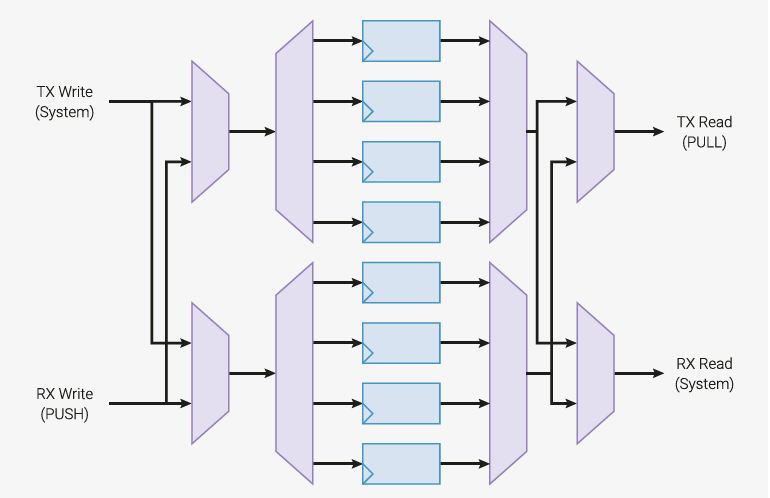
<figcaption>
Figure 47. Joinable dual FIFO. A pair of four-entry FIFOs, implemented with four data registers, a 1:4 decoder and a 4:1 multiplexer. Additional multiplexing allows write data and read data to cross between the TX and RX lanes, so that all 8 entries are accessible from both ports 

図 47. 結合可能なデュアル FIFO。つのデータレジスタ、1: 4 デコーダ、および 4: 1 マルチプレクサで実装された、4 エントリ FIFO のペア。マルチプレクサを追加することで、書き込みデータと読み出しデータが TX レーンと RX レーンの間で交差できるようになり、8 つのエントリすべてに両方のポートからアクセスできるようになります。
</figcaption>
</figure>

Another  example  is  a  UART:  because  the  TX/CTS  and  RX/RTS  parts  a  of  a  UART  are  asynchronous,  they  are implemented  on  two  separate  state  machines.  It  would  be  wasteful  to  leave  half  of  each  state  machine's  FIFO resources idle. The ability to join the two halves into just a TX FIFO for the TX/CTS state machine, or just an RX FIFO in the case of the RX/RTS state machine, allows full utilisation. A UART equipped with an 8-deep FIFO can be left alone for twice as long between interrupts as one with only a 4-deep FIFO.

When one FIFO is increased in size (from 4 to 8), the other FIFO on that state machine is reduced to zero. For example, if joining  to  TX,  the  RX  FIFO  is  unavailable,  and  any  PUSH  instruction  will  stall.  The  RX  FIFO  will  appear  both  RXFULL  and RXEMPTY in the FSTAT register. The converse is true if joining to RX: the TX FIFO is unavailable, and the TXFULL and TXEMPTY bits for this state machine will both be set in FSTAT. Setting both FJOIN_RX and FJOIN_TX makes both FIFOs unavailable.

8 FIFO entries is sufficient for 1 word per clock through the RP2350 system DMA, provided the DMA is not slowed by contention with other masters.

>  CAUTION Changing  FJOIN  discards  any  data  present  in  the  state  machine's  FIFOs.  If  this  data  is  irreplaceable,  it  must  be drained beforehand.

UART の TX/CTS と RX/RTS は非同期であるため、2 つの別々のステートマシンに実装されます。 それぞれのステートマシンの FIFO リソースの半分をアイドル状態にしておくのは無駄です。TX/CTS ステートマシンの場合は 2 つの半分を TX FIFO だけに、RX/RTS ステートマシンの場合は RX FIFO だけに結合できるので、フルに活用できます。8 ディープ FIFO を搭載した UART は、4 ディープ FIFO のみを搭載した UART に比べ、割り込みの間に 2 倍の時間放置することができます。

一方の FIFO のサイズが大きくなると(4 から 8 へ)、そのステートマシンのもう一方の FIFO はゼロになります。例えば、TX に参加する場合、RX FIFO は使用できず、どの PUSH 命令もストールする。 RX FIFO は FSTAT レジスタに RXFULL と RXEMPTY の両方で表示される。RX FIFO は使用できず、このステートマシンの TXFULL ビットと TXEMPTY ビットは共に FSTAT にセットされる。FJOIN_RX と FJOIN_TX の両方を設定すると、両方の FIFO が使用できなくなる。

8 FIFO エントリは、DMA が他のマスタとの競合によって遅くならない限り、RP2350 システム DMA を通して 1 クロックあたり 1 ワードで十分です。

> 注意 FJOIN を変更すると、ステートマシンの FIFO に存在するデータはすべて破棄される。 このデータが交換不可能な場合は、事前にドレインしなければならない。

### 11.5.4. Autopush and Autopull

With each OUT instruction, the OSR gradually empties, as data is shifted out. Once empty, it must be refilled: for example, a  PULL  transfers  one  word  of  data  from  the  TX  FIFO  to  the  OSR.  Similarly,  the  ISR  must  be  emptied  once  full.  One approach to this is a loop which performs a PULL after an appropriate amount of data has been shifted:

OUT 命令のたびに、データがシフトアウトされるため、OSR は徐々に空になります。例えば、PULL 命令で TX FIFO から OSR に 1 ワード分のデータが転送されます。 同様に、ISR も一度満杯になったら空にしなければならない。 これに対する 1 つのアプローチは、適切な量のデータがシフトされた後に PULL を実行するループです: 

```
 1 .program manual_pull
 2 .side_set 1 opt
 3
 4 .wrap_target
 5     set x, 2                   ; X = bit count - 2
 6     pull            side 1 [1]  ; Stall here if no TX data
 7 bitloop:
 8     out pins, 1     side 0 [1]  ; Shift out data bit and toggle clock low
 9     jmp x-- bitloop side 1 [1]  ; Loop runs 3 times
10     out pins, 1     side 0      ; Shift out last bit before reloading X
11 .wrap
```

This program shifts out 4 bits from each FIFO word, with an accompanying bit clock, at a constant rate of 1 bit per 4 cycles. When the TX FIFO is empty, it stalls with the clock high (noting that side-set still takes place on cycles where the instruction stalls).  Figure 48 shows how a state machine would execute this program.

このプログラムは、各 FIFO ワードから 4 ビットを、付随するビットクロックとともに、4 サイクルあたり 1 ビットの一定レートでシフトアウトする。TX FIFO が空になると、クロックがハイのままストールする(命令がストールするサイクルでもサイドセットは行われることに注意)。 図 48 は、ステートマシンがこのプログラムをどのように実行するかを示している。

<figure>
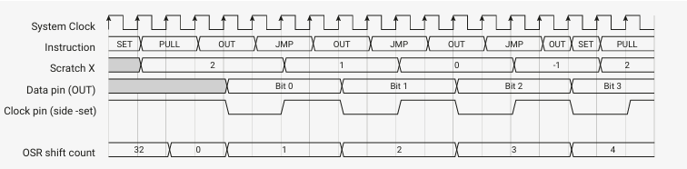
<figcaption>
Figure 48. Execution of manual_pull program. X is used as a loop counter. On each iteration, one data bit is shifted out, and the clock is asserted low, then high. A delay cycle on each instruction brings the total up to four cycles per iteration. After the third loop, a fourth bit is shifted out, and the state machine immediately returns to the start of the program to reload the loop counter and pull fresh data, while maintaining the 4 cycles/bit cadence.

図 48. manual_pull プログラムの実行。X はループカウンタとして使用される。各反復で、1 つのデータビットがシフトアウトされ、クロックがローアサートされ、次にハイアサートされる。各命令の遅延サイクルにより、反復ごとに合計 4 サイクルになる。3 回目のループの後、4 ビット目がシフトアウトされ、ステートマシンは直ちにプログラムの最初に戻り、4 サイクル/ビットのペースを維持しながら、ループカウンタを再ロードし、新しいデータを取り出します。
</figcaption>
</figure>

This program has some limitations:

* It occupies 5 instruction slots, but only 2 of these are immediately useful (out pins, 1 set 0 and … set 1), for outputting serial data and a clock.
* Throughput is limited to system clock over 4, due to the extra cycles required to pull in new data, and reload the loop counter.

This is a common type of problem for PIO, so each state machine has some extra hardware to handle it. State machines keep track of the total shift count OUT of the OSR and IN to the ISR, and trigger certain actions once these counters reach a programmable threshold.
* On an OUT instruction which reaches or exceeds the pull threshold, the state machine can simultaneously refill the OSR from the TX FIFO, if data is available.
* On an IN instruction which reaches or exceeds the push threshold, the state machine can write the shift result directly to the RX FIFO, and clear the ISR.

The manual_pull example can be rewritten to take advantage of automatic pull (autopull):

このプログラムにはいくつかの制限があります: 

* このプログラムは 5 つの命令スロットを占有するが、すぐに役立つのはシリアルデータとクロックを出力するための 2 つのみ(アウトピン、1 セット 0 と...セット 1)。
* スループットは、新しいデータを取り込み、ループカウンタを再ロードするために必要な余分なサイクルのため、システムクロックが 4以上に制限されます。

これは PIO にとってよくあるタイプの問題であるため、各ステートマシンはこれを処理するためのハードウェアをいくつか追加している。ステートマシンは、OSR からの OUT と ISR への IN の合計シフトカウントを追跡し、これらのカウンタがプログラム可能な閾値に達すると、特定のアクションをトリガします。
* プル閾値に達するかそれを超える OUT 命令では、ステートマシンは、データが利用可能であれば、同時に TX FIFO から OSR をリフィルすることができる。
* プッシュしきい値に達するかそれを超える IN 命令では、ステートマシンはシフト結果を直接 RX FIFO に書き込み、ISR をクリアすることができます。

manual_pull の例は、自動プル(autopull)を利用するように書き換えることができます: 

```
1 .program autopull
2 .side_set 1
3
4 .wrap_target
5     out pins, 1   side 0    [1]
6     nop           side 1    [1]
7 .wrap
```

This  is  shorter  and  simpler  than  the  original,  and  can  run  twice  as  fast,  if  the  delay  cycles  are  removed,  since  the hardware  refills  the  OSR  "for  free".  Note  that  the  program  does  not  determine  the  total  number  of  bits  to  be  shifted before the next pull; the hardware automatically pulls once the programmable threshold, SHIFCTRL_PULL_THRESH, is reached, so the same program could also shift out e.g. 16 or 32 bits from each FIFO word.

Finally,  note  that  the  above  program  is  not  exactly  the  same  as  the  original,  since  it  stalls  with  the  clock  output  low, rather  than  high.  We  can  change  the  location  of  the  stall,  using  the  PULL  IFEMPTY  instruction,  which  uses  the  same configurable threshold as autopull:

ハードウェアが OSR を 「ただで」補充するため、遅延サイクルが削除されれば、2 倍速く実行できます。 ハードウェアは、プログラム可能な閾値 SHIFCTRL_PULL_THRESH に達すると自動的にプルするので、同じプログラムで各 FIFO ワードから例えば 16 ビットまたは 32 ビットをシフトアウトすることもできます。

最後に、上記のプログラムは、クロック出力が High ではなく Low でストールするため、オリジナルと全く同じではないことに注意してください。 オートプルと同じ設定可能なスレッショルドを使用する PULL IFEMPTY 命令を使用して、ストールの場所を変更することができます: 

```
1 .program somewhat_manual_pull
2 .side_set 1
3
4 .wrap_target
5     out pins, 1   side 0    [1]
6     pull ifempty  side 1    [1]
7 .wrap
```

Below is a complete example (PIO program, plus a C program to load and run it) which illustrates autopull and autopush both  enabled  on  the  same  state  machine.  It  programs  state  machine  0  to  loopback  data  from  the  TX  FIFO  to  the  RX FIFO, with a throughput of one word per two clocks. It also demonstrates how the state machine will stall if it tries to OUT when both the OSR and TX FIFO are empty.

以下は、オートプルとオートプッシュの両方が同じステートマシンで有効になっている完全な例です(PIO プログラムと、それをロードして実行する C プログラム)。 この例では、ステートマシン 0 をプログラムして、TX FIFO から RX FIFO にデータをループバックさせ、2 クロックあたり 1 ワードのスループットを実現しています。また、OSR と TX FIFO の両方が空のときに OUT しようとすると、ステートマシンがストールすることも示している。

```
1 .program auto_push_pull
2
3 .wrap_target
4     out x, 32
5     in x, 32
6 .wrap
```

```
 1 #include "tb.h" // TODO this is built against existing sw tree, so that we get printf etc
 2
 3 #include "platform.h"
 4 #include "pio_regs.h"
 5 #include "system.h"
 6 #include "hardware.h"
 7
 8 #include "auto_push_pull.pio.h"
 9
10 int main()
11 {
12     tb_init();
13
14     // Load program and configure state machine 0 for autopush/pull with
15     // threshold of 32, and wrapping on program boundary. A threshold of 32 is
16     // encoded by a register value of 00000.
17     for (int i = 0; i < count_of(auto_push_pull_program); ++i)
18         mm_pio->instr_mem[i] = auto_push_pull_program[i];
19     mm_pio->sm[0].shiftctrl =
20         (1u << PIO_SM0_SHIFTCTRL_AUTOPUSH_LSB) |
21         (1u << PIO_SM0_SHIFTCTRL_AUTOPULL_LSB) |
22         (0u << PIO_SM0_SHIFTCTRL_PUSH_THRESH_LSB) |
23         (0u << PIO_SM0_SHIFTCTRL_PULL_THRESH_LSB);
24     mm_pio->sm[0].execctrl =
25         (auto_push_pull_wrap_target << PIO_SM0_EXECCTRL_WRAP_BOTTOM_LSB) |
26         (auto_push_pull_wrap << PIO_SM0_EXECCTRL_WRAP_TOP_LSB);
27
28     // Start state machine 0
29     hw_set_bits(&mm_pio->ctrl, 1u << (PIO_CTRL_SM_ENABLE_LSB + 0));
30
31     // Push data into TX FIFO, and pop from RX FIFO
32     for (int i = 0; i < 5; ++i)
33         mm_pio->txf[0] = i;
34     for (int i = 0; i < 5; ++i)
35         printf("%d\n", mm_pio->rxf[0]);
36
37     return 0;
38 }
```

Figure 49 shows how the state machine executes the example program. Initially the OSR is empty, so the state machine stalls on the first OUT instruction. Once data is available in the TX FIFO, the state machine transfers this into the OSR. On the  next  cycle,  the  OUT  can  execute  using  the  data  in  the  OSR  (in  this  case,  transferring  this  data  to  the  X  scratch register), and the state machine simultaneously refills the OSR with fresh data from the FIFO. Since every IN instruction immediately fills the ISR, the ISR remains empty, and IN transfers data directly from scratch X to the RX FIFO.

図 49 に、ステートマシンがサンプルプログラムを実行する様子を示します。最初は OSR が空なので、ステートマシンは最初の OUT 命令でストールします。TX FIFO でデータが利用可能になると、ステートマシンはこれを OSR に転送します。次のサイクルでは、OSR 内のデータを使用して OUT を実行することができ(この場合、このデータを X スクラッチレジスタに転送する)、ステートマシンは同時に FIFO から新しいデータを OSR に補充します。IN 命令はすべて即座に ISR を満たすため、ISR は空のままとなり、IN はスクラッチ X から RX FIFO に直接データを転送します。

<figure>
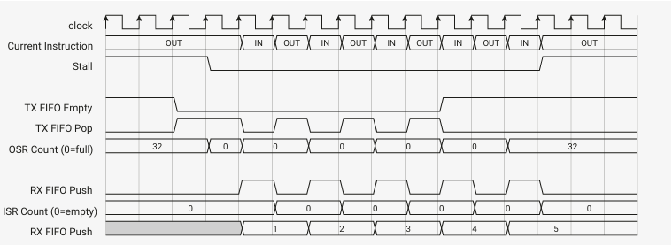
<figcaption>
Figure 49. Execution of auto_push_pull program. The state machine stalls on an OUT until data has travelled through the TX FIFO into the OSR.  Subsequently, the OSR is refilled simultaneously with each OUT operation (due to bit count of 32), and IN data bypasses the ISR and goes straight to the RX FIFO. The state machine stalls again when the FIFO has drained, and the OSR is once again empty.

図 49. auto_push_pull プログラムの実行。ステートマシンは、データが TX FIFO を通過して OSR に入るまで、OUT でストールする。 その後、OSR は各 OUT 動作と同時に補充され(ビットカウントが 32 のため)、IN データは ISR をバイパスして RX FIFO に直行する。FIFO が消耗し、OSR が再び空になると、ステートマシンは再びストールする。
</figcaption>
</figure>

To trigger automatic push or pull at the correct time, the state machine tracks the total shift count of the ISR and OSR, using a pair of saturating 6-bit counters.

* At reset, or upon CTRL_SM_RESTART assertion, ISR shift counter is set to 0 (nothing shifted in), and OSR to 32 (nothing left to be shifted out)
* An OUT instruction increases the OSR shift counter by Bit count
* An IN instruction increases the ISR shift counter by Bit count
* A PULL instruction or autopull clears the OSR counter to 0
* A PUSH instruction or autopush clears the ISR counter to 0
* A MOV OSR, x or MOV ISR, x clears the OSR or ISR shift counter to 0, respectively
* A OUT ISR, n instruction sets the ISR shift counter to n

On any  OUT or  IN instruction, the state machine compares the shift counters to the values of  SHIFTCTRL_PULL_THRESH and SHIFTCTRL_PUSH_THRESH  to  decide  whether  action  is  required.  Autopull  and  autopush  are  individually  enabled  by  the SHIFTCTRL_AUTOPULL and SHIFTCTRL_AUTOPUSH fields.

正しいタイミングで自動プッシュまたはプルをトリガするために、ステートマシンは、飽和する 6 ビットカウンタのペアを使用して、ISR と OSR の合計シフトカウントを追跡します。

* リセット時、または CTRL_SM_RESTART アサート時には、ISR シフトカウンタは 0 に設定され(何もシフトインされていない)、OSR は 32 に設定される(シフトアウトされるものは残っていない)。
* OUT 命令は OSR シフトカウンタをビットカウント増加させます。
* IN 命令は、ISR シフトカウンタを Bit カウント増やします。
* PULL 命令またはオートプルは、OSR カウンタを 0 にクリアします。
* PUSH 命令またはオートプッシュは、ISR カウンタを 0 にクリアします。
* MOV OSR, x または MOV ISR, x は、それぞれ OSR または ISR シフトカウンタを 0 にクリアします。
* OUT ISR, n 命令は ISR シフトカウンタを n にセットします。

OUT または IN 命令では、ステートマシンはシフトカウンタと SHIFTCTRL_PULL_THRESH および SHIFTCTRL_PUSH_THRESH の値を比較し、アクションが必要かどうかを判断します。 オートプルとオートプッシュは、SHIFTCTRL_AUTOPULL フィールドと SHIFTCTRL_AUTOPUSH フィールドによって個別に有効になります。

#### 11.5.4.1. Autopush Details

Pseudocode for an IN with autopush enabled:

```
 1 isr = shift_in(isr, input())
 2 isr count = saturate(isr count + in count)
 3
 4 if rx count >= threshold:
 5     if rx fifo is full:
 6         stall
 7     else:
 8         push(isr)
 9         isr = 0
10         isr count = 0
```

The hardware performs the above steps in a single machine clock cycle, unless there is a stall.

Threshold is configurable from 1 to 32.

>  IMPORTANT Autopush  must  not  be  enabled  when  SHIFTCTRL_FJOIN_RX_PUT  or  SHIFTCTRL_FJOIN_RX_PUTGET  is  set.  Its  operation  in  this state is undefined.

ハードウェアは、ストールが発生しない限り、上記のステップを 1 マシンクロックサイクルで実行する。

スレッショルドは 1～32 の範囲で設定可能です。

> IMPORTANT SHIFTCTRL_FJOIN_RX_PUT または SHIFTCTRL_FJOIN_RX_PUTGET が設定されている場合は、 自動プッシュを有効にしないでください。 この状態での動作は未定義です。

#### 11.5.4.2. Autopull Details

On non-OUT cycles, the hardware performs the equivalent of the following pseudocode:

非 OUT サイクルでは、ハードウェアは以下の擬似コードと同等の処理を行う: 

```
1 if MOV or PULL:
2     osr count = 0
3
4 if osr count >= threshold:
5     if tx fifo not empty:
6         osr = pull()
7         osr count = 0
```

An autopull can therefore occur at any point between two OUTs, depending on when the data arrives in the FIFO.

On OUT cycles, the sequence is a little different:

したがって、オートプルは、データが FIFO に到着するタイミングによって、2 つの OUT の間のどの時点でも発生する可能性がある。

OUT サイクルでは、シーケンスは少し異なる: 

```
 1 if osr count >= threshold:
 2     if tx fifo not empty:
 3         osr = pull()
 4         osr count = 0
 5     stall
 6 else:
 7     output(osr)
 8     osr = shift(osr, out count)
 9     osr count = saturate(osr count + out count)
10
11     if osr count >= threshold:
12         if tx fifo not empty:
13             osr = pull()
14             osr count = 0
```

The  hardware  is  capable  of  refilling  the  OSR  simultaneously  with  shifting  out  the  last  of  the  shift  data,  as  these  two operations can proceed in parallel. However, it cannot fill an empty OSR and OUT it on the same cycle, due to the long logic path this would create.

The refill is somewhat asynchronous to your program, but an OUT behaves as a data fence, and the state machine will never OUT data which you didn't write into the FIFO.

Note that a MOV from the OSR is undefined whilst autopull is enabled; you will read either any residual data that has not been shifted out, or a fresh word from the FIFO, depending on a race against system DMA. Likewise, a MOV to the OSR may overwrite data which has just been autopulled. However, data which you MOV into the OSR will never be overwritten, since MOV updates the shift counter.

If  you  do  need  to  read  the  OSR  contents,  you  should  perform  an  explicit  PULL  of  some  kind.  The  nondeterminism described above is the cost of the hardware managing pulls automatically. When autopull is enabled, the behaviour of PULL is altered: it becomes a no-op if the OSR is full. This is to avoid a race condition against the system DMA. It behaves as a fence: either an autopull has already taken place, in which case the PULL has no effect, or the program will stall on the PULL until data becomes available in the FIFO.

PULL does not require similar behaviour, because autopush does not have the same nondeterminism.

ハードウェアは、シフトデータの最後のシフトアウトと同時に OSR を再充填することができる。しかし、空の OSR を再充填し、同じサイクルでそれを OUT することはできません。

再充填はプログラムに対して多少非同期ですが、OUT はデータフェンスとして動作し、ステートマシンが FIFO に書き込まなかったデータを OUT することはありません。

OSR からの MOV は、オートプルが有効になっている間は未定義であることに注意してください。システム DMA との競合によって、シフトアウトされていない残存データか、FIFO からの新しいワードのいずれかを読み取ることになります。同様に、OSR への MOV は、オートプルされたばかりのデータを上書きする可能性があります。ただし、OSR に MOV したデータは、MOV によってシフトカウンタが更新されるため、上書きされることはありません。

OSR の内容を読み出す必要がある場合は、何らかの明示的な PULL を実行する必要があります。 上記の非決定性は、ハードウェアが自動的にプルを管理するためのコストです。オートプルが有効になっている場合、PULL の動作は変更されます。これはシステム DMA との競合状態を避けるためである。PULL はフェンスのように動作します。オートプルがすでに実行されている場合は、PULL は何の効果もなく、または FIFO でデータが利用可能になるまで、プログラムは PULL でストールします。

自動プッシュには同じような非決定性がないため、PULL には同様の動作は必要ない。

### 11.5.5. Clock Dividers

PIO  runs  off  the  system  clock,  but  this  is  too  fast  for  many  interfaces,  and  the  number  of  Delay  cycles  which  can  be inserted  is  limited.  Some  devices,  such  as  UART,  require  the  signalling  rate  to  be  precisely  controlled  and  varied,  and ideally  multiple  state  machines  can  be  varied  independently  while  running  identical  programs.  Each  state  machine  is equipped with a clock divider, for this purpose.

Rather than slowing the system clock itself, the clock divider redefines how many system clock periods are considered to be "one cycle", for execution purposes. It does this by generating a clock enable signal, which can pause and resume execution  on  a  per-system-clock-cycle  basis.  The  clock  divider  generates  clock  enable  pulses  at  regular  intervals,  so that the state machine runs at some steady pace, potentially much slower than the system clock.

Implementing  the  clock  dividers  in  this  way  allows  interfacing  between  the  state  machines  and  the  system  to  be simpler, lower-latency, and with a smaller footprint. The state machine is completely idle on cycles where clock enable is low, though the system can still access the state machine's FIFOs and change its configuration.

The  clock  dividers  are  16-bit  integer,  8-bit  fractional,  with  first-order  delta-sigma  for  the  fractional  divider.  The  clock divisor can vary between 1 and 65536, in increments of .

If the clock divisor is set to 1, the state machine runs on every cycle, i.e. full speed:

PIO はシステムクロックで動作するが、これは多くのインターフェースにとって速すぎるし、挿入できる Delay サイクルの数も限られている。 UART のような一部のデバイスでは、信号速度を正確に制御して変化させる必要があり、理想的には、複数のステートマシンを同一のプログラムを実行しながら独立して変化させることができる。 各ステートマシンは、この目的のためにクロック分周器を備えている。

クロックデバイダは、システムクロックそのものを減速させるのではなく、実行の目的で、システムクロックの何周期を「1 サイクル」とみなすかを再定義する。これはクロックイネーブル信号を生成することで行われ、システムクロック周期ごとに実行を一時停止したり再開したりすることができる。 クロック分周器は、一定の間隔でクロックイネーブルパルスを生成するため、ステートマシンは、システムクロックよりもはるかに遅い、ある一定のペースで実行される可能性がある。

このようにクロックデバイダを実装することで、ステートマシンとシステム間のインターフェイスをよりシンプルに、低レイテンシで、フットプリントを小さくすることができる。クロックイネーブルが低いサイクルでは、ステートマシンは完全にアイドル状態になるが、システムはステートマシンの FIFO にアクセスし、コンフィギュレーションを変更することができる。

クロック分周器は 16 ビット整数、8 ビット分数で、分数分周器には 1 次のΔΣを使用する。 クロック分周器は 1～65536 の間で変化する。

クロック分周器が 1 に設定されている場合、ステートマシンは毎サイクル、つまりフルスピードで動作する: 

<figure>
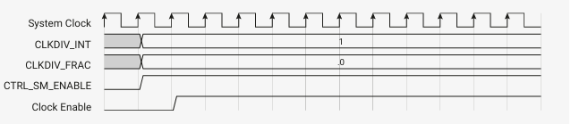
<figcaption>
Figure 50. State machine operation with a clock divisor of 1. Once the state machine is enabled via the CTRL register, its clock enable is asserted on every cycle.

図 50. CTRL レジスタを介してステートマシンをイネーブルにすると、そのクロックイネーブルは毎サイクルでアサートされる。
</figcaption>
</figure>

In general, an integer clock divisor of n will cause the state machine to run 1 cycle in every n, giving an effective clock speed of $$f_{sys} / n$$.

一般に、整数クロックの除数が n の場合、ステートマシンは n ごとに 1 サイクルを実行することになり、実効クロック速度は$$f_{sys} / n$$となる。

<figure>
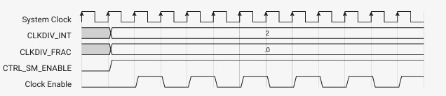
<figcaption>
Figure 51. Integer clock divisors yield a periodic clock enable.

The clock divider repeatedly counts down from n, and emits an enable pulse when it reaches 1.

図 51. 整数のクロック分周器は、 周期的なクロックイネーブルを生成する。

クロック分周器は n からカウントダウンを繰り返し、1 に達するとイネーブルパルスを発する。
</figcaption>
</figure>

Fractional division will maintain a steady state division rate of $$n + f / 256$$, where n and f are the integer and fractional fields of this state machine's CLKDIV register. It does this by selectively extending some division periods from  cycles to $$n + 1$$.

フラクショナル除算は、定常状態の分割率 $$n + f / 256$$を維持する。ここで n と f はこのステートマシンの CLKDIV レジスタの整数フィールドと分数フィールドである。n と f はこのステートマシンの CLKDIV レジスタの整数フィールドと分数フィールドである。

<figure>
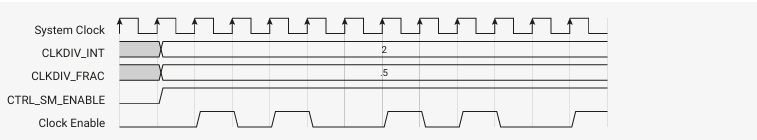
<ficcaption>
Figure 52. Fractional clock division with an average divisor of 2.5.  The clock divider maintains a running total of the fractional value from each division period, and every time this value wraps through 1, the integer divisor is increased by one for the next division period.

図 52. 平均除数 2.5 の分数クロック分周。 クロック分周器は、 各分周期間の分数値の実行合計を保持し、この値が 1 を超えるたびに、次の分周期間の整数分周器が 1 ずつ増加する。
</figcaption>
</figure>

For small  n, the jitter introduced by a fractional divider may be unacceptable. However, for larger values, this effect is much less apparent.

>  NOTE For  fast  asynchronous  serial,  it  is  recommended  to  use  even  divisions  or  multiples  of  1  Mbaud  where  possible, rather than the traditional multiples of 300, to avoid unnecessary jitter.

n が小さい場合、分数分周器によってもたらされるジッタは許容できないかもしれない。しかし、値が大きくなると、この影響はかなり小さくなります。

> 注: 高速非同期シリアルでは、不必要なジッタを避けるために、可能な限り、従来の 300 の倍数ではなく、偶数分割または 1 Mbaud の倍数を使用することを推奨する。

### 11.5.6. GPIO マッピング

Internally, PIO has a 32-bit register for the output levels of each GPIO it can drive, and another register for the output enables  (Hi/Lo-Z).  On  every  system  clock  cycle,  each  state  machine  can  write  to  some  or  all  of  the  GPIOs  in  each  of these registers.

内部的には、PIO は駆動可能な各 GPIO の出力レベル用の 32 ビットレジスタと、出力イネーブル (Hi/Lo-Z)用の別のレジスタを持っています。 システムクロックサイクルごとに、各ステートマシンはこれらのレジスタの一部またはすべての GPIO に書き込むことができます。

<figure>
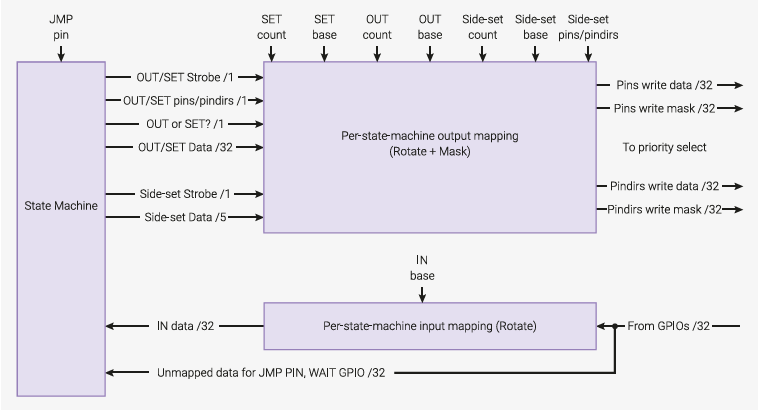
<figcaption>
Figure 53. The state machine has two independent output channels, one shared by OUT/SET, and another used by side- set (which can happen at any time). Three independent mappings (first GPIO, number of GPIOs) control which GPIOs OUT, SET and side-set are directed to. Input data is rotated according to which GPIO is mapped to the LSB of the IN data.

図 53. ステートマシンには 2 つの独立した出力チャネルがあり、1 つは OUT/SET で共有され、もう 1 つはサイドセットで使用されます(これはいつでも起こり得ます)。3 つの独立したマッピング(最初の GPIO、GPIO の数)が、どの GPIO OUT、SET、および side-set に向けられるかを制御します。入力データは、どの GPIO が IN データの LSB にマッピングされるかに従って回転します。
</figcaption>
</figure>

The write data and write masks for the output level and output enable registers come from the following sources:

* An OUT instruction writes to up to 32 bits. Depending on the instruction's Destination field, this is applied to either
pins or pindirs. The least-significant bit of OUT data is mapped to PINCTRL_OUT_BASE, and this mapping continues for PINCTRL_OUT_COUNT bits, wrapping after GPIO31.
* A SET instruction writes up to 5 bits. Depending on the instruction's Destination field, this is applied to either pins or pindirs. The least-significant bit of SET data is mapped to PINCTRL_SET_BASE, and this mapping continues for PINCTRL_SET_COUNT bits, wrapping after GPIO31.
* A side-set operation writes up to 5 bits. Depending on the register field EXECCTRL_SIDE_PINDIR, this is applied to either pins or pindirs. The least-significant bit of side-set data is mapped to PINCTRL_SIDESET_BASE, continuing for PINCTRL_SIDESET_COUNT pins, minus one if EXECCTRL_SIDE_EN is set.

Each  OUT/SET/side-set operation writes to a contiguous range of pins, but each of these ranges is independently sized and  positioned  in  the  32-bit  GPIO  space.  This  is  sufficiently  flexible  for  many  applications.  For  example,  if  one  state machine is implementing some interface such as an SPI on a group of pins, another state machine can run the same program, mapped to a different group of pins, and provide a second SPI interface.

On any given clock cycle, the state machine may perform an OUT or a SET, and may simultaneously perform a side-set.  The pin mapping logic generates a 32-bit write mask and write data bus for the output level and output enable registers, based on this request, and the pin mapping configuration.

If a side-set overlaps with an OUT/SET performed by that state machine on the same cycle, the side-set takes precedence in the overlapping region.

出力レベルと出力イネーブルレジスタの書き込みデータと書き込みマスクは、以下のソースから得られます: 

* OUT 命令は最大 32 ビットに書き込みます。OUT 命令は最大 32 ビットに書き込みます。
ピンまたはピンディレクトリに適用されます。OUT データの最下位ビットは PINCTRL_OUT_BASE にマッピングされ、このマッピングは PINCTRL_OUT_COUNT ビットの間、GPIO31 の後に続きます。
* SET 命令は最大 5 ビットを書き込みます。SET 命令は最大 5 ビットを書き込みます。命令の Destination フィールドによって、これはピンまたはピンディールに適用されます。SET データの最下位ビットは PINCTRL_SET_BASE にマッピングされ、このマッピングは PINCTRL_SET_COUNT ビットの間、GPIO31 の後に続きます。
* サイドセット動作は最大 5 ビットを書き込みます。レジスタフィールド EXECCTRL_SIDE_PINDIR によって、これはピンまたはピンディールに適用されます。サイドセットデータの最下位ビットは PINCTRL_SIDESET_BASE にマップされ、PINCTRL_SIDESET_COUNT ピンの場合は続き、EXECCTRL_SIDE_EN が設定されている場合はマイナス 1 されます。

各 OUT/SET/サイドセット動作はピンの連続した範囲に書き込みますが、これらの範囲はそれぞれ独立したサイズで 32 ビット GPIO 空間に配置されます。 これは、多くのアプリケーションにとって十分に柔軟です。 例えば、あるステートマシンがピンのグループに SPI などのインターフェイスを実装している場合、別のステートマシンが同じプログラムを実行し、別のピンのグループにマッピングして、2 番目の SPI インターフェイスを提供することができます。

任意のクロックサイクルにおいて、ステートマシンは OUT または SET を実行し、同時にサイドセットを実行することができる。 ピンマッピングロジックは、 この要求とピンマッピングコンフィギュレーションに基づいて、 出力レベルレジスタと出力イネーブルレジスタ用の 32 ビット書き込みマスクと書き込みデータバスを生成します。

サイドセットが、同じサイクルでそのステートマシンが実行する OUT/SET と重複する場合、重複する領域ではサイドセットが優先される。

#### 11.5.6.1. Output Priority

<figure>
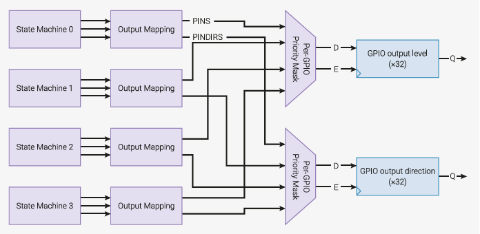
<figcaption>
Figure 54. Per-GPIO priority select of write masks from each state machine. Each GPIO considers level and direction writes from each of the four state machines, and applies the value from the highest-numbered state machine.

図 54. 各ステートマシンからの書き込みマスクの GPIO ごとの優先順位選択。各 GPIO は、4 つのステートマシンそれぞれからのレベルと方向の書き込みを考慮し、最も高い番号のステートマシンからの値を適用します。
</figcaption>
</figure>

Each  state  machine  may  assert  an  OUT/SET  and  a  side-set  through  its  pin  mapping  hardware  on  each  cycle.  This generates 32 bits of write data and write mask for the GPIO output level and output enable registers, from each state machine.

For each GPIO, PIO collates the writes from all four state machines, and applies the write from the highest-numbered state machine. This occurs separately for output levels and output values --- it is possible for a state machine to change both the level and direction of the same pin on the same cycle (e.g. via simultaneous SET and side-set), or for one state machine to change a GPIO's direction while another changes that GPIO's level. If no state machine asserts a write to a GPIO's level or direction, the value does not change.

各ステートマシンは、各サイクルでピンマッピングハードウェアを通して OUT/SET とサイドセットをアサートすることができる。 これにより、各ステートマシンから GPIO 出力レベルと出力イネーブルレジスタ用の 32 ビットの書き込みデータと書き込みマスクが生成されます。

各 GPIO に対して、PIO は 4 つのステートマシンすべてからの書き込みを照合し、最も番号の高いステートマシンからの書き込みを適用します。これは出力レベルと出力値で別々に行われます。ステートマシンが同じピンのレベルと方向を同じサイクルで変更したり(例えば SET とサイドセットを同時に行う)、あるステートマシンが GPIO の方向を変更する一方で別のステートマシンがその GPIO のレベルを変更したりすることが可能です。どのステートマシンも GPIO のレベルまたは方向への書き込みをアサートしない場合、値は変更されません。

#### 11.5.6.2. Input Mapping

The  data  observed  by  IN  instructions  is  mapped  such  that  the  LSB  is  the  GPIO  selected  by  PINCTRL_IN_BASE,  and successively more-significant bits come from successively higher-numbered GPIOs, wrapping after 31.

In  other  words,  the  IN  bus  is  a  right-rotate  of  the  GPIO  input  values,  by  PINCTRL_IN_BASE.  If  fewer  than  32  GPIOs  are present, the PIO input is padded with zeroes up to 32 bits.

Some instructions, such as  WAIT  GPIO, use an absolute GPIO number, rather than an index into the  IN data bus. In this case, the right-rotate is not applied.

IN 命令によって観測されるデータは、LSB が PINCTRL_IN_BASE によって選択された GPIO であり、順次上位のビットが順次上位番号の GPIO から来るようにマップされ、31 の後にラップされます。

言い換えれば、IN バスは PINCTRL_IN_BASE によって GPIO 入力値を右回転したものです。 GPIO が 32 個未満の場合、PIO 入力は 32 ビットまでゼロでパディングされます。

WAIT GPIO のようないくつかの命令では、IN データバスのインデックスではなく、絶対 GPIO 番号を使用します。この場合、右回転は適用されません。

#### 11.5.6.3. 入力同期

To protect PIO from metastabilities, each GPIO input is equipped with a standard 2-flipflop synchroniser. This adds two cycles of latency to input sampling, but the benefit is that state machines can perform an IN PINS at any point, and will see  only  a  clean  high  or  low  level,  not  some  intermediate  value  that  could  disturb  the  state  machine  circuitry.  This  is absolutely necessary for asynchronous interfaces such as UART RX.

It is possible to bypass these synchronisers, on a per-GPIO basis. This reduces input latency, but it is then up to the user to guarantee that the state machine does not sample its inputs at inappropriate times. Generally this is only possible for synchronous interfaces such as SPI. Synchronisers are bypassed by setting the corresponding bit in INPUT_SYNC_BYPASS.

>  WARNING Sampling a metastable input can lead to unpredictable state machine behaviour. This should be avoided.

PIO をメタスタビリティから保護するために、各 GPIO 入力には標準的な 2 フリップフロップ・シンクロナイザが装備されています。これは入力サンプリングに 2 サイクルのレイテンシを追加しますが、その利点は、ステートマシンがどの時点でも IN PINS を実行でき、ステートマシン回路を乱す可能性のある中間値ではなく、きれいなハイレベルまたはローレベルだけを見ることができることです。 これは UART RX のような非同期インターフェイスには絶対に必要である。

GPIO ごとに、これらのシンクロナイザをバイパスすることも可能である。これによって入力レイテンシが減少しますが、ステートマシンが不適切なタイミングで入力をサンプリングしないことを保証するかどうかはユーザ次第です。一般的に、これは SPI などの同期インターフェイスでのみ可能です。同期器は、INPUT_SYNC_BYPASS の対応するビットを設定することでバイパスされる。

> 警告メタステーブル入力をサンプリングすると、ステートマシンの動作が予測不可能になることがある。これは避けるべきである。

### 11.5.7. 強制命令と実行命令

Besides the instruction memory, state machines can execute instructions from 3 other sources:

* MOV EXEC which executes an instruction from some register Source
* OUT EXEC which executes data shifted out from the OSR
* The SMx_INSTR control registers, to which the system can write instructions for immediate execution


命令メモリの他に、ステートマシンは 3 つのソースから命令を実行できます: 

* レジスタソースから命令を実行する MOV EXEC
* OSR からシフトアウトされたデータを実行する OUT EXEC
* SMx_INSTR 制御レジスタ(システムが即座に実行する命令を書き込むことができる

```
 1 .program exec_example
 2
 3 hang:
 4     jmp hang
 5 execute:
 6     out exec, 32
 7     jmp execute
 8
 9 .program instructions_to_push
10
11     out x, 32
12     in x, 32
13     push
```

```
 1 #include "tb.h" // TODO this is built against existing sw tree, so that we get printf etc
 2
 3 #include "platform.h"
 4 #include "pio_regs.h"
 5 #include "system.h"
 6 #include "hardware.h"
 7
 8 #include "exec_example.pio.h"
 9
10 int main()
11 {
12     tb_init();
13
14     for (int i = 0; i < count_of(exec_example_program); ++i)
15         mm_pio->instr_mem[i] = exec_example_program[i];
16
17     // Enable autopull, threshold of 32
18     mm_pio->sm[0].shiftctrl = (1u << PIO_SM0_SHIFTCTRL_AUTOPULL_LSB);
19
20     // Start state machine 0 -- will sit in "hang" loop
21     hw_set_bits(&mm_pio->ctrl, 1u << (PIO_CTRL_SM_ENABLE_LSB + 0));
22
23     // Force a jump to program location 1
24     mm_pio->sm[0].instr = 0x0000 | 0x1; // jmp execute
25
26     // Feed a mixture of instructions and data into FIFO
27     mm_pio->txf[0] = instructions_to_push_program[0]; // out x, 32
28     mm_pio->txf[0] = 12345678;                        // data to be OUTed
29     mm_pio->txf[0] = instructions_to_push_program[1]; // in x, 32
30     mm_pio->txf[0] = instructions_to_push_program[2]; // push
31
32     // The program pushed into TX FIFO will return some data in RX FIFO
33     while (mm_pio->fstat & (1u << PIO_FSTAT_RXEMPTY_LSB))
34         ;
35
36     printf("%d\n", mm_pio->rxf[0]);
37
38     return 0;
39 }
```

Here we load an example program into the state machine, which does two things:

* Enters an infinite loop
* Enters a loop which repeatedly pulls 32 bits of data from the TX FIFO, and executes the lower 16 bits as an instruction 

The  C  program  sets  the  state  machine  running,  at  which  point  it  enters  the  hang  loop.  While  the  state  machine  is  still running, the C program forces in a jmp instruction, which causes the state machine to break out of the loop.

When  an  instruction  is  written  to  the  INSTR  register,  the  state  machine  immediately  decodes  and  executes  that instruction, rather than the instruction it would have fetched from the PIO's instruction memory. The program counter does not advance, so on the next cycle (assuming the instruction forced into the INSTR interface did not stall) the state machine continues to execute its current program from the point where it left off, unless the written instruction itself manipulated PC.

Delay  cycles  are  ignored  on  instructions  written  to  the  INSTR  register,  and  execute  immediately,  ignoring  the  state machine clock divider. This interface is provided for performing initial setup and effecting control flow changes, so it executes instructions in a timely manner, no matter how the state machine is configured.

Instructions written to the INSTR register are permitted to stall, in which case the state machine will latch this instruction internally until it completes. This is signified by the EXECCTRL_EXEC_STALLED flag. This can be cleared by restarting the state machine, or writing a NOP to INSTR.

In the second phase of the example state machine program, the OUT EXEC instruction is used. The OUT itself occupies one execution  cycle,  and  the  instruction  which  the  OUT  executes  is  on  the  next  execution  cycle.  Note  that  one  of  the instructions we execute is also an OUT --- the state machine is only capable of executing one OUT instruction on any given cycle.

OUT  EXEC  works  by  writing  the  OUT  shift  data  to  an  internal  instruction  latch.  On  the  next  cycle,  the  state  machine remembers it must execute from this latch rather than the instruction memory, and also knows to not advance PC on this second cycle.

This program will print "12345678" when run.

>  CAUTION If an instruction written to INSTR stalls, it is stored in the same instruction latch used by OUT EXEC and MOV EXEC, and will overwrite an in-progress instruction there. If EXEC instructions are used, instructions written to INSTR must not stall.

ここでは、ステートマシンに例のプログラムをロードし、2 つのことを行う: 

* 無限ループに入る
* TX FIFO から 32 ビットのデータを繰り返し取り出し、下位16 ビットを命令として実行するループに入る。

C プログラムはステートマシンを実行状態にし、その時点でハングループに入る。 ステートマシンがまだ実行されている間に、C プログラムは jmp 命令を強制的に入力し、ステートマシンをループから抜け出させます。

INSTR レジスタに命令が書き込まれると、ステートマシンは PIO の命令メモリからフェッチした命令ではなく、その命令を即座にデコードして実行する。プログラムカウンタは進まないため、次のサイクルでは(INSTR インターフェイスに強制的に書き込まれた命令がストールしなかったと仮定して)、書き込まれた命令自体が PC を操作しない限り、ステートマシンは現在のプログラムを中断した時点から実行し続けます。

INSTR レジスタに書き込まれた命令では、遅延サイクルは無視され、ステートマシンのクロック分周を無視して直ちに実行される。このインターフェイスは、初期セットアップと制御フロー変更のために用意されているため、ステートマシンがどのように構成されていても、命令をタイムリに実行することができる。

INSTR レジスタに書き込まれた命令はストールすることが許され、その場合、ステートマシンは命令が完了するまでこの命令を内部的にラッチする。これは EXECCTRL_EXEC_STALLED フラグで示される。これは、ステートマシンを再起動するか、INSTR に NOP を書き込むことでクリアできる。

ステートマシンプログラムの第 2 段階では、OUT EXEC 命令が使用される。OUT 自体は 1 つの実行サイクルを占め、OUT が実行する命令は次の実行サイクルにある。 実行する命令の 1 つは OUT でもあり、ステートマシンは任意のサイクルで OUT 命令を 1 つしか実行できないことに注意してください。

OUT EXEC は、OUT シフトデータを内部命令ラッチに書き込むことで動作する。 次のサイクルでは、ステートマシンは命令メモリではなくこのラッチから実行しなければならないことを記憶し、この 2 番目のサイクルでは PC を進めないことも知っている。

このプログラムを実行すると、 "12345678" と表示される。

> INSTR に書き込まれた命令がストールした場合、その命令は OUT EXEC や MOV EXEC と同じ命令ラッチに格納され、そこで実行中の命令を上書きします。EXEC 命令を使用する場合、INSTR に書き込まれた命令はストールしてはならない。

## 11.6. Examples

These examples illustrate some of PIO's hardware features, by implementing common I/O interfaces.

>  TIP Raspberry  Pi  Pico-series  C/C++  SDK  has  a  comprehensive  PIO  chapter  that  begins  with  writing  and  building  your first PIO application. Later chapters walk through some programs line-by-line. Finally, it covers broader topics such as using PIO with DMA, and how PIO can integrate into your software.

これらの例では、一般的な I/O インターフェースを実装することで、PIO のハードウェア機能の一部を説明しています。

> ヒント Raspberry Pi Pico シリーズ C/C++ SDK には、最初の PIO アプリケーションの記述と構築から始まる包括的な PIO の章があります。後の章では、いくつかのプログラムを一行ずつ説明します。最後に、PIO を DMA で使用する方法や、PIO をソフトウェアに統合する方法など、より幅広いトピックをカバーしています。

### 11.6.1. Duplex SPI

<figure>
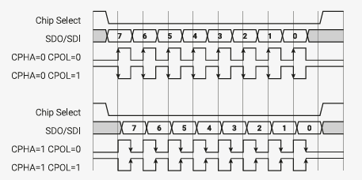
<figcaption>
Figure 55. In SPI, a host and device exchange data over a bidirectional pair of serial data lines, synchronous with a clock (SCK). Two flags, CPOL and CPHA, specify the clock's behaviour.  CPOL is the idle state of the clock: 0 for low, 1 for high. The clock pulses a number of times, transferring one bit in each direction per pulse, but always returns to its idle state. CPHA determines on which edge of the clock data is captured: 0 for leading edge, and 1 for trailing edge. The arrows in the figure show the clock edge where data is captured by both the host and device.

図 55 SPI SPI では、ホストとデバイスは、クロック(SCK)に同期した双方向のシリアルデータラインのペアでデータ交換を行う。CPOL と CPHA という 2 つのフラグがクロックの動作を指定する。 CPOL はクロックのアイドル状態であり、0 がロー、1 がハイである。クロックは何度かパルスし、1 パルスにつき各方向に 1 ビットずつ転送するが、常にアイドル状態に戻る。CPHA はクロックのどのエッジでデータを取り込むかを決定する。0 は前エッジ、1 は後エッジである。図中の矢印は、ホストとデバイスの両方でデータがキャプチャされるクロックエッジを示しています。
</figcaption>
</figure>

SPI is a common serial interface with a twisty history. The following program implements full-duplex (i.e. transferring data in both directions simultaneously) SPI, with a CPHA parameter of 0.

SPI は紆余曲折の歴史を持つ一般的なシリアルインターフェースである。以下のプログラムは、CPHA パラメータを 0 として、全二重(双方向に同時にデータを転送する)SPI を実装している。

Pico Examples: https://github.com/raspberrypi/pico-examples/blob/master/pio/spi/spi.pio Lines 14 - 32

```
14 .program spi_cpha0
15 .side_set 1
16
17 ; Pin assignments:
18 ; - SCK is side-set pin 0
19 ; - MOSI is OUT pin 0
20 ; - MISO is IN pin 0
21 ;
22 ; Autopush and autopull must be enabled, and the serial frame size is set by
23 ; configuring the push/pull threshold. Shift left/right is fine, but you must
24 ; justify the data yourself. This is done most conveniently for frame sizes of
25 ; 8 or 16 bits by using the narrow store replication and narrow load byte
26 ; picking behaviour of RP2040's IO fabric.
27
28 ; Clock phase = 0: data is captured on the leading edge of each SCK pulse, and
29 ; transitions on the trailing edge, or some time before the first leading edge.
30
31     out pins, 1 side 0 [1] ; Stall here on empty (sideset proceeds even if
32     in pins, 1  side 1 [1] ; instruction stalls, so we stall with SCK low)
```

This code uses autopush and autopull to continuously stream data from the FIFOs. The entire program runs once for every  bit  that  is  transferred,  and  then  loops.  The  state  machine  tracks  how  many  bits  have  been  shifted  in/out,  and automatically pushes/pulls the FIFOs at the correct point. A similar program handles the CPHA=1 case:

このコードは、autopush と autopull を使用して、FIFO から継続的にデータをストリーミングする。プログラム全体は、転送されるビットごとに 1 回実行され、その後ループする。 ステートマシンは、何ビットがシフトイン/アウトされたかを追跡し、正しいポイントで FIFO を自動的にプッシュ/プルします。同様のプログラムは CPHA=1 の場合を処理する: 

Pico Examples: https://github.com/raspberrypi/pico-examples/blob/master/pio/spi/spi.pio Lines 34 - 42

```
34 .program spi_cpha1
35 .side_set 1
36
37 ; Clock phase = 1: data transitions on the leading edge of each SCK pulse, and
38 ; is captured on the trailing edge.
39
40     out x, 1    side 0     ; Stall here on empty (keep SCK deasserted)
41     mov pins, x side 1 [1] ; Output data, assert SCK (mov pins uses OUT mapping)
42     in pins, 1  side 0     ; Input data, deassert SCK
```

>  NOTE These programs do not control the chip select line; chip select is often implemented as a software-controlled GPIO, due to wildly different behaviour between different SPI hardware. The full spi.pio source linked above contains some examples how PIO can implement a hardware chip select line.

A C helper function configures the state machine, connects the GPIOs, and sets the state machine running. Note that the  SPI  frame  size --- that  is,  the  number  of  bits  transferred  for  each  FIFO  record --- can  be  programmed  to  any  value from 1 to 32, without modifying the program. Once configured, the state machine is set running.

> NOTE チップセレクトは、SPI ハードウェアによって動作が大きく異なるため、ソフトウェア制御の GPIO として実装されることがよくあります。上記のリンク先の spi.pio 全ソースには、PIO がハードウェアチップセレクトラインを実装する例がいくつか含まれています。

C ヘルパ関数がステートマシンを設定し、GPIO を接続し、ステートマシンの実行を設定します。SPI フレームサイズ(つまり、FIFO レコードごとに転送されるビット数)は、プログラムを変更することなく、1 から 32 までの任意の値にプログラムできることに注意してください。いったん設定されると、ステートマシンは実行状態に設定される。


Pico Examples: https://github.com/raspberrypi/pico-examples/blob/master/pio/spi/spi.pio Lines 46 - 72

```
46 static inline void pio_spi_init(PIO pio, uint sm, uint prog_offs, uint n_bits,
47         float clkdiv, bool cpha, bool cpol, uint pin_sck, uint pin_mosi, uint pin_miso) {
48     pio_sm_config c = cpha ? spi_cpha1_program_get_default_config(prog_offs) :
   spi_cpha0_program_get_default_config(prog_offs);
49     sm_config_set_out_pins(&c, pin_mosi, 1);
50     sm_config_set_in_pins(&c, pin_miso);
51     sm_config_set_sideset_pins(&c, pin_sck);
52     // Only support MSB-first in this example code (shift to left, auto push/pull,
   threshold=nbits)
53     sm_config_set_out_shift(&c, false, true, n_bits);
54     sm_config_set_in_shift(&c, false, true, n_bits);
55     sm_config_set_clkdiv(&c, clkdiv);
56
57     // MOSI, SCK output are low, MISO is input
58     pio_sm_set_pins_with_mask(pio, sm, 0, (1u << pin_sck) | (1u << pin_mosi));
59     pio_sm_set_pindirs_with_mask(pio, sm, (1u << pin_sck) | (1u << pin_mosi), (1u << pin_sck)
   | (1u << pin_mosi) | (1u << pin_miso));
60     pio_gpio_init(pio, pin_mosi);
61     pio_gpio_init(pio, pin_miso);
62     pio_gpio_init(pio, pin_sck);
63
64     // The pin muxes can be configured to invert the output (among other things
65     // and this is a cheesy way to get CPOL=1
66     gpio_set_outover(pin_sck, cpol ? GPIO_OVERRIDE_INVERT : GPIO_OVERRIDE_NORMAL);
67     // SPI is synchronous, so bypass input synchroniser to reduce input delay.
68     hw_set_bits(&pio->input_sync_bypass, 1u << pin_miso);
69
70     pio_sm_init(pio, sm, prog_offs, &c);
71     pio_sm_set_enabled(pio, sm, true);
72 }
```

The state machine will now immediately begin to shift out any data appearing in the TX FIFO, and push received data into the RX FIFO.

これでステートマシンは、TX FIFO に現れたデータのシフトアウトを直ちに開始し、受信したデータを RX FIFO にプッシュする。

Pico Examples: https://github.com/raspberrypi/pico-examples/blob/master/pio/spi/pio_spi.c Lines 18 - 34

```
18 void __time_critical_func(pio_spi_write8_blocking)(const pio_spi_inst_t *spi, const uint8_t
   *src, size_t len) {
19     size_t tx_remain = len, rx_remain = len;
20     // Do 8 bit accesses on FIFO, so that write data is byte-replicated. This
21     // gets us the left-justification for free (for MSB-first shift-out)
22     io_rw_8 *txfifo = (io_rw_8 *) &spi->pio->txf[spi->sm];
23     io_rw_8 *rxfifo = (io_rw_8 *) &spi->pio->rxf[spi->sm];
24     while (tx_remain || rx_remain) {
25         if (tx_remain && !pio_sm_is_tx_fifo_full(spi->pio, spi->sm)) {
26             *txfifo = *src++;
27             --tx_remain;
28         }
29         if (rx_remain && !pio_sm_is_rx_fifo_empty(spi->pio, spi->sm)) {
30             (void) *rxfifo;
31             --rx_remain;
32         }
33     }
34 }
```

Putting  this  all  together,  this  complete  C  program  will  loop  back  some  data  through  a  PIO  SPI  at  1 MHz,  with  all  four CPOL/CPHA combinations:

これをすべてまとめると、この完全な C プログラムは、4 つの CPOL/CPHA の組み合わせすべてで、1MHz の PIO SPI を介していくつかのデータをループバックすることになる: 

Pico Examples: https://github.com/raspberrypi/pico-examples/blob/master/pio/spi/spi_loopback.c

```
 1 /**
 2  * Copyright (c) 2020 Raspberry Pi (Trading) Ltd.
 3  *
 4  * SPDX-License-Identifier: BSD-3-Clause
 5  */
 6
 7 #include <stdlib.h>
 8 #include <stdio.h>
 9
10 #include "pico/stdlib.h"
11 #include "pio_spi.h"
12
13 // This program instantiates a PIO SPI with each of the four possible
14 // CPOL/CPHA combinations, with the serial input and output pin mapped to the
15 // same GPIO. Any data written into the state machine's TX FIFO should then be
16 // serialised, deserialised, and reappear in the state machine's RX FIFO.
17
18 #define PIN_SCK 18
19 #define PIN_MOSI 16
20 #define PIN_MISO 16 // same as MOSI, so we get loopback
21
22 #define BUF_SIZE 20
23
24 void test(const pio_spi_inst_t *spi) {
25     static uint8_t txbuf[BUF_SIZE];
26     static uint8_t rxbuf[BUF_SIZE];
27     printf("TX:");
28     for (int i = 0; i < BUF_SIZE; ++i) {
29         txbuf[i] = rand() >> 16;
30         rxbuf[i] = 0;
31         printf(" %02x", (int) txbuf[i]);
32     }
33     printf("\n");
34
35     pio_spi_write8_read8_blocking(spi, txbuf, rxbuf, BUF_SIZE);
36
37     printf("RX:");
38     bool mismatch = false;
39     for (int i = 0; i < BUF_SIZE; ++i) {
40         printf(" %02x", (int) rxbuf[i]);
41         mismatch = mismatch || rxbuf[i] != txbuf[i];
42     }
43     if (mismatch)
44         printf("\nNope\n");
45     else
46         printf("\nOK\n");
47 }
48
49 int main() {
50     stdio_init_all();
51
52     pio_spi_inst_t spi = {
53             .pio = pio0,
54             .sm = 0
55     };
56     float clkdiv = 31.25f;  // 1 MHz @ 125 clk_sys
57     uint cpha0_prog_offs = pio_add_program(spi.pio, &spi_cpha0_program);
58     uint cpha1_prog_offs = pio_add_program(spi.pio, &spi_cpha1_program);
59
60     for (int cpha = 0; cpha <= 1; ++cpha) {
61         for (int cpol = 0; cpol <= 1; ++cpol) {
62             printf("CPHA = %d, CPOL = %d\n", cpha, cpol);
63             pio_spi_init(spi.pio, spi.sm,
64                          cpha ? cpha1_prog_offs : cpha0_prog_offs,
65                          8,       // 8 bits per SPI frame
66                          clkdiv,
67                          cpha,
68                          cpol,
69                          PIN_SCK,
70                          PIN_MOSI,
71                          PIN_MISO
72             );
73             test(&spi);
74             sleep_ms(10);
75         }
76     }
77 }
```

### 11.6.2. WS2812 LEDs

WS2812 LEDs are driven by a proprietary pulse-width serial format, with a wide positive pulse representing a "1" bit, and narrow positive pulse a "0". Each LED has a serial input and a serial output; LEDs are connected in a chain, with each serial input connected to the previous LED's serial output.

WS2812 LED は、独自のパルス幅シリアルフォーマットで駆動され、幅の広い正パルスは  "1" ビットを表し、幅の狭い正パルスは  "0" を表します。各 LED はシリアル入力とシリアル出力を持ち、LED はチェーン接続され、各シリアル入力は前の LED のシリアル出力に接続されます。

<figure>
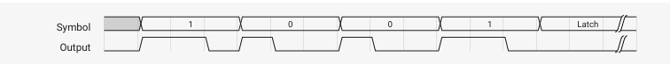
<figcaption>
Figure 56. WS2812 line format. Wide positive pulse for 1, narrow positive pulse for 0, very long negative pulse for latch enable 
</figcaption>
</figure>

Latch LEDs consume 24 bits of pixel data, then pass any additional input data on to their output. In this way a single serial burst can individually program the colour of each LED in a chain. A long negative pulse latches the pixel data into the LEDs.

ラッチ LED は 24 ビットのピクセルデータを消費し、追加の入力データを出力に渡します。このようにして、1 回のシリアルバーストで、チェーンの各 LED の色を個別にプログラムすることができる。長い負パルスがピクセルデータを LED にラッチします。

Pico Examples: https://github.com/raspberrypi/pico-examples/blob/master/pio/ws2812/ws2812.pio Lines 8 - 31

```
 8 .program ws2812
 9 .side_set 1
10
11 ; The following constants are selected for broad compatibility with WS2812,
12 ; WS2812B, and SK6812 LEDs. Other constants may support higher bandwidths for
13 ; specific LEDs, such as (7,10,8) for WS2812B LEDs.
14
15 .define public T1 3
16 .define public T2 3
17 .define public T3 4
18
19 .lang_opt python sideset_init = pico.PIO.OUT_HIGH
20 .lang_opt python out_init     = pico.PIO.OUT_HIGH
21 .lang_opt python out_shiftdir = 1
22
23 .wrap_target
24 bitloop:
25     out x, 1       side 0 [T3 - 1] ; Side-set still takes place when instruction stalls
26     jmp !x do_zero side 1 [T1 - 1] ; Branch on the bit we shifted out. Positive pulse
27 do_one:
28     jmp  bitloop   side 1 [T2 - 1] ; Continue driving high, for a long pulse
29 do_zero:
30     nop            side 0 [T2 - 1] ; Or drive low, for a short pulse
31 .wrap
```

This program shifts bits from the OSR into X, and produces a wide or narrow pulse on side-set pin 0, based on the value of each data bit. Autopull must be configured, with a threshold of 24. Software can then write 24-bit pixel values into the FIFO, and these will be serialised to a chain of WS2812 LEDs. The .pio file contains a C helper function to set this up:

このプログラムは OSR から X にビットをシフトし、各データビットの値に基づいてサイドセットピン 0 にワイドまたはナローのパルスを生成します。オートプルはスレッショルドを 24 に設定する必要があります。ソフトウェアは 24 ビットのピクセル値を FIFO に書き込むことができ、これらは WS2812 LED のチェーンにシリアライズされます。.pio ファイルには、これを設定するための C ヘルパ関数が含まれています: 

Pico Examples: https://github.com/raspberrypi/pico-examples/blob/master/pio/ws2812/ws2812.pio Lines 36 - 52

```
36 static inline void ws2812_program_init(PIO pio, uint sm, uint offset, uint pin, float freq, bool rgbw) {
37
38     pio_gpio_init(pio, pin);
39     pio_sm_set_consecutive_pindirs(pio, sm, pin, 1, true);
40
41     pio_sm_config c = ws2812_program_get_default_config(offset);
42     sm_config_set_sideset_pins(&c, pin);
43     sm_config_set_out_shift(&c, false, true, rgbw ? 32 : 24);
44     sm_config_set_fifo_join(&c, PIO_FIFO_JOIN_TX);
45
46     int cycles_per_bit = ws2812_T1 + ws2812_T2 + ws2812_T3;
47     float div = clock_get_hz(clk_sys) / (freq * cycles_per_bit);
48     sm_config_set_clkdiv(&c, div);
49
50     pio_sm_init(pio, sm, offset, &c);
51     pio_sm_set_enabled(pio, sm, true);
52 }
```

Because the shift is MSB-first, and our pixels aren't a power of two size (so we can't rely on the narrow write replication behaviour on RP2350 to fan out the bits for us), we need to preshift the values written to the TX FIFO.

シフトは MSB ファーストであり、ピクセルのサイズは 2 のべき乗ではないため(そのため、RP2350 の狭い書き込み複製動作がビットをファンアウトしてくれることに頼ることはできない)、TX FIFO に書き込まれる値をプリシフトする必要がある。

Pico Examples: https://github.com/raspberrypi/pico-examples/blob/master/pio/ws2812/ws2812.c Lines 43 - 45

```
43 static inline void put_pixel(PIO pio, uint sm, uint32_t pixel_grb) {
44     pio_sm_put_blocking(pio, sm, pixel_grb << 8u);
45 }
```

To DMA the pixels, we could instead set the autopull threshold to 8 bits, set the DMA transfer size to 8 bits, and write a byte  at  a  time  into  the  FIFO.  Each  pixel  would  be  3  one-byte  transfers.  Because  of  how  the  bus  fabric  and  DMA  on RP2350  work,  each  byte  the  DMA  transfers  will  appear  replicated  four  times  when  written  to  a  32-bit  IO  register,  so effectively your data is at both ends of the shift register, and you can shift in either direction without worry.

>  TIP The WS2812 example is the subject of a tutorial in the Raspberry Pi Pico-series C/C++ SDK document, in the PIO chapter. The tutorial dissects the ws2812 program line by line, traces through how the program executes, and shows wave diagrams of the GPIO output at every point in the program.

ピクセルを DMA するためには、代わりにオートプルしきい値を 8 ビットに設定し、DMA 転送サイズを 8 ビットに設定し、一度に 1 バイトずつ FIFO に書き込めばよい。 各ピクセルは 3 回の 1 バイト転送となる。 RP2350 のバスファブリックと DMA の動作により、DMA 転送された各バイトは、32 ビット IO レジスタに書き込まれたときに 4 回複製されて表示されます。

> ヒント WS2812 の例は、Raspberry Pi Pico シリーズ C/C++ SDK ドキュメントの PIO 章にあるチュートリアルの主題です。このチュートリアルでは、ws2812 プログラムを一行ずつ分解し、プログラムがどのように実行されるかをトレースし、プログラムの各ポイントにおける GPIO 出力のウェーブダイアグラムを示しています。

### 11.6.3. UART TX

<figure>
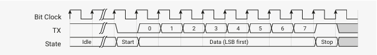
<figcaption>
Figure 57. UART serial format. The line is high when idle. The transmitter pulls the line down for one bit period to signify the start of a serial frame (the "start bit"), and a small, fixed number of data bits follows. The line returns to the idle state for at least one bit period (the "stop bit") before the next serial frame can begin.

図 57. UART シリアルフォーマット。ラインはアイドル時にハイになります。送信機はシリアルフレームの開始を示すために 1 ビット期間ラインをプルダウンし(「スタートビット」)、少量の固定数のデータビットが続きます。次のシリアルフレームを開始する前に、ラインは少なくとも 1 ビット期間(「ストップビット」)アイドル状態に戻る。
</figcaption>
</figure>

This  program  implements  the  transmit  component  of  a  universal  asynchronous  receive/transmit  (UART)  serial peripheral. Perhaps it would be more correct to refer to this as a UAT.

このプログラムは、ユニバーサル非同期送受信(UART)シリアルペリフェラルの送信コンポーネントを実装している。おそらく、これを UAT と呼ぶ方が正しいでしょう。

Pico Examples: https://github.com/raspberrypi/pico-examples/blob/master/pio/uart_tx/uart_tx.pio Lines 8 - 18

```
 8 .program uart_tx
 9 .side_set 1 opt
10
11 ; An 8n1 UART transmit program.
12 ; OUT pin 0 and side-set pin 0 are both mapped to UART TX pin.
13
14     pull       side 1 [7]  ; Assert stop bit, or stall with line in idle state
15     set x, 7   side 0 [7]  ; Preload bit counter, assert start bit for 8 clocks
16 bitloop:                   ; This loop will run 8 times (8n1 UART)
17     out pins, 1            ; Shift 1 bit from OSR to the first OUT pin
18     jmp x-- bitloop   [6]  ; Each loop iteration is 8 cycles.
```

As written, it will:

1. Stall with the pin driven high until data appears (noting that side-set takes effect even when the state machine is stalled) 
2. Assert a start bit, for 8 SM execution cycles 
3. Shift out 8 data bits, each lasting for 8 cycles 
4. Return to the idle line state for at least 8 cycles before asserting the next start bit 

If the state machine's clock divider is configured to run at 8 times the desired baud rate, this program will transmit well- formed UART serial frames, whenever data is pushed to the TX FIFO either by software or the system DMA. To extend the program to cover different frame sizes (different numbers of data bits), the set x, 7 could be replaced with mov x, y, so that the y scratch register becomes a per-SM configuration register for UART frame size.

The  .pio file in the SDK also contains this function, for configuring the pins and the state machine, once the program has been loaded into the PIO instruction memory:

書いてある通り、それは次のようなものである: 

1. データが現れるまでピンをハイにしたままストールする(ステートマシンがストールしているときでもサイドセットは有効であることに注意)。
2. SM 実行サイクル 8 回の間、スタートビットをアサートする。
3. 8 ビットのデータビットをシフトアウトする。
4. 次のスタートビットをアサートする前に、少なくとも 8 サイクル、アイドルライン状態に戻る。

ステートマシンのクロック分周器が希望のボーレートの 8 倍で動作するように設定されている場合、このプログラムは、ソフトウェアまたはシステム DMA によって TX FIFO にデータがプッシュされるたびに、適切に形成された UART シリアルフレームを送信します。異なるフレームサイズ(異なるデータビット数)をカバーするようにプログラムを拡張するには、set x, 7 を mov x, y に置き換えて、y スクラッチレジスタを UART フレームサイズ用の SM ごとのコンフィギュレーションレジスタにします。

SDK の.pio ファイルには、プログラムが PIO 命令メモリにロードされると、ピンとステートマシンを設定するためのこの関数も含まれています: 

Pico Examples: https://github.com/raspberrypi/pico-examples/blob/master/pio/uart_tx/uart_tx.pio Lines 24 - 51

```
24 static inline void uart_tx_program_init(PIO pio, uint sm, uint offset, uint pin_tx, uint
   baud) {
25     // Tell PIO to initially drive output-high on the selected pin, then map PIO
26     // onto that pin with the IO muxes.
27     pio_sm_set_pins_with_mask64(pio, sm, 1ull << pin_tx, 1ull << pin_tx);
28     pio_sm_set_pindirs_with_mask64(pio, sm, 1ull << pin_tx, 1ull << pin_tx);
29     pio_gpio_init(pio, pin_tx);
30
31     pio_sm_config c = uart_tx_program_get_default_config(offset);
32
33     // OUT shifts to right, no autopull
34     sm_config_set_out_shift(&c, true, false, 32);
35
36     // We are mapping both OUT and side-set to the same pin, because sometimes
37     // we need to assert user data onto the pin (with OUT) and sometimes
38     // assert constant values (start/stop bit)
39     sm_config_set_out_pins(&c, pin_tx, 1);
40     sm_config_set_sideset_pins(&c, pin_tx);
41
42     // We only need TX, so get an 8-deep FIFO!
43     sm_config_set_fifo_join(&c, PIO_FIFO_JOIN_TX);
44
45     // SM transmits 1 bit per 8 execution cycles.
46     float div = (float)clock_get_hz(clk_sys) / (8 * baud);
47     sm_config_set_clkdiv(&c, div);
48
49     pio_sm_init(pio, sm, offset, &c);
50     pio_sm_set_enabled(pio, sm, true);
51 }
```

The  state  machine  is  configured  to  shift  right  in  out  instructions,  because  UARTs  typically  send  data  LSB-first.  Once configured, the state machine will print any characters pushed to the TX FIFO.

UART は通常 LSB ファーストでデータを送信するため、ステートマシンは右シフトするように設定されています。 一度設定されると、ステートマシンは TX FIFO にプッシュされた文字を印刷します。

Pico Examples: https://github.com/raspberrypi/pico-examples/blob/master/pio/uart_tx/uart_tx.pio Lines 53 - 55

```
53 static inline void uart_tx_program_putc(PIO pio, uint sm, char c) {
54     pio_sm_put_blocking(pio, sm, (uint32_t)c);
55 }
```

Pico Examples: https://github.com/raspberrypi/pico-examples/blob/master/pio/uart_tx/uart_tx.pio Lines 57 - 60

```
57 static inline void uart_tx_program_puts(PIO pio, uint sm, const char *s) {
58     while (*s)
59         uart_tx_program_putc(pio, sm, *s++);
60 }
```

The example program in the SDK will configure one PIO state machine as a UART TX peripheral, and use it to print a message on GPIO 0 at 115200 baud once per second.

SDK のサンプルプログラムは、1 つの PIO ステートマシンを UART TX ペリフェラルとして設定し、それを使用して GPIO 0 に 115200 ボーでメッセージを 1 秒に 1 回プリントします。

Pico Examples: https://github.com/raspberrypi/pico-examples/blob/master/pio/uart_tx/uart_tx.c

```
 1 /**
 2  * Copyright (c) 2020 Raspberry Pi (Trading) Ltd.
 3  *
 4  * SPDX-License-Identifier: BSD-3-Clause
 5  */
 6
 7 #include "pico/stdlib.h"
 8 #include "hardware/pio.h"
 9 #include "uart_tx.pio.h"
10
11 // We're going to use PIO to print "Hello, world!" on the same GPIO which we
12 // normally attach UART0 to.
13 #define PIO_TX_PIN 0
14
15 // Check the pin is compatible with the platform
16 #error Attempting to use a pin>=32 on a platform that does not support it
17
18 int main() {
19     // This is the same as the default UART baud rate on Pico
20     const uint SERIAL_BAUD = 115200;
21
22     PIO pio;
23     uint sm;
24     uint offset;
25
26     // This will find a free pio and state machine for our program and load it for us
27     // We use pio_claim_free_sm_and_add_program_for_gpio_range (for_gpio_range variant)
28     // so we will get a PIO instance suitable for addressing gpios >= 32 if needed 
and supported by the hardware
29     bool success = pio_claim_free_sm_and_add_program_for_gpio_range(&uart_tx_program, &pio,
   &sm, &offset, PIO_TX_PIN, 1, true);
30     hard_assert(success);
31
32     uart_tx_program_init(pio, sm, offset, PIO_TX_PIN, SERIAL_BAUD);
33
34     while (true) {
35         uart_tx_program_puts(pio, sm, "Hello, world! (from PIO!)\r\n");
36         sleep_ms(1000);
37     }
38
39     // This will free resources and unload our program
40     pio_remove_program_and_unclaim_sm(&uart_tx_program, pio, sm, offset);
41 }
```

With the two PIO instances on RP2350, this could be extended to 8 additional UART TX interfaces, on 8 different pins, with 8 different baud rates.

RP2350 の 2 つの PIO インスタンスにより、8 つの異なるピン、8 つの異なるボーレートで、8 つの追加 UART TX インターフェースに拡張することができます。

### 11.6.4. UART RX

Recalling Figure 57 showing the format of an 8n1 UART:

We can recover the data by waiting for the start bit, sampling 8 times with the correct timing, and pushing the result to the RX FIFO. Below is possibly the shortest program which can do this:

8n1 UART のフォーマットを示す図 57 を思い出してください: 

スタートビットを待ち、正しいタイミングで 8 回サンプリングし、結果を RX FIFO にプッシュすることで、データを復元できます。以下は、おそらくこれを実行できる最も短いプログラムです: 

Pico Examples: https://github.com/raspberrypi/pico-examples/blob/master/pio/uart_rx/uart_rx.pio Lines 8 - 19

```
 8 .program uart_rx_mini
 9
10 ; Minimum viable 8n1 UART receiver. Wait for the start bit, then sample 8 bits
11 ; with the correct timing.
12 ; IN pin 0 is mapped to the GPIO used as UART RX.
13 ; Autopush must be enabled, with a threshold of 8.
14
15     wait 0 pin 0        ; Wait for start bit
16     set x, 7 [10]       ; Preload bit counter, delay until eye of first data bit
17 bitloop:                ; Loop 8 times
18     in pins, 1          ; Sample data
19     jmp x-- bitloop [6] ; Each iteration is 8 cycles
```

This works, but it has some annoying characteristics, like repeatedly outputting  NUL characters if the line is stuck low.  Ideally,  we  would  want  to  drop  data  that  is  not  correctly  framed  by  a  start  and  stop  bit  (and  set  some  sticky  flag  to indicate this has happened), and pause receiving when the line is stuck low for long periods. We can add these to our program, at the cost of a few more instructions.

これは機能するが、回線が低レベルのままだと NUL 文字が繰り返し出力されるなど、厄介な特徴がある。 理想的には、スタートビットとストップビットで正しくフレームされていないデータをドロップしたり(そして、それが起こったことを示すスティッキーなフラグを設定したり)、行が長い間ローレベルに止まっているときに受信を一時停止したりしたいものだ。いくつかの命令を追加する代償として、これらをプログラムに追加することができる。

Pico Examples: https://github.com/raspberrypi/pico-examples/blob/master/pio/uart_rx/uart_rx.pio Lines 44 - 63

```
44 .program uart_rx
45
46 ; Slightly more fleshed-out 8n1 UART receiver which handles framing errors and
47 ; break conditions more gracefully.
48 ; IN pin 0 and JMP pin are both mapped to the GPIO used as UART RX.
49
50 start:
51     wait 0 pin 0        ; Stall until start bit is asserted
52     set x, 7    [10]    ; Preload bit counter, then delay until halfway through
53 bitloop:                ; the first data bit (12 cycles incl wait, set).
54     in pins, 1          ; Shift data bit into ISR
55     jmp x-- bitloop [6] ; Loop 8 times, each loop iteration is 8 cycles
56     jmp pin good_stop   ; Check stop bit (should be high)
57
58     irq 4 rel           ; Either a framing error or a break. Set a sticky flag,
59     wait 1 pin 0        ; and wait for line to return to idle state.
60     jmp start           ; Don't push data if we didn't see good framing.
61
62 good_stop:              ; No delay before returning to start; a little slack is
63     push                ; important in case the TX clock is slightly too fast.
```

The second example does not use autopush (Section 11.5.4), preferring instead to use an explicit  push instruction, so that  it  can  condition  the  push  on  whether  a  correct  stop  bit  is  seen.  The  .pio  file  includes  a  helper  function  which configures the state machine and connects it to a GPIO with the pull-up enabled:

2 番目の例では、オートプッシュ(セクション 11.5.4)を使用せず、代わりに明示的なプッシュ命令を使用し、正しいストップビットが表示されるかどうかをプッシュの条件としています。 .pio ファイルには、ステートマシンを設定し、プルアップを有効にした GPIO に接続するヘルパ関数が含まれています: 

Pico Examples: https://github.com/raspberrypi/pico-examples/blob/master/pio/uart_rx/uart_rx.pio Lines 67 - 85

```
67 static inline void uart_rx_program_init(PIO pio, uint sm, uint offset, uint pin, uint baud) {
68     pio_sm_set_consecutive_pindirs(pio, sm, pin, 1, false);
69     pio_gpio_init(pio, pin);
70     gpio_pull_up(pin);
71
72     pio_sm_config c = uart_rx_program_get_default_config(offset);
73     sm_config_set_in_pins(&c, pin); // for WAIT, IN
74     sm_config_set_jmp_pin(&c, pin); // for JMP
75     // Shift to right, autopush disabled
76     sm_config_set_in_shift(&c, true, false, 32);
77     // Deeper FIFO as we're not doing any TX
78     sm_config_set_fifo_join(&c, PIO_FIFO_JOIN_RX);
79     // SM transmits 1 bit per 8 execution cycles.
80     float div = (float)clock_get_hz(clk_sys) / (8 * baud);
81     sm_config_set_clkdiv(&c, div);
82
83     pio_sm_init(pio, sm, offset, &c);
84     pio_sm_set_enabled(pio, sm, true);
85 }
```

To correctly receive data which is sent LSB-first, the ISR is configured to shift to the right. After shifting in 8 bits, this unfortunately leaves our 8 data bits in bits 31:24 of the ISR, with 24 zeroes in the LSBs. One option here is an in null, 24 instruction to shuffle the ISR contents down to 7:0. Another is to read from the FIFO at an offset of 3 bytes, with an 8-bit read, so that the processor's bus hardware (or the DMA's) picks out the relevant byte for free:

LSB ファーストで送信されたデータを正しく受信するために、ISR は右シフトするように構成されている。8 ビットをシフトした後、残念ながら 8 つのデータビットが ISR のビット 31:24 に残り、LSB には 24 個のゼロがある。ここで 1 つの選択肢は、ISR の内容を 7:0 にシャッフルする in null, 24 命令である。もう 1 つは、FIFO から 3 バイトのオフセットで 8 ビットリードを行い、プロセッサのバスハードウェア(または DMA)が該当するバイトを自由に選択できるようにすることである: 

Pico Examples: https://github.com/raspberrypi/pico-examples/blob/master/pio/uart_rx/uart_rx.pio Lines 87 - 93

```
87 static inline char uart_rx_program_getc(PIO pio, uint sm) {
88     // 8-bit read from the uppermost byte of the FIFO, as data is left-justified
89     io_rw_8 *rxfifo_shift = (io_rw_8*)&pio->rxf[sm] + 3;
90     while (pio_sm_is_rx_fifo_empty(pio, sm))
91         tight_loop_contents();
92     return (char)*rxfifo_shift;
93 }
```

An example program shows how this UART RX program can be used to receive characters sent by one of the hardware UARTs on RP2350. A wire must be connected from GPIO4 to GPIO3 for this program to function. To make the wrangling of 3 different serial ports a little easier, this program uses core 1 to print out a string on the test UART (UART 1), and the code running on core 0 will pull out characters from the PIO state machine, and pass them along to the UART used for the  debug  console  (UART  0).  Another  approach  here  would  be  interrupt-based  IO,  using  PIO's  FIFO  IRQs.  If  the SM0_RXNEMPTY  bit  is  set  in  the  IRQ0_INTE  register,  then  PIO  will  raise  its  first  interrupt  request  line  whenever  there  is  a character in state machine 0's RX FIFO.

この UART RX プログラムを使用して、RP2350 のハードウェア UART の 1 つから送信された文字を受信する方法をプログラム例で示します。このプログラムが機能するためには、GPIO4 から GPIO3 に配線が接続されている必要があります。3 つの異なるシリアルポートの取り回しを少し簡単にするために、このプログラムではコア 1 を使用してテスト UART(UART 1)に文字列をプリントアウトし、コア 0 上で動作するコードが PIO ステートマシンから文字を取り出して、デバッグコンソールに使用する UART(UART 0)に渡します。 ここでのもう 1 つのアプローチは、PIO の FIFO IRQ を使用した割り込みベースの IO です。 IRQ0_INTE レジスタに SM0_RXNEMPTY ビットが設定されている場合、PIO はステートマシン 0 の RX FIFO に文字があるたびに、最初の割り込み要求ラインを立ち上げます。


Pico Examples: https://github.com/raspberrypi/pico-examples/blob/master/pio/uart_rx/uart_rx.c

```
 1 /**
 2  * Copyright (c) 2020 Raspberry Pi (Trading) Ltd.
 3  *
 4  * SPDX-License-Identifier: BSD-3-Clause
 5  */
 6
 7 #include <stdio.h>
 8
 9 #include "pico/stdlib.h"
10 #include "pico/multicore.h"
11 #include "hardware/pio.h"
12 #include "hardware/uart.h"
13 #include "uart_rx.pio.h"
14
15 // This program
16 // - Uses UART1 (the spare UART, by default) to transmit some text
17 // - Uses a PIO state machine to receive that text
18 // - Prints out the received text to the default console (UART0)
19 // This might require some reconfiguration on boards where UART1 is the
20 // default UART.
21
22 #define SERIAL_BAUD PICO_DEFAULT_UART_BAUD_RATE
23 #define HARD_UART_INST uart1
24
25 // You'll need a wire from GPIO4 -> GPIO3
26 #define HARD_UART_TX_PIN 4
27 #define PIO_RX_PIN 3
28
29 // Check the pin is compatible with the platform
30 #error Attempting to use a pin>=32 on a platform that does not support it
31
32 // Ask core 1 to print a string, to make things easier on core 0
33 void core1_main() {
34     const char *s = (const char *) multicore_fifo_pop_blocking();
35     uart_puts(HARD_UART_INST, s);
36 }
37
38 int main() {
39     // Console output (also a UART, yes it's confusing)
40     setup_default_uart();
41     printf("Starting PIO UART RX example\n");
42
43     // Set up the hard UART we're going to use to print characters
44     uart_init(HARD_UART_INST, SERIAL_BAUD);
45     gpio_set_function(HARD_UART_TX_PIN, GPIO_FUNC_UART);
46
47     // Set up the state machine we're going to use to receive them.
48     PIO pio;
49     uint sm;
50     uint offset;
51
52     // This will find a free pio and state machine for our program and load it for us
53     // We use pio_claim_free_sm_and_add_program_for_gpio_range (for_gpio_range variant)
54     // so we will get a PIO instance suitable for addressing gpios >= 32 if needed and
   supported by the hardware
55     bool success = pio_claim_free_sm_and_add_program_for_gpio_range(&uart_rx_program, &pio,
   &sm, &offset, PIO_RX_PIN, 1, true);
56     hard_assert(success);
57
58     uart_rx_program_init(pio, sm, offset, PIO_RX_PIN, SERIAL_BAUD);
59     //uart_rx_mini_program_init(pio, sm, offset, PIO_RX_PIN, SERIAL_BAUD);
60
61     // Tell core 1 to print some text to uart1 as fast as it can
62     multicore_launch_core1(core1_main);
63     const char *text = "Hello, world from PIO! (Plus 2 UARTs and 2 cores, for complex
   reasons)\n";
64     multicore_fifo_push_blocking((uint32_t) text);
65
66     // Echo characters received from PIO to the console
67     while (true) {
68         char c = uart_rx_program_getc(pio, sm);
69         putchar(c);
70     }
71
72     // This will free resources and unload our program
73     pio_remove_program_and_unclaim_sm(&uart_rx_program, pio, sm, offset);
74 }
```

Figure 58. Manchester serial line code. Each data bit is represented by either a high pulse followed by a low pulse (representing a '0' bit) or a low pulse followed by a high pulse (a '1' bit).

図 58. マンチェスターシリアルラインコード。各データビットは、ハイパルスの後にローパルス('0'ビットを表す)、またはローパルスの後にハイパルス('1'ビット)で表される。


### 11.6.5. Manchester Serial TX and RX

Pico Examples: https://github.com/raspberrypi/pico-examples/blob/master/pio/manchester_encoding/manchester_encoding.pio Lines 8 - 30

```
 8 .program manchester_tx
 9 .side_set 1 opt
10
11 ; Transmit one bit every 12 cycles. a '0' is encoded as a high-low sequence
12 ; (each part lasting half a bit period, or 6 cycles) and a '1' is encoded as a
13 ; low-high sequence.
14 ;
15 ; Side-set bit 0 must be mapped to the GPIO used for TX.
16 ; Autopull must be enabled -- this program does not care about the threshold.
17 ; The program starts at the public label 'start'.
18
19 .wrap_target
20 do_1:
21     nop         side 0 [5] ; Low for 6 cycles (5 delay, +1 for nop)
22     jmp get_bit side 1 [3] ; High for 4 cycles. 'get_bit' takes another 2 cycles
23 do_0:
24     nop         side 1 [5] ; Output high for 6 cycles
25     nop         side 0 [3] ; Output low for 4 cycles
26 public start:
27 get_bit:
28     out x, 1               ; Always shift out one bit from OSR to X, so we can
29     jmp !x do_0            ; branch on it. Autopull refills the OSR when empty.
30 .wrap
```

Starting from the label called start, this program shifts one data bit at a time into the X register, so that it can branch on the value. Depending on the outcome, it uses side-set to drive either a 1-0 or 0-1 sequence onto the chosen GPIO. This program uses autopull (Section 11.5.4.2) to automatically replenish the OSR from the TX FIFO once a certain amount of data  has  been  shifted  out,  without  interrupting  program  control  flow  or  timing.  This  feature  is  enabled  by  a  helper function in the .pio file which configures and starts the state machine:

このプログラムは start と呼ばれるラベルから開始し、X レジスタに一度に 1 つのデータビットをシフトし、その値で分岐できるようにします。その結果に応じて、サイドセットを使用して、選択した GPIO に 1-0 または 0-1 シーケンスをドライブします。このプログラムでは、オートプル(セクション 11.5.4.2)を使用して、プログラムの制御フローやタイミングを中断することなく、 一定量のデータがシフトアウトされると、TX FIFO から OSR を自動的に補充します。 この機能は、.pio ファイル内のヘルパ関数によって有効化され、ステートマシンを設定および起動します: 

Pico Examples: https://github.com/raspberrypi/pico-examples/blob/master/pio/manchester_encoding/manchester_encoding.pio Lines 33 - 46

```
33 static inline void manchester_tx_program_init(PIO pio, uint sm, uint offset, uint pin, float
   div) {
34     pio_sm_set_pins_with_mask(pio, sm, 0, 1u << pin);
35     pio_sm_set_consecutive_pindirs(pio, sm, pin, 1, true);
36     pio_gpio_init(pio, pin);
37
38     pio_sm_config c = manchester_tx_program_get_default_config(offset);
39     sm_config_set_sideset_pins(&c, pin);
40     sm_config_set_out_shift(&c, true, true, 32);
41     sm_config_set_fifo_join(&c, PIO_FIFO_JOIN_TX);
42     sm_config_set_clkdiv(&c, div);
43     pio_sm_init(pio, sm, offset + manchester_tx_offset_start, &c);
44
45     pio_sm_set_enabled(pio, sm, true);
46 }
```

Another state machine can be programmed to recover the original data from the transmitted signal:

Pico Examples: https://github.com/raspberrypi/pico-examples/blob/master/pio/manchester_encoding/manchester_encoding.pio Lines 49 - 71

```
49 .program manchester_rx
50
51 ; Assumes line is idle low, first bit is 0
52 ; One bit is 12 cycles
53 ; a '0' is encoded as 10
54 ; a '1' is encoded as 01
55 ;
56 ; Both the IN base and the JMP pin mapping must be pointed at the GPIO used for RX.
57 ; Autopush must be enabled.
58 ; Before enabling the SM, it should be placed in a 'wait 1, pin` state, so that
59 ; it will not start sampling until the initial line idle state ends.
60
61 start_of_0:            ; We are 0.25 bits into a 0 - signal is high
62     wait 0 pin 0       ; Wait for the 1->0 transition - at this point we are 0.5 into the bit
63     in y, 1 [8]        ; Emit a 0, sleep 3/4 of a bit
64     jmp pin start_of_0 ; If signal is 1 again, it's another 0 bit, otherwise it's a 1
65
66 .wrap_target
67 start_of_1:            ; We are 0.25 bits into a 1 - signal is 1
68     wait 1 pin 0       ; Wait for the 0->1 transition - at this point we are 0.5 into the bit
69     in x, 1 [8]        ; Emit a 1, sleep 3/4 of a bit
70     jmp pin start_of_0 ; If signal is 0 again, it's another 1 bit otherwise it's a 0
71 .wrap
```

The  main  complication  here  is  staying  aligned  to  the  input  transitions,  as  the  transmitter's  and  receiver's  clocks  may drift relative to one another. In Manchester code there is always a transition in the centre of the symbol, and based on the  initial  line  state  (high  or  low)  we  know  the  direction  of  this  transition,  so  we  can  use  a  wait  instruction  to resynchronise to the line transitions on every data bit.

This program expects the X and Y registers to be initialised with the values 1 and 0 respectively, so that a constant 1 or 0  can  be  provided  to  the  in  instruction.  The  code  that  configures  the  state  machine  initialises  these  registers  by executing some set instructions before setting the program running.

ここでの主な問題は、送信側と受信側のクロックが相対的にずれる可能性があるため、入力の遷移に合わせておくことです。マンチェスターコードでは常にシンボルの中央に遷移があり、最初のライン状態(High または Low)に基づいてこの遷移の方向がわかるので、データビットごとにライン遷移に再同期するために wait 命令を使用することができます。

このプログラムでは、X レジスタと Y レジスタがそれぞれ 1 と 0 で初期化されていることを想定しているため、in 命令に定数 1 または 0 を与えることができます。 ステートマシンを設定するコードは、プログラムを実行する前にいくつかのセット命令を実行することにより、これらのレジスタを初期化する。

Pico Examples: https://github.com/raspberrypi/pico-examples/blob/master/pio/manchester_encoding/manchester_encoding.pio Lines 74 - 94

```
74 static inline void manchester_rx_program_init(PIO pio, uint sm, uint offset, uint pin, float
  div) {
75     pio_sm_set_consecutive_pindirs(pio, sm, pin, 1, false);
76     pio_gpio_init(pio, pin);
77
78     pio_sm_config c = manchester_rx_program_get_default_config(offset);
79     sm_config_set_in_pins(&c, pin); // for WAIT
80     sm_config_set_jmp_pin(&c, pin); // for JMP
81     sm_config_set_in_shift(&c, true, true, 32);
82     sm_config_set_fifo_join(&c, PIO_FIFO_JOIN_RX);
83     sm_config_set_clkdiv(&c, div);
84     pio_sm_init(pio, sm, offset, &c);
85
86     // X and Y are set to 0 and 1, to conveniently emit these to ISR/FIFO.
87     pio_sm_exec(pio, sm, pio_encode_set(pio_x, 1));
88     pio_sm_exec(pio, sm, pio_encode_set(pio_y, 0));
89     // Assume line is idle low, and first transmitted bit is 0. Put SM in a
90     // wait state before enabling. RX will begin once the first 0 symbol is
91     // detected.
92     pio_sm_exec(pio, sm, pio_encode_wait_pin(1, 0) | pio_encode_delay(2));
93     pio_sm_set_enabled(pio, sm, true);
94 }
```

The example C program in the SDK will transmit Manchester serial data from GPIO2 to GPIO3 at approximately 10 Mb/s (assuming a system clock of 125 MHz).

Pico Examples: https://github.com/raspberrypi/pico-examples/blob/master/pio/manchester_encoding/manchester_encoding.c Lines 20 - 43

```
20 int main() {
21     stdio_init_all();
22
23     PIO pio = pio0;
24     uint sm_tx = 0;
25     uint sm_rx = 1;
26
27     uint offset_tx = pio_add_program(pio, &manchester_tx_program);
28     uint offset_rx = pio_add_program(pio, &manchester_rx_program);
29     printf("Transmit program loaded at %d\n", offset_tx);
30     printf("Receive program loaded at %d\n", offset_rx);
31
32     manchester_tx_program_init(pio, sm_tx, offset_tx, pin_tx, 1.f);
33     manchester_rx_program_init(pio, sm_rx, offset_rx, pin_rx, 1.f);
34
35     pio_sm_set_enabled(pio, sm_tx, false);
36     pio_sm_put_blocking(pio, sm_tx, 0);
37     pio_sm_put_blocking(pio, sm_tx, 0x0ff0a55a);
38     pio_sm_put_blocking(pio, sm_tx, 0x12345678);
39     pio_sm_set_enabled(pio, sm_tx, true);
40
41     for (int i = 0; i < 3; ++i)
42         printf("%08x\n", pio_sm_get_blocking(pio, sm_rx));
43 }
```

### 11.6.6. Differential Manchester (BMC) TX and RX

<figure>
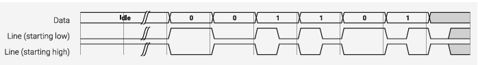
<figcaption>
Figure 59. Differential Manchester serial line code, also known as biphase mark code (BMC). The line transitions at the start of every bit period.  The presence of a transition in the centre of the bit period signifies a 1 data bit, and the absence, a 0 bit. These encoding rules are the same whether the line has an initial high or low state.

図 59. 差動マンチェスターシリアルラインコード、バイフェーズマークコード(BMC)としても知られる。ラインは各ビット期間の開始時に遷移する。 ビット期間の中央に遷移がある場合は 1 データビット、ない場合は 0 ビットを意味する。これらの符号化規則は、線路の初期状態が High であろうと Low であろうと同じである。
</figcaption>
</figure>

The  transmit  program  is  similar  to  the  Manchester  example:  it  repeatedly  shifts  a  bit  from  the  OSR  into  X  (relying  on autopull to refill the OSR in the background), branches, and drives a GPIO up and down based on the value of this bit.  The added complication is that the pattern we drive onto the pin depends not just on the value of the data bit, as with vanilla Manchester encoding, but also on the state the line was left in at the end of the last bit period. This is illustrated in Figure 59, where the pattern is inverted if the line is initially high. To cope with this, there are two copies of the test- and-drive code, one for each initial line state, and these are linked together in the correct order by a sequence of jumps.

送信プログラムはマンチェスタの例と同様で、OSR から X にビットを繰り返しシフトし(バックグラウンドで OSR を補充するオートプルに依存する)、分岐し、このビットの値に基づいて GPIO を上下に駆動します。 さらに複雑なのは、ピンにドライブするパターンが、素のマンチェスタエンコーディングのようにデータビットの値に依存するだけでなく、最後のビット期間の終了時にラインが残っていた状態にも依存することです。図 59 に示すように、線が最初にハイの場合、パターンは反転します。この問題に対処するため、テストアンドドライブコードには 2 つのコピーがあり、各ラインの初期状態ごとに 1 つずつ、ジャンプのシーケンスによって正しい順序でリンクされている。

Pico Examples: https://github.com/raspberrypi/pico-examples/blob/master/pio/differential_manchester/differential_manchester.pio Lines 8 - 35

```
 8 .program differential_manchester_tx
 9 .side_set 1 opt
10
11 ; Transmit one bit every 16 cycles. In each bit period:
12 ; - A '0' is encoded as a transition at the start of the bit period
13 ; - A '1' is encoded as a transition at the start *and* in the middle
14 ;
15 ; Side-set bit 0 must be mapped to the data output pin.
16 ; Autopull must be enabled.
17
18 public start:
19 initial_high:
20     out x, 1                     ; Start of bit period: always assert transition
21     jmp !x high_0     side 1 [6] ; Test the data bit we just shifted out of OSR
22 high_1:
23     nop
24     jmp initial_high  side 0 [6] ; For `1` bits, also transition in the middle
25 high_0:
26     jmp initial_low          [7] ; Otherwise, the line is stable in the middle
27
28 initial_low:
29     out x, 1                     ; Always shift 1 bit from OSR to X so we can
30     jmp !x low_0      side 0 [6] ; branch on it. Autopull refills OSR for us.
31 low_1:
32     nop
33     jmp initial_low   side 1 [6] ; If there are two transitions, return to
34 low_0:
35     jmp initial_high         [7] ; the initial line state is flipped!
```

The .pio file also includes a helper function to initialise a state machine for differential Manchester TX, and connect it to a  chosen  GPIO.  We  arbitrarily  choose  a  32-bit  frame  size  and  LSB-first  serialisation  (shift_to_right  is  true  in sm_config_set_out_shift),  but  as  the  program  operates  on  one  bit  at  a  time,  we  could  change  this  by  reconfiguring  the state machine.

.pio ファイルには、差動マンチェスタ TX 用のステートマシンを初期化し、選択した GPIO に接続するヘルパ関数も含まれています。 フレームサイズは 32 ビットで、LSB ファーストのシリアル化(sm_config_set_out_shift で shift_to_right が true)を任意に選択したが、プログラムは一度に 1 ビットずつ動作するので、ステートマシンを再構成することで変更できる。

Pico Examples: https://github.com/raspberrypi/pico-examples/blob/master/pio/differential_manchester/differential_manchester.pio Lines 38 - 53

```
38 static inline void differential_manchester_tx_program_init(PIO pio, uint sm, uint offset,
   uint pin, float div) {
39     pio_sm_set_pins_with_mask(pio, sm, 0, 1u << pin);
40     pio_sm_set_consecutive_pindirs(pio, sm, pin, 1, true);
41     pio_gpio_init(pio, pin);
42
43     pio_sm_config c = differential_manchester_tx_program_get_default_config(offset);
44     sm_config_set_sideset_pins(&c, pin);
45     sm_config_set_out_shift(&c, true, true, 32);
46     sm_config_set_fifo_join(&c, PIO_FIFO_JOIN_TX);
47     sm_config_set_clkdiv(&c, div);
48     pio_sm_init(pio, sm, offset + differential_manchester_tx_offset_start, &c);
49
50     // Execute a blocking pull so that we maintain the initial line state until data is
   available
51     pio_sm_exec(pio, sm, pio_encode_pull(false, true));
52     pio_sm_set_enabled(pio, sm, true);
53 }
```

The RX program uses the following strategy:

1. Wait until the initial transition at the start of the bit period, so we stay aligned to the transmit clock
2. Then, wait 3/4 of the configured bit period, so that we are centred on the second half-bit-period (see Figure 59)
3. Sample the line at this point to determine whether there are one or two transitions in this bit period
4. Repeat

RX プログラムは以下の戦略を採用している: 

1. ビット期間の最初の遷移まで待ち、送信クロックにアライメントする。
2. 次に、設定されたビット周期の 3/4 を待ち、後半ビット周期の中心に位置するようにする(図 59 参照)。
3. この時点でラインをサンプリングし、このビット期間に 1 つの遷移があるか 2 つの遷移があるかを判断する。
4. 繰り返し

Pico Examples: https://github.com/raspberrypi/pico-examples/blob/master/pio/differential_manchester/differential_manchester.pio Lines 55 - 85

```
55 .program differential_manchester_rx
56
57 ; Assumes line is idle low
58 ; One bit is 16 cycles. In each bit period:
59 ; - A '0' is encoded as a transition at time 0
60 ; - A '1' is encoded as a transition at time 0 and a transition at time T/2
61 ;
62 ; The IN mapping and the JMP pin select must both be mapped to the GPIO used for
63 ; RX data. Autopush must be enabled.
64
65 public start:
66 initial_high:           ; Find rising edge at start of bit period
67     wait 1 pin, 0  [11] ; Delay to eye of second half-period (i.e 3/4 of way
68     jmp pin high_0      ; through bit) and branch on RX pin high/low.
69 high_1:
70     in x, 1             ; Second transition detected (a `1` data symbol)
71     jmp initial_high
72 high_0:
73     in y, 1 [1]         ; Line still high, no centre transition (data is `0`)
74     ; Fall-through
75
76 .wrap_target
77 initial_low:            ; Find falling edge at start of bit period
78     wait 0 pin, 0 [11]  ; Delay to eye of second half-period
79     jmp pin low_1
80 low_0:
81     in y, 1             ; Line still low, no centre transition (data is `0`)
82     jmp initial_high
83 low_1:                  ; Second transition detected (data is `1`)
84     in x, 1 [1]
85 .wrap
```

This  code  assumes  that  X  and  Y  have  the  values  1  and  0,  respectively.  This  is  arranged  for  by  the  included  C  helper function:

このコードでは、X と Y がそれぞれ 1 と 0 の値を持っていると仮定している。 これは付属の C ヘルパ関数によって調整されている: 

Pico Examples: https://github.com/raspberrypi/pico-examples/blob/master/pio/differential_manchester/differential_manchester.pio Lines 88 - 104  

```
 88 static inline void differential_manchester_rx_program_init(PIO pio, uint sm, uint offset,     uint pin, float div) {  
 89     pio_sm_set_consecutive_pindirs(pio, sm, pin, 1, false);
 90     pio_gpio_init(pio, pin);
 91 
 92     pio_sm_config c = differential_manchester_rx_program_get_default_config(offset);
 93     sm_config_set_in_pins(&c, pin); // for WAIT 
 94     sm_config_set_jmp_pin(&c, pin); // for JMP  
 95     sm_config_set_in_shift(&c, true, true, 32);
 96     sm_config_set_fifo_join(&c, PIO_FIFO_JOIN_RX);
 97     sm_config_set_clkdiv(&c, div);
 98     pio_sm_init(pio, sm, offset, &c);
 99
100     // X and Y are set to 0 and 1, to conveniently emit these to ISR/FIFO.
100     // X and Y are set to 0 and 1, to conveniently emit these to ISR/FIFO.
101     pio_sm_exec(pio, sm, pio_encode_set(pio_x, 1));
102     pio_sm_exec(pio, sm, pio_encode_set(pio_y, 0));
103     pio_sm_set_enabled(pio, sm, true);
104 }
```

All the pieces now exist to loopback some serial data over a wire between two GPIOs.

これで、2 つの GPIO 間のワイヤを介してシリアルデータをループバックするためのすべてのピースが揃った。

Pico Examples: https://github.com/raspberrypi/pico-examples/blob/master/pio/differential_manchester/differential_manchester.c

```
 1 /**
 2  * Copyright (c) 2020 Raspberry Pi (Trading) Ltd.
 3  *
 4  * SPDX-License-Identifier: BSD-3-Clause
 5  */
 6
 7 #include <stdio.h>
 8
 9 #include "pico/stdlib.h"
10 #include "hardware/pio.h"
11 #include "differential_manchester.pio.h"
12
13 // Differential serial transmit/receive example
14 // Need to connect a wire from GPIO2 -> GPIO3
15
16 const uint pin_tx = 2;
17 const uint pin_rx = 3;
18
19 int main() {
20     stdio_init_all();
21
22     PIO pio = pio0;
23     uint sm_tx = 0;
24     uint sm_rx = 1;
25
26     uint offset_tx = pio_add_program(pio, &differential_manchester_tx_program);
27     uint offset_rx = pio_add_program(pio, &differential_manchester_rx_program);
28     printf("Transmit program loaded at %d\n", offset_tx);
29     printf("Receive program loaded at %d\n", offset_rx);
30
31     // Configure state machines, set bit rate at 5 Mbps
32     differential_manchester_tx_program_init(pio, sm_tx, offset_tx, pin_tx, 125.f / (16 * 5));
33     differential_manchester_rx_program_init(pio, sm_rx, offset_rx, pin_rx, 125.f / (16 * 5));
34
35     pio_sm_set_enabled(pio, sm_tx, false);
36     pio_sm_put_blocking(pio, sm_tx, 0);
37     pio_sm_put_blocking(pio, sm_tx, 0x0ff0a55a);
38     pio_sm_put_blocking(pio, sm_tx, 0x12345678);
39     pio_sm_set_enabled(pio, sm_tx, true);
40
41     for (int i = 0; i < 3; ++i)
42         printf("%08x\n", pio_sm_get_blocking(pio, sm_rx));
43 }
```

### 11.6.7. I2C

<figure>
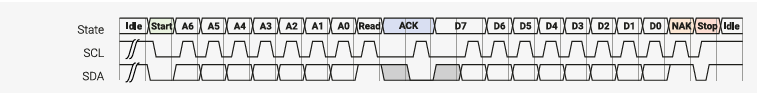
<figcaption>
Figure 60. A 1-byte I2C read transfer. In the idle state, both lines float high. The initiator drives SDA low (a Start condition), followed by 7 address bits A6-A0, and a direction bit (Read/nWrite). The target drives SDA low to acknowledge the address (ACK). Data bytes follow. The target serialises data on SDA, clocked out by SCL. Every 9th clock, the initiator pulls SDA low to acknowledge the data, except on the last byte, where it leaves the line high (NAK).  Releasing SDA whilst SCL is high is a Stop condition, returning the bus to idle.

図 60. 1 バイト I2C リード転送。アイドル状態では、両方のラインはハイフロートする。イニシエータは SDA をローにドライブし(スタート条件)、続いて 7 つのアドレスビット A6-A0 と方向ビット(Read/nWrite)をドライブする。ターゲットは SDA をローにドライブし、アドレスを確認する(ACK)。データバイトが続く。ターゲットは、SCL によってクロック出力される SDA でデータをシリアライズする。9 クロックごとに、イニシエータは SDA をローにプルしてデータを確認しますが、最後のバイトの場合は例外で、SDA はハイのままです(NAK)。 SCL がハイの間に SDA をリリースすることは、バスをアイドルに戻すストップコンディションである。
</figcaption>
</figure>

I2C  is  an  ubiquitous  serial  bus  first  described  in  the  Dead  Sea  Scrolls,  and  later  used  by  Philips  Semiconductor.  Two wires with pullup resistors form an open-drain bus, and multiple agents address and signal one another over this bus by driving the bus lines low, or releasing them to be pulled high. It has a number of unusual attributes:

* SCL can be held low at any time, for any duration, by any member of the bus (not necessarily the target or initiator
of the transfer). This is known as clock stretching. The bus does not advance until all drivers release the clock.
* Members of the bus can be a target of one transfer and initiate other transfers (the master/slave roles are not fixed). However this is poorly supported by most I2C hardware.
* SCL is not an edge-sensitive clock, rather SDA must be valid the entire time SCL is high.
* In spite of the transparency of SDA against SCL, transitions of SDA whilst SCL is high are used to mark beginning and end of transfers (Start/Stop), or a new address phase within one (Restart).

The  PIO  program  listed  below  handles  serialisation,  clock  stretching,  and  checking  of  ACKs  in  the  initiator  role.  It provides a mechanism for escaping PIO instructions in the FIFO datastream, to issue Start/Stop/Restart sequences at appropriate times. Provided no unexpected NAKs are received, this can perform long sequences of I2C transfers from a DMA buffer, without processor intervention.

I2C は、"死海文書" に最初に記述され、後に Phillips Semiconductor が使用したユビキタスシリアルバスである。 プルアップ抵抗付きの 2 本のワイヤーがオープンドレインバスを形成し、複数のエージェントがバスラインを Low に駆動するか、High にプルアップされるように解放することで、このバス上で互いにアドレスや信号を送受信する。このバスにはいくつかの珍しい特徴がある: 

* SCL は、バスのどのメンバ(転送のターゲットやイニシエータである必要はない。
これはクロックストレッチングと呼ばれる)。 これはクロックストレッチとして知られている。全てのドライバがクロックを解放するまでバスは進まない。
* バスのメンバは、ある転送のターゲットになり、他の転送を開始することができます(マスタ/スレーブの役割は固定されていません)。しかし、これはほとんどの I2C ハードウェアではサポートされていない。
* SCL はエッジセンシティブなクロックではなく、SDA は SCL がハイの間ずっと有効でなければならない。
* SCL に対する SDA の透明性にもかかわらず、SCL が High の間の SDA の遷移は、転送の開始と終了(Start/Stop)、または 1 つのアドレスフェーズ内の新しいアドレスフェーズ(Restart)を示すために使用される。

以下に示す PIO プログラムは、イニシエータの役割として、シリアル化、クロックストレッチ、および ACK のチェックを処理する。 これは、FIFO データストリーム中の PIO 命令をエスケープするメカニズムを提供し、適切なタイミングで Start/Stop/Restart シーケンスを発行する。予期しない NAK を受信しない限り、プロセッサの介入なしに、DMA バッファから長い I2C 転送シーケンスを実行できる。

Pico Examples: https://github.com/raspberrypi/pico-examples/blob/master/pio/i2c/i2c.pio Lines 8 - 73

```
 8 .program i2c
 9 .side_set 1 opt pindirs
10
11 ; TX Encoding:
12 ; | 15:10 | 9     | 8:1  | 0   |
13 ; | Instr | Final | Data | NAK |
14 ;
15 ; If Instr has a value n > 0, then this FIFO word has no
16 ; data payload, and the next n + 1 words will be executed as instructions.
17 ; Otherwise, shift out the 8 data bits, followed by the ACK bit.
18 ;
19 ; The Instr mechanism allows stop/start/repstart sequences to be programmed
20 ; by the processor, and then carried out by the state machine at defined points
21 ; in the datastream.
22 ;
23 ; The "Final" field should be set for the final byte in a transfer.
24 ; This tells the state machine to ignore a NAK: if this field is not
25 ; set, then any NAK will cause the state machine to halt and interrupt.
26 ;
27 ; Autopull should be enabled, with a threshold of 16.
28 ; Autopush should be enabled, with a threshold of 8.
29 ; The TX FIFO should be accessed with halfword writes, to ensure
30 ; the data is immediately available in the OSR.
31 ;
32 ; Pin mapping:
33 ; - Input pin 0 is SDA, 1 is SCL (if clock stretching used)
34 ; - Jump pin is SDA
35 ; - Side-set pin 0 is SCL
36 ; - Set pin 0 is SDA
37 ; - OUT pin 0 is SDA
38 ; - SCL must be SDA + 1 (for wait mapping)
39 ;
40 ; The OE outputs should be inverted in the system IO controls!
41 ; (It's possible for the inversion to be done in this program,
42 ; but costs 2 instructions: 1 for inversion, and one to cope
43 ; with the side effect of the MOV on TX shift counter.)
44
45 do_nack:
46     jmp y-- entry_point        ; Continue if NAK was expected
47     irq wait 0 rel             ; Otherwise stop, ask for help
48
49 do_byte:
50     set x, 7                   ; Loop 8 times
51 bitloop:
52     out pindirs, 1         [7] ; Serialise write data (all-ones if reading)
53     nop             side 1 [2] ; SCL rising edge
54     wait 1 pin, 1          [4] ; Allow clock to be stretched
55     in pins, 1             [7] ; Sample read data in middle of SCL pulse
56     jmp x-- bitloop side 0 [7] ; SCL falling edge
57
58     ; Handle ACK pulse
59     out pindirs, 1         [7] ; On reads, we provide the ACK.
60     nop             side 1 [7] ; SCL rising edge
61     wait 1 pin, 1          [7] ; Allow clock to be stretched
62     jmp pin do_nack side 0 [2] ; Test SDA for ACK/NAK, fall through if ACK
63
64 public entry_point:
65 .wrap_target
66     out x, 6                   ; Unpack Instr count
67     out y, 1                   ; Unpack the NAK ignore bit
68     jmp !x do_byte             ; Instr == 0, this is a data record.
69     out null, 32               ; Instr > 0, remainder of this OSR is invalid
70 do_exec:
71     out exec, 16               ; Execute one instruction per FIFO word
72     jmp x-- do_exec            ; Repeat n + 1 times
73 .wrap
```

The IO mapping required by the I2C program is quite complex, due to the different ways that the two serial lines must be driven and sampled. One interesting feature is that state machine must drive the output enable high when the output is low, since the bus is open-drain, so the sense of the data is inverted. This could be handled in the PIO program (e.g. mov osr,  ~osr),  but  instead  we  can  use  the  IO  controls  on  RP2350  to  perform  this  inversion  in  the  GPIO  muxes,  saving  an instruction.

I2C プログラムが必要とする IO マッピングは、2 本のシリアルラインの駆動方法とサンプリング方法が異なるため、非常に複雑である。興味深い特徴の 1 つは、バスがオープンドレインであるため、出力が Low のときにステートマシンが出力イネーブルを High に駆動しなければならず、データのセンスが反転してしまうことである。これは PIO プログラムで処理することもできるが(例: mov osr, ~osr)、代わりに RP2350 の IO コントロールを使って GPIO mux でこの反転を実行し、命令を節約することができる。

Pico Examples: https://github.com/raspberrypi/pico-examples/blob/master/pio/i2c/i2c.pio Lines 81 - 121 

```
 81 static inline void i2c_program_init(PIO pio, uint sm, uint offset, uint pin_sda, uint 
     pin_scl) { 
 82     assert(pin_scl == pin_sda + 1);
 83     pio_sm_config c = i2c_program_get_default_config(offset);
 84 
 85     // IO mapping 
 86     sm_config_set_out_pins(&c, pin_sda, 1);
 87     sm_config_set_set_pins(&c, pin_sda, 1);
 88     sm_config_set_in_pins(&c, pin_sda);
 89     sm_config_set_sideset_pins(&c, pin_scl);
 90     sm_config_set_jmp_pin(&c, pin_sda);
 91 
 92     sm_config_set_out_shift(&c, false, true, 16);
 93     sm_config_set_in_shift(&c, false, true, 8);
 94 
 95     float div = (float)clock_get_hz(clk_sys) / (32 * 100000);
 96     sm_config_set_clkdiv(&c, div);
 97
 98     // Try to avoid glitching the bus while connecting the IOs. Get things set
 99     // up so that pin is driven down when PIO asserts OE low, and pulled up
100     // otherwise.
101     gpio_pull_up(pin_scl);
102     gpio_pull_up(pin_sda);
103     uint32_t both_pins = (1u << pin_sda) | (1u << pin_scl);
104     pio_sm_set_pins_with_mask(pio, sm, both_pins, both_pins);
105     pio_sm_set_pindirs_with_mask(pio, sm, both_pins, both_pins);
106     pio_gpio_init(pio, pin_sda);
107     gpio_set_oeover(pin_sda, GPIO_OVERRIDE_INVERT);
108     pio_gpio_init(pio, pin_scl);
109     gpio_set_oeover(pin_scl, GPIO_OVERRIDE_INVERT);
110     pio_sm_set_pins_with_mask(pio, sm, 0, both_pins);
111
112     // Clear IRQ flag before starting, and make sure flag doesn't actually
113     // assert a system-level interrupt (we're using it as a status flag)
114     pio_set_irq0_source_enabled(pio, (enum pio_interrupt_source) ((uint) pis_interrupt0 +
    sm), false);
115     pio_set_irq1_source_enabled(pio, (enum pio_interrupt_source) ((uint) pis_interrupt0 +
    sm), false);
116     pio_interrupt_clear(pio, sm);
117
118     // Configure and start SM
119     pio_sm_init(pio, sm, offset + i2c_offset_entry_point, &c);
120     pio_sm_set_enabled(pio, sm, true);
121 }
```

We  can  also  use  the  PIO  assembler  to  generate  a  table  of  instructions  for  passing  through  the  FIFO,  for Start/Stop/Restart conditions.

また、PIO アセンブラを使って、スタート/ストップ/リスタートの各条件で FIFO を通過させるための命令表を生成することもできる。

Pico Examples: https://github.com/raspberrypi/pico-examples/blob/master/pio/i2c/i2c.pio Lines 126 - 136

```
126 .program set_scl_sda
127 .side_set 1 opt
128
129 ; Assemble a table of instructions which software can select from, and pass
130 ; into the FIFO, to issue START/STOP/RSTART. This isn't intended to be run as
131 ; a complete program.
132
133     set pindirs, 0 side 0 [7] ; SCL = 0, SDA = 0
134     set pindirs, 1 side 0 [7] ; SCL = 0, SDA = 1
135     set pindirs, 0 side 1 [7] ; SCL = 1, SDA = 0
136     set pindirs, 1 side 1 [7] ; SCL = 1, SDA = 1
```

The example code does blocking software IO on the state machine's FIFOs, to avoid the extra complexity of setting up the system DMA. For example, an I2C start condition is enqueued like so:

サンプルコードは、システム DMA のセットアップの余分な複雑さを避けるために、ステートマシンの FIFO 上でブロッキングソフトウェア IO を行う。例えば、I2C の開始条件は次のようにエンキューされる: 

Pico Examples: https://github.com/raspberrypi/pico-examples/blob/master/pio/i2c/pio_i2c.c Lines 69 - 73

```
69 void pio_i2c_start(PIO pio, uint sm) {
70     pio_i2c_put_or_err(pio, sm, 1u << PIO_I2C_ICOUNT_LSB); // Escape code for 2 instruction
   sequence
71     pio_i2c_put_or_err(pio, sm, set_scl_sda_program_instructions[I2C_SC1_SD0]);    // We are
   already in idle state, just pull SDA low
72     pio_i2c_put_or_err(pio, sm, set_scl_sda_program_instructions[I2C_SC0_SD0]);    // Also
   pull clock low so we can present data
73 }
```

Because I2C can go wrong at so many points, we need to be able to check the error flag asserted by the state machine, clear the halt and restart it, before asserting a Stop condition and releasing the bus.

I2C は非常に多くの箇所で問題が発生する可能性があるため、ストップコンディションをアサートしてバスを解放する前に、ステートマシンによってアサートされたエラーフラグをチェックし、停止をクリアして再起動できるようにする必要がある。

Pico Examples: https://github.com/raspberrypi/pico-examples/blob/master/pio/i2c/pio_i2c.c Lines 15 - 17

```
15 bool pio_i2c_check_error(PIO pio, uint sm) {
16     return pio_interrupt_get(pio, sm);
17 }
```

Pico Examples: https://github.com/raspberrypi/pico-examples/blob/master/pio/i2c/pio_i2c.c Lines 19 - 23

```
19 void pio_i2c_resume_after_error(PIO pio, uint sm) {
20     pio_sm_drain_tx_fifo(pio, sm);
21     pio_sm_exec(pio, sm, (pio->sm[sm].execctrl & PIO_SM0_EXECCTRL_WRAP_BOTTOM_BITS) >>
   PIO_SM0_EXECCTRL_WRAP_BOTTOM_LSB);
22     pio_interrupt_clear(pio, sm);
23 }
```

We need some higher-level functions to pass correctly-formatted data though the FIFOs and insert Starts, Stops, NAKs and so on at the correct points. This is enough to present a similar interface to the other hardware I2Cs on RP2350.

正しくフォーマットされたデータを FIFO に渡し、Starts、Stops、NAKs などを正しいポイントに挿入するために、いくつかの上位関数が必要である。これは、RP2350 上の他のハードウェア I2C と同様のインターフェイスを提供するのに十分である。

Pico Examples: https://github.com/raspberrypi/pico-examples/blob/master/pio/i2c/i2c_bus_scan.c Lines 13 - 42

```
13 int main() {
14     stdio_init_all();
15
16     PIO pio = pio0;
17     uint sm = 0;
18     uint offset = pio_add_program(pio, &i2c_program);
19     i2c_program_init(pio, sm, offset, PIN_SDA, PIN_SCL);
20
21     printf("\nPIO I2C Bus Scan\n");
22     printf("   0  1  2  3  4  5  6  7  8  9  A  B  C  D  E  F\n");
23
24     for (int addr = 0; addr < (1 << 7); ++addr) {
25         if (addr % 16 == 0) {
26             printf("%02x ", addr);
27         }
28         // Perform a 0-byte read from the probe address. The read function
29         // returns a negative result NAK'd any time other than the last data
30         // byte. Skip over reserved addresses.
31         int result;
32         if (reserved_addr(addr))
33             result = -1;
34         else
35             result = pio_i2c_read_blocking(pio, sm, addr, NULL, 0);
36
37         printf(result < 0 ? "." : "@");
38         printf(addr % 16 == 15 ? "\n" : "  ");
39     }
40     printf("Done.\n");
41     return 0;
42 }
```

### 11.6.8. PWM

<figure>
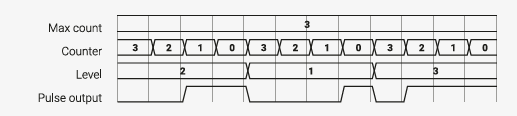
<figcaption>
Figure 61. Pulse width modulation (PWM).  The state machine outputs positive voltage pulses at regular intervals. The width of these pulses is controlled, so that the line is high for some controlled fraction of the time (the duty cycle). One use of this is to smoothly vary the brightness of an LED, by pulsing it faster than human persistence of vision.

図 61. パルス幅変調(PWM)。 ステートマシンは一定間隔で正の電圧パルスを出力する。これらのパルスの幅は制御され、制御された時間(デューティサイクル)の何分の一かの間、ラインはハイになる。この用途の 1 つは、人間の視覚の持続時間よりも速くパルスを出力することで、LED の輝度を滑らかに変化させることである。
</figcaption>
</figure>

This program repeatedly counts down to 0 with the Y register, whilst comparing the Y count to a pulse width held in the X register. The output is asserted low before counting begins, and asserted high when the value in Y reaches X. Once Y reaches 0, the process repeats, and the output is once more driven low. The fraction of time that the output is high is therefore proportional to the pulse width stored in X.

このプログラムは、Y カウントを X レジスタに保持されたパルス幅と比較しながら、Y レジスタで 0 まで繰り返しカウントダウンする。出力は、カウントが始まる前にローアサートされ、Y の値が X に達するとハイアサートされる。したがって、出力がハイである時間の割合は、X に格納されたパルス幅に比例する。

Pico Examples: https://github.com/raspberrypi/pico-examples/blob/master/pio/pwm/pwm.pio Lines 10 - 22

```
10 .program pwm
11 .side_set 1 opt
12
13     pull noblock    side 0 ; Pull from FIFO to OSR if available, else copy X to OSR.
14     mov x, osr             ; Copy most-recently-pulled value back to scratch X
15     mov y, isr             ; ISR contains PWM period. Y used as counter.
16 countloop:
17     jmp x!=y noset         ; Set pin high if X == Y, keep the two paths length matched
18     jmp skip        side 1
19 noset:
20     nop                    ; Single dummy cycle to keep the two paths the same length
21 skip:
22     jmp y-- countloop      ; Loop until Y hits 0, then pull a fresh PWM value from FIFO
```

Often, a PWM can be left at a particular pulse width for thousands of pulses, rather than supplying a new pulse width each time. This example highlights how a non-blocking PULL (Section 11.4.7) can achieve this: if the TX FIFO is empty, a non-blocking PULL will copy X to the OSR. After pulling, the program copies the OSR into X, so that it can be compared to the count value in Y. The net effect is that, if a new duty cycle value has not been supplied through the TX FIFO at the start of this period, the duty cycle from the previous period (which has been copied from X to OSR via the failed PULL, and then back to X via the MOV) is reused, for as many periods as necessary.

Another  useful  technique  shown  here  is  using  the  ISR  as  a  configuration  register,  if  IN  instructions  are  not  required.  System software can load an arbitrary 32-bit value into the ISR (by executing instructions directly on the state machine), and the program will copy this value into Y each time it begins counting. The ISR can be used to configure the range of PWM counting, and the state machine's clock divider controls the rate of counting.

To start modulating some pulses, we first need to map the state machine's side-set pins to the GPIO we want to output PWM on, and tell the state machine where the program is loaded in the PIO instruction memory:

多くの場合、PWM は毎回新しいパルス幅を供給するのではなく、特定のパルス幅のまま何千パルスも放置することができる。この例では、ノンブロッキング PULL(セクション 11.4.7)がどのようにこれを実現できるかを示します。TX FIFO が空の場合、ノンブロッキング PULL は X を OSR にコピーします。プルした後、プログラムは OSR を X にコピーし、Y のカウント値と比較できるようにします。正味の効果は、この期間の開始時に TX FIFO を介して新しいデューティサイクル値が供給されていない場合、前の期間のデューティサイクル(失敗した PULL を介して X から OSR にコピーされ、MOV を介して X に戻された)が必要な期間だけ再利用されることです。

ここで示したもう 1 つの便利なテクニックは、IN 命令が必要ない場合に ISR をコンフィギュレーションレジスタとして使用することです。 システムソフトウェアは、(ステートマシンで直接命令を実行することにより)任意の 32 ビット値を ISR にロードすることができ、プログラムはカウントを開始するたびにこの値を Y にコピーする。ISR を使用して PWM 計数の範囲を設定することができ、ステートマシンのクロック分周器が計数の速度を制御する。

パルスの変調を開始するには、まずステートマシンのサイドセットピンを PWM を出力したい GPIO にマッピングし、ステートマシンに PIO 命令メモリのどこにプログラムがロードされているかを伝える必要があります: 

Pico Examples: https://github.com/raspberrypi/pico-examples/blob/master/pio/pwm/pwm.pio Lines 25 - 31

```
25 static inline void pwm_program_init(PIO pio, uint sm, uint offset, uint pin) {
26    pio_gpio_init(pio, pin);
27    pio_sm_set_consecutive_pindirs(pio, sm, pin, 1, true);
28    pio_sm_config c = pwm_program_get_default_config(offset);
29    sm_config_set_sideset_pins(&c, pin);
30    pio_sm_init(pio, sm, offset, &c);
31 }
```

A little footwork is required to load the ISR with the desired counting range:

Pico Examples: https://github.com/raspberrypi/pico-examples/blob/master/pio/pwm/pwm.c Lines 14 - 20

```
14 void pio_pwm_set_period(PIO pio, uint sm, uint32_t period) {
15     pio_sm_set_enabled(pio, sm, false);
16     pio_sm_put_blocking(pio, sm, period);
17     pio_sm_exec(pio, sm, pio_encode_pull(false, false));
18     pio_sm_exec(pio, sm, pio_encode_out(pio_isr, 32));
19     pio_sm_set_enabled(pio, sm, true);
20 }
```

Once this is done, the state machine can be enabled, and PWM values written directly to its TX FIFO.

これが完了すると、ステートマシンを有効にし、PWM 値を TX FIFO に直接書き込むことができる。

Pico Examples: https://github.com/raspberrypi/pico-examples/blob/master/pio/pwm/pwm.c Lines 23 - 25

```
23 void pio_pwm_set_level(PIO pio, uint sm, uint32_t level) {
24     pio_sm_put_blocking(pio, sm, level);
25 }
```

Pico Examples: https://github.com/raspberrypi/pico-examples/blob/master/pio/pwm/pwm.c Lines 27 - 51

```
27 int main() {
28     stdio_init_all();
29 #ifndef PICO_DEFAULT_LED_PIN
30 #warning pio/pwm example requires a board with a regular LED
31     puts("Default LED pin was not defined");
32 #else
33
34     // todo get free sm
35     PIO pio = pio0;
36     int sm = 0;
37     uint offset = pio_add_program(pio, &pwm_program);
38     printf("Loaded program at %d\n", offset);
39
40     pwm_program_init(pio, sm, offset, PICO_DEFAULT_LED_PIN);
41     pio_pwm_set_period(pio, sm, (1u << 16) - 1);
42
43     int level = 0;
44     while (true) {
45         printf("Level = %d\n", level);
46         pio_pwm_set_level(pio, sm, level * level);
47         level = (level + 1) % 256;
48         sleep_ms(10);
49     }
50 #endif
51 }
```

If the TX FIFO is kept topped up with fresh pulse width values, this program will consume a new pulse width for each pulse. Once the FIFO runs dry, the program will again start reusing the most recently supplied value.

もし TX FIFO が新しいパルス幅の値で一杯に保たれていれば、このプログラムは各パルスごとに新しいパルス幅を消費する。FIFO が空になると、プログラムは再び直近に供給された値を再利用し始めます。

### 11.6.9. 加算

Although not designed for computation, PIO is quite likely Turing-complete, provided a long enough piece of tape can be found. It is conjectured that it could run DOOM, given a sufficiently high clock speed.

計算のために設計されたわけではないが、PIO はチューリング完全である可能性が高い。クロック速度が十分に高ければ、DOOM を走らせることもできると推測される。


Pico Examples: https://github.com/raspberrypi/pico-examples/blob/master/pio/addition/addition.pio Lines 7 - 25

```
 7 .program addition
 8
 9 ; Pop two 32 bit integers from the TX FIFO, add them together, and push the
10 ; result to the TX FIFO. Autopush/pull should be disabled as we're using
11 ; explicit push and pull instructions.
12 ;
13 ; This program uses the two's complement identity x + y == ~(~x - y)
14
15     pull
16     mov x, ~osr
17     pull
18     mov y, osr
19     jmp test        ; this loop is equivalent to the following C code:
20 incr:               ; while (y--)
21     jmp x-- test    ;     x--;
22 test:               ; This has the effect of subtracting y from x, eventually.
23     jmp y-- incr
24     mov isr, ~x
25     push
```

A full 32-bit addition takes only around one minute at 125 MHz. The program pulls two numbers from the TX FIFO and pushes their sum to the RX FIFO, which is perfect for use either with the system DMA, or directly by the processor:

完全な 32 ビット加算は、125MHz で約 1 分しかかからない。このプログラムは、TX FIFO から 2 つの数値を取り出し、その合計を RX FIFO にプッシュする: 

Pico Examples: https://github.com/raspberrypi/pico-examples/blob/master/pio/addition/addition.c

```
 1 /**
 2  * Copyright (c) 2020 Raspberry Pi (Trading) Ltd.
 3  *
 4  * SPDX-License-Identifier: BSD-3-Clause
 5  */
 6
 7 #include <stdlib.h>
 8 #include <stdio.h>
 9
10 #include "pico/stdlib.h"
11 #include "hardware/pio.h"
12 #include "addition.pio.h"
13
14 // Pop quiz: how many additions does the processor do when calling this function
15 uint32_t do_addition(PIO pio, uint sm, uint32_t a, uint32_t b) {
16     pio_sm_put_blocking(pio, sm, a);
17     pio_sm_put_blocking(pio, sm, b);
18     return pio_sm_get_blocking(pio, sm);
19 }
20
21 int main() {
22     stdio_init_all();
23
24     PIO pio = pio0;
25     uint sm = 0;
26     uint offset = pio_add_program(pio, &addition_program);
27     addition_program_init(pio, sm, offset);
28
29     printf("Doing some random additions:\n");
30     for (int i = 0; i < 10; ++i) {
31         uint a = rand() % 100;
32         uint b = rand() % 100;
33         printf("%u + %u = %u\n", a, b, do_addition(pio, sm, a, b));
34     }
35 }
```

### 11.6.10. Further Examples

Raspberry  Pi  Pico-series  C/C++  SDK  has  a  PIO  chapter  which  goes  into  depth  on  some  software-centric  topics  not presented here. It includes a PIO + DMA logic analyser example that can sample every GPIO on every cycle (a bandwidth of nearly 4Gbps at 125 MHz, although this does fill up RP2350's RAM somewhat quickly).

There are also further examples in the pio/ directory in the Pico Examples repository.

Some of the more experimental example code, such as DPI and SD card support, is currently located in the Pico Extras and Pico Playground repositories. The PIO parts of these are functional, but the surrounding software stacks are still in an experimental state.

Raspberry Pi Pico シリーズの C/C++ SDK には PIO の章があり、ここでは紹介していないソフトウェア中心のトピックについて深く掘り下げています。これには PIO + DMA ロジックアナライザのサンプルが含まれており、毎サイクルですべての GPIO をサンプリングすることができます(125MHz でほぼ 4Gbps の帯域幅ですが、RP2350 の RAM はすぐにいっぱいになってしまいます)。

また、Pico Examples リポジトリの pio/ディレクトリにもサンプルがあります。

DPI や SD カードのサポートなど、より実験的なサンプルコードの一部は、現在 Pico Extras と Pico Playground リポジトリにあります。これらの PIO 部分は機能していますが、周辺のソフトウェアスタックはまだ実験的な状態です。

## 11.7. レジスタ一覧

The PIO0 and PIO1 registers start at base addresses of  0x50200000 and  0x50300000 respectively (defined as PIO0_BASE Table 980. List of PIO registers and PIO1_BASE in SDK).

PIO0 および PIO1 レジスタは、それぞれ 0x50200000 および 0x50300000 のベースアドレスから始まります(PIO0_BASE 表 980.SDK の PIO レジスタ一覧および PIO1_BASE として定義)。


